ff1.new game minus mode walkthrough
from
http://bbs.ffsky.com/disp.aspx?ID=1700042&bid=45
http://bbs.ffsky.com/disp.aspx?ID=1700324&bid=45
http://bbs.ffsky.com/disp.aspx?ID=1700360&bid=45

---
- [正篇：](#正篇)
- [序章：](#序章)
- [Chapter 1——水路脱险：](#chapter-1水路脱险)
    - [Boss战：史莱姆×4](#boss战史莱姆4)
    - [Boss战：ブッシュファイア](#boss战ブッシュファイア)
    - [Boss战：希克族地牢猪×3](#boss战希克族地牢猪3)
    - [Boss战：ミミッククィーン](#boss战ミミッククィーン)
- [Chapter 2——将军入队：](#chapter-2将军入队)
    - [工会讨伐：手配書 No.1 - 熱砂に現れた魔犬](#工会讨伐手配書-no1---熱砂に現れた魔犬)
    - [工会讨伐：手配書 No.2 - 砂風にゆれるサボテンの花](#工会讨伐手配書-no2---砂風にゆれるサボテンの花)
    - [工会讨伐：手配書 No.3 - 地下水路に消える](#工会讨伐手配書-no3---地下水路に消える)
    - [工会讨伐：緊急討伐No.1 - 大草原の小さな愛](#工会讨伐緊急討伐no1---大草原の小さな愛)
    - [交易品：旅人の装備：](#交易品旅人の装備)
    - [交易品：はやての靴：](#交易品はやての靴)
- [Chapter 3——空中魔矿：](#chapter-3空中魔矿)
    - [工会讨伐：手配書 No.4 - 魔石鉱に生きる魔物](#工会讨伐手配書-no4---魔石鉱に生きる魔物)
    - [工会讨伐：緊急討伐No.2 - 魔石の力におどらされ](#工会讨伐緊急討伐no2---魔石の力におどらされ)
    - [Boss战：ジャッジ·ギース](#boss战ジャッジギース)
- [Chapter 4——浩瀚沙海：](#chapter-4浩瀚沙海)
    - [工会讨伐：手配書 No.7 - 空から呼ぶ声](#工会讨伐手配書-no7---空から呼ぶ声)
- [Chapter 5——暁の断片：](#chapter-5暁の断片)
    - [Boss战：デモンズウォール](#boss战デモンズウォール)
    - [Boss战：デモンズウォール](#boss战デモンズウォール-1)
    - [收伏战：魔人ベリアス](#收伏战魔人ベリアス)
    - [Boss战：ウォースラ](#boss战ウォースラ)
    - [工会讨伐：手配書 No.9 - 衝突！オズモーネ平原を守れ！](#工会讨伐手配書-no9---衝突オズモーネ平原を守れ)
- [Chapter 6——征战四方1：](#chapter-6征战四方1)
    - [交易品：やる気のでる防具：](#交易品やる気のでる防具)
    - [交易品：プラチナ製の装備：](#交易品プラチナ製の装備)
    - [Boss战：ボムキング](#boss战ボムキング)
- [Chapter 7——湿原探秘：](#chapter-7湿原探秘)
    - [交易品：最新式の猟銃：](#交易品最新式の猟銃)
    - [工会讨伐：手配書 No.5 - 落としものにはモブがつく](#工会讨伐手配書-no5---落としものにはモブがつく)
    - [交易品：戦斧：](#交易品戦斧)
    - [特殊战：最强水晶虫](#特殊战最强水晶虫)
    - [交易品：まがまがしい盾：デモンズシールド（盾6，物回+40，暗吸收），共需3种材料：](#交易品まがまがしい盾デモンズシールド盾6物回40暗吸收共需3种材料)
- [Chapter 8——暗之异型：](#chapter-8暗之异型)
    - [收伏战：憤怒の霊帝アドラメレク](#收伏战憤怒の霊帝アドラメレク)
    - [收伏战：死の天使ザルエラ](#收伏战死の天使ザルエラ)
    - [工会讨伐：手配書 No.1.- 流れ落ちる雨と指輪](#工会讨伐手配書-no1--流れ落ちる雨と指輪)
    - [工会讨伐：手配書 No.6 - 誰がために竜はなく](#工会讨伐手配書-no6---誰がために竜はなく)
    - [工会讨伐：手配書 No.8 - ピリリと苦い毒蛇の酒](#工会讨伐手配書-no8---ピリリと苦い毒蛇の酒)
    - [要收集5样材料：](#要收集5样材料)
- [Chapter 9——自由之价：](#chapter-9自由之价)
    - [Boss战： ティアマット](#boss战-ティアマット)
    - [Boss战：エルダードラゴン](#boss战エルダードラゴン)
- [Chapter 10——征战四方2：](#chapter-10征战四方2)
    - [工会讨伐：手配書 No.1.- 死者よ、永久に眠れ](#工会讨伐手配書-no1--死者よ永久に眠れ)
    - [工会讨伐：手配書 No.1.- 神都を汚す獣の血](#工会讨伐手配書-no1--神都を汚す獣の血)
    - [交易品：呪われた首飾り：](#交易品呪われた首飾り)
    - [交易品：植物製の防具：](#交易品植物製の防具)
    - [交易品：蠍：](#交易品蠍)
    - [交易品：神秘的な杖：](#交易品神秘的な杖)
    - [交易品：高級な棒：](#交易品高級な棒)
    - [交易品：貫通の銃弾：](#交易品貫通の銃弾)
    - [交易品：化石の弾：](#交易品化石の弾)
    - [交易品：赤黒い剣：](#交易品赤黒い剣)
    - [工会讨伐：緊急討伐No.3 - 罪は許してモブは許さず！](#工会讨伐緊急討伐no3---罪は許してモブは許さず)
    - [工会讨伐：緊急討伐No.4 - 復活、封印されし楽園！](#工会讨伐緊急討伐no4---復活封印されし楽園)
- [Chapter 11——水路死地：](#chapter-11水路死地)
    - [收伏战：天蝎宫—不浄王キュクレイン](#收伏战天蝎宫不浄王キュクレイン)
- [Chapter 12——覇王の剣：](#chapter-12覇王の剣)
    - [Boss战：ヴィヌスカラ](#boss战ヴィヌスカラ)
    - [收伏战：双鱼宫—背徳の皇帝マティウス](#收伏战双鱼宫背徳の皇帝マティウス)
    - [Boss战：ジャッジ·ベルガ](#boss战ジャッジベルガ)
    - [工会讨伐：緊急討伐No.5 - バラミナをかけ抜ける一陣の光](#工会讨伐緊急討伐no5---バラミナをかけ抜ける一陣の光)
    - [交易品：おぞましい壷：](#交易品おぞましい壷)
- [Chapter 13——洞窟之霸：](#chapter-13洞窟之霸)
    - [交易品：土色の銃弾：](#交易品土色の銃弾)
    - [工会讨伐：緊急討伐No.6 - 異常發生アントリアオン！](#工会讨伐緊急討伐no6---異常發生アントリアオン)
    - [收伏战：巨蟹宫—断罪の暴君ゼロムス](#收伏战巨蟹宫断罪の暴君ゼロムス)
    - [工会讨伐：緊急討伐No.7 - 私のキャロットちゃん](#工会讨伐緊急討伐no7---私のキャロットちゃん)
- [Chapter 14——海天一线：](#chapter-14海天一线)
    - [收伏战：審判の霊樹エクスデス](#收伏战審判の霊樹エクスデス)
- [Chapter 15——地下宫殿：](#chapter-15地下宫殿)
    - [Boss战：アーリマン](#boss战アーリマン)
    - [工会讨伐：手配書 No.1.- 追いかけっこは森の中](#工会讨伐手配書-no1--追いかけっこは森の中)
    - [工会讨伐：手配書 No.1.- 地の巨人、怒りの大暴走！](#工会讨伐手配書-no1--地の巨人怒りの大暴走)
    - [工会讨伐：手配書 No.1.- 制御不能！？決死のロデオ！](#工会讨伐手配書-no1--制御不能決死のロデオ)
    - [工会讨伐：手配書 No.1.- 地下宮殿の巨大亀](#工会讨伐手配書-no1--地下宮殿の巨大亀)
    - [交易品：チェーン：](#交易品チェーン)
    - [工会讨伐：手配書 No.1.- 脱走者はかたき討ちを望む](#工会讨伐手配書-no1--脱走者はかたき討ちを望む)
    - [工会讨伐：手配書 No.1.- 邪悪な亜人、魔石鉱で何を想う](#工会讨伐手配書-no1--邪悪な亜人魔石鉱で何を想う)
    - [工会讨伐：手配書 No.1.- 怒りのコブシは霧をはらすか](#工会讨伐手配書-no1--怒りのコブシは霧をはらすか)
    - [Boss战：フンババボス](#boss战フンババボス)
    - [Boss战：フューリー](#boss战フューリー)
- [Chapter 16——帝都机要：](#chapter-16帝都机要)
    - [Boss战：ドクター·シド](#boss战ドクターシド)
- [Chapter 17——聚宝台地：](#chapter-17聚宝台地)
    - [工会讨伐：手配書 No.20 - 取られた荷物を取り返せ！](#工会讨伐手配書-no20---取られた荷物を取り返せ)
    - [工会讨伐：手配書 No.21 - サビた伝説、ほころびた封印](#工会讨伐手配書-no21---サビた伝説ほころびた封印)
    - [工会讨伐：手配書 No.22 - 人生バラ色！男の野望を目指す戰い](#工会讨伐手配書-no22---人生バラ色男の野望を目指す戰い)
    - [工会讨伐：手配書 No.23 - 最高のカタロゲのために](#工会讨伐手配書-no23---最高のカタロゲのために)
    - [工会讨伐：手配書 No.24 - 死した都の墓守](#工会讨伐手配書-no24---死した都の墓守)
- [Chapter 18——珍惜讨伐：](#chapter-18珍惜讨伐)
    - [交易品：究極の宝剣：](#交易品究極の宝剣)
    - [声明在先：](#声明在先)
    - [第一部分：身上有宝的！](#第一部分身上有宝的)
    - [第二部分：直接切就可以的！](#第二部分直接切就可以的)
    - [特殊战：最强珍惜怪ディズマ](#特殊战最强珍惜怪ディズマ)
- [Chapter 19——雪原古都：](#chapter-19雪原古都)
    - [Boss战：ラフレシア](#boss战ラフレシア)
    - [交易品：蛇型の忍刀：](#交易品蛇型の忍刀)
    - [交易品：黒の装備：](#交易品黒の装備)
    - [工会讨伐：緊急討伐No.9 - 黒いウワサ](#工会讨伐緊急討伐no9---黒いウワサ)
    - [收伏战：金牛宫—輪廻王カオス](#收伏战金牛宫輪廻王カオス)
    - [交易品：ヒマワリの花：](#交易品ヒマワリの花)
    - [Boss战：ダイダロス](#boss战ダイダロス)
- [Chapter 20——辉煌水晶：](#chapter-20辉煌水晶)
    - [Boss战：タイラント](#boss战タイラント)
    - [收伏战：密告者シュミハザ](#收伏战密告者シュミハザ)
- [Chapter 21——契約の剣：](#chapter-21契約の剣)
    - [工会讨伐：緊急討伐No.8 - ビッグブリッヂの死闘（第2战）](#工会讨伐緊急討伐no8---ビッグブリッヂの死闘第2战)
    - [Boss战：魔神竜](#boss战魔神竜)
- [Chapter 22——飞艇起飞：](#chapter-22飞艇起飞)
    - [工会讨伐：手配書 No.25 - 地獄へのフライト！](#工会讨伐手配書-no25---地獄へのフライト)
    - [工会讨伐：手配書 No.26 - 獄炎の惡魔は子供好き？！](#工会讨伐手配書-no26---獄炎の惡魔は子供好き)
    - [手配書 No.28 - 古代生物はワイルドな臭い！](#手配書-no28---古代生物はワイルドな臭い)
    - [手配書 No.29 - 幼き罪をつぐなうとき](#手配書-no29---幼き罪をつぐなうとき)
    - [手配書 No.27 - 黒の魔術師](#手配書-no27---黒の魔術師)
- [Chapter 23——水晶之巅：](#chapter-23水晶之巅)
    - [声明在先：](#声明在先-1)
    - [收伏战：聖天使アルテマ](#收伏战聖天使アルテマ)
- [Chapter 24——究极凶地：](#chapter-24究极凶地)
    - [交易品：至高の一振り：](#交易品至高の一振り)
    - [收伏战：戒律王ゾディアーク](#收伏战戒律王ゾディアーク)
- [Chapter 25——绝海之塔：](#chapter-25绝海之塔)
    - [Boss战：ハイドロ](#boss战ハイドロ)
    - [工会讨伐：パンデモニウム（闇神一味之一）](#工会讨伐パンデモニウム闇神一味之一)
    - [工会讨伐：シャーリート（闇神一味之一）](#工会讨伐シャーリート闇神一味之一)
    - [交易品：白の装備：](#交易品白の装備)
    - [交易品：魔力の兜：](#交易品魔力の兜)
    - [交易品：魔物の髭：](#交易品魔物の髭)
    - [特殊怪：第3强珍惜怪アヴェンジャー](#特殊怪第3强珍惜怪アヴェンジャー)
    - [工会讨伐：フェンリル（闇神一味之一）](#工会讨伐フェンリル闇神一味之一)
    - [收伏战：統制者ハシュマリム](#收伏战統制者ハシュマリム)
    - [Boss战：ジャッジ·ガブラス](#boss战ジャッジガブラス)
    - [Boss战+收伏战：ドクター·シド+ 暗黒の雲ファムフリート](#boss战收伏战ドクターシド-暗黒の雲ファムフリート)
- [Chapter 26——要塞启动：](#chapter-26要塞启动)
    - [工会讨伐：手配書 No.31 - 最強はどっちだ！？](#工会讨伐手配書-no31---最強はどっちだ)
    - [工会讨伐：手配書 No.30 - 邪竜、ここに目覚める](#工会讨伐手配書-no30---邪竜ここに目覚める)
    - [工会讨伐：緊急討伐No.1.- ミストに包まれた真実](#工会讨伐緊急討伐no1--ミストに包まれた真実)
- [Chapter 27——トロの剣：](#chapter-27トロの剣)
    - [工会讨伐：緊急討伐No.1.- 最期の戰い、師よ安らかに眠れ](#工会讨伐緊急討伐no1--最期の戰い師よ安らかに眠れ)
    - [特殊战：次强珍惜怪クリスタルナイト](#特殊战次强珍惜怪クリスタルナイト)
    - [最终隐藏Boss战：オメガmk.XII](#最终隐藏boss战オメガmkxii)
- [Chapter 28——灯台冥渊：](#chapter-28灯台冥渊)
    - [工会讨伐：緊急討伐No.1.- 眠れぬ美女に安らかな夜を](#工会讨伐緊急討伐no1--眠れぬ美女に安らかな夜を)
    - [工会讨伐：フェニックス（闇神一味之一）](#工会讨伐フェニックス闇神一味之一)
    - [工会讨伐：緊急討伐No.1.- 神か悪魔か](#工会讨伐緊急討伐no1--神か悪魔か)
- [尾声：](#尾声)
- [鸣谢：](#鸣谢)

### 声明：

本攻略是仅用于天幻FF12论坛内的讨论，禁止一切形式的转载，其中大量资料属于天幻…… 
 
### 前言： 

1.本攻略为针对国际版弱模式的详细攻略；基于弱模式为SE所提供的官方极限挑战模式，所以说，能玩到，或者说是决心玩国际版弱模式的玩家势必对 __FF12国际版__ 已经有了不浅的了解……故，在本攻略中不会过多的提及剧情，迷宫的走法。解谜也是从简言之，因为天幻网上对于基本要素的介绍已经是详而又细了，所以无需赘言。 

2.本攻略是一篇 __初级者向的弱模式攻略__ ，所用战术均为最基本的，达人勿怪！ 

3.本攻略 __封印神器__ ，只会提及到得到时机，全攻略中不会用到，对三神器有爱的玩家请视情况取得并使用，会大幅降低难度的……至于王道的逆转魔法，全游戏对战如下敌人时会使用： __欧米茄XII，魔神龙，紧急讨伐8号（第二战）、10号（集中力高的玩家完全可以不用）、11号（集中力高的玩家完全可以不用）和12号__ ，余下的场合都没有必要用到。全文不涉及圆战术，没有高端操作要求。不封印执照…… 

4.关于国际版恶心的日语字幕，给玩国际版又不懂日语的玩家一个偷巧的办法：先把日文五十音中的“片假名”的发音和字形背下来，很简单的。又因为片假名绝大部分描述的是外来语，所以按照发音对应成英文十有八九是正确的！比如： _ポーション_ 就从读音很轻松的辨别出来是Potion， _デスブリンガー_ 就是Deathbringer嘛……绝大部分的消耗性道具，战利品，装备和魔法都能轻松读懂！系统方面就算突破了！为了方便，人名全部会使用英文。关于战术安排时，绝大部分地方用职业来代替人名。 

5.本攻略力争在Boss战，工会讨伐，刷宝和装备合成上做到针对弱模式介绍得巨细靡遗，如有纰漏，尽请达人们斧正！ 

6.本攻略要和天幻专题结合着看， __主要是支线触发和迷宫解密部分__ 。同时，因为能玩到弱模式的玩家自然对FF12国际版有不小的了解，所以关于一些隐藏Boss的出现条件和讨伐对象的出现条件不会再说明的特别详细！ 

7.本攻略所提及的时间均为用PS2主机验证的时间，第二遍验证，本攻略则用模拟器（因为手头没有PS2，机器在家呢……），为了保证真实性，全程不用即时存档。至于喜欢即时存档和金手指的玩家，请随性修改吧……笔者对这两样没爱……至于台地的乱数入手装备法……我个人在模拟器上和机器上均未验证，攻略中也不会提及…… 

8.根据FF12的系统伤害公式，所计算的结果直接取整。 
 
9. **括号中的文字为吐槽和建议，请根据攻关情况自己酌情选择……**  
 
## 正篇： 
 
## 序章： 

开始，首先必然是常模式下通过100层，进入弱模式，并且在任意存档点存档以保存住该模式，然后进入Gabranth暗杀皇帝的两年后，操作角色变成Vaan……游戏正式开始！ 

 _王都ラバナスタ，以后通称王都：_  

一上来，还是跑到Migelo的道具屋，和他说话，然后去工会，开启执照系统并且得到饰品オルアケアの腕輪，去东门，在东门的存档点存档！ 

好，先开始说人物选职，虽然现在人物只有Vaan一个，但是职业选择人物之间的牵制性非常大，所以在开篇就干脆把所有人的选职都说了好了！ 

可以说国际版之所以平衡性非常非常良好以及弱模式为什么值得一玩都要归功于12宫职业分化，有了合理的职业分化弱模式的主线流程也会履平地一般： 

之前7vmn7vmn对于弱模式的职业选择已经有非常精当的评价了，原帖地址为http://bbs.ffsky.com/disp.aspx?ID=1684884&bid=45，下面我对职业选择做几点补充： 

1.__Fran建议就选择白魔__ ，毕竟三位女性中 __她的魔力最低__ ，做支援型工作最合适，而Vaan的魔力成长虽然也很好，但是无奈是弱模式，万年Lv1，机工非他莫属。 

2.关于Basch，弱模式下这个人用的最少，主要是因为弱模式下火铳是绝对的物理输出主力，Basch的能力决定了他合适的选职不会特别出彩， __其实Basch选择骑士，破坏和格斗都是不错的选择__ ，骑士的优势在于有 __圣剑__   **（入手比特洛早很多很多）** ，可以习得不错的支援白魔法，同时可以使用全部的盾；破坏的优势则在于可以通过搭桥得到 __行动缩短3阶__ ，不过较之骑士缺少了白魔法，同样，也可以使用全部的盾，破坏输出不稳定的劣势在弱模式下可以忽略，因为就算选骑士， __绝大部分时间也基本轮不上骑士去做输出__ ，等到百层中使用神剑的话，破坏可是比骑士更优秀；还有格斗家，优点就是有全模式下最强悍的HP加成， __3035的HP加成全部是本盘，无需召唤搭桥__ ，而且还能穿勇气套装， __而最大的缺点就是不能用盾__ ，而且在弱模式下强力白魔法的搭桥基本全是鸡肋了……Basch在弱模式下，对战强力Boss战时出场次数不多，其最大的放光点就是在100层中的最终战了，如果以100层最终战为目的的话，格斗家绝对是最好的选择，但是不能用盾的劣势绝对会使本篇中不少地方提高难度！具体Basch选择什么职业，请玩家自己抉择！ 

3.Penelo和Ashe一个黑魔一个时魔，谁选哪个无所谓，我个人更偏向于Ashe选择时魔，因为时魔后期的重要程度堪比机工，而想要把时魔的作用发挥到最大，势必要用到トロの剣  **（本篇中用到的机会太少了，主要是因为トロの剣入手太晚）** ，而Penelo拿双手兵器的样子实在是…… 

最后说一下召唤兽分配： 

1.机工（蛇夫，金牛），猎人（双子，处女，天蝎，人马，双鱼），白魔（巨蟹），骑士（白羊，天秤，狮子），时魔（摩羯），黑魔（宝瓶）； 
 
2.机工（蛇夫，金牛，天秤），猎人（双子，天蝎，人马，双鱼），白魔（巨蟹），破坏（白羊，狮子，处女），时魔（摩羯），黑魔（宝瓶）； 

3.机工（蛇夫，金牛，天秤），猎人（双子，天蝎，人马，双鱼），白魔（巨蟹），格斗（白羊，狮子，处女），时魔（摩羯），黑魔（宝瓶），在最后一种选职中，天秤给格斗也成，白羊给谁都可以； 

余下职业的装备和战术，本攻略基本不会说明…… 

最后说明一点的就是，无论是什么样的Boss，哪怕它菜到惨不忍睹，也尽量不要开4倍速……这点谨慎还是要有的……当然了，特定场合除外。 

废话完了，给Vaan选择机工士，别选错了！ 
 

 

开启执照盘后，有6点的LP，就先激活旁边的饰品吧！物防魔防都+1，在游戏开篇还是蛮实用的！装备好饰品オルアケアの腕輪之后，出东门讨伐番茄！ 

 _東ダルマスカ砂漠，以后通称东沙漠：_  

现阶段是全手动，偷偷杀杀，都是很基本的操作了，就是注意一下血量好了， __Vaan现在只有120+的HP一定要小心__ ！没有难度的切掉番茄之后，回到王都，到东门和“撬锁小男孩”对话，GC，剧情。 

好了，现在我们的活动范围一下大了不少，ネブラ河以南的东沙漠，几乎全部的西沙漠和旱季的吉萨大草原都可以自由出入了！不过先去工会，然后去工会专属商店把刚才得到的战利品全卖掉，买20个左右的Potion……卖掉2个狼の毛皮和1个土の石，合成出クロムレザー，开启轻装2执照，给Vaan装备上……现阶段装备也就到这个程度了！之后就可以先去东沙漠小心地Chain狼了，这时候真的要小心啊！千万不要吝啬Potion，被狼咬死太不值了！在小キャンプ和ネブラ河沿いの集落南側之间的三个场景之间Chain吧！狼の毛皮或者是风の石中的任意一个到了99个就去卖掉，小キャンプ宝箱中开出的ファイアフライ也卖掉吧！有800大洋的进项呢！ 

 _ナルビナ城塞，以后通称城塞：_  

 __Vaan本身就会偷窃__ ，所以在机工的执照盘上偷窃是已经被激活了的，这在初期是个很不错的优势，借着已开启的偷窃执照，Vaan能比较轻松的开启增加HP上限的执照！提升HP上限是弱模式中的重中之重，一定要尽早！先利用145点LP将执照从偷窃左边开始推进到凤凰尾知识，再往下就是增加HP上限的执照了，现阶段推荐再打出270点LP开启前6个增加HP上限的执照，共计可以提升HP上限780点，再算上装备，Vaan的HP上限就突破900了。 
 

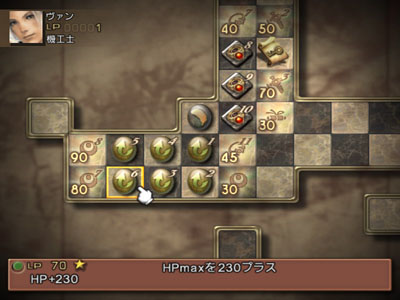
 

随着你不断开启提升HP上限执照，Chain狼的危险性越来越低，你的基础资金也越来越多！然后去把东西沙漠和吉萨草原的地图买了吧！开着4倍速两个半小时之内完成这些事情是没有问题的！之后就去王都地下的老爷爷家触发剧情，再安心地去吉萨大草原吧！ 

 _ギーザ草原，以后通称吉萨草原：_  

在草原部落分别和村民对话，之后Penelo加入，立即去最南端的场景，取得阴石，之后去找黑水晶将阴石填充成太阳石，中途如果Penelo挂掉了没有必要救……才60+的HP，摸几下就死了，没有必要浪费凤凰尾，当然如果你给Penelo选择了职业并开启了一些增加HP上限的执照就没有这个问题了……得到太阳石后回到王都地下，Pennelo退出队伍，好了，现在去王都买西沙漠的地图，把东沙漠宝箱中的两个黑魔法取到  **（宝箱地图请参见天幻FF12专题）** ，再在ネブラ河沿いの集落和城塞买全现金能买到的所有技和魔法  **（虽然我们没有赤魔，里魔法理论上可以不买，不过也不贵，顺手捎上吧……）** ，做完这些准备工作之后，我们就可以去老爷爷家了。 

在老爷爷家触发完剧情之后，直接转到加兰斯地下水路。 

 _ガラムサイズ水路，以后通称地下水路或水路：_  

极简单的迷宫和敌人，900+的HP在这里显得富富有余，直接进入王宫好了！存档继续…… 

解谜，拿オルケアの腕輪，剧情，GC之后Balthier和Fran加入队伍！往下走一点，开启Gambit系统，不要覆盖，存档，开始给Balthier和Fran选职。Balthier选猎人，Fran选白魔，Balthier适当开启一些增加HP上限的执照，也开到900+就可以了，之后就就近开启一些自动能力和力强化的执照；Fran则先开启50LP和75LP的必杀执照和这两个的必杀搭桥，这样也会有400+的HP，在初期就够了！猎人的必杀执照请选择75，100，125LP的三个执照，必杀搭桥不急着开启  **（忍刀弱模式下用处不大，主要是猎人的力量实在是让人不敢有非分之想）** 。还有一点， __请确认Balthier的MP大于等于36__ ，否则请读刚进入王宫的档让他重新加入。 
 

 

 

所有职业开启执照的顺序是：#### 增加HP上限执照->必杀执照->道具强化执照->行动时间缩短执照->其他自动能力执照->技和魔法执照（视近期技和魔法的取得）->装备执照（视近期装备的取得）->饰品执照（视近期饰品的取得）；能玩到弱模式的玩家走执照盘的顺序基本都很熟了，像特殊装备执照以及高级技能和魔法肯定靠后开启……按照本攻略， __暁の断片__ 入手之后，重要执照都应该开启得差不多了，到达神都时，基本就制霸了。 

为什么要及早开启必杀执照呢？因为一般来讲必杀搭桥都还是不错的，虽然在弱模式下必杀的威力的确不高  **（本来就是倾向于低取值的伤害技）** ，但同时必杀连协所产生的融合技是无视敌人防御的 __固定伤害__ ，是弱模式初期的强大输出，伤害公式为： __融合技威力×被攻击方的等级__ ，比如说连协产生了融合技アークブラスト  **（1，2，3级必杀各两个，不难的，经常能搞出来）** ，威力是205，如果被攻击方的等级是30，就能造成6150的伤害，这在初期  **（就是暁の断片入手前）** 是很可观的！所以必杀执照要尽早开，等到暁の断片入手后，造成比较高的伤害就不是什么奇怪的事情了，所以必杀执照要尽早开启。关于必杀搭桥请参见天幻FF12专题。 
 
## Chapter 1——水路脱险： 

好了，简单地设置一下Gambit，该偷的偷，该杀的杀……继续前进吧！FF12的主线剧情迷宫没有太难的……顺着水路一路捅下去，该开的宝箱开，没有什么刻意要刷的。走到东部水量調整区，触发剧情，简单的剧情杂兵战……轻松取胜！Ashe以Guest的形式暂时加入队伍！ __弱模式下Guest因为没有执照盘支援，所以HP都很寒碜__ ……所以Guest死就死了吧，不用救活，一般也不指着Guest那点输出……Ashe暂时加入队伍后，请存档……然后进入北部取水廊，对战4个大大的黄色史莱姆！ 

#### Boss战：史莱姆×4 

虽然本战斗的四个敌人在图鉴中不属于Boss，不过暂且按照Boss战处理吧！第一次Boss战就来点恶心的，史莱姆系的敌人具有铳耐性，Balthier基本做不了输出……好在Fran自带黑魔法1的执照能力，可以使用初级火焰，对付这些史莱姆还是颇有效果的，再注意下补血，此战不难！ 

战斗后在FF12中第一次听到战斗胜利的音乐，不仔细听还真听不出那个经典旋律  **（变奏太凶了）** …… 

然后进入加兰斯地下水路的西侧部分，又多了一种鬼魂系敌人，又是铳耐性，烦……好在是不死系，可以让Fran用初级治疗来加速其死亡！别的就没什么了，一路走到记忆点区域，存档后进入最終処理区画，迎来游戏中真正意义上的第一个Boss： 

#### Boss战：ブッシュファイア 
 

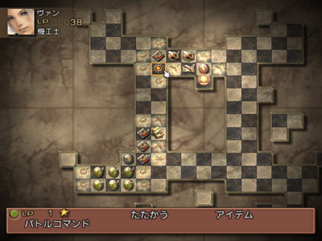

 
 

右图为使用融合技攻击该Boss。 

这一战Boss可比刚才那4个史莱姆强悍多了，是大范围火属性伤害外带概率中毒，要及时解状态，好在我方Vaan和Balthier的HP都能突破900，有这个量作保证基本就没问题了，想速战速决的请选择必杀连协，只不过此时开启的必杀执照恐怕不多吧  **（我这个时候Fran有2阶必杀，Vaan只有1阶，Balthier什么都没有……）** ！ 

战斗结束，主角们被当成贼  **（事实上也的确如此）** ，剧情……进入城寨地下牢。 

 _ナルビナ城塞地下牢，以后通称地下牢_   **（不过估计也没有以后了）** ： 

对战手执3只希克族地牢猪  **（其中一只手执伪-古里古里棒棒）**  

#### Boss战：希克族地牢猪×3 

只要HP够多，根本是没有难度的战斗！ 

取回装备，顺手开宝箱，进入厳重警戒区域，把出现的宝箱全开了，进入封印门吧！剧情后Basch以Guset的身份加入队伍，进入巴拉海姆地下道： 

 _バルハイム地下道，以后通称地下道：_  

取保险丝，安装，充电，之后就可以开始整备了！先卖掉之前在地下水路得到的战利品，注意如果有看到 __战利品的描述是“……的黄宝石”__ 时，请不要卖掉该战利品  **（这一类战利品的价格全是150）** ，这些就是12宫魔石，说珍惜珍惜，说不值钱也真不值钱……因为12宫魔石基本都是低概率偷窃或掉落，所以并不好一次性收集，那就平常积累吧！如果有需要预留的战利品，本攻略会详细说明的！买齐现阶段所有Gambit  **（国际版这点真好，Gambit在地下道脱出后就可以基本买齐，极大方便了战术的安排）** ，装备和武器嘛，随意了，建议给Vaan买一把カペラ，余下的就随意了，在本攻略中， __直接从商店买武器和防具的情况极少极少__ ，不过遇到 __饰品的话，资金不紧张就买到3个__ 吧。 

进入地下道，取地图，开机关，唯一一个必出的宝箱是18号，里面是バトルハーネス，弱模式下几乎没有用，本来反击几率就是速度/2，弱模式下人物的速度值都不高，而且不少兵器还不支持反击，愿意卖卖了，愿意留留着……稍微说一下的就是如果从35号宝箱中开出了サクラの杖，就不要卖掉了，这是黑魔初期最实用的兵器，如果没开出来也不必反复刷，这个兵器空都有卖，而且不算贵。史莱姆具有铳耐性，请用Fran的火魔法解决  **（也就这时候用用……）** ，顺便请在史莱姆身上取得2个緑色の液体。 

是否愿意让电力低下到30%一下也随各位玩家的意愿， __因为弱模式下空贼小屋的称号是注定不能集齐的__   **（全员无法Lv过50）** ，所以其他称号的取得也就是不显得那么重要了……但是在低电下出现的骷髅还是比较值得打的，掉落或是偷到的骨くず，如果凑齐99个，在初期对资金积累还是相当有帮助的！顺便也打LP开启执照盘，我这时Vaan和Balthier开启了1阶必杀，Fran开启了2阶必杀。走到最末端，存档，准备迎接Boss战。 

#### Boss战：ミミッククィーン 

没有什么难度的Boss，一通必杀连协搞死他！ 
 

右图为使用融合技攻击该Boss…… 
 
## Chapter 2——将军入队： 

脱出地下道，先去东沙漠集落，把战利品都卖了，应该能合成狙撃用の銃弾了吧（魚のウロコ×1，出集落在水边的鱼就能掉落；緑色の液体×2，在地下道史莱姆身上取得；闇の石×3，肯定够了吧！），之后一路赶回王都吧！大家都走了，去道具屋，再去老爷爷家，之后去地图上有红叉标记的地方和坐在箱子上面的人说话，好了Basch正式加入队伍！在这里还是按照Basch为骑士的职业选择  **（也建议大家选择骑士）** …… 
 

 
 
选择破坏或者是格斗的话，我也会在以后的攻略中详细提及装备取得和战术设定  **（不过还是那句，Basch出场的场合没有常模式那么多）** 。Basch在开启执照盘时，请在开启必杀和HP上限的同时，关照一下需要115点LP的那个饰品执照  **（现在不急着开，在天空矿打LP时请不要忘了它……）** 。然后赶到沙海亭，Balthier和Fran再次加入队伍！剧情发展至准备飞往空都！不过在这之前，有一些 __基本的准备工作__ 还是要做了！ 

严格的莫布兰会长要是知道我们这么犯懒，肯定要怒了！好了，既然队伍中已经加入了4人，开始补讨伐吧！讨伐对象在接到任务后，如果不和委托人说话是不会出现的，别忘了！去沙海亭接到手配書  
No.1 - 熱砂に現れた魔犬 

 _西ダルマスカ砂漠，以后通称西沙漠：_  

#### 工会讨伐：手配書 No.1 - 熱砂に現れた魔犬 
 

 

敌人出现在西沙漠ガルテア丘陵的右下角，这个讨伐实在是太简单了，就不说了，几枪毙了它！顺便 __请去風紋の地把ダイヤの腕輪取到__ ，25%概率出现，出现必定能开出ダイヤの腕輪，几次1AC就搞到了，这个东西的作用玩国际版的玩家一定非常非常清楚，我就不多说了，除此之外它 __还兼配有雷无效的属性__ ，在弱模式下也很有用哦！ 

之后回到沙海亭交任务，得到奖励。紧接着再看委托板，接到手配書 No.2 - 砂風にゆれるサボテンの花和手配書 No.3 - 地下水路に消える 

#### 工会讨伐：手配書 No.2 - 砂風にゆれるサボテンの花 
 

 

先去小キャンプ和委托人对话，之后就是去东沙漠砂紋の迷宮找仙人掌了，除了“针千本”会瞬杀我方单人之外，别的攻击多完全不足为惧，及时复活战斗不能的同伴就好了，没难度！ 

#### 工会讨伐：手配書 No.3 - 地下水路に消える 
 

 

先要去王都地下区北部右侧去找那位母亲，然后进入地下水路最終処理区画，在里面稍微一走，讨伐对象レイス就出来了。这个レイス比起前两个讨伐对象可要烦人多了，是鬼魂，有铳耐性，回复魔法对它效果也不是很明显！而且还会用招式让我方进入“死的宣告”异常装备，这个异常在现在只能是等死再复活……所以，恶俗的招式，必杀连协好了，如果出了融合技就很轻松了！ 

好了，现阶段委托板上就不会有任务了  **（很少见哦）** ！所以，我们就趁此机会 __连续调查委托板40次，再和防具店老板对话15次，武器店老板30次，魔法屋老板25次，这样交易品中至少会出现5本古びた書物，正常情况的话，第6本古びた書物也应该出来了__   **（光这次就和老板们对话累计80次了，再算上之前的买卖，累计100次怎么也有了吧……没有的话继续随便在哪个店和老板对话，直到第6本古びた書物出现在交易品中）** ，再跑去王都市街地西部，在工会商店的对面找到手配書 No.1 - 熱砂に現れた魔犬的委托人，和他对话，再去商店，追加最后一本古びた書物，这样， __贵重品—7大心得均出现__ 了，心得书的作用是让不同种类的怪物在完全不影响其基本物品掉落的基础上，我方杀死怪物时以完全固定的概率掉落各式各样的战利品！对于任何模式而言都是收集战利品的必备物品，一定要尽早入手！！！好，然后 __买下20000元的那本，是魔剣士の心得__ ，很快这本心得就会体现其作用！ 

 
 
再跑到Gambit店买齐现在所有的Gambit  **（要差不多30000块……知道攒99个骨くず的好处了吧……）** ，这样，除了Ashe相关的2个Gambit之外，我们已经收集Gambit完毕了，那两个等Ashe加入队伍自然就有了…… 

再去公会长那里，去取工会2级和3级的奖励…… 
 

 
 
再接两个紧急讨伐：緊急討伐No.1 - 大草原の小さな愛和緊急討伐No.2 - 魔石の力におどらされ，后一个要脱出卢苏魔石矿方可拜访委托人，所以我们就先去做前一个。 

#### 工会讨伐：緊急討伐No.1 - 大草原の小さな愛 
 

 

先去草原集落和鸡围栏里面的委托人对话，然后把ギーザス川沿岸北側的杂兵全部清光，回集落，再回ギーザス川沿岸北側，四个球球就出现啦！ 

玩到弱模式的玩家一定很清楚，同等级紧急讨伐的难度要远远大于通常讨伐的难度……緊急討伐No.1 - 大草原の小さな愛便是一个极好的佐证！首先，讨伐的对象就是1大3小，以3对4，我方就不利，而且那只大大的ニワトリス还会非常多样的状态攻击  **（好在没有一次性复数状态攻击）** ，4只圆滚滚的鸡的攻击也不低，而且风吸收  **（换言之就是グラディウス不能用）** 同时铳耐性  **（因为是魔法生物）** ……以现在的防具来看，我方就算HP多，不会被打死，也是处于不断解状态和回复这种疲于奔命的状态，最后撑不住导致屁滚尿流地回村落…… 

那在弱模式游戏最初期就没有办法对法这4个球球了么？显然不是……有两种方法可以选择。 __先说一个无耻的，再说一个无聊的。__  

第一种，无耻的方法：玩家已经有ダイヤの腕輪了，城际慢速飞空艇也已经启动了（王都—城塞）；所以…………三神器中最神的那个 _ザイテングラート（奥穗高岳尖山背，攻击+224，CT10，射程20，物理回避+75，金属度0）_ 已经可以入手了……如果无耻到刷出这样神兵……别说这四个球球了，以后很多很多敌人都没什么好说的了……所以本攻略封印神器……有兴趣的玩家自行体验  **（鄙人从来没刷过神弓）** 。 

第二种，无聊的方法：四只鸡累计HP实在太多，一只一只打不现实，所以要想办法一次性大范围解决它们，融合技是最优先的选择  **（范围是圆10，和范围白魔法一样，挺大的）** ！好在相对于它们的HP来说，它们的等级不算太低，如果能施放出融合技アークブラスト的话，就会对三只小鸡ヒナドリス造成2665点伤害，小鸡一共才3067的HP，余下的402就好解决了！而对大鸡ニワトリス施放必杀连协再加融合技アークブラスト，少说也会有6000+的伤害……这样的话战斗的胜利就明显向我方倾斜了！不过アークブラスト要求1，2，3阶必杀各自释放两次，所以 __至少有一个人要开启3阶必杀执照__ ……毫无疑问，这个人非白魔莫属，白魔的三个必杀搭桥是50，75，100LP的，而且离起点都不算太远，是12宫职业中最方便开启3阶必杀的职业了  **（格斗也蛮容易的……）** ！至于机工，猎人和骑士，现阶段能开启2阶还算现实……至于第3阶嘛……呵呵，有耐心的可以去磨！好了，战术确定了  **（众人语：这算什么鸟战术……）** 存档，清兵，切场景，对ニワトリス放必杀连协，以出现融合技アークブラスト为目标  **（笔者到这里第一次未成功，读档重新清兵，第二次成功了）** ，余下的就简单了，因为敌人有铳耐性，请选择Basch给战斗收尾。 

完成了讨伐，接着我们去弄3件现阶段会大幅提升我方能力的装备： 
 
#### 交易品：旅人の装備： 
 

 
 
[/B]羽根付き帽子（魔装4，魔防+18，魔力+5，MP+40）和旅人の法衣（魔装4，物防+18，魔力+5，HP+30，MP+50）。这套装备是可以合成的最低级的魔装，但是在初期已经是足够强大了！有了这套装备，到暁の断片入手前，是不必再更新魔装了！共需3种材料： 

1).水の石×5，这个东西很好弄，从吉萨大草原的小兔子和巴尔海姆地下道的史莱姆身上都可以轻松偷盗或是掉落； 
 

 
2).なめし皮×2，吉萨大草原的スレイヴ（怪物图鉴编号18号），中概率偷盗，中概率掉落，收集2个很轻松！ 
 

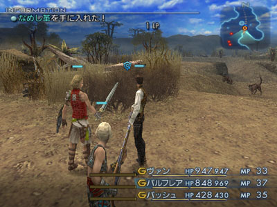
 

3).ウール×2，游戏初期合成这套魔装，这个材料算是个难点，出处是珍惜怪03グリード（怪物图鉴编号297）高概率掉落，在不可能Chain的情况下，ウール的掉落率是40%，不算太低。グリード的出现条件非常明确：进入东沙漠ネブラ河の岸辺，不能杀任何仙人掌敌人，在3分钟时间后グリード出现。这个敌人的攻击力高，HP很长（7000+），直接打根本没胜算，好在 __其等级很高，30+，__ 融合技对它的效果很明显  **（如果放出アークブラスト基本就是必胜了！）** ，好了，进入ネブラ河の岸辺，看一下游戏计时，然后随便打打狼，等到3分钟后，就可以去水边找グリード，二话不说，一通必杀连协搞死他，再把掉落的东西捡起来！然后回到ネブラ河沿いの集落南側，存档，重启PS2，重新进入ネブラ河の岸辺，再等3分钟，再去找グリード的茬……直到收集到2个ウール。下图为使用融合技攻击该珍惜怪…… 
 

 

2.#### 偷窃：グラディウス（匕首4，攻+54，风属性攻击，速度+1）。 

出自珍惜怪08リンブルウルフ（怪物图鉴编号307），低概率必定偷得，建议取得旅人の装備后再去取这把匕首，因为珍惜怪リンブルウルフ攻击力不低，Fran除了偷窃还要经常回复。リンブルウルフ的出现条件：西沙漠境内，打倒20只狼怪以上后出现在陽炎立つ地平，请注意陽炎立つ地平的入口  **（有2个，别选错了）** 。上Vaan，Balthier和Fran，三人一起偷，边偷边回复，偷到立即闪……愿意杀的可以用必杀连协，不过没什么价值。让猎人装备上グラディウス后，攻击力立即有了质的飞升，直到暁の断片入手前，猎人都拿这把兵器即可，其风属性攻击对付大沙海的敌人也是非常的有利！ 
 

 

#### 交易品：はやての靴： 
 

 
 
[/B]エルメスのくつ（饰品，力+5，永久自动加速）。 

这个饰品是游戏获得最早的高级饰品  **（在死都和大灯台下层还各有一个）** ，能提供5点的力量加成，同时永久自动加速，直到游戏最后期乃至100层中都有不小的用处，在前期，饰品上5点的力量给Basch的话是非常有力的！所以要大家在开启Basch的执照时稍微照顾一下这个饰品执照。共需2种材料： 

1).ギサールの野菜×33，这个材料最简单，慢速飞空艇上购买…… 

2).アルカナ×15，理论上アルカナ是得到カノープスの壷之后以各种固定概率从普通杂兵身上掉落，但是少部分珍惜怪的心得道具也是アルカナ，比如西沙漠的白色死神就是！ __アルカナ以30%的固定概率从它身上掉落。请先购买魔剣士の心得！！__ 珍惜怪61号ダスティア（怪物图鉴编号334），出现条件：战斗成员中，有任何人的HP低于最大值的10%时，ダスティア出现。请用凤凰尾将其一击必杀……关于这个珍惜怪大家绝对是太熟悉了  **（常模式Vaan在一开始就可以用它轻松地升到Lv25-26）** ，无论是Chain的Bug还是从王都轻松的刷新，这里就不详细提及了。 
 

 
 
按照概率来算，收集15个アルカナ大概要杀50个ダスティア  **（笔者当时是杀了46个收集齐的）** ，中间过程中得到炎の杖很正常，至少留1根给黑魔，没掉也无所谓，后面有卖。 

最后去工会商店把 __两个绿魔法__ 买了…… 

做完这些我们真的可以飞往空都了！到此为止，大概耗时9小时。下图为去空都之前全员的执照盘开启情况…… 
 

 
 
## Chapter 3——空中魔矿： 

 _空中都市ビュエルバ，以后通称空都：_  

去王都西门的停机坪，和Balthier对话，飞往空都，出停机坪，遇见王子大人，王子大人以Guset加入，直奔卢苏魔石矿。 

 _ルース魔石鉱，以后通称天空魔石矿或天空矿：_  

一路狂奔，记得拿技—算術！到达深处遇到Balthier的死对头，愿意打死他们  **（它们？）** 的请选择必杀连协，不过打死他们  **（它们？）** 也没什么价值，反正以后还有复仇的机会……一路再狂奔出来吧！看到王子和Penelo手牵手……好了，卢苏魔石矿主线剧情结束了。 

现在空都才算对我们正式开放，先去魔法屋和技屋买齐新魔法和技，再去防具店买一套现在能买到的最强轻装  **（一会儿做讨伐还能得到一套更好的）** 和最强重装  **（Basch要是格斗就不必了）** ，去武器店针对职业给Basch买一把最新的兵器，没有サクラの杖的买一把，别的就不用了。整备结束后就要开始做在王都剩下的那个讨伐了！顺便去浮云亭把手配書 No.4 - 魔石鉱に生きる魔物也接了。 

#### 工会讨伐：手配書 No.4 - 魔石鉱に生きる魔物 
 

 

委托人就在魔石矿入口，和他对话讨伐开始。讨伐对象ニーズヘッグ的第１運送路，很明显的一条蓝色大蛇！敌人攻击速度非常快，攻击力也不算低，但是攻击没什么特点，以现在的Balthier和Basch的攻击，一会儿就把它解决了，注意回复即可。 

#### 工会讨伐：緊急討伐No.2 - 魔石の力におどらされ 
 

 

委托人在空都的西侧场景，是个莫古利，讨伐对象ロックタイタス是它的宠物  **（汗一滴……）** ，ロックタイタス在魔石矿现阶段能去的最深处，既然是紧急讨伐，难度自然比上一个高了不少！首先就是ロックタイタス的HP竟然有17000+！但是比起緊急討伐No.1 - 大草原の小さな愛来讲，我们这时候的装备已经要好上不少了，所以一通必杀连协之后华丽的接一个融合技！之后 __白魔对自己使用绿魔法デコイ__   **（白魔的物防现在最高，ロックタイタス打Fran也就50+的HP，就算是范围攻击那招也不会大失血，デコイ以后通称火力吸引）** ，Balthier和Basch攻击，顺利取胜！ 

出来后讨赏，两个任务能加起来能给一套现阶段不错的轻装，手配書 No.4 - 魔石鉱に生きる魔物的委托人还会给你一个 __大蛇の抜け殻__ ，只有有了它才能 __完美完成支线—沙漠病人__ ，进而得到饰品金のアミュレット，所以别卖了
 

 
 
（万一卖了也没事，就算无法完美完成沙漠病人支线，暁の断片入手后，收集齐3个金のアミュレット也不难）。之后莫古利还会委托你去看日记，去技屋，然后回来报告，选第二个选项  **（其实哪个都无关紧要，奖励不珍贵）** ，得到奖励。 

之后就是去魔石矿里面打LP和赚钱了，在スーニア平行橋反复地Chain骷髅，收集齐99个骨くず就去卖，一次能得到个20000+大洋，再卖掉其他一些闲七杂八的玩意，差不多能买一本心得书，请 __在此将余下的6本心得书均买齐__ ，顺便打LP开执照！ 
 

 
 
下面是进入战舰之前人物执照盘的开启情况： 
 

 

 

之后是流程中最无聊的“小游戏”，填充到100%之后，剧情，去侯爵府，进入戦艦リヴァイアサン…… 

 _戦艦リヴァイアサン：_  

剧情  **（巴掌扇的真优雅……）** ，Vosler以Guset的身份加入队伍，一路上把スリプル和HPMP取到，之后向地图右边走，剧情杂兵战……没有任何难度，找到Ashe，Ashe加入队伍，选择职业，开启执照盘。 __时魔因为HP极短__ ，所以 __在逆转魔法入手之前基本没有上场机会__ ，装备就不用操心了！再之后往地图上标记红叉的地方走，中途Penelo加入！至此FF12的战斗队伍终于正式确立，Vosler离队，为Penelo选择职业，黑魔在流程中的作用极大，笔者每次玩FF12国际版  **（无论常模式还是弱模式）** ，都是给Penelo选择黑魔的……也没有一次后悔过…… 
 
下面是Ashe和Penelo职业选择和执照盘开启情况： 
 

 

 

 
 
之后是Boss战…… 

#### Boss战：ジャッジ·ギース 

这位裁判是游戏中第一位人类敌人……实力低的要死  **（为什么到100层里就彻底咸鱼翻身了呢？）** ……常规打即可……没难点，更没必要用必杀。 
 
## Chapter 4——浩瀚沙海： 

脱出戦艦リヴァイアサン，再去侯爵府，剧情，来到西沙漠，买齐新的技和魔法（这件事以后就不提醒了），开始浩瀚的大沙海探索…… 

此时建议大家回到王都，去沙海亭接D级讨伐：手配書 No.7 - 空から呼ぶ声，这个讨伐的奖励可是相当的不错！准备的差不多了就进入大砂海オグル·エンサ吧！ 

 _大砂海オグル·エンサ，以后两个大沙海均通称大沙海，具体用场景区分：_  

进入之后，开启两个地图，请取得魔法リフレク，12号宝箱中有金のアミュレット，是帮助我们制霸执照盘的最有效手段，取得后装备上吧！之前偷盗的グラディウス的风属性攻击很好用， __搭配黑魔的サクラの杖使用エアロ__ ，这里的敌人全都是一击清……不要招惹炎精灵  **（就是可爱的红色大球球，它要是怒了可就不可爱了，在它旁边不要使用“任何”魔法！）** ……需要说明的是这里的亚人身上可以低概率偷盗エンサのヒレ，偷到了的话请至少留2个，是重要的合成材料！在探索大沙海的过程中， __作为调剂__   **（读者：你这是什么恶趣味？）** ，不妨去弄一件现在来讲很强的防具！ 

 _ゼルテニアン洞窟，以后通称地下洞窟：_  

请从中央ジャンクション的右上角进入ゼルテニアン洞窟—地の森，取到技—黑暗杀法（我个人从来没用过……），要是觉得里面的敌人有些强就一路R2吧！出去之后来到大砂海ナム·エンサ—風化する岸辺，来到左边平台，有一个亀のチョーカー（传说中的“金钱施法”，弱模式下时魔的标配！），拿了它，然后 __站在三个桶内侧__ ，一会儿，珍惜巨鸟イムドゥグド就飞过来了！ 

珍惜怪兽34号イムドゥグド（怪物图鉴编号359），这只鸟的攻击不算高，偷之……能偷盗シールドアーマー（重装5，物防+25，力+5，永久自动护盾），给Basch装备上吧！这件 __シールドアーマー在游戏初期可是极为极品__ 啊！Basch装备上它之后受到杂兵的物理攻击基本都是0，让Basch现阶段做Leader实在是太合适了  **（唯一美中不足的就是Basch不会偷窃……）** 。 

偷完之后回到大沙海，剩下的就没什么好说的了，建议去传送水晶记忆点存一下档，方便以后回来……之后进入大砂海ナム·エンサ。 

 _大砂海ナム·エンサ：_  

建议完成支线沙海秘宝，得到イクシロの実，大砂海ナム·エンサ也没有太多好说的……奇特的怪鱼エンサ身上可以低概率掉落和高概率偷窃/密猎到エンサのウロコ，请取到1个，再和3个緑色の液体和4个水の石合成，得到アクアバレット（水流子弹，攻击+3，水属性攻击），还有一把铳，忽略掉……同时，エンサ的心得道具为エンサのヒレ（魔道士心得，20%固定概率）。不要忘记魔法バランス，在离开前去熱風の下りる高台解决工会讨伐…… 

#### 工会讨伐：手配書 No.7 - 空から呼ぶ声 
 

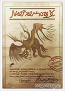

 

是个飞行系的讨伐对象，会用风魔法，各种各样的物理攻击也还不算弱，不过对Basch使用绿魔法デコイ，进行火力吸引，稍微注意一下补血即可， __懒得和它耗__ 得请选择必杀连协…… 

之后就来到莱斯沃尔王墓了……存档，Boss战，对Boss使用イクシロの実，之后就随便虐吧……流程中的Boss基本都是当菜切的…… 

剧情，来到王墓门口，是否整备无所谓……建议回一趟王都把手配書 No.7 - 空から呼ぶ声得奖励取到，是1把弓  **（直接卖了……）** 和1面贝纹盾（贝纹盾，物回+5，永久自动魔盾），贝纹盾是非常重要的装备，尤其是到了游戏后期对付那些持有自动能力—活力無視和回避無視并且会恶心的异常攻击的强力Boss  **（典型：戒律王的召唤阵大魔法！）** 非常有用，可惜只能赤魔、骑士和破坏用…… 
 
## Chapter 5——暁の断片： 

 _レイスウォール王墓，以后通称王墓：_  

#### Boss战：デモンズウォール 

回到王墓，进去之后，会遇到第一面恶魔墙，这场战斗可不是菜的……限制时间很短，Boss还会使用X-zone的异常状态……在战斗中这个异常没有解决办法，所以必须速战速决，请选择必杀连协  **（读者：你有意思么？？？笔者：我也没办法啊……）。** 实在不行，就逃跑吧！……请注意右图中，必杀一次性扣除了Boss多少血槽…… 
 

 

进入下一道门，又是Boss战…… 

#### Boss战：デモンズウォール 

还是一道恶魔墙，这次可不能逃跑了！不过 __时间的限制长度宽松了不少__ ，所以这次常规打即可，黑魔利用サクラの杖使用エアロ，每次能有1000+的伤害，如左图，一边走一边退，小心别被X-zone就成了。 
 

 

如果两战都胜利了，请回到上一场景，调查恶魔墙开始的位置，启动密道，从左从右无所谓，进入隐藏场景，里面有一个宝箱，是1片最强黑魔片……好抠门…… 

这下可以正式进入王墓了！来到大通廊，取到两个魔法。然后在该场景Chain蝙蝠，Chain增加11之后，出现珍惜怪。 

珍惜怪43号バルムー（怪物图鉴编号298），擅长魔法攻击，但是威胁不大……可以偷到ラミアのティアラ（魔装5，魔防+25，魔力+4，水属性减半，活力+7，MP+48）。 
 

 
 
如果觉得烦不偷也罢……反正 __暁の断片入手之后，我方的装备会发生质的飞升！__  

然后就是去南/北翼の通廊解除机关，过程中收集到石材的话不要卖掉哦，进入火炎の回廊……先把两个宝箱开了，其中一个是ブラッドソード（低级血剑……），然后迎来弱模式下的第一场收伏战！ 

#### 收伏战：魔人ベリアス 

剧情召唤兽嘛……不会太强，和之前的Boss打法一样，就是要注意在召唤阵大魔法之后请 __及时解除油污状态__ …… 

开启旁边的两个宝箱……剧情，取得 __暁の断片__ ！  **（取得暁の断片是游戏中极为有战略意义的事件，在取得暁の断片之后，FF12极大的自由度一下子全部彰显了出来！）**  
 

 

脱出王墓，上戦艦リヴァイアサン，剧情，Boss战。 

#### Boss战：ウォースラ 

我方有人咏唱魔法时，Boss必定进入使用“反射”，所以 __这场战斗就素砍好了__ ，嫌烦就用必杀连协好了……轻松取胜！ 

GC，精彩的大爆炸！剧情，可以自由活动了！先去沙海亭接讨伐吧！天呢……瞧这一打……先接了再说，不过以我方现在的实力，恐怕去挑战也会被虐，所以先接好了……不急着做，反正在进入哥尔摩大森林之前，我们的公会等级会升到6级的  **（其实稍微努力一点的话，7级也没问题）** …… 

进入吉萨大草原的雨季，雨季的敌人强了不少，不过也不算难，就是不要去招惹雷精灵和雷元素！然后请按照专题上緊急討伐No.4 - 復活、封印されし楽園！的提示，把6棵树全砍掉……余下的就没什么好说了，进入集落取得魔法……之后就是进入奥兹蒙尼平原了！ 

 _オズモーネ平原，以后通称平原：_  

平原上也没有什么强敌，一路直奔ガリフの地ジャハラ。 

 _ガリフの地ジャハラ：_  

请买一把マインゴーシュ（匕首4，攻+46，这些很平常，但是它 __提供50点的物回，给猎人装上当肉盾非常合适__ ），再买两面アイスシールド（盾3，物回+15，冰减半），不要去见大长老，在第三个场景去见手配書 No.9 - 衝突！オズモーネ平原を守れ！的委托人吧！ 

#### 工会讨伐：手配書 No.9 - 衝突！オズモーネ平原を守れ！ 
 

 

接到讨伐之后去ひびわれ谷全灭那些名字叫ウー的鸟怪，退出这个场景立刻切换返回就可以发现エンケドラス，注意，最好不要遇到珍惜怪04—ブルダイル，遇到了重新切迷宫好了。エンケドラス防高血厚，而且还会自己补血，所以在把它打到半血以后，就用必杀连协一鼓作气解决它吧！ 

回到ガリフの地ジャハラ，得到奖励，是一个金のアミュレット。 

然后请回到王都，完美完成渡船再开和沙漠病人这两个支线，从而重新开启巴尔海姆地下道！ 

需要说明的是：取谷間の花のしずく时要去北岸的东沙漠，那里的敌人 __现在来看可是不弱__ ，请用火力吸引的办法将攻击都引到Basch身上并保持较高的血量！混乱及时解除，只要不贪功， __取得3个谷間の花のしずく并安全返回__ 还是不难的！ 

至此，我们又得到了一个金のアミュレット和ナパームショット（龙炎子弹，攻击+3，火属性攻击）。同时地下道也重新开启了！好了，现在开始我们漫长的装备更新之旅！ 
 

 

 
 
## Chapter 6——征战四方1： 

 _モスフォーラ山地，以后通称山地：_  

回到城塞，花钱租鸟，一路狂奔到山地的集落，开启 __盗賊のカフス__   **（重要！）** ，存档！ 

要征服现阶段的紧急讨伐和隐藏召唤，没有过硬的装备是不行的。可以 __现阶段直接找高级敌人要高级装备也不太现实__ ，所以要先给全员搞一套 __过渡用的装备__ ！现阶段敌人的攻击以物理攻击居多，所以优先收集铠甲，后收集头盔。开启一下宝箱时千万不要装备ダイヤの腕輪。 

从集落左上角出去，进入岩坂のそびえる路，请对照天幻专题的宝箱地图，29号和30号宝箱，在南部山道的两个顶点处，分别可以开出ダイヤアーマー和黒装束。\r 

ダイヤアーマー（重装6，物防+40，力+7，活力+5）； 

黒装束（魔装6，物防+33，魔力+6，速度+3，MP+38）； 

 
这2件装备每次AC的开出率均为22.5%，不算低，下述所有装备请按照自己的职业分配完成收集，ダイヤアーマー收集齐了之后就可以了，因为下一个场景中还有黒装束呢，之后就可以从右上角进入北の山すそ了，可以分别从33号，35号和36号宝箱中开启出黒装束，メタルジャーキン和ドラゴンシールド。 

メタルジャーキン（轻装7，物防+31，HP+280）； 

ドラゴンシールド（盾4，物回+23，土无效）； 

 
这3件装备每次AC的开出率均为21%，也不低，收集完毕之后就可以从山地离开了！ 

再回到东沙漠北岸，进入ヨーマ大砂丘，50号宝箱中可以开出ボーンメイル。 

ボーンメイル（重装5，物防+35，力+6，暗减半，圣弱点），这个防具防御性能不及ダイヤアーマー，但是暗减半在不久的一场战斗中会派上用场。 

还有，选择破坏的玩家，可以从56号宝箱中开出ハンマーヘッド。 

ハンマーヘッド（单手斧4，攻+81），真的很难理解东沙漠能开出攻击力这么高的兵器……虽说是破坏的。 

这2件装备每次AC的开出率均为24.375%，收集完成之后进入断裂の砂地，在59号，63号和70号宝箱中可以开出黒頭巾，バイキングコート和ダイヤヘルム。 

黒頭巾（魔装6，魔防+33，魔力+5，速度+4，MP+60）； 

バイキングコート（轻装6，物防+27，HP+240，水无效），防御性能也不及メタルジャーキン，但是水无效的特点很不错，以后会用到； 

ダイヤヘルム（重装6，魔防+29，力+7，活力+3）。 

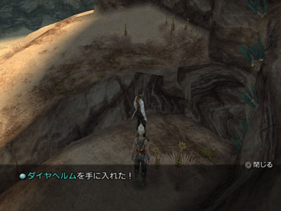
 

前2件装备每次AC的开出率为26%，第3件为20%，最后不要忘记在70号宝箱中开启出バーサーカー（饰品13，物防+2，永久自动狂战），概率是100%，宝箱必出不再生，狂战士饰品是弱模式下非常重要的装备，国际版独有，在 __弱模式下机工会非常经常地装备狂战饰品的，其将伤害和攻击速度提升至1.5倍的效果对铳实在是太合适了！__  

刷出上述装备的话，只有轻装的头盔没有着落了，现阶段的人物生存算是有了基本的保障，所以，保证不死的情况下，自然就该考虑输出了！下面说兵器的取得。 

刚才已经提及了破坏的ハンマーヘッド，然后说骑士的兵器，就是大名鼎鼎的即死剑！专题上已经辟出一个专门的页面来讲デスブリンガー，我在这里就不费唇舌了，不过请从同场景的44号宝箱中开出氷の杖，氷の杖（黑杖4，攻+38，魔力+5，冰强化），每次AC开出率为22.5%。该场景的陷阱会让人 __陷入病毒状态__ ，在万能药不能量产之前这个状态很烦人，所以小心陷阱，别的没什么要注意的了。 

 

 _サリカ樹林，以后通称树林：_  

再回山地，一直向北，进入萨利卡树林，在巨木に囲まれた路的4号宝箱中开启ゴクウの棒。 

ゴクウの棒（棒4，攻+72）； 

该装备每次AC的开出率为18.75%，然后进入別離の路，在20号宝箱中开启ラス·アルゲティ。 

ラス·アルゲティ（铳3，攻+29）； 

该装备每次AC的开出率为14.625%，完成这些兵器收集就可以去いやしの響く路了，开启技-劝诱，在传送存档点存档，然后传送回大沙海收集两套防具。 

やる気のでる防具和プラチナ製の装備 

#### 交易品：やる気のでる防具：

チャクラバンド（轻装8，魔防+37，力+2，HP+390）和力だすき（轻装8，物防+41，力+2，HP+400），这也是一套过渡装备，不过比起在山地开启的メタルジャーキン来说，性能好了相当多的……给肉盾装上是很合适的，方便进一步的收集！ 

#### 交易品：プラチナ製の装備： 
 

 

 

 

 
 
[/B]プラチナヘルム（重装8，魔防+35，力+8），プラチナアーマー（重装8，物防+49，力+7）和プラチナシールド（盾4，物回+20），这是在进入死度纳布迪斯之前能收集到的最强重装了！因为这套装备共用一种材料，所以利用共享原则一并合成  **（材料并不珍惜，但是共享原则还是多用才熟练嘛……）** ，共需5种材料，这些材料的收集大多不困难，下文只提及比较简单的收集方法： 

1).良質の毛皮×6：东沙漠北部和莫福兰山地大量出现的红色狼怪（怪物图鉴编号113，这个怪物在两地的名字不相同），高概率密猎良質の毛皮； 
 

 

2).火の魔晶石×3：推荐两个地方，泽尔提南地下洞窟キラーカッター（怪物编号191），中概率偷盗和高概率掉落出现在バラムカ断層（上层）和砂落ちる間。还有就是大沙海的炎精灵サラマンド，高概率偷盗（现阶段还是只偷它吧！没必要打死它，而且大精灵可都不好欺负……），偷窃所有大精灵时，请派出两人，一个人上去偷窃，另外一个人装备西陣の帯，在出现不利的情况下可以逃跑； 
 

 

3).巨人のなめし革×5：东沙漠北部和莫福兰山地出现的ディコタイタス（怪物图鉴编号119），高概率偷盗，高概率掉落，密猎100%； 
 

 

4).虫の甲殻×2，泽尔提南地下洞窟キラーカッター（怪物编号191），高概率掉落； 
 

 

5).雷の魔石×6，这个材料太常见了，推荐在萨利卡树林的南瓜怪身上取得，パンプキンヘッド（怪物图鉴编号122），要不在奥兹蒙尼平原上的马怪身上取得也可以。 

收集完之后请一次性全部将上述战利品卖出，两种交易品会同时出现。 

  **PS：** 如果选择偷窃炎精灵的话，请偷盗出炎王石サラマンド，很快就会用到的重要合成材料哦！同时，偷盗出的精霊石也不要卖掉……而地下洞窟的螳螂怪キラーカッター，会以12%的固定概率（骑士心得）掉落裂かれた衣，如果在沙漠病人支线中没有收集到第3个金のアミュレット的话，卖掉1个裂かれた衣便可以合成出一个金のアミュレット！ 

好了，把新合成的装备调整好，请传回ガリフの地ジャハラ，从平原进入地下洞窟，这里的马怪メリッサ（怪物图鉴编号195）可以以极低概率掉落大地の帽子。 

大地の帽子（魔装7，魔防+41，魔力+7，HP+90，MP+70）； 

概率是很低的，但是连续2个场景的メリッサ，非常方便Chain，收集所需要的数量收工，再传送到地下道，向ゼバイア連結橋进发，小心陷阱不要踩到陷阱，这里的骷髅デッドリーボーン（怪物图鉴编号041）身上可以低概率偷盗魔人の帽子，同时低概率掉落，中概率偷盗修羅の骨，选择格斗的玩家请收集8个。 

魔人の帽子（轻装9，魔防+43，HP+530，魔力+2）； 

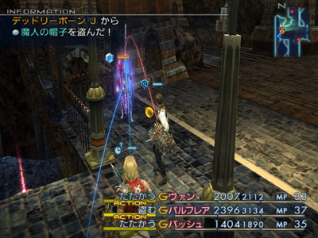

小心别被围殴了，所以不建议去西部新坑道区  **（敌人密度太大）** ，单个敌人不难解决，装备盗賊のカフス，6%概率并不低，一会儿就能收集到想要的数目。现在应该可以去合成当前最新的兵器的，不过下一个Boss具有铳耐性，而Basch的兵器（单手剑，棒和单手斧）都够强了，所以传回树林，准备打一场简单Boss战。 

#### Boss战：ボムキング 

Boss会让我方进入油污，再 __配上强大的火魔法，想全灭我方跟玩一样__ ，不过作为 __魔法生物的Boss却会吃沉默__ ，所以将Boss沉默之后就好办多了，Boss水弱点，会优先攻击咏唱魔法的人物，所以数量足够的话最好让 __黑魔使用水流魔片__ ，许多宝箱都能开启出，这里就不多说了，下面4张图是猎人和黑魔的装备以及Gambit设置，不一定是最好的，但肯定保险 
 

 

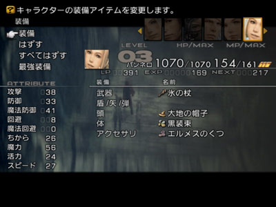
 
 
……至于Basch，装备狂战饰品和现今最强兵器了……Boss具有铳耐性，所以请让Basch装备狂战饰品连同黑魔的水流魔法做主要输出，猎人做肉盾就可以了，注意Boss低HP时会进行回复  **（具体行动解析请参照专题相应的怪物图鉴页面）** ，请一鼓作气解决它！ 
打完Boss之后，重要的隐藏迷宫死都纳布迪斯和纳布琉斯湿原就都像玩家开放了，那两个地方的杂兵就我方现在的实力而言实在是不弱，所以继续去做充分的准备吧！  **（读者：你烦不烦…… 笔者：不烦的话还谈什么弱模式！）**  
 
## Chapter 7——湿原探秘： 

之后我方要面对的敌人的HP都很长，所以 __优先提升机工输出__ ，选择合成最新式の猟銃。 

#### 交易品：最新式の猟銃：

アルクトゥルス（铳6，攻+45），这是全游戏第3强的火铳，最早入手时机却异常的早  **（探秘大沙海时就可以合成）** ，而且以现在的装备来看，入手难度的确不大，有了アルクトゥルス，机工有如如虎添翼，再配上狂战饰品，流程中的敌人和Boss基本都是被当菜切的！PS：其实 __最强铳アルデバランY的合成条件也达成__ 了，不过就是……言归正传，所需3样材料： 
 

 

1).エンサのヒレ×2，之前已经提及过了，大沙海的亚人身上低概率偷盗或是大沙海的怪鱼エンサ以20%固定概率（魔道士心得）掉落； 

2).飛竜の翼×2，现今的话出处只有1个，出现在奥兹蒙尼平原的ひびわれ谷的珍惜怪58号エアロス（怪物图鉴编号328）身上低概率必定偷盗，エアロス的出现条件很有趣，击倒同样在该场景出现的珍惜怪04号ブルダイル（怪物图鉴编号299），而ブルダイル的出现条件是20%概率出现，所以反复1AC刷出ブルダイル，几枪解决掉这条大鳄鱼，然后エアロス一会儿就飞过来了，偷完之后顺手宰了它，没难度的！之后切换迷宫使珍惜怪重生，收集2个后收工； 
 

 

3).サラマンド×1，炎王石，上文说过了； 

合成完之后，给机工装备上，在之后我们要重新返回加兰斯地下水路，去弄更强的轻装体防具，这样的话我们需要弄到水門のカギ，所以要先完成一个讨伐。 

#### 工会讨伐：手配書 No.5 - 落としものにはモブがつく 
 

 

委托人是王都西门的传送莫古利，讨伐对象则在加兰斯地下水路的西部水量調整区，此时，水路已经刷新成了高级怪，不过凭借现在的实力，不会很难……进入西部水量調整区之后，白色的史莱姆就从天而降了！ホワイトムース是史莱姆，自然具有铳耐性，所以还让Bsach装备狂战饰品来担当输出吧！ホワイトムース是可以被黑暗的，将其黑暗之后，以猎人做肉盾，黑魔作输出  **（炎の杖搭配中级火魔法）** ，再及时解状态，战斗就是必胜了！战斗后记得去东部水量調整区再次开启地图宝箱。 

 

 

上面几幅图为狂战骑士和黑魔造成很客观的输出，以及猎人和黑魔的Gambit设置……完成任务之后，领取奖励，追加得到水門のカギ，这样我们就可以控制地下水路的排水系统了。回到水路控制系统，进入如下图位置： 
 

 

这个场景里面有一个死神ゲシュンペスト（怪物图鉴编号025），身上可以低概率偷盗忍びの衣。 

忍びの衣（轻装9，物防+44，HP+470，速度+4），偷完了，无论偷没偷到都杀了，可以轻松2AC令其重生，中了死的宣告也不用解，死了再复活好了！偷到足够的数量走人！ 

如果选择了破坏的玩家请注意，现在又可以合成一个比在东沙漠刷到的兵器稍微强一点的兵器，其实一个攻+81，另一个攻+88，差的不多，不过因为合成也不太费劲…… 

#### 交易品：戦斧：

（单手斧5，攻+88），共需3样材料： 
 

 

1).とがった角×2，地下水路的大蛤蟆会掉落； 
 

 

2).モルボルの実×4，地下水路的グレートキング（怪物图鉴编号023）高概率掉落； 

3).風の魔石×6，山地的蛇和怪鸟都会掉落； 
 
这样以现在的装备，闯湿原是可以了  **（想平趟是不现实的）** ，传回萨利卡树林，从右上出口进入纳布琉斯湿原。 

 _ナブレウス湿原，以后通称湿原：_  

纳布琉斯湿原有 __相当多的亚人__ ，攻击力不低  **（有的还拿着铳……）** ，以及大量的不死系敌人，建议在追憶の地开启地图之后直奔まどろみへ誘う平原的北部出口，准备对战全游戏中 __最强的水晶虫__ …… 

#### 特殊战：最强水晶虫 
 
虽然这个敌人没有专门的Boss图鉴，但是实力的确不俗 

水晶虫，伪装成记忆水晶的怪物，不会物理攻击，但是会极多的属性魔法，而且湿原的黄色水晶虫的HP更是在国际版中加长到了无耻的43656，在配上烦人的自动能力被ダメージカット  **（将除了针千本外所有伤害减至7成）** ，的确是一个强敌！它的元素魔法如果不做 __减半防御__ 的话，在魔防40左右时能造成接近1000的伤害……所以，进行相应属性的抗性是非常重要的！推荐现在可以进行属性抗性的防具有： 

アイスシールド，ダイヤの腕輪，瑪瑙の指輪，アーガイルの腕輪，ボーンメイル和人造破魔石。余下的还有轻装ポンチョ和アダマン帽，但是降低HP。以及ボーンヘルム，会降低魔防，所以都不推荐。 
 

 

开战之后，先上必杀……一通连协之后，给Basch装备上 __人造破魔石__ ，这样Basch的属性抗性就不用再操心了，然后请根据左上角怪物咏唱魔法的提示  **（如上左图，水晶正在咏唱高级火焰，就针对火属性防御进行装备变更，注意，敌人有魔法CT0，别慢了）** 来给Balthier变更装备来减轻伤害，再专心给主要输出Vaan补血，这场战斗胜利就没什么难度了！ 

胜利之后，水晶虫变成了真正的传送水晶……进行回复，然后再去まどろみへ誘う平原，在这个场景是浓雾天气时，会出现暗精灵リョスアルプ，请偷到暗王石リョスアルプ，稍后合成有用，并且在该场景的22号宝箱中可以开出マディーンの衣。 

マディーンの衣（魔装7，物防+41，魔力+8，力+1，MP+46）； 
 

 
 
每次AC开出的概率为18.75%，请收集到足够数量为止。 

同时，该场景中有大乌龟エメラルタス（怪物图鉴编号202），可以高概率掉落和中概率偷盗千年亀の甲羅，请收集2个，还有这里的僵尸会以12%的固定概率掉落ゾンビパウダー，用1个ゾンビパウダー和1个戦馬のたてがみ（奥兹蒙尼平原的马怪会掉）可以合成クイスモイトの靴（HP+500，完全防御急速损血）……完成这些事情之后，请传送回王都，补足药品  **（凤凰尾买到99个）** ，重返湿原，准备合成1面在前期来讲非常出色的盾牌。 

#### 交易品：まがまがしい盾：デモンズシールド（盾6，物回+40，暗吸收），共需3种材料： 
 

 

1).千年亀の甲羅×2，上文说过了，大乌龟エメラルタス处取得，就近嘛； 
 
2).戦馬の殻×8，这个材料值得说一说，首先戦馬の殻只能是湿原马怪ワイアード（怪物图鉴编号203）以低概率掉落，而且要8个，所以Chain是首选  **（我是Chain到了99，凤凰尾全部用光光，挺有意思的）** ，在命消えし水辺南部出口，有3只ワイアード，这个马怪虽然是挺高级的不死系怪物，但是 __一个凤凰尾就可将其一击必杀__ ，ワイアード的攻击力可并不低，所以最好关闭4倍速，在远处投放凤凰尾来了结它！ 
 

 
 
同时可以获得 __大量的雷の魔晶石和鉄甲殻__ ，所以以后这两样材料的收集我就不说了，而且在收集戦馬の殻的过程中势必会收集到戦神のアシュリング和ディフェンダー，前者是合成霊帝の魂的材料，后者是1把不错双手剑，ディフェンダー（双手剑2，攻+90，物回+37），收集到8个戦馬の殻就可以收工了，愿意多玩会儿的可以一直Chain，余下的东西有几个算几个； 
 

 

2).リョスアルプ×1，暗王石，说过了； 
 

 

选择了骑士同时准备合成向日葵的玩家，收集到的戦神のアシュリング不要卖！如果打大乌龟エメラルタス时很RP地掉落了ヒヒイロカネ也不要卖掉。 
 
## Chapter 8——暗之异型： 

到现在为止，我们已经取得了在暁の断片刚入手后足够强的一系列装备，其实还有一些更强的装备可以取得，不过多少都有些难度，不妨我们先去收伏2体召唤兽在解决一下讨伐任务，再去谈谈装备  **（读者：你还真不是一般的无聊……）** ： 

#### 收伏战：憤怒の霊帝アドラメレク 

所在场景是地下洞窟的アスローザ大流砂，进入之后往里面走一点就是憤怒の霊帝アドラメレク了，战斗时有无数的僵尸做干扰，所以 __憤怒の霊帝アドラメレク是一级所有召唤兽中收伏最困难的__ ，不过该Boss __没有回避无视的自动能力__ ，而非物理攻击绝大部分都是雷属性的，所以 __ダイヤの腕輪能派上大用途__   **（地下洞窟能取到第2个）** ……上2图为Gambit设置……可以让猎人对该场景的不死系敌人使用Hi-Potion，因为一个Hi-Potion再加上狂战下机工配着アルクトゥルス的一下攻击，是很有可能把僵尸打死的，能够减轻该战斗的压力，而其Boss吃黑暗，再用ダイヤの腕輪屏蔽掉雷属性伤害，这场战斗真的就没有什么压力了……唯一要 __当心的就是召唤阵大魔法所附带全员35%的停止__ ，不过全员都被停止的概率只有9.5%左右……注意 __火力吸引__ ，现在猎人的HP已经够长了，而且配上高回避匕首和刚刚合成的暗吸收盾牌， __物理攻击只有25%的可能会攻击到他__ ……以下为3人的装备和Gambit设置…… 

 

 

 
 
#### 收伏战：死の天使ザルエラ 

在地下道的最内侧……最弱的非主线召唤兽死の天使ザルエラ等待着我们……在第7ターミナル接続路存档，并且刷出カメオのベルト（攻击无视回避……）……进入第７ターミナルステーション，对战死の天使ザルエラ。 

死の天使ザルエラ的有3种模式形态  **（HP在20%以下时全模式解除）** ，会用单体强制即死，各种等级异常招式，召唤阵大魔法是素数等级即死  **（除了Vaan，我方全挂……）** ，防御模式下死の天使ザルエラ会物防魔防+80，但是对于我方无视防御的火铳攻击，根本无所谓，所以防御封印即可，万一中了混乱，及时解除就可以了，被强制即死了一定要立即复活，尤其在段位模式下，请根据左上角招式提示，及时针对等级变更饰品来对抗异常，素数即死之后请务必摘下狂战饰品开始复活  **（废话）** ……胜利不难。以下为猎人和白魔的装备和Gambit设置： 
 

 

 

开启第７ターミナルステーション的2个宝箱，从水路脱出吧！ 

回到王都，先把公告板上剩下的3个通常讨伐了结掉吧！ 

#### 工会讨伐：手配書 No.1.- 流れ落ちる雨と指輪  

**（这个任务太简单了，尽可以在去ガリフの地ジャハラ的过程中去做……）**  
 

 

首先确保吉萨大草原是雨季，进入集落，接委托，来到星ふり原，在桥附近能遇到讨伐对象，没什么好说的吧……装上 __龙炎子弹__ ，毙了它……回去交委托……估计是任务太简单了，报酬很不值钱。 

#### 工会讨伐：手配書 No.6 - 誰がために竜はなく 
 

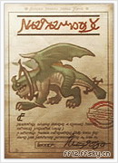

 

委托人在王都地下，讨伐对象在西沙漠風紋の地，当是沙尘暴天气时会出现，Boss的HP不短，可是有火弱点，配上狂战饰品的机工，一枪能7000+，而且这个 __Boss没有杀招__ ……所以，切之…… 
 
#### 工会讨伐：手配書 No.8 - ピリリと苦い毒蛇の酒 
 

 

委托人竟然是沙海亭老板……讨伐对象在地下洞窟的异端诱う岩窟右下角有阳光的地方，进入该场景之后要先晃一会儿，然后讨伐对象就突然出现了……话说玩美版时，第一次这个Boss噌地一下窜出来吓了我一跳……Boss不会魔法， __物理攻击是火属性__ ，水弱点，吃黑暗，所以让黑魔上场，让 __猎人火力吸引同时装备人造破魔石，机工装备水流子弹__ ，顺利讨伐。对了，该讨伐对象身上可以偷到高級なめし革，配合上地下水路的大鳄鱼身上的高級ウール， __黑袍+黑面可就出来了__ ……我当时估计大脑脱线了，顺手把它宰了……所以就…… 

上述两个讨伐结束后回王都领赏，除了蛇眼都可以卖掉哦！ 

剩下的两个紧急讨伐，只要稍微注意一下现在都可以轻松解决，不过基于那两个讨伐的奖励……还是等等好了，想做的玩家可以去做，稍微注重一下特点可以无伤，至于本攻略会在之后解明……到工会领取6级之前的奖品…… 

做完了这一些，基本可以去见ガリフの地ジャハラ的长老了……  **（读者：亏你还记得你该干什么……）** ，不过，不妨先去收集一些材料好了……当然了收集材料的事情也可以以后再办，本攻略只是先写出了罢了…… 

#### 要收集5样材料： 

1).攻竜の殻×2，可以从泽尔提南地下洞窟的ふりそそぐ空场景中，击倒スカルドラゴン（怪物图鉴编号164）身上取得，高概率掉落； 
 

 

2).死竜の骨×3，和上一样材料的出处相同，低概率偷盗或者是龙骑士心得10%固定概率，没有选择破坏的玩家请忽略此项； 
 

 

3).デスパウダー×2，泽尔提南地下洞窟和上述骨龙同场景出没的鬼魂ボギー（怪物图鉴编号194）身上魔剑士心得16%固定概率掉落。 

4).悪魔の羽根×6，现阶段取得最麻烦的材料，这个材料最方便的出处本应该是在索亨地下宫殿高概率密猎インプ（怪物图鉴编号139）或者是ピットフィーンド（怪物图鉴编号141），但显然现在离索亨地下宫殿还十万八千里呢，这个材料的相关交易品是神秘的な杖和高級な棒，前者还好，后者到了索亨地下宫殿再合成根本是没有任何意义……而神秘的な杖也是1柄极佳的黑魔杖，所以才会有现阶段入手本材料的问题。当然，等到レンテの涙入手之后，神秘的な杖的合成条件才能达成，现阶段要是想取得该材料要从ガルキマセラ（怪物图鉴编号024）身上下手，机低概率掉落和低概率偷盗，让地下水路的第１０主水路处于充水状态，就能遇到该怪物，在第１０主水路北部离存档点场景近的出口，有 __3只ガルキマセラ，2AC刷新很方便__ ，注意收集是不要招惹水元素，Chain到大金币吧！如果想尽早高級な棒的玩家请收集12个，愿意和神秘的な杖一起入手的可以根据 __共享原则而只收集6个__ ； 
 

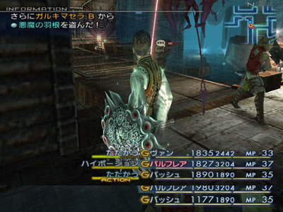

 
 
5).邪神の肉×7，这样材料现在要想取得要从71号珍惜怪ドゥラウナ（怪物图鉴编号354）身上偷得，虽然有点费时，但是必定能偷到，不拼RP，耐心即可，出现条件：第4処理区補助水路排水时，首先，进入区域逗留5分钟，然后，每经过15秒，系统都会以8%的概率判定一次让珍稀怪出现； 
 

 

  **PS：** 个人觉得攻竜の殻比死竜の骨还难弄……还有就是第一次遇到ドゥラウナ的确要等5分钟，但是之后再来貌似不用等那么久，不过也不一定……还有就是大家要是一直按本攻略走的，一定富得流油了吧？？！！ 
 
至于高級な棒和植物製の防具，现在都可以合成了，不过现在都不推荐，一是没必要，我们现在够强了，二是有些材料收集起来有些烦  **（读者：烦的还少么？笔者：是不少，以后也少不了……）** 。

## Chapter 9——自由之价：

 现在我们真的可以去见长老了，然后王子加入，目标神都！向哥尔摩大森林进发！ 

 _ゴルモア大森林，以后通称大森林：_ 

 现在机工要是开了行动时间缩短3阶，再配上狂战士状态，出招速度简直就是飞快，往往就是猎人还没来得及偷，Vaan就一枪把敌人闷毙了！还有就是现在已经有90回避  **（实际上是40（+10）+50，系统显示的90没有意义，回避是分别判定的）** 的猎人显然是做Leader的最佳人选，他佩戴的饰品建议是 __盗賊のカフス或者是ダイヤの腕輪__   **（请至少收集99个铁锈）** ，各自有各自的好处，具体选哪个，诸君随意！ 

 _エルトの里：_ 

 来到エルトの里，买饰品和魔法，剧情，记得开启ヘイスト（时4，加速）的宝箱。 

 FF12主线剧情中搞笑的不多，Vaan在这里被鄙视算是一个…… 

 _ヘネ魔石鉱，以后通称赫尼魔石矿，其二阶矿道通称蛇夫矿：_ 

 ヘネ魔石鉱，骑鸟来到入口，进入魔石矿1期矿道，对于现在的主角们，敌人显然非常地不够看，一路奔到最里面去打Boss吧！ 

#### Boss战： ティアマット

 是一只轮龙，菜就一个字……流程中的Boss基本都是用来欺负的（非流程的Boss基本都在欺负我们）…… 剧情，传回エルトの里，レンテの涙入手，大森林的封印全部解除，同时意味着幻妖之森的北部也对我们开放了！ 

 这意味着又有不少好东西可以入手，不过带个HP不过200的Guest总是别别扭扭的，所以建议大家一路捅到神都，让王子退出，再进行收集！ 

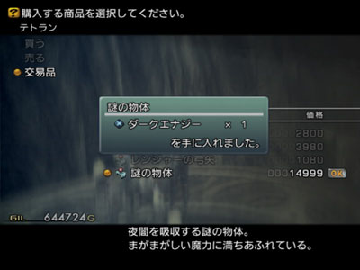

 謎の物体一般也是在这个时候合成出来的，如此高伤害的珍惜道具，适时使用吧！ 来到大森林的先を見通す広場，存档，我们要打 __流程中唯一值得一说的Boss__ 了！ 

#### Boss战：エルダードラゴン

 这是一头植物系轮龙，这个Boss有2点说头，一是身上可以 __低概率偷盗皇帝のウロコ__ ，这东西是合成最强铳的材料， __需要2个__ ，全游戏的 __入手途径只有3条__ ： 1.低概率偷盗本Boss； 2.低概率偷盗手配書 No.25 - 地獄へのフライト！的讨伐对象； 3.游戏中 __杂兵No.1—アルケオエイビス__ （怪物图鉴编号193），龙骑士心得10%掉落； 话说这3个龙系敌人都不是好惹的主……一个比一个变态，为什么要建议从本Boss身上偷取呢？主要是因为手配書 No.25 - 地獄へのフライト！的接到时机 __实在是太晚__ 了，要求飞空艇入手，所以最强铳的入手时机也要推到那个时候，本来アルデバランY是理论入手时机最早的FF兵器，现在却因为アルケオエイビス的过分强化导致入手时机一下几乎进入盘终物语了……令人不爽的是，如果想早入手アルデバランY，势必要从アルケオエイビス身上取得皇帝のウロコ，但是 __作为杂兵No.1，10%的固定概率实在是不高__   **（让我想起了从戒律王身上偷无名塔的曾经……）** ，所以拼RP取得一个就不错了，另一个就不妨从本Boss身上偷得……这样，只要能 __击败アルケオエイビス并且取得1个皇帝のウロコ__ ，就能取得アルデバランY啦！ 话说アルデバランY真的这么诱人么？ __研究一下伤害公式__ 就知道アルデバランY比现在拿的アルクトゥルス强多少了！！！ 二是这个Boss的杀招—シオウルスボール实在可怕……非常繁复的复数异常攻击……现在万能药还不能量产，这招极为讨厌，要是狂战机工吃了这招备不住几枪就把我方全灭了……所以要想一点邪恶的办法遏制住Boss的シオウルスボール……シオウルスボール是80%HP下必定使用一次，也就是说，除非你能一下在Boss的HP为57353时直接秒了它，否则必定要吃シオウルスボール…… 

 好在 __Boss吃睡眠__ ，这下明白了吧！进场后，先偷，偷到皇帝のウロコ后再战  **（如左上图）** ，要不就读档……偷到之后快速把那两个木头清掉，然后让黑魔使用睡眠魔法  **（如右上图，黑魔适时控制）** ，白魔使用エアロの魔片  **（没有的话用别的攻击魔片也成……就是エアロの魔片效果比较好罢了）** ，王子使用無作為魔从旁辅助  **（王子为数不多的用途，但是因为魔力太低同时没有执照盘支援，就算摇出究极黑魔法，其伤害也不及白魔的エアロの魔片）** ， __睡眠效果可以叠加__ ……就这样一直屈死Boss即可！  **PS：** 凡是吃睡眠的强力敌人都可以用这种无耻的方法解决……前面没说的一个緊急討伐No.3 - 罪は許してモブは許さず！也可以这样无伤完成！ 打完Boss之后，进入帕拉米娜大峡谷，转战神都！ 

 _パラミナ大峡谷，以后通称大峡谷或冰谷：_ 

 

 _神都ブルオミシェイス，以后通称神都：_ 

 剧情，王子退出。 

## Chapter 10——征战四方2：

 好了，这一下我们又可以转战南北， __强化自我__ 了！ 既然都到了神都，不妨先去做两个简单的通常讨伐…… 

#### 工会讨伐：手配書 No.1.- 死者よ、永久に眠れ

 

 先去ガリフの地ジャハラ把任务接了，然后去魔石矿把任务做了，没什么好注意的！回来领赏，如果想合成向日葵的玩家不要把奖励卖了  **（是1个ソウルパウダー！）** …… 

#### 工会讨伐：手配書 No.1.- 神都を汚す獣の血

 

 委托人在神都，接到后顺着大峡谷往遗迹走，在氷竜の骨就能遇到讨伐对象，属性弱点是土，风吸收，其余减半……就用沉默子弹吧！比起上一个讨伐，这个讨伐对象也没强多少  **（其实主要是机工的攻击太高了，速度也太快了……）** 打完了记得先去遗迹一下，存档，以后就能直接传送过去了……回神都交任务……是把时魔用的弩，意义不大…… 下面做几个合成。 现在又有不少重要的装备要合成了，其中我们先合成呪われた首飾り和植物製の防具 

#### 交易品：呪われた首飾り：

ニホパラオア， __大名鼎鼎的药剂逆转__ 了！鲸鱼之牙能让极其强大的敌人瞬间变成废材，其王道的程度已经因为它 __过于强大__ 而导致在更为极限的攻略中禁止其使用了，以后通称逆转指轮，共需3种材料： 

 1).レオ×3，狮子宫魔石，各种地龙身上偷得或者是掉落，东沙漠的ワイルドザウルス（怪物图鉴编号004）和赫尼魔石矿的ロックイーター（怪物图鉴编号081）身上低概率偷盗，建议从东沙漠砂段の丘  **（2AC方便）** 的ワイルドザウルス（怪物图鉴编号004）身上低概率偷得，偷完了杀掉，ワイルドザウルス还以12%的固定概率掉落地竜の骨，也是有用的材料. 

 收集完2个地竜の骨就可以去魔石矿的区間連結ラインA找ロックイーター要レオ了，因为每次2AC能刷出2只ロックイーター，效率高些……在区間連結ラインA和传送点之间的场景还有一种叫サンダーバグ（怪物图鉴编号079）的宝箱怪，它身上会以18%的固定概率掉落落雷衝，选择破坏的玩家请收集； 

 2).血染めの首飾り×3，泽尔提南地下洞窟击倒灵帝的场景的僵尸コープス（怪物图鉴编号196）会以16%的固定概率掉落； 

 3).シャレコウベ×2，在哥尔摩大丛林的葉ずれのしみる路，全灭该场景的全部杂兵，之后ダークスケルトン（怪物图鉴编号092）会登场，ダークスケルトン会以10%的固定概率掉落シャレコウベ……当达到21Chain之后，会出现珍惜怪69号グレイブロード（怪物图鉴编号350），其身上也可以必定偷到シャレコウベ； 

 

 _幻妖の森，以后通称幻妖之森：_ 

 

#### 交易品：植物製の防具：

ローレルクラウン（轻装11，魔防49，HP+680）和ラバーコンシャス（轻装11，物防+53，HP+700，雷无效），可以合成的最强轻装！ 想得到比这更好的轻装备都是蛮靠后的事情了……共需3种材料： 

 1).高級毛皮×9，现在的话可以在幻妖之森的ケルベロス（怪物图鉴编号146）和タルタロス（怪物图鉴编号160）身上取得……中高概率掉落，轻松收集，如果收集过程中 __很RP地得到了獄門の炎__ ，准备合成向日葵的玩家可不要卖掉哦； 

 2).邪神の肉×7，上文提到了，从珍惜怪身上偷盗； 3).火の魔晶石×8，玩到现在了不可能不知道这玩意从哪来吧？ケルベロス身上也能高概率掉落； PS：这套装备其实在暁の断片入手之后就能合成了……只不过那时候高級毛皮要从珍惜怪07号カウンターウルフ（怪物图鉴编号303）身上偷盗，カウンターウルフ是当地的普通狼怪以7%的固定概率异变而来，收集起来有点小烦  **（其实也还好了……要是想一次性在断片入手后就合成黒の装備+魔人の装備+植物製の防具的话，找这个珍惜怪是必然的）** ，而且当时不闯死都的话用不着那么高级装备，所以现在合成，至于邪神の肉嘛，也要偷珍惜怪……不过要是不偷珍惜怪的话就只能强闯死都了……弱模式暁の断片入手就闯的话，在那儿全灭了可别怪我…… 顺手把破坏最强的常规兵器也合成了吧！ 

#### 交易品：蠍：

蠍のしっぽF，攻击力最高的FF兵器，理论入手时机第2早，有出色的连击值，破坏装备了它，再想换兵器就只能等神剑无名塔了！话说无名塔比蠍のしっぽF那真是强的不是一星半点儿……弱模式选择破坏的就是等着神剑了……当然，行动缩短3阶也是比骑士优秀的地方……共需3种材料： 

 1).落雷衝×3，收集レオ时提到了，在魔石矿完成； 2).死竜の骨×3，上文也说过了，在地下洞窟的骨龙身上取得； 3).スコーピオ×4,收集大地の帽子时肯定同时也收集到了，地下洞窟的马怪低概率偷盗； 然后就可以根据共享原则一齐合成神秘的な杖，高級な棒和貫通の銃弾了！ 

#### 交易品：神秘的な杖：

雲の杖（黑杖5，攻+49，速度+3，魔力+7，雷+水+风强化），次强的黑杖，但是因为黑杖具有属性强化的问题，所以雲の杖是不可代替的，就如同炎の杖一样； 

#### 交易品：高級な棒：

象牙の棒（棒5，攻+83），比ゴクウの棒强一些； 

#### 交易品：貫通の銃弾：

スピカ（铳5，忽略掉）和風のペネトラテ（风神子弹，攻+4，风属性攻击），子弹很重要，任何兵器都可以进行多样的属性和状态攻击是远程兵器的一大亮点，共需7种材料： 

 1).良質の木材×5，去找幻妖之森的木头人ゴーレム（怪物图鉴编号156），高概率掉落，偷盗和密猎，实在很轻松； 

 2).雷の魔晶石×7，合成恶魔盾时肯定收集足了； 3).悪魔の羽根×6，上文提到过了，在地下水路； 4).修羅の骨×8，地下道的骷髅デッドリーボーン（怪物图鉴编号041）低概率掉落，中概率偷盗，上文也说过； 5).風の魔晶石×7，现在去找幻妖之森南部的ミラーナイト（怪物图鉴编号158）要最合适，中概率掉落，高概率偷盗，顺便说一句，我个人认为这是 __弱模式赚钱的最佳地点__ ，虽然一般不会缺钱，Chainミラーナイト到大金币的收益是很不错的，同时ミラーナイト还会以10%的固定概率掉落鏡のウロコ，请收集2个，这个敌人身上还能 __中概率偷到X-Potion__ ，在没有到帝都之前，这里是最好的入手地点； 6).銀色の液体×5，湿原的不死系果冻フォーバー（怪物图鉴编号206）中概率掉落，或者去米利亚姆遗迹，那里的火果冻オイルタワー（怪物图鉴编号109）高概率密猎； 7).怪魚のウロコ×4，湿原的鱼……你不惹它，它不惹你……フォカロル（怪物图鉴编号145），高概率掉落，偷盗和密猎； 

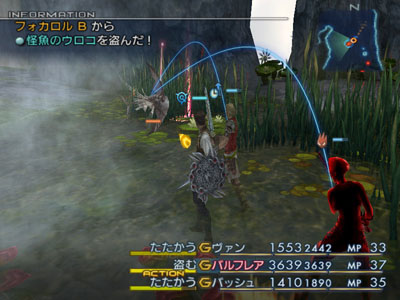

 然后把7种材料一股脑卖掉……得到3种交易品！  **PS：** 其实象牙の棒在暁の断片入手后即可合成，不过那样就要多刷6个悪魔の羽根，而且象牙の棒也没比ゴクウの棒强太多，不急着那么早合成……同时暁の断片刚刚入手后，風の魔晶石也不是很好搞……要么在进出奥兹蒙尼平原刷天气，然后刷出阴天找风精灵シルフス，高概率偷得……或者是找游戏初期的那个大鳄鱼珍惜怪03グリード（怪物图鉴编号297），必定偷得…… 顺手把 __最强的无属性子弹__ 也合成了！ 

#### 交易品：化石の弾：

石化弾（石化弹，攻击+3），最强无属性子弹，不算台地的话，全游戏只有这1颗！共需3种材料： 

 1).地竜の骨×2，上文说过了，东沙漠的霸王龙； 2).リーブラ×3，又是13宫魔石……在幻妖之森收集高級毛皮时一并收集吧，还可以看看能不能打出獄門の炎； 

 3).鏡のウロコ×2，也是上文刚说完； 有了逆转指轮好办事，我们最后去更新一下骑士的兵器！ 

#### 交易品：赤黒い剣：

ブラッドソードA（血剑A，攻+92，攻击100%混乱），合成包最便宜的FF兵器，才4444块大洋。别的FF兵器动辄都要几万几万的，像蠍就要7万大洋……而最富盛名的名刀工の一品，竟然要35万大洋，全游戏第2奢侈的合成品……别看它廉价，可是血剑A很有趣也很好用哦  **（不低的攻击力，同时可以很好的延迟敌人的行动）** ……共需3样材料： 

 1).闇の魔晶石×15，虽然上文没有提到过，但是……这真的是最泛滥的魔晶石，稍微高级一点的不死系敌人全会掉； 2).石材×2，王墓的灯台怪会掉； 3).吸血の牙×3，嗯……为了这个材料，我们要稍微冒一点险了……从幻妖之森的影の舞う路左上角，进入游戏中 __三大凶地之首的赫尼魔石矿二期矿道__ 的一小段……里面有三只蝙蝠，FF12中极为有名的亡灵者アビス（怪物图鉴编号138），狩人心得15%固定概率掉落，不过这厮的攻击高得离谱……吸血则是连逆转魔法都没办法抵消的招数  **（一吸就2000+，巨疼）** ，好在这蝙蝠的异常抗性差的离谱，而且攻击无法无视回避……用逆转指轮使用王子の口づけ，再用油污+炎の杖+火魔法的办法直接闷死它！在这里它还会掉落恶魔盾，所以不妨Chain上几只，试试RP， __为了保险，火力吸引还是要加的__ ； 

 好了……现在去把拖了好久好久的两个紧急讨伐做了吧！其实这两个讨伐都不难，拖到现在真的不应该…… 

#### 工会讨伐：緊急討伐No.3 - 罪は許してモブは許さず！

 

 委托人就在王都地下水路入口，接完之后进入水路，在南部取水廊，让3位Lady上场……好色的史莱姆就现身了！オルトロス是一个攻击招式非常繁多的破玩意，铳耐性，会异常，血还挺厚……常规打绝对算是强敌！不过……它吃睡眠……我就不说了……没有逆转指轮的话，手动让黑魔利用睡眠魔法牵制，白魔用魔片攻击……有了逆转指轮就让Gambit设置对睡眠的敌人一直使用王子の口づけ  **（当然了，第一次要手动）** ，再用炎の杖+火魔法  **（敌人火弱点）** 闷毙讨伐对象！如下右图…… 

 对了，可以 __用逆转指轮使用Potion来调整黑魔的HP，进入濒死，加速战斗进程__ ……这种阴招以后我方还会使用很多次…… 

#### 工会讨伐：緊急討伐No.4 - 復活、封印されし楽園！

 

 要求吉萨草原雨季，关于怎么找到讨伐对象我就不说了…… 

 讨伐对象既吃黑暗又吃沉默……算了，虽然血厚……不过…… __配上雲の杖使用雷魔法__ ……速战速决吧！之前不来做就是因为没有中级雷魔法，也没有雷の杖或是雲の杖，打起来慢……其实难度是没有的…… 这两个讨伐的奖励都是合成特殊交易品おぞましい壷的材料……卖不卖都无所谓……反正都是关联着唯一的交易品…… 

## Chapter 11——水路死地：

 做完这些，我们不妨利用Bug，勇闯死都！关于利用PS2机能限制的Bug来使杂兵全部清除的办法计罗都侯（暗）已经说的非常清楚了……原帖地址：http://bbs.ffsky.com/ShowJH.aspx?ID=14445。这个Bug在死都还是非常适用的……传送到湿原……记得取到デジョン魔法，还有オパールの指輪（无视反射，物防+2， __魔力+5，是全游戏魔力加成最多的饰品__ ）……进入死都…… 

 _死都ナブディス，以后通称死都：_ 

 

 

 一个人装备 __逆转指轮__ ，Gambit设置是对自己使用クロノスの涙  **（减速的延长时间会长于停止，从而达到反复禁足）** ，另外一人，建议猎人  **（HP长，回避率高）** ，勇闯死都！如上两图，Balthier被攻击锁定，切换回在门口的Vaan，锁定解除……别的不用刷，就是把100%必出的宝箱拿到就好了……唯一建议刷的就是エルメスのくつ……别贪功，然后从树林脱出！ 好了，按照剧情应该向米利亚姆遗迹发展了……在此之前，我们先去挑战一下到现在为止最强的一个敌人……天蝎宫——不净王，作为现在而言，绝对是一场苦战！ 

#### 收伏战：天蝎宫—不浄王キュクレイン

 关于如何在地下水路解谜，最后在中央找到不净王就不说了，专题上很详细，而且本攻略是不倾向于迷宫解题的！不净王有现阶段所有Boss中最长的HP，120000+，场地附带HP急速损—  **弱模式最怕的异常空间，每秒3次，每次1%** ，配上的敌人的高攻，简直就是死穴！更可恶的是 __不净王带有铳耐性__ ，机工根本没有办法做像样的输出！同时，战场上时不时的还会有不死系果冻增援……绝对是一场苦战！ 不过既然设计了，自然就能打过去，首先，范围回复不能少，白魔要上场，其次，机工没办法作输出，那就要选黑魔来完成了（有黑魔也方便清理不死系果冻），最后就剩肉盾了！首先，不净王是会针对敌对心最强的我方来攻击的，所以，火力吸引是很重要的，那么肉盾的选择可以使Balthier，或是Basch……Balthier的HP最长，回避率也能提到最高……但是轻装职业的通常兵器物理攻击是在太寒碜，而且如果装备高回避率匕首，输出更是上不了台……Basch的HP是1800+，配上恶魔盾也能有说的过去的回避率，现阶段黑魔没有无属性攻击魔法，所以就算配上黑魔杖进行属性强化，因为  **不净王全属性减半的原因，也只能达到75%的伤害** ，以我的Penelo为例，此时魔力为57  **（如果自己合成了黑袍+黑面的话自然最好）** ，因为最强的白面黑袍给了白魔，补血在这个异常空间很重要，配上炎の杖和中级火魔法  **（方便使用油污魔法，快速解决不死系果冻）** ，对不净王的魔法伤害是414-511，算出来的，不会错的，事实上就在这个范围里……当然了，没有了不死系果冻，使用吸血魔法也很重要……所以，在不净王瀕死防御力UP启动之前，肉盾的输出是很重的，选Basch的话，配上白金装备，使用血剑A，能造成764-899的伤害，是挺可观的……不净王会用封印魔法，所以 __黑带的装备__ 是必须的，但是白魔的HP太短了，就给她装备クイスモイトの靴吧！Gambit设置如下： 

 战斗开始后一定要注意站位，让白魔离Basch远一点，白魔要是被封印上了，基本就算玩了，所以一定设置让Penelo使用万能药……看准时机使用必杀吧！相信我，这基本是必杀最后一次放光芒了……如果调整好Penelo的位置保证不会被封印的话就把饰品换成エルメスのくつ，不净王对Basch用アンチ（敌单体HPMP互换，不净王自身HP<80%时行动8回间隔必定发动）是绝对的杀招，复活后一定要尽快调整队形！这是一场漫长的苦战……算得上是不错的挑战，笔者到这里是一次打过去的，不过打了17分钟就是了…… 至于如何在弱模式晓の断片入手后就收复不净王，请参见：http://bbs.ffsky.com/disp.aspx?ID=1667756&bid=45。不过就是用到了血塗られた盾罢了，血盾在游戏前期堪比神盾，所以我也没刷……  **PS：** 如果等通过遗迹之后，神都会追加售出バイオ，那样的话战斗会轻松不少……所以实在打不过，就通过遗迹再说吧！那是黑魔的输出能一下子接近增大1倍……再不行就等在帝都研究所拿了技—銭投げ……等有了銭投げ，这个Boss就废材了，没有任何挑战意义了…… 收伏不净王之后，给猎人搭桥，以后猎人走着走着还能够给队伍加上プロテガ（白12，高级物盾），实用度又高了！这就是为什么Balthier加入队伍时为什么一定要 __要求他的MP大于等于36的原因__ ，至于シェルガ（白12，高级魔盾），算了吧，Balthier在2级时MP上限在39，不装金钱施法是没戏的。还有，收伏完之后请回工会，得到收伏召唤4体的奖励，大アルカナ不要卖掉！顺便把2个紧急讨伐接了…… 

 

## Chapter 12——覇王の剣：

 做完这一些……我们就去遗迹。 

 _ミリアム遺跡，以后通称遗迹：_ 

 解谜，取得该取得的魔法，隐藏区域的贝纹盾，拿不拿随意，反正已经有1面了…… 

#### Boss战：ヴィヌスカラ

 异常空间—磁场，和刚刚的HP急速损比较起来，这个异常空间几乎可以忽略，快速地把Boss 切掉好了！ 继续向前，遇到了主线召唤第2体…… 

#### 收伏战：双鱼宫—背徳の皇帝マティウス

 

 让黑魔用雲の杖配上雷魔法解决吧……主线的Boss真的值得说的不多…… 之后给猎人或者是骑士搭桥， __个人强烈推荐猎人__ …… 取得 __覇王の剣__ ……脱出迷宫，见到神都有烟…… 奔回神都……行商处买齐新近的魔法道具……存档…… 

#### Boss战：ジャッジ·ベルガ

 __著名的神都裁判！__ 不过著名的原因不是因为他强，而是因为击倒他之后，又有不少事情做……对于现在的我们，这个Boss真的只有被虐的份儿……速战速决！ 之后Balthier发话……又要开始长征了，而且是游戏中最长的一次！不过相信我，一路上不会无聊的！离开时，到神殿前和一位长者说话得到 __断罪の魔石__ 。开始长征之前，我们先把 __天价的壶壶__ 合成了吧！ 

 为了合成壶壶，还缺一样材料，是一个紧急讨伐的奖励，所以要先把这个讨伐完成！ 

#### 工会讨伐：緊急討伐No.5 - バラミナをかけ抜ける一陣の光

 

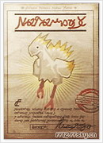

 委托人是神都租鸟的莫古利……讨伐对象在大峡谷的氷結するせせらぎ，不是每次都出现，可以1AC刷新，当讨伐对象トリックスター会出现时，NPC会有提示,如下左图…… 

 好了，只要它会出现，就先 __弄死NPC__   **（读者：喂喂喂……你没搞错吧！笔者：没错，成大事者，必要心狠手辣……读者：去死吧！）** ，因为NPC会干扰战斗，然后，如果本场景有冰元素的话，请先在银色陆行鸟出现前将之解决……等待讨伐对象出现后……调出黑魔和另外1人，随便是谁都可以，用デスペル魔法/魔片把对象身上的有力状态消掉……然后装备逆转指轮使用王子の口づけ  **（读者：你个贱人……）** ，之后的就不用我说了吧……让Boss一直睡眠  **（NPC会物理攻击，所以要杀掉他，离冰元素太近会被魔法激活，干扰战斗……）** ，并用逆转指轮使用药剂将黑魔调整至濒死，使用バイオ，如上右图  **（Boss的属性弱点不确定……有耐心试的也可以去试）** ……一直屈死Boss即可……回到神都，交任务得到奖励…… 

#### 交易品：おぞましい壷：

カノープスの壷  **（所有杂兵概率追加掉落アルカナ/大アルカナ，所有非讨伐珍惜怪概率追加掉落大アルカナ）** ，游戏中第3奢侈的交易品，不过也算物有所值  **（FF12的交易品其实基本上都是物有所值的……）** ，要25万大洋……3样材料： 

 1).ホルアクティの炎×1，緊急討伐No.3 罪は許してモブは許さず！的奖励； 2).フォボスの上薬×1，緊急討伐No.4 復活、封印されし楽園！的奖励； 3).ディモスの粘土×1，緊急討伐No.5 バラミナをかけ抜ける一陣の光的奖励； 

## Chapter 13——洞窟之霸：

 购入壶壶之后，建议做一件  **（是建议……但是是强烈建议）** 弱模式下，有些危险  **（读者：你做的还少么？）** 也要有些拼RP的事情了……就是取得第2个皇帝のウロコ……现在要取得 __第2个皇帝のウロコ__ ，自然是要找游戏No.1杂兵去要喽！击倒小灰龙（怪物图鉴编号193）的条件其实在探索大沙海时就可以达到了，而且那时候完成也未必比现在难多少，只不过当时合成的アルクトゥルス，威力已经足够了……但是现在我们要开始挑战更高阶的Boss，将机工的输出提升至Max是最好的准备工作！挑战方法和准备工作都是借鉴  **（读者：什么借鉴，明明就是照搬…… 笔者：低调低调……）** nouseforever的帖子，原帖地址：http://bbs.ffsky.com/disp.aspx?ID=1664229&bid=45，我在此做几点补充： 1.__加有利状态的事情请用手动__ ，用Gambit的话，万一在半血下的小灰龙面前开始用魔法肯定会令小灰龙开启自动能力的！这是绝对要避免的。 

 2. __杀2只小灰龙也没有必要调整2只的残余HP__ ，因为小灰龙在HP小于50%时使用気合い  **（自身获得「通常攻击伤害UP」）** ，在濒死时会使用アグレッサー  **（自身获得「通常攻击CT0」）** ， __后者的优先级要大于前者__ ，也就是说，在50%HP以下的小灰龙没有成功使用気合い的话，在其HP至20%以下时，也必然会优先使用アグレッサー，在使用アグレッサー成功后， __继续使用気合い__ （如上右图），所以，我们击倒1只小灰龙之后，捡完道具，而与此同时另1只小灰龙肯定会使用アグレッサー成功，此时我们过线，再回去，就会看到剩下的那只在使用気合い，而我们呢，继续从容地开一枪走人，开一枪再走人……直到第2只也死，捡起道具……笔者这次RP不太好，10%的固定概率貌似不太偏爱我……具体杀了几只我就不吓唬大家了……反正也不难，就是有点枯燥…… 

 取到第2个皇帝のウロコ后闪人…… 

#### 交易品：土色の銃弾：

アルデバランY（アルデバランY，攻+66）和ソイルショット（土神子弹），共需3种材料： 

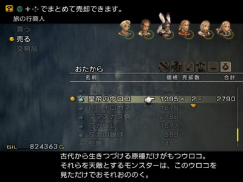

 1).皇帝のウロコ×2，国际版取得最纠结的材料，上文已经详细介绍过了； 2).銀色の液体×3，上文也说过了； 3).土の魔晶石×8，洞窟马怪メリッサ（怪物图鉴编号195）高概率掉落，收集大地の帽子时肯定已经够数了； 至此， __除了黑暗子弹之外的所有子弹__ 我们都收集完毕了，机工的攻击属性也增加至了4种，其中还包含霸道的火属性！而黑暗子弹不到物语后期是绝对用不上的。然后我们然后在山地购入2个新魔法，去完成下一个紧急讨伐了！ 

#### 工会讨伐：緊急討伐No.6 - 異常發生アントリアオン！

 

 委托人在空都的公会分部……得到钥匙之后进入魔石矿，一路不短，战斗不难，不过陷阱不要踩，在传送点存档……记得设置黑魔使用エアロガ， __机工配上风神子弹和狂战饰品__ ，敌人基本都是秒杀的，到达最深处……遇到讨伐的螳螂群…… 

 敌人高攻，但是攻击视回避，所以让猎人火力吸引，黑魔和技工后面阴着即可……连逆转指轮都不必用，很快就能把敌人清光……回去交任务……得到一个好饰品—バブルチェーン（饰品，永久泡沫），完成此任务以后，才能在佛恩海岸捡到新的钥匙哦！セプルサイズ也不要卖掉…… 完成后，我们就传送回遗迹，准备收伏断罪の暴君ゼロムス…… 

#### 收伏战：巨蟹宫—断罪の暴君ゼロムス

 如何进入隐藏场景我就不说了，战斗前一定要调整好状态……如果已经有アルデバランY的话，这场战斗会很简单……如果机工在狂战+勇气+加速的情况下，使用石化弹的伤害下限为：69×69×1.3×1.5=9283，而上限则是69×69×81/64×1.3×1.5=11749，而且出招速度是正常情况下的3倍，Boss一共才16万+的HP，一会儿就没了，更何况アルデバランY的CR是10，有 __比其他火铳高一倍的会心值__ ！……此战魔法封印，所以上3位男性好了！战斗前请为参战人员加上护盾+魔盾+泡沫的有利状态，延长生存时间……再给机工加上狂战+加速……装备和Gambit设置如下： 

 记得最后给Balthier加火力吸引  **（时间持续最短）** ，有了这些有利状态，队伍的生存能力是很强的，再利用X-Potion回复的话，应该能做到不死人结束战斗，战斗时记得把站位分开， __别让重力魔法一次打到3人__ ……我这场战斗结束时，消耗了6个X-Potion，1瓶狂战酒，未死人，算得上是轻松过关！如果没有アルデバランY的话就是时间长一点，Boss没有瀕死防御力UP，所以就是多一些药品消耗罢了，战线不会拉的特别长…… 

 上图为战斗前的状态增益： 收伏后，白魔的执照盘所提供的HP加成提到上限……不算装备的话肯定是过不了1000的……回公会接新的紧急讨伐。 游戏中第1个H级讨伐，而且还是个紧急讨伐？？！！接到后准备完成它！至于公告板上的通常讨伐嘛……实在都太简单了， __到了帝都之后再做一次通常讨伐大屠杀吧！__  

#### 工会讨伐：緊急討伐No.7 - 私のキャロットちゃん

 

 先去城塞接任务，然后传送到树林。 __Boss体积很大__ ，移动速度快，会极强的状态攻击招式……不过本Boss的HP不长  **（在没有异常空间和变态自动能力的干扰下，十几万的HP真的不长……）** 是个弱点，所以我们尽可以让狂战下的Basch顶在前面，不让Boss通过，然后让Vaan火力吸引，减少Basch的HP消耗，然后远处的Vaan安心输出，因为Vaan在远程，所以可以在濒死状态佩戴鋼のゴルゲット  **（以后机工濒死提输出所说的饰品支援都是指鋼のゴルゲット）** ，配上勇气和狂战以及加速，会以正常攻击速度的3倍进行每次约20000点  **（下限：69×69×1.3×1.5×2，上限还要再×81/64）** 的输出，没有アルデバランY的话，每次大概也就只有10000左右了，不过也够了……强大的讨伐对象绝对是连Basch都没打死的时候就已经一命呜呼了！不过为了延长Basch的生存率同时辅助输出，还是在战前给他加上护盾+魔盾+泡沫+勇气+加速+狂战吧！然后白魔从旁观辅助  **（记得设置不要给Vaan补血，破坏濒死会导致输出下降一半！）** ……对了，传送到树林时，请直奔木もれ日の路，要保证该迷宫内不能有任何敌人死亡，对象才会出现，等对象出现了，再把提前加好状态的两人调出来……只要是一路狂奔，应该没问题！ 

## Chapter 14——海天一线：

 完成这些之后，我们去把大森林的门修好，向佛恩海岸进发吧！ 

 _フォーン海岸，以后通称海岸：_ 

 一路上请解决青蛙シュメルケ（怪物图鉴编号138），会以30%固定概率掉落カエルのタマゴ，请收集2个。 

 海岸的音乐很激昂，战斗很简单，到达集镇时，卖出2个カエルのタマゴ，合成出第2个オパールの指輪，之后请去西北方买地图，并且把第11鉱区のカギ捡到，购买好魔法和药剂  **（万能药要买足）** 之后，我们就可以准备去天空魔石矿收集除了轻装体之外的次强装备了！ 

 到ラッシェ橋之前都好说，进入ラッシェ橋之后，建议装备猎人装备逆转指轮，关闭Gambit，对所见到的所有敌人使用万能药！机工呢，加上狂战和勇气，装备龙炎子弹，收到菜单里备用（如果是没有アルデバランY的话，就让机工保证满HP并佩戴ブレイサー，有的话就无所谓了），在 __确认敌人中了逆转万能药之后，调出机工，开枪毙之……收回去……__  

 继续探索，每次要保证把同一区域的2-3个敌人都定住，再调出机工，要小心陷阱……应该没什么危险，但是要谨慎， __被围殴是极容易全灭的__ ，把100%出现和25%概率出现的宝箱都刷完， __中间记得在作業準備区的存档点存档，免得失误……__ 都收集完回到第５鉱区採掘場入口坐矿车走人吧！到现在，已经有了两套很好的魔装  **（死都一套，天空矿一套，如果中途找A级讨伐蛇怪又要了一套的话，就是3套了）** ，一套第2极品的重装和第2强的轻装头……还有就是最强黑魔法的入手！ 

 如果选格斗的话，第2强的棒也入手了，至于第1强的棒嘛……不到大灯台是不要想了……卖掉用不了的装备，然后传回山地，准备打一场收伏战！ 

#### 收伏战：審判の霊樹エクスデス

 如何解谜进入蒼き天辺，我就不说了，这场战斗道具封印，是弱模式下第2恶心的异常空间，主要是法师的生存能力弱，易死亡，我方会复活魔法的只有2人，而且Boss的高级黑魔法，尤其是フレアー，能卡人卡的急死…… __刚复活就被高级黑魔法阴掉完全正常__ ，等到时魔和白魔都死了，基本就……所以此战必须速战速决，好在審判の霊樹的HP只有119060，不长……我方可以计算一下强力的攻击手段，现在有2个： 机工：处于加速+狂战+勇气+濒死（需要饰品支援），アルデバランY配上石化弹是最理想的了，如果 __有アルデバランY完全就不需要黑魔的支援__ 了！伤害下限：69×69×1.5×1.3×2=18567，上限则有23499之多！如果中间出了会心就更简单了！不过要考虑到 __審判の霊樹有自动技能瀕死防御力UP__ ，这个技能无需使用回合开启，濒死时则会直接启动，那时候每1击就只有上述数值的1/3了。如果没有アルデバランY的话，肯定就要选择アルクトゥルス，那么伤害下限就是48×48×1.5×1.3×2=8985，上限则是11372，输出稍显不足，实战中也能在 __審判の霊樹启动魔法障壁之前__ 做掉它……不过就是有点险，笔者这次这个Boss打了14遍  **（打的时候其实挺Happy的，就是每次之前都要调整HP）** ，单独用アルクトゥルス打了4遍，只有一次審判の霊樹启动魔法障壁了……所以为了保险起见，就要看看黑魔的支援了！ 黑魔：最强黑魔法コラプス  **（以后通称粒子炮或者究极黑魔法）** 的入手使得黑魔的输出大幅提升！以我的Penelo装备次强魔装+雲の杖为例：在加速+信仰+濒死的支援下，粒子炮对審判の霊樹的伤害下限是：（190-31）×{2+[71×(3+71)]/256}×1.3×2=9311，上限则是（190×9/8-31）×{2+[71×(3+71)]/256}×1.3×2=10702，也是非常出色的输出了，而且コラプス会卡住双方的魔法行动，从而给 __机工的高速物理输出__ 提供更多的机会，事实上審判の霊樹每次施放フレアー都会吃2-3次机工的攻击……当然如果有アルデバランY的话，没有必要上黑魔了！以下为有アルデバランY的情况： 

 战斗的Gambit设定极为简单，白魔对Boss使用デスペル，以防万一在设置对猎人使用火力吸引，黑魔对Boss使用粒子炮，为了以防万一也设置对猎人使用火力吸引，猎人和机工的压根就不用开……因为審判の霊樹在HP大于50%时会对敌对心最高的对象行动，所以火力吸引很重要，因为它还没来得及对火力吸引对象之外的对象采取行动时，肯定就挂了！战前的准备非常重要，让猎人做肉盾，能加的防御状态全上吧  **（物盾+魔盾+泡沫）** ！饰品可以选择クイスモイトの靴或是パワーリスト  **（死都有卖，完全防御停止）** ，各有各的好处。对于两位输出主力，能提升攻击的手段全要用上，最后调整HP进濒死即可，白魔上加速就够了，为了保险，让黑魔佩戴オパールの指輪，最后的最后，给猎人加上火力吸引  **（这个状态很重啊，持续时间却又如此之短……）** 。让Basch进入战场，进入战斗后，收回Basch，调出猎人和白魔，向前，審判の霊樹必定会锁定猎人，猎人名字一变红，就调出机工，然后确认審判の霊樹的有益状态被白魔消掉之后，收回白魔，调出黑魔  **（如果有アルデバランY则完全没有必要调出黑魔）** ，利用猎人把審判の霊樹牵引到后背对着两位输出  **（以Boss为顶点，肉盾和输出成180度）** ，然后很快的战斗胜利，之间審判の霊樹对猎人的攻击绝对不会致命！以下为没有アルデバランY的情况： 

 战斗真的很快  **（主要是因为50%HP时審判の霊樹会束縛解放，然后下一回合必定使用コラプス，从而为我们提供了更多的攻击机会）** ，而且屡试不爽！如果既用黑魔又用机工  **（装备アルデバランY）** ，在4倍速状态不算开菜单和调人的时间的话，10-12秒即可结束战斗。 收伏審判の霊樹エクスデス之后，骑士的执照盘HP加成也提到上限了，没有骑士给机工或者破坏都可以……然后传回海岸……直奔大草原。 

 _ツィッタ大草原，以后通称齐塔大草原：_ 

 取到2个魔法后，去传送点接？？？？讨伐……并且得到钥匙，然后直奔索亨地下宫殿……此时 __喜欢刷宝__ 的玩家可以通过陆行鸟去台地了！ 

## Chapter 15——地下宫殿：

 

 _ソーヘン地下宮殿，以后通称地下宫殿：_ 

 进入第2场景，会完成？？？？讨伐……传说中的幻妖五小妖！在这里出现时，每个小怪身上都能必定偷盗到它们对应的植物系战利品，建议收集  **（就算不为合成，也是挺好玩的材料，说明都挺扯的……）** ，轻松取胜！ 索亨地下宫殿是一个两个谜题的迷宫，瀑布谜题  **（本章最后附图解明）** 和魔神龙谜题  **（专题上很清楚）** ……顺手解了吧，解完瀑布谜题能得到一个 __ラストエリクサー__ ，蛮不错的！ 之后遇到游戏中最后一个水晶虫，切了它……存档准备Boss战…… 

#### Boss战：アーリマン

 Boss不难，就是分身特别烦！而且还瞬移，要到处跑  **（其实打五小妖也是）** ，用黑魔的魔法做输出吧！轻松取胜！ 进入帝都旧街市…… 

 _アルケイディス旧市街，以后通称帝都旧市街：_ 

 然后耍点小伎俩进入帝都…… 

 _帝都アルケイディス：以后通称帝都：_ 

 购买魔法和地图，补足道具，接公告板所有的讨伐，准备来一次大屠杀吧！！！因为有难度的不多，所以从简说明了！同时，因为又要周游世界，而且还会去湿原的隐藏场景永遠を見下ろす高台，所以 __请将支线“三大勋章”同时完成__ ，方便后期挑战輪廻王！ 

#### 工会讨伐：手配書 No.1.- 追いかけっこは森の中

 

 委托人在Fran的故乡，对象在大森林的葉ずれのしみる路只会逃跑的小兔子……追紧了即可，当然了，也可 __调整机工和HP再配上相应的饰品__ ，一击必杀！ 

#### 工会讨伐：手配書 No.1.- 地の巨人、怒りの大暴走！

 

 委托人在城塞……和另外一个S级讨伐一起接了吧……讨伐对象在山地的北の山すそ，没有任何难度…… 

#### 工会讨伐：手配書 No.1.- 制御不能！？決死のロデオ！

 

 委托人在山地，对象在树林接近死都的入口……比起上一个也没什么难度！ 

#### 工会讨伐：手配書 No.1.- 地下宮殿の巨大亀

 

 委托人在帝都的武防店……讨伐对象身上可以低概率偷盗万年亀の甲羅……的确是比较珍惜的材料……但是合成出来的东西却蛮一般的……是否收集随意，1AC即可反复偷窃！ 偷够了毙了它……收到奖励之后，可以合成チェーン 

#### 交易品：チェーン：

バブルチェーン（泡沫腰带，HP2倍），这是游戏中的第二个 所需材料有2样： 

 1).攻竜の殻×2，上文已经提及了，是在地下洞窟的骨龙身上取得； 2).アダマンタイト×1，上述讨伐的奖励； 

#### 工会讨伐：手配書 No.1.- 脱走者はかたき討ちを望む

 

 地点是比较偏远……在地下道深处西部新坑道区……注意吸血技能即可……还有 __周围的杂兵也要及时处理掉__ ！ 

#### 工会讨伐：手配書 No.1.- 邪悪な亜人、魔石鉱で何を想う

 

 之所以把 __这么一个简单的讨伐放在这一章比较靠后的位置就是想强调它的重要性__ ……讨伐本身很简单，但是只有完成它方才能开启究极凶地蛇夫矿，当然了收伏10体召唤也是必要的……对象有铳耐性，可以选择黑魔，当然了，对象的HP才31161，尽可以稍微打一打就召唤天秤，50%概率3万伤害，没打出3万尽可以天秤连发。 

#### 工会讨伐：手配書 No.1.- 怒りのコブシは霧をはらすか

 

 游戏中第1个S级讨伐！算是这次大屠杀中唯一值得说一说的讨伐……讨伐对象没什么难度…… 

 但是因为在ナブレウス湿原的永遠を見下ろす高台充斥着大量的高级骷髅  **（可以低概率偷盗黄金のスカラー，次强魔装头，很不错）** ，所以战斗比较的吃力，不过也就是及时解除黑暗，然后装上狂战饰品的机工就开始大清扫吧！！注意补血……以现在的防具，没什么可怕的……而且充分 __利用血剑A，能够非常有效的延迟杂兵的出招__ ，从而减轻战斗强度…… 完成这些之后，工会就升到9级了！ 

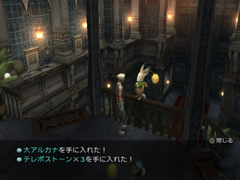

 完成这些之后，三大勋章的支线也处理的差不多了，所以进军死都，把收伏輪廻王之前的两个Boss解决了……至于輪廻王，常模式到这里肯定有足够的实力收伏它了，不过因为 __弱模式下封印物理攻击导致现阶段收伏比较困难__ ……所以还是等出了研究所再收伏它吧！ __这次进入死都就可以安心的推进了__ ……死都的敌人现在已经不足为惧！死都的魔法人形掉落的聖の魔晶石请不要卖掉…… 

#### Boss战：フンババボス

 Boss的HP不短，高攻……圣属性弱点  **（这点机工没辙……）** ，所以还是老战术，让Basch火力吸引，后面的机工调整HP将攻击输出到最大！ 

 记得手动补火力吸引，大概30秒一次，在3倍速  **（加速+狂战）** 的攻击下，Boss的HP一会儿就空了…… 

#### Boss战：フューリー

 和上一战相比，Boss的HP可就太短了，才不到7万，不过绝对是高攻高速……但是有水弱点，理论上濒死的机工配上饰品，极限伤害可以再37135到46999之间，不过Boss持有自动能力被ダメージカット  **（除针千本外，所有伤害强制减为7成……）** 。 

 同时在把Boss的有益状态解除之后，Boss必定会使用英雄マーチ  **（开战第1回合必用，100%物理/魔法防御+加速+物理/魔法攻击UP，巨汗……）** ，然后还要再消除一次……所以实际上能达到的伤害只有19495和24674之间，如右上图，当然了，第2次解除物盾之后会增加不少伤害，不过20000左右也已经足够了，毕竟才不到70000的HP，利用火力吸引保全机工， __一般3枪就收工__ 了！ 杀够了么？？进入帝都研究所吧…… 下面两页是地下宫殿的瀑布解谜，因为关系到一个究极圣灵药和一个珍惜讨伐，所以附图说明……请 __从左往右，从上往下看__ ……中间不要错，错了就要重来！ 

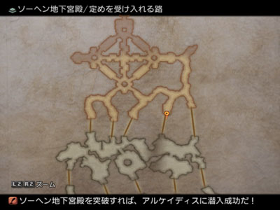

 

## Chapter 16——帝都机要：

 

 _ドラクロア研究所：_ 

 解谜和开机关的部分就不说了……到了70层可是有事干了……拿到技能—銭投げ之后，刷逆转魔片吧，每次AC开启逆转魔片的概率是25%，全游戏最高，仅此一地，过了这村儿没这店儿！ 

 刷足吧！笔者这次刷了97片……存着好啊……逆转魔片太有用了  **（可惜日美版里没有……）** 。 

#### Boss战：ドクター·シド

 流程Boss……轰之！记得把2个宝箱开了，不拿白不拿……  **PS：读者：就你这么短也算一章？？唬人么？笔者：就冲着刷逆转魔片这一点，单分出一章也值！！！**  

## Chapter 17——聚宝台地：

 剧情，终于到达港汀了！ 

 _港町バーフォンハイム，以后通称港汀：_ 

 这是游戏中最后的城镇，以后基本就在这里整备吧！买齐魔法…… 去台地刷几样装备……这是蛮必要但是又巨恶心的一件事……笔者在这里耗了不短的时间…… 

 _セロビ台地，以后通称台地：_ 

 先去フェディック川，51号和53-56号宝箱离得很近  **（56号只是顺手……根本没必要）** ，建议一起刷  **（以刷到ブレイブスーツ为目标，勇气套装，国际版较之日美版中以这件装备被强化的最多）** ！我在机器上使用了2小时40分钟刷出了5样中的4样（没出フォーマルハウト）……这次在模拟器上是用了将近2个小时，只刷出了2样，就是56号和53号……不知道到底是RP变好了，还是变坏了……最后建议去14号宝箱刷出一颗ダークショット（黑暗子弹……），目的是尽早击败聖天使  **（笔者有个不良嗜好，总喜欢在去大灯台之前收伏戒律王……）** ，如果不是这个目的，这颗子弹就不用刷了……可以等到游戏最终期去大灯台地下层刷到第2颗  **（第1颗是契約の剣入手后接到讨伐的奖励……）** 。 既然已经到了台地，那么次强重装的合成条件已经达成，但是我个人不推荐此时合成  **（一般来讲没必要合成マクシミリアン）** ，原因以后说…… 刷完之后，请将勇气套装给机工配上，这样再配上狂战饰品和石化弹，只要敌人 __不具有铳耐性__ ，机工装备アルデバランY就能有万点左右的输出  **（而且还很快……）** ，如果敌人有属性弱点  **（水，火和风……土和暗要看玩家现在的收集度……）** ，就是2万左右，可以说是非常强大了！现在，再去把5个新的通常讨伐解决掉！ 

#### 工会讨伐：手配書 No.20 - 取られた荷物を取り返せ！

 

 委托人就在白波亭……倒是就近……专题上说：讨伐对象形态比较有气势，却在HP小于50%时会飞奔逃跑并且给 __自己完全回复HP__ ……不得不说，这种会自动回复HP的对象极度烦人……打的时间长了会烦……不过，此Boss吃睡眠…… 

 所以……先解决NPC，药剂控制，调整黑魔的HP进濒死，装备雲の杖使用高级旋风……屈死Boss即可，放心，睡眠中的Boss是不会自动回复HP的……战斗后追加ヴィエラの荷物，最后和委托人对话得到奖励イージスの盾，不错的盾牌……在某些场合还是可以非常有用的！ 

#### 工会讨伐：手配書 No.21 - サビた伝説、ほころびた封印

 

 委托人在帝都旧街市……讨伐对象在齐塔大草原……需要刷天气，具体见专题，这里就不赘述了…… 

 和上一个对象一样， __对象吃睡眠__ ……风弱点，别的就没什么好说的了…… 

#### 工会讨伐：手配書 No.22 - 人生バラ色！男の野望を目指す戰い

 

 遇到了一个有些棘手的讨伐……Boss的攻击十分的出众，濒死发威完全可以轻松解决我方全员！不过它的异常抗性可以说是非常差的……投掷逆转万能药，余下的就虐了…… 

#### 工会讨伐：手配書 No.23 - 最高のカタロゲのために

 

 

#### 工会讨伐：手配書 No.24 - 死した都の墓守

 

 这两个讨伐对象都在死都……所以一起说，从树林进入的话，在気高き者たちの間先讨伐手配書 No.24，战斗组的任意队员HP<10%时，对象才会在目标区域浮现，建议给时魔调整好HP，顺便罩上火力吸引，开战后死了就算了……也不必复活，直接调出另一人即可…… 对象不吃睡眠，但是 __吃混乱__ ，可以手动用逆转指轮使用混乱药剂，不停的延迟对象的行动  **（对象一旦攻击自己解除混乱，就再给它加上即可……）** ，直到对象启动魔法障壁……进入物理免疫……进入物理免疫时，逆转药剂也是无效的……就硬上吧……究极黑魔法是主攻……注意回复。 

 另外一个在力宿る回廊，接近在湿原出口的一个角落里……先清光周围的亚人……现阶段的机工可不是盖的……清光亚人十分简单，不过讨伐对象就有点难搞了……对象是魔法人形， __会伤害很高的风魔法和伤害超高的水魔法__ ……还都是范围的……所以只让轻装角色上场，装备バイキングコート（维金外套， __水无效__ ，敌人不会物攻，物防低无所谓……）……有黑暗子弹最好，没有的话就用石化弹好了，配上猎人的銭投げ……站位是两个人贴着墙边，间隔90°远距离攻击，这样魔法只能打到一个人……余下的就是输出了，机工远程铳，猎人就用銭投げ  **（偶尔也要奢侈一下）** ……速战速决吧！ 

 完成这些之后，公会等级就到11级了（恰好32体讨伐），得到的霊帝の魂不要卖掉  **（哦，前提是选择了骑士同时想合成向日葵的玩家……）** ，再去去专属商店买进逆转魔法  **（弱模式下绝对王道的魔法）** ，还余下两个紧急讨伐，先接了好了，暂时先不急做…… 

 

## Chapter 18——珍惜讨伐：

 接着我们就可以开始 __漫长的珍惜讨伐征程__ 了，因为珍惜讨伐关乎到的东西非常多，包括若干高等级防具的取得和若干珍惜材料的取得  **（主要是关于向日葵）** ……所以占得篇幅比较大： 首先，要去海岸开启珍惜讨伐任务，第一个实验讨伐就在海岸的ヴァドゥ海岸，站在山崖上一会儿，讨伐怪就出现了，想合成究極の宝剣的玩家请反复从该珍惜怪身上偷盗2个アダマンタイト。偷够数量就杀了吧！没难度的。 

 回到海岸，先把究極の宝剣合成了吧，个人觉得合成的意义不大…… 

#### 交易品：究極の宝剣：

アルテマブレイド（双手剑2，攻+109），作为一把过渡用双手剑，值得一提的实在不多，共需要3种材料； 

 1).ノーマ×1，土王石，西沙漠沙尘暴天气中出没的土精灵身上低概率偷盗； 2).アダマンタイト×2，刚才演练的珍惜怪身上必定偷盗； 3).デスパウダー×2，上文已经提及了，地下洞窟的鬼魂身上取得； 把演练讨伐的贵重品交给开启珍惜讨伐的人，这次就正式开启珍惜讨伐任务了！ 

 

#### 声明在先：

 __在进入大水晶之前，可以完成的珍惜讨伐一共27体__ ，余下的3体分别在大水晶上层，里多拉纳大瀑布和大灯台中，换言之，要真正意义上完成珍惜讨伐，只能等到盘终物语了，不过，现阶段可以完成 __27体讨伐恰好可以分配成1，25，1的组合__   **（25个给防御大好きバンガ）** ，对于装备取得是足够了，这27讨伐中，包含了传说中最强的僵尸王ディズマ  **（百层中也放到了88层，可见实力之强！）** ……对于实力已经远远高于绝大部分的工会讨伐的ディズマ，我们还是把后置它处理吧，先去解决比较简单的26体讨伐……对于这26体，请先给何でもいいバンガ1个，余下的25个给防御大好きバンガ。顺序说完了，就开始四处传送喽！ 关于这26体简单的珍惜讨伐，也要分成两部分说，我会先说明身上的东西值得一偷的  **（讨伐珍惜怪可是一杀就彻底没有了……）** ，再说明余下的！好了讨伐正式开始！具体顺序自然可以不按照本攻略而打乱。具体珍惜怪出现的方法请参照专题，无特殊情况不再提及，因为 __战斗很简单__ ，所本攻略只会提及珍惜怪的属性和异常抗性，具体战术请自行设定，话说都玩到这里了，又是不封印执照的弱模式，所以这些小角色早就不成问题了！绝大部分珍惜怪，视回避！ 

#### 第一部分：身上有宝的！

其中一些是之前可能已经收集到了的， __请及时清点，没必要偷多了__ 。 1.珍稀怪兽序号No.01：アスピドケロン，身上可偷到物品：ヒヒイロカネ，共需4个， __合成向日葵用__ ，偷够为止；该珍惜怪属性抗性：风弱点，土吸收；该珍惜怪异常状态抗性：沉默，黑暗，睡眠，油污，病毒有效！ 

 2.珍稀怪兽序号No.77：ブルーブラッド，身上可偷到物品：ダマスカス鋼，共需4个， __合成向日葵用__ ，偷够为止；该珍惜怪属性抗性：水弱点，火吸收；该珍惜怪异常状态抗性：沉默，黑暗，迟缓，逆转，油污有效！ 

 3.珍稀怪兽序号No.30：ヴィクター，身上可偷到物品：戦神のアシュリング，共需4个， __合成向日葵用__ ，偷够为止；该珍惜怪属性抗性：圣弱点，暗吸收，不死系；该珍惜怪异常状态抗性：沉默，迟缓，混乱，油污有效！ 

 4.珍稀怪兽序号No.63：ヴォーレス，身上可偷到物品：ソウルパウダー，共需2个， __合成向日葵用__   **（但是之前B级讨伐奖励了1个，故只需偷盗1个，但是注意，一定要偷盗，ソウルパウダー不在此处获得，以后再弄可就费劲了！暗元素1AC即可刷出，建议先把该场景的敌人清光，如果未清光杂兵之前暗元素就已经出现，请不要激活……清光杂兵后再反复1AC刷出暗元素，在远处激活，再让珍惜怪出现，方便偷窃，否则周围亚人或者是暗元素，战斗容易陷入被动）** ，偷到就可以把它杀了；该珍惜怪属性抗性：圣弱点，暗吸收，不死系；该珍惜怪异常状态抗性：迟缓，油污有效！ 

 5.珍稀怪兽序号No.62：イスティーン，身上可偷到物品：ソウルオブサマサ，共需1个， __合成大アルカナ用__   **（但是之前S级讨伐奖励了1个）** ，愿意偷的就偷吧，不愿意的直接宰了就好了；该珍惜怪属性抗性：圣弱点，暗吸收，不死系；该珍惜怪异常状态抗性：沉默，黑暗，迟缓，混乱，油污有效！  **PS：** 珍惜怪会召唤杂兵，及时清理…… 

 6.珍稀怪兽序号No.57：ディード，身上可偷到物品：ミラージュベスト（次强轻装体，轻装12，物防+55，HP+800），共需2-3件，视玩家的职业选择，偷够为止；该珍惜怪属性抗性：水弱点，火吸收，飞行系；该珍惜怪异常状态抗性：油污有效  **（没有意义）** ！ 

 7.珍稀怪兽序号No.66：アリオク，身上可偷到物品：賢者の指輪（饰品，MP消耗减半，圣吸收），共需3个，前2个分别在遗迹和从幻妖之森进入的蛇夫矿的宝箱中开出，只需偷盗1个；该珍惜怪属性抗性：圣弱点，暗吸收；该珍惜怪异常状态抗性：黑暗，迟缓，急速损血，油污有效！ 

 8.珍稀怪兽序号No.19：グリマルキン，身上可偷到物品：クァールのヒゲ，共需2个，合成おろちN用，偷够为止  **（这个材料其实在大水晶也能轻松搞到，而且おろちN不是什么强力兵器，不偷也罢！）** ；该珍惜怪属性抗性：冰弱点，雷吸收；该珍惜怪异常状态抗性：沉默，睡眠，混乱，停止，逆转，油污，病毒有效！ 

 

#### 第二部分：直接切就可以的！

身上能偷的东西不怎么值钱…… 1.珍稀怪兽序号No.05：ガビアル，该珍惜怪属性抗性：土弱点，风吸收；该珍惜怪异常状态抗性：沉默，迟缓，油污有效！ 

 2.珍稀怪兽序号No.29：ナザルニル，该珍惜怪属性抗性：冰弱点，雷吸收；该珍惜怪异常状态抗性：沉默，睡眠，迟缓，油污有效！ 

 3.珍稀怪兽序号No.07：カイザーウルフ，该珍惜怪属性抗性：土弱点，风吸收；该珍惜怪异常状态抗性：沉默，黑暗，睡眠，迟缓，油污，病毒有效！ 

 4.珍稀怪兽序号No.16：バイドカッター，该珍惜怪属性抗性：圣弱点，暗吸收；该珍惜怪异常状态抗性：逆转，迟缓，油污有效！ 

 5.珍稀怪兽序号No.09：ドレッドガード，该珍惜怪属性抗性：土弱点，风吸收；该珍惜怪异常状态抗性：沉默，迟缓，油污有效！狂战有效！ 

 6.珍稀怪兽序号No.79：アルティック，该珍惜怪属性抗性：冰弱点，雷吸收；该珍惜怪异常状态抗性：中毒，沉默，黑暗，迟缓，睡眠，混乱，油污，急速损血，病毒有效！ 

 7.珍稀怪兽序号No.56：クリス，该珍惜怪属性抗性：风弱点，土吸收；该珍惜怪异常状态抗性：沉默，黑暗，睡眠，迟缓，油污，病毒有效！狂战有效！ 

 8.珍稀怪兽序号No.42：アヌビス，该珍惜怪属性抗性：圣弱点，暗吸收，不死系；该珍惜怪异常状态抗性：沉默，黑暗，油污，病毒有效！ 

 9.珍稀怪兽序号No.75：ウェンディス，该珍惜怪属性抗性：雷弱点，冰吸收；该珍惜怪异常状态抗性：沉默，黑暗，迟缓，停止，油污，病毒有效！狂战有效！ 

 10.珍稀怪兽序号No.74：アンクボルダー，该珍惜怪属性抗性：风弱点，土吸收；该珍惜怪异常状态抗性：沉默，黑暗，止步，睡眠，混乱，迟缓，停止，封印，油污，急速损血，病毒有效！狂战有效！ 

 11.珍稀怪兽序号No.37：マイス，该珍惜怪属性抗性：圣弱点，暗吸收，不死系；该珍惜怪异常状态抗性：沉默，黑暗，睡眠，混乱，迟缓，油污有效！狂战有效！ 

 12.珍稀怪兽序号No.59：スケアクロウ，该珍惜怪属性抗性：风弱点，土吸收；该珍惜怪异常状态抗性：油污有效！ 

 13.珍稀怪兽序号No.35：チョコボリーダー，该珍惜怪属性抗性：弱点不固定，其余均吸收；该珍惜怪异常状态抗性：黑暗，睡眠，油污有效！ 

 14.珍稀怪兽序号No.36：スカルアッシュ，该珍惜怪属性抗性：雷弱点，冰吸收；该珍惜怪异常状态抗性：沉默，黑暗，止步，睡眠，混乱，迟缓，逆转，油污有效！狂战有效！ 

 15.珍稀怪兽序号No.70：ゾンビロード，该珍惜怪属性抗性：圣弱点，暗吸收，不死系；该珍惜怪异常状态抗性：中毒，沉默，黑暗，止步，混乱，迟缓，停止，封印，油污，急速损血有效！狂战有效！ 

 16.珍稀怪兽序号No.46：メルティゼリー，该珍惜怪属性抗性：冰弱点，雷吸收；该珍惜怪异常状态抗性：沉默，油污有效！雷魔法攻击很强，注意防御！ 

 17.珍稀怪兽序号No.53：キリング，该珍惜怪属性抗性：风弱点，土吸收；该珍惜怪异常状态抗性：沉默，迟缓，油污，逆转有效！ 

 18.珍稀怪兽序号No.15：レイジクロウ，该珍惜怪属性抗性：水弱点，火吸收；该珍惜怪异常状态抗性：沉默，黑暗，混乱，封印，油污，病毒有效！狂战有效！ 

 好了，至此， __26体简单的珍惜讨伐已经完成__ ，回海岸交差……然后去讨伐商店“怪しい男”那里买东东！ 

 ヘビの皮×12： __想合成向日葵的玩家注意__ ……中途路过吉萨大草原，旱季时请在トーム丘陵中下部，ワイルドスネーク（怪物图鉴编号014）身上高概率掉落高概率偷盗， __2AC轻松刷新怪物__ 。 简单的都完成了，该做难的了吧！请补充好药剂，传送到天空矿！准备完成H级紧急讨伐ビッグブリッヂの死闘的前一半和第27体珍惜讨伐  **（最强珍惜怪）** ； 战斗前请做好有利状态的增益，不过第一战謎の男是没有任何难度的…… 进入タッシェ橋……ギルガメッシュ华丽登场，废话一堆，开战。 第一战ギルガメッシュ攻击力不高，HP不长，攻击视回避，必杀的伤害连1000都突破不了…… __根本就不像H级紧急讨伐__ ……战斗开始后装备逆转指轮，赏狗狗エンキドゥ一记 万能药……装备龙炎子弹，两枪毙了狗狗……专心对付謎の男，超级常规，没有任何要注意的，记得在HP在40～20%和小于20%时偷盗源氏の盾和源氏の小手，都是低概率必定偷盗的……战斗后回传送点存档…… 

 

#### 特殊战：最强珍惜怪ディズマ

 比起第一战ギルガメッシュ，最强珍惜怪ディズマ可就显得太变态了！首先，ディズマ的HP就不短，将近20万……异常抗性好的惊人，只吃油污……HP < 50%时启动被ダメージカット，濒死时防御力UP  **（物理伤害变成正常值的1/3）** ，5%的伤害反弹，堪称极品的自律防卫体系！攻击方面也是极为骇人，濒死魔力UP  **（魔法伤害变成1.7倍）** ， __濒死时启动通常攻撃CT0，HP < 10%时启动魔法CT0__ ，任何时候攻击均无视回避，会四种属性的最高段魔法和圣属性物理技シャイニングレイ，绝对是一个可怖的怪物！ 5%的伤害反弹决定了我方不可能像之前一样，把机工调整成为濒死然后火力吸引安心输出，在无逆转的情况下， __战斗长了肯定是我方全灭__ ……所以还是速杀  **（没有アルデバランY就算了，安心用逆转魔法吧……）** ，只不过有点险。 首先还是计算伤害：机工在非濒死的状态下，对油污状态的ディズマ的输出下限是：69×69×1.3×1.5×3=27851，上限是69×69×81/64×1.3×1.5×3=35249，所以对技工的伤害反弹是1392到1762之间，如果是濒死配上饰品支援的话，伤害能有55702到70498之间…… __这样的话肯定是机工开一枪等于自杀__ ，所以战斗前要调整机工的HP，要他处于， __开一枪进濒死__   **（如果第一枪CR了的话请为自己的RP默哀……）**  __，再开一枪再挂的程度__ ，以我的Vaan为例，当时的HP最多为2622（决斗面盔要给猎人，肉盾要尽量厚……），濒死是524，所以524+1392=1916，是保证机工开一枪不死但进濒死的HP，当然了，再开一枪肯定就死了，这样，两枪累计造成了83553至105747的伤害  **（当然了，第二枪要是CR那简直就是太好了）** ……基本就算去掉了ディズマ的半血，之后会启动自动能力被ダメージカット，伤害降至7成，非濒死的机工输出为19495至24674之间，最后到濒死时，输出就只有6498至8224了……然后算算黑魔的极限伤害，高级火焰+炎の杖+信仰+濒死+油污，算一下下限是：（120-36）×（2+69×72/256）×1.3×1.5×2×3=23990，上限是28274， __对抗ディズマ濒死时非常有效__ ，不过也只能放一次法罢了……所以到这里战术基本就确定了，调整好机工的HP，开2枪死，复活再开枪再死……直到ディズマ濒死时，开两枪，调出黑魔……放一次法，收工……关键就看机工能不能一直顺利的开枪，死，复活，再开枪了  **（补血是别指望了，跟不上，还是直接复活吧，第一次机工死亡后请将其饰品变成更为狂战饰品）** ，前两枪算9万的伤害，后面再开4枪进ディズマ濒死，再开2枪调出黑魔…… __之间肉盾能不能撑住ディズマ的7-8招是个问题__ ……肉盾肯定还是选猎人，猎人的HP此时已经可以调整到上限4200+了，算上泡沫状态足足有了8400，就算是ディズマ的高伤害物理攻击在物盾支撑下也能支撑3次，而且让猎人设定对自己使用X-Potion  **（HP不满就用）** ，针对ディズマ所使用的招式  **（要时时刻刻关注屏幕左上角的提示）** 换装，最希望的就是ディズマ使用暗魔法，基本一次能把猎人的HP补满（恶魔盾暗吸收），圣属性可以用賢者の指輪，其他三种属性也请调用对应的饰品进行无效化或者减半。撑住ディズマ的高压攻击是没问题的， __唯一会出差错的就是ディズマ物理攻击出现高连击了__ …… 

 确定这些之后……就是调整战前状态了，不过这时候又来了一个问题， __ディズマ出现的地点太随机__ ……经常会打我们一个措手不及，这一点没有任何方法保证了……只能是小心再小心，千万别贪功冒进……一旦确定目之所及有ディズマ了，立即先跑到远处调整状态……机工士合适的HP+加速+狂战+勇气套装+龙炎子弹，黑魔是濒死+信仰+炎の杖+加速，最后给猎人和Basch加上物盾+魔盾+泡沫，猎人一定要上火力吸引，调整好这些之后，猎人装备逆转指轮……单独上阵，先用驱除魔片解除ディズマ的有利状态，并用万能药定住周围的杂兵给ディズマ上油污状态，调整饰品，然后立即调出机工和Basch，开始攻击……猎人的Gambit设置对自分自身使用X-Potion时时刻刻保证再回血的状态，并且 __视情况手动使用エリクサー__ ，同时调整饰品减轻伤害，而Basch就保证在远处复活机工即可， __不要让Basch也进入ディズマ的魔法攻击范围__ ，就是不要被锁定  **（非常重要）** ，机工第一次死后，将饰品调整为狂战饰品，在ディズマ的HP下一半时， __记得调出法师给猎人再罩一次火力吸引__ ……最后在ディズマ濒死又中了两枪时，复活机工后收回Basch，调出黑魔，配合机工一鼓作气解决它……收工！ 再次回到海岸，把最后一个证明给攻撃大好きバンガ，再追加2件装备，第2件是最强法袍哦！ 

 

## Chapter 19——雪原古都：

 现在的话就可以去幻妖之森南部，先把去古代都市的路通了…… 

#### Boss战：ラフレシア

 巨型植物，异常空间—MP急速损……可以忽略的异常空间……让机工配上狂战饰品和风神子弹……几枪收工…… 然后就进入幻妖之森的全部场景了，到这里除了是剧情需要之外，更重要的是要收集几样材料：前两样不合成向日葵就不必收集了…… 1.獄門の炎×4：图鉴上146号怪物ケルベロス，只出现在幻妖之森的現を惑わす路，由蓝色的狼以40%概率异变而成，狩人心得5%概率固定掉落或是低概率密猎……因为是心得类道具，随便乱杀即可； 2.蛇眼×6：普通A级讨伐—手配書 No.8 - ピリリと苦い毒蛇の酒的奖励是蛇眼1个，余下的5个要刷了，怪物图鉴150号怪物バジリスク，狩人心得8%掉落蛇眼，连锁无效！随便乱杀即可； 

 3.セーブルサイズ×2：之前的A级紧急讨伐的奖励还有一个，所以刷1个就可以了……マンティスデビル（怪物图鉴编号154），骑士心得10%固定概率掉落……同时它身上还可以中概率偷盗キャンサー，也请收集一下…… 4.高級なめし革×7：这个材料到这里就不值钱了，光幻妖之森就有3个敌人会掉…… 最后要说明的就是关于幻妖5小妖的问题……这5个小东西就是地下宫殿的？？？？任务的讨伐对象，出现条件是：全灭“英知の氷原”的怪物，离开后再返回就会出现(不能离开幻妖之森)，其中オニオンクイーン会以10%的固定概率掉落オニオン，是合成ラストエリクサー的材料……有爱的玩家可以在见见它们…… 来到门前……召唤魔人……进入古代都市…… 

 _古代都市ギルヴェガン，以后通称古代都市：_ 

 先不急着进去，不妨回一下城，合成一把FF武器，一套魔装，顺便收伏1只召唤兽： 

#### 交易品：蛇型の忍刀：

おろちN（大蛇柳生，攻+102，中毒20%），弱模式下因为猎人的力量太低，所以忍刀不是很出彩的兵器，共需材料3样： 

 1).クァールのヒゲ×2，提及珍惜讨伐时已经说明了，没有偷的话可以在大水晶的オセ（怪物图鉴编号161）身上以16%的固定概率取得； 2).セーブルサイズ×2，上文刚提及； 3).キャンサー×3，上文刚提及； 

#### 交易品：黒の装備：

黒の仮面（魔装11，魔防+53，魔力+8，MP+81，暗吸收）和黒のローブ（魔装11，物防+56，魔力+12，魔防+5，MP+66，暗强化），黑袍黑面在特定场合会有极大用处，其实话说这套魔装在暁の断片入手后即可入手的……共需材料3样： 

 闇の魔晶石×8：泛滥的材料； 高級ウール×9：建议从齐塔大草原的ワイルドダイル（怪物图鉴编号153）身上取得，高概率偷盗，高概率偷窃，在オリフザックの丘又出现，1次1只，2AC重生很方便，请收集18个，暁の断片入手后的出处是地下水路的大鳄鱼； 

 高級なめし革×7：上文刚提及，暁の断片入手后的出处是A级通常讨伐蛇怪； 

 完成这些之后，请补足药品，去把那个伪紧急讨伐完成…… 

#### 工会讨伐：緊急討伐No.9 - 黒いウワサ

 

 请先传送到大沙海，存档！地点我们早就已经去过了，就是王墓剧情之前，去偷过1件在当时看来极为强大的重装体，这次的讨伐也在那里……一路战斗很简单，就是离存档点有些远……到了地方之后，陷阱揭穿，开战……バッガモナン水属性弱点，会在3位同伙挂掉之后使用圣属性攻击技シャイニングレイ，请注意调整装备……战斗很简单，为什么之前一定要强调要存档呢……因为シャイニングレイ身上可以低概率偷盗出ダークマター（玩到弱模式的玩家都知道这东西是干什么用的吧……利用サビのカタマリ填充伤害，最高至60000），如果偷到的话，稍后对战輪廻王会简单些……就是路程有些远。不过这是现阶段获得ダークマター概率最高的途径了…… 

 对于选择骑士的玩家来说，现在合成向日葵只差一个玉鋼了，可以通过收伏8体召唤在公会长处领取1个，所以我们去收伏輪廻王。觉得危险而不愿现在收伏輪廻王的玩家请等到大水晶收伏密告者シュミハザ后去领取。 到此并且请确定三大纹章的支线事件已经完成……那么，请填充满那个刚偷盗的ダークマター…进军死都吧……这次进军死都稍微说一下……虽然几乎所有人都知道了……死都的小妖魔エルヴィオレ（怪物图鉴编号206）会以极低概率掉落次强轻装マクシミリアン，不必劳心去Chain，这么多次闯死都……它要是不给咱们几件マクシミリアン也太不近人情了……所以一般是不用去合成マクシミリアン的…… 

#### 收伏战：金牛宫—輪廻王カオス

 游戏中第1只三级召唤……场地异常空间为物理攻击封印……这样看来机工的铳是又一次没有用了……不过因为在帝都研究所已经取得了重要技能銭投げ……所以，此时收伏輪廻王，也并非难事！ 輪廻王的HP不到21万……不具备被动能力被ダメージカット和被ダメージ返し，所以銭投げ在机工和猎人都处于泡沫状态时，应该可以轻松地达到10000，算上填充好的ダークマター，銭投げ用的次数不会太多（不过要注意輪廻王周围四元素的干扰，会让銭投げ打折扣，好在元素的HP不长），而且輪廻王在HP>50%时，还要视回避，所以可以通过イージスの盾来回避魔法伤害（魔回+50），再配上瑪瑙の指輪（风减半），整体战斗压力并不大……不过请注意輪廻王的残存HP投掷ダークマター……战斗前请为主力Basch，机工和猎人加上物盾+魔盾+泡沫+加速，并让猎人或是机工处于火力吸引状态，让黑魔处于濒死+信仰状态。开战后，调出白魔和黑魔，白魔使用デスペガ，黑魔使用粒子炮魔片……挂了也 

 不要救活，两位都挂了调出3位主力，让Basch冲到輪廻王面前使用暗黑，以阻挡輪廻王的移动……之后就安心输出了，X-Potion的回复完全足够…… 收伏成功后，机工的HP又多了350点……以下为装备和Gambit设定： 

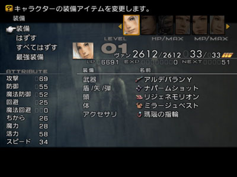

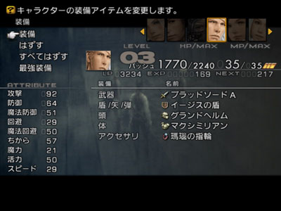

 回到工会，领取奖励……到现在为止，合成向日葵的所有材料完全收集完毕！开始合成！先合成一个大アルカナ： 交易品：生命の結晶：大アルカナ，供需材料3种： 

 1).ソウルオブサマサ×1：完成S级任务“死した都の墓守|Dead City Watch”后的报酬； 2).精霊石×1：精灵元素类敌人中的概率偷盗； 3).アルカナ×10：这个就不说了…… 到此请检查材料：所有材料都在前文详细说明了出处！ 1).大アルカナ×3； 2).ヘビの皮×12； 3).蛇眼×6； 4).ソウルパウダー×2； 5).戦神のアシュリング×4； 6).ヒヒイロカネ×2； 7).ダマスカス鋼×4； 8).獄門の炎×4； 9).霊帝の魂×1.10).玉鋼×1.

#### 交易品：ヒマワリの花：

トウルヌソル（最强之剑，攻+138），直接材料有3种，不过寻根溯源…… 合成步骤： 1.卖出：2个獄門の炎，2个ダマスカス鋼，1个ヒヒイロカネ； 

 2.买进：1个玉鋼（要2000大洋）； 3.卖出：2个獄門の炎，2个ダマスカス鋼，1个ヒヒイロカネ； 4.买进：1个玉鋼……3个玉鋼到此收集完毕； 5.卖出：1个大アルカナ，4个ヘビの皮，2个蛇眼，1个ソウルパウダー，2个戦神のアシュリング； 

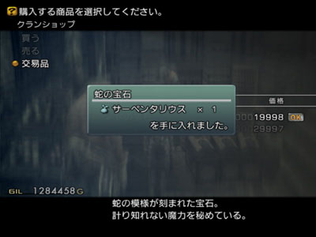

 6.买进：1个サーペンタリウス（要2000大洋）和1个霊帝の魂（要2000大洋）； 7.卖出：1个大アルカナ，4个ヘビの皮，2个蛇眼，1个ソウルパウダー，2个戦神のアシュリング； 8.买进：1个サーペンタリウス和1个霊帝の魂……3个霊帝の魂到此收集完毕； 9.卖出：1个大アルカナ，4个ヘビの皮，2个蛇眼； 

 10.买进：1个サーペンタリウス……到此，合成向日葵的全部材料收集完毕！ 11.卖出：3个蛇夫魔石，3个霊帝の魂和3个玉鋼； 

 12.买进：ヒマワリの花——トウルヌソル（向日葵），需要60万大洋…… 至此，恭喜玩家合成了FF12中常规交易品中合成最繁琐的东东！ 东奔西跑着实有好一段时间了……是该干点主线流程的事情了……回港汀补齐药品，传送到古代都市……准备一场简单的Boss战： 

#### Boss战：ダイダロス

 无头巨人……菜到爆……圣弱点，暗吸收，其余减半……吃混乱，沉默和狂战！ 进入古代都市，一路上没人么好说的，别招惹圣精灵就是了……到了存档点，记得取到スリプガ，非常重要的魔法呦！ 

## Chapter 20——辉煌水晶：

 进入火の門，又是一场Boss战：タイラント 

#### Boss战：タイラント

 异常空间：技封印，Boss是一条龙族敌人！很有气势，很没实力，话说タイラント可是FF历代都会出现的敌人啊……冰弱点，雷吸收，其余减半，吃混乱，从速解决…… 通过传送点正式进入大水晶！ 

 

 _クリスタル·グランデ，以后通称大水晶：_ 

 甭管是不是路痴，都直接看天幻的地图吧！流程中往下走敌人非常简单……注意オセ的强力异常攻击就可以了…… ジュラ存档，进入风の門，准备收伏游戏中的第9体召唤： 

#### 收伏战：密告者シュミハザ

 密告者本身实力不强，但是它的自律防卫体系可以说是非常好的了，以后的强力Boss的自律防卫体系基本都是这个样子的真子集！不过毕竟密告者本身实力不强，而且没有召唤阵大魔法，用无属性子弹轻松解决。 收伏后给猎人搭桥！兴奋啊，能做规模输出的人物又多了一个！ 剧情后， __契約の剣__ 入手！ 

 __契約の剣入手又是1个非常重要的时机__ ，同时契約の剣入手和飞空艇启动几乎是同时，所以就更显得重要了！在契約の剣之后，身列为 __FF12最强Boss之一—最强隐藏召唤戒律王ゾディアーク的收伏时机已经达到！__ FF12最顶级最强力的一批敌人已经部分出现……最究极最华丽的舞台慢慢地向我们拉开了帷幕！

 
## Chapter 21——契約の剣：
 在契約の剣入手到飞空艇启动这段很短的时间里，我们先做3件事情： 先去地下道，剧情加保险丝的地方，去把黑魔法クラウダ买到……我个人认为，这个魔法的图像效果才最有“黑”魔法的味道！同时回港汀买进3个新的魔法…… 之后去把还剩下一般的紧急讨伐完成  **（之前的謎の男第1战根本就算不上紧急讨伐！所以连标题都没给！）**  
#### 工会讨伐：緊急討伐No.8 - ビッグブリッヂの死闘（第2战）
 

 此战ギルガメッシュ和エンキドゥ可是来真的了，比起上一战的不痛不痒，这次的战斗压力极大，花样频出的等级状态攻击，两个单体极大威力的杀招，濒死启动魔法障壁，而且还有瀕死防御力UP……就连狗狗都不是白给的了……如果还要在偷窃源氏装备的话，可是够手忙脚乱的……基于此种情况…… __没啥才能的我只好选择了逆转战略__ ……呵呵，一旦选择了逆转战略，战斗一下子就轻松了许多，(*^__^*) 嘻嘻……不过第一次提及逆转战略，还是稍微仔细说一下吧！再声明一次笔者 __全攻略共计6场战斗使用到了逆转战术__ ，更高水平的玩家尽可以把这个数字再缩小…… 绿魔法3—リバース，工会达至11级时，专属商店有售……4个魔法职业专用，按照弱模式的职业选择，我方应该有3位法师：黑魔，白魔和时魔。因为时魔某些得天独厚的条件，以后所说的所有逆转战略，均为时魔+2位输出  **（基本就是机工+猎人的双火枪组合）** 的阵型。 リバース魔法的效果是伤害回复逆转，即原来是补血的，现在变成伤血的；原来是伤血的，现在反而变成补血了的，所以，逆转战略的一个注意要点： __装备不要有属性吸收！__ 再者，リバース的默认目标是敌人，即， __系统认定为リバース是一种妨害魔法__ ，上リバース时和其他有利增益状态不同，命中率不是“必中”，而是“100%”，所以第二个注意要点：战斗角色 __尽量不要身上附带魔盾这种有利状态__ ，但是盾上附有魔法回避是无所谓的，因为 __リバース无视回避__ ！同时，国际版让复数状态防御的究极饰品リボン也能容忍逆转和火力吸引，实在是太体贴了！第三点注意的： __リバース对所有异常状态没有任何抵抗效果__ ……同时极个别招式的伤害是无法逆转的，比如说亡灵蝙蝠的“吸血”…… __リバース以后通称逆转，不再使用日文__  说完了2点重要的注意，再说说逆转的主要释放者—时空魔法战士； 时空魔法战士是一个很特殊的职业，作为一个魔法职业，几乎做不了魔法输出  **（无论强常弱模式）** ，从名字就可以看出，它是个“战士”，较之魔法输出上的捉襟见肘，由于全部重装  **（除了源氏）** 的支援，它的物理输出反而比较能上台面，但可惜本职业强力兵器不多……这样一个输出上不太能尽如人意的角色的造就自然是 __为了支援__ ！时魔会全套的时空魔法和绿魔法，火力吸引，逆转，泡沫和加速  **（就冲着这个魔法才选时魔呢……）** ，4种出色的魔法支援，而且有4位法师中独有的行动时间缩短3阶，致使它是弱模式下第1支援职业  **（白魔：那我算什么？笔者：不上逆转你是第一。白魔：这还差不多）** ！ 不过时魔有行动速度快和加速魔法这两大优势并不能掩盖它在其余方面的劣势，时魔有3个非常要命的劣势： 1.HP短的惊人，按照本攻略的召唤兽分配，时魔只能加全本盘的HP，充其量绝对过不了600  **（笔者本次游戏Ashe的HP是549）** ，防具再好也绝对是一摸就死，换言之，游戏后期的非流程Boss战，上时魔就必须上逆转！不过HP短也有好处， __时魔在逆转状态下基本都是满HP，可以提高逆转的命中率！__  2. __魔力加成不乐观__ ，时魔是一个重装职业，其全称就是时空魔战士，而不是纯粹的法师，又因为不能穿源氏，所以防具所能提供最多的魔力加成只有5点（次强轻装头，重装11，魔力のシシャーク，魔防+47，力+11，魔力+5）……而且所有的弩也没有魔力加成  **（读者：期望CrossBow会有魔力加成，你疯了吧！）** ……所以弱模式下不算饰品时魔的魔力最高也不会超过40，在使用非必中逆转魔法  **（幸好基本命中率是100%）** 时，的确不容乐观，理论上可以用信仰状态来弥补的，无奈本篇中トロの剣入手实在是太晚了…… 3.MP也没有保障，就算选Penelo或是Ashe作时魔，在没有魔装支援的情况下，MP也就60多点……所以，饰品上装备金钱施法是必然的，倒不是在乎那几两银子，只不过装备上金钱施法之后， __时魔的异常状态抗性就是0__ ，只能靠队友解除，或者是时刻注意Boss出招来临时变更饰品。 有了对逆转魔法和时魔这个职业优劣的认识，逆转战术的安排很明了！如下是Gambit的安排： 首先， __攻略中提及用逆转的6场战斗基本都是持久战__ ，在持久战中防御比进攻更重要，时魔优先保住自己是最重要的！所以逆转和加速的设定都是优先自己，保证在两人逆转同时消失时，时魔会优先给自己加！同时， __对停止状态下的队友加火力吸引是没有效果的__ ，所以解除停止要在火力吸引之前……还有，防止万一出现时魔正在施法但是其自身的逆转恰好在此时消失，所以设定另外两名队友给时魔使用逆转魔片  **（可要省着啊……逆转魔片就是这时候救命用的）** 。同时要根据Boss的自动能力设定是否要适时自残…… 废话了真么多，针对ギルガメッシュ和エンキドゥ说说吧，エンキドゥ的异常状态抗性还是不怎么样， __会中油污__ ，虽然有14万的HP，不过配上龙炎子弹，几枪就了解了，不足为惧…… 

 忠心的狗狗先主人一步走了…… 因为有逆转，所以ギルガメッシュ的伤害问题就不必担心了，说一下异常招式，ギルガメッシュ会用3种等级异常招式，等级条件一旦判定成功，状态强制命中……所以如果选择Balthier为猎人的话，请装备西陣の帯，至于时魔嘛……中了状态等着队友解除好了，当然也可以注意Boss出招来变更饰品……至于Vaan，等级Lv1，又能拿最强铳，在非偷窃时刻，就装备狂战饰品强力输出吧！对了，ギルガメッシュ全属性减半， __异常只吃迟缓__ ，所以狗狗死后，请选用无属性子弹……此战，时魔全力支援，时不时用减速魔法干扰Boss，猎人辅助状态防御，兼顾输出  **（有次强铳フォーマルハウト最好，不过，RP这玩意，不能强求……）** ，机工则猛攻即可！  **PS：** 如果没有合成アルデバラン Y，但是却刷出了フォーマルハウト，或者是只有2把アルクトゥルス，请将猎人和技工的角色互换，即，让猎人拿好兵器作主输出，因为猎人有2个物理攻击UP执照，机工却没有，而逆转状态下角色通常不是满HP，就是濒死，所以在此情况下猎人的输出要大于机工，同时 __Vaan的Lv1可以保证他基本不受异常状态的干扰__ ，安心辅助！还有就是之所以要等契約の剣入手再来完成这个讨伐，是因为又多了一个人输出，同时 __飞空艇上开始出售デスペル魔片__ 了，没有白魔的话，解除敌人的有利增益可比较简单…… 记得在HP在40～20%和小于20%时偷盗源氏の兜和源氏の鎧，和另外两件源氏一样，也都是低概率必定偷盗的……ギルガメッシュ濒死时会物理无效，安心等待即可……同时他有瀕死防御力UP的能力，所以濒死时请选择銭投げ来做输出……战斗后逆转魔片消耗5片  **（从99到94）** 。以下为战前状态调整和Gambit设置： 

 磨叽了这么一大通废话，第三件事还没说呢……那就是解决魔神竜！ 
#### Boss战：魔神竜
 国际版游戏中HP第2多的Boss， __实力算得上是仅次于Boss三小强__ ，废话不多说了，请参照专题先关页面完成解谜并取得ぼろぼろのカギ，准备进入地下宫殿怒れる神と対する広間！ HP这么老长……自然还是逆转战术啦！基本战术设定和上次一样，下面说几个不一样的细节问题…… 1.魔神竜和ギルガメッシュ不一样，前者自律防卫体系远不及后者，圣属性弱点同时吃异常状态油污，所以利用龙炎子弹可以造成1.5倍的伤害，加快输出。 2.其HP每减少10%所使用的大招ジャッジメント范围不像召唤阵大魔法， __通过站位完全可以不让3人全部受伤__ …… 3. __物理攻击附带5%概率即死__ ……即使是我方队伍状态最佳也有可能被打乱步伐…… 4.除了附带即死的物理攻击之外，其他的招数在逆转状态下没有什么要注意的 因为魔神竜体积极大，所以尽可以让火力吸引的人牵引魔神竜，使机工可以在魔神竜背后安心的输出  **（只要有猎人的火力吸引，连逆转都不用给机工罩，当然这也要求战斗场景足够大才成）** ，只要保证机工能不被伤害的安心输出，尽可以调整其HP进入濒死，再利用饰品支援达到伤害极致，令其自己对自己使用狂战酒，伤害下限是：69×69×1.5×1.3×0.5×3×2=27851，上限则是：35249……算是非常令人满意了……以下两图：无需保护的机工在Boss身后安心输出；不净王的血魔互换，不过在此地只能徒增猎人的输出…… 

 不过这就要求猎人身上的火力吸引不能断，经反复测试，Balthier的活力为24，开启了有利状态延长的执照时，火力吸引大概可以支持不到40秒，所以， __请保证每过30秒__   **（我用的就是计算机自带的时钟，话说我用PS2玩的时候也是用电视卡接到显示器上玩的）**  __利用时魔手动加一次火力吸引！__ 同时万一猎人阵亡，先不要去操心技工  **（猎人死后，没有逆转保护的濒死机工肯定下一个阵亡，没跑的……）** ，在保证时魔生存的前提后，复活猎人后手动让其自己对自己使用逆转魔片，时魔手动给猎人加火力吸引！ __还有就是战斗太久了，就不要在Gambit中设定使用逆转魔片了，适时手动使用就成了。__  

 战斗压力并不大，就是比较长！坚持就是胜利……战斗后逆转魔片消耗8片  **（从94到86）** 。以下为装备和Gambit设置： 

 战斗胜利后，建议刷出本场景的最強の盾，1%概率，不难的，笔者每次都是20分钟内搞定……话说天幻论坛上有一个人据说刷了4个小时也没见到……真怀疑他是不是地方找错了……天幻地图上的这个宝箱的位置完全正确，不过还是给一下图吧！ 

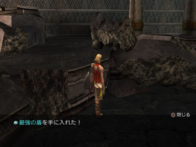
 刷到最強の盾后，Bsach一跃成为队伍第一肉盾  **（要是Basch是格斗家就不用刷了……）** ，不论是破坏还是骑士装备上最強の盾之后，都会 __有90的物回和60的魔回__ ，同时还附带了雷无效。非常出彩，在封印神器的条件下，最強の盾的确是名归副实……但同时破坏或是骑士作为肉盾劣势也是明显的，主要表现在HP不是很长  **（执照盘上都是2100点HP的加成）** ，同时道具强化都很惨不忍睹，尤其是万能药知识方面……当然了，嫌麻烦不刷最強の盾也可以，猎人的  **（40+10+50+暗吸收）** 的回避也不错了，可惜就是魔回是0…… 做完这些之后，按照条件已经可以去收伏聖天使，进而收伏戒律王，不过在不使用逆转的情况下收伏这2位大神，最好要2颗黑暗子弹和填充好的1个ダークマター  **（铁锈飞空艇有售）** ，要是光靠刷的话蛮烦的……而稍微触发一下主线剧情的话，这两样东西都比较容易入手了。 
## Chapter 22——飞艇起飞：
 回到港汀！去找光头大叔……大叔加入队伍，自带一个ダークマター和12个下町のカルバドス，ダークマター的问题就解决了……同时小巴的飞空艇正式归我们操控了，又多了6个通常讨伐…… 

 在去 __2个大凶地__ 之前不妨先来一些稍微简单些  **（其实H级的通常讨伐还是要稍微讲一点点战术的……）** 。 
#### 工会讨伐：手配書 No.25 - 地獄へのフライト！
 

 委托人在所有的飞空艇场……要通过反复和委托人说话和反复坐慢速飞空艇来挺高遇到讨伐对象的概率……讨伐对象デスゲイズ大名鼎鼎，在FF很多作品中都有出现，比如在FF9中，最终Boss连战的第一场就是デスゲイズ……デスゲイズ在FF12国际版中也非常出名是因为它身上可以低概率偷盗皇帝のウロコ  **（这个材料玩到这里不会还有人不知道是干什么用的吧？）** 。按照本攻略，最强铳—アルデバランY应该早就入手了，所以犯不着再去劳心偷窃皇帝のウロコ了。不过，也许有玩家不愿意当时去找小灰龙的茬，所以还是稍微说一下偷盗的注意要点……主要问题就是デスゲイズ在开战之后会进入物理免疫的状态，偷盗无效……所以要利用一点点时间差来偷盗皇帝のウロコ……具体请见天幻FF12论坛的精华帖http://bbs.ffsky.com/ShowJH.aspx?ID=13429，说的非常清楚了……我再多说一点意义都没有…… デスゲイズ刚开始物理免疫，所以先选择黑魔做主要输出吧！Boss除了有不弱的物理攻击以外，还会游戏中最强的异常攻击招数カーズ  **（同时发生混乱+中毒+急速损血+病毒，基本命中率高达80%）** 和黑魔法クラウダ，还会用バイオ反击  **（HP<50%之后，反击频率会增加）** ……是个挺讨厌的Boss，不过先说喜讯： __该讨伐对象不持有自动能力リフレク貫通__ ，所以，我方罩上反射状态就可以轻松地把两个讨厌的黑魔法原封不动地还给Boss，怎么， __时魔才会高级反射魔法__ ？？哎呀，不是还有反射魔片了么？当时在地下水路找死神要忍びの衣的时候，肯定也 __没少偷到リフレガの魔片__ ！肯定够用，豪爽的使用吧！笔者到这个地方有リフレガの魔片29片呢……这玩意以后用处不大…… 

 剩下的就让白魔装备上オパールの指輪来完成支援工作吧！等到魔法障壁消除之后，退回黑魔，调出机工，快速收尾好了！需要注意的就是，攻击不够连续的话Boss也会进入非战斗状态从而HP全恢复，所以请保持输出  **（Guest就不要复活了，复活Gambit关掉好了，手动复活）** 。对了，Boss的异常抗性是：逆转，沉默，急速损血有效，不过何必让它沉默呢？属性抗性是土弱点，风吸收。同时再提一句， __物免时，逆转药剂是不管用的__ ！  **PS：** 从此之后，就不要再说没有アルデバランY和土神子弹啦！ 
#### 工会讨伐：手配書 No.26 - 獄炎の惡魔は子供好き？！
 

 委托人在空都，要先把第11鉱区のカギ入手，就是海岸的那把……现在不可能没拿到！讨伐对象ディアボロス的第１１鉱区採掘場左下角里！攻击招式非常繁多，而且绝对强力，而且会根据情况开启强大的自动能力，HP<50%之后也会无视回避！比较讨厌……不过Boss具有水弱点，同时HP不长，才不到10万……所以尽可以速战速决！不过Boss本身具有自动能力被ダメージ返し  **（伤害反弹5%）** ，所以 __濒死放火枪的战略不能直接用__ ，而且2枪也解决不掉Boss，所以又要用到 __开一枪进濒死，再开一枪挂的战略__ ……下面做一下简单的计算…… 1.アルデバランY  **（机工专属）** ：非濒死下限：69×69×1.3×1.5×2=18567，上限是：23499，最小反弹的伤害是：18567×0.05=928 2.フォーマルハウト  **（RP好的人才有，给猎人的）** ：非濒死下限：55×55×1.3×1.5×2=11797，上限是：14931，最小反弹的伤害是：11797×0.05=589 3.アルクトゥルス  **（没有フォーマルハウト的猎人只好拿アルクトゥルス代替喽）** ：非濒死下限：48×48×1.3×1.5×2=8985，上限是：11372，最小反弹的伤害是：8985×0.05=449 第二枪因为是濒死  **（机工须饰品支援）** ，所以伤害再×2，需要调整的HP为：机工/猎人的泡沫HP上限的20%+所装备兵器造成的最小反弹伤害  **（比如拿アルクトゥルス的猎人，4239的HP，那需要调整的HP就是4239×2×0.2+499=2194，**  __能开3枪__   **哦，至于拿最强铳的机工，就不要指望第3枪了）** ……再看输出，以アルデバランY+アルクトゥルス来说， __机工能开2枪，猎人至少能开3枪的最小输出__ 为：18567×（1+2）+8985×（1+2+2）=100626，没问题！事实上一般都不用猎人开第3枪……秒杀Boss很轻松！ 剩下的就是战前准备了，让 __Basch来做火力吸引__ ，加上物盾+魔盾+泡沫+反射……两位主攻手则是调整好HP，狂战+加速+勇气+物盾+魔盾+泡沫+反射， __Boss视反射，以防万一还是加上吧__ ！ 

 最后给Basch上火力吸引，Basch单人去找Boss，被锁定后立即调出两名主攻……基本是玩家自己还没反应过来呢，Boss就死了……还有就是老生常谈， __不要设置给两位主攻手回复HP__ ……下图为讨伐结束后的HP状态： 

  **PS：** 机工第一枪就CR的人请为自己的RP默哀…… 
#### 手配書 No.28 - 古代生物はワイルドな臭い！
 
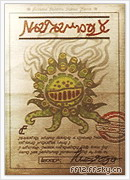

 和上面两个讨伐比起来，这个讨伐一点意思都没有，Boss风弱点，但是 __吃油污__ ，周围有几个杂兵……狂战的机工穿上勇气套装配上龙炎子弹，几枪收工……Boss绝对连HP/MP全回复都来不及！ 
#### 手配書 No.29 - 幼き罪をつぐなうとき
 

 S级讨伐和H级讨伐就是有区别，刚做了个简单的，又来了个更简单的…… __Boss吃睡眠__ ……圣弱点，暗吸收……别的我就不说了，药剂连续控制，解决NPC，调整两位法师的HP进濒死……用法术屈死它……下图为濒死黑魔用黑魔法クラウダ攻击睡眠中的讨伐对象： 

 
#### 手配書 No.27 - 黒の魔術師
 

  **（读者：话说你怎么讲讨伐的等级是从高到低讲？笔者：深入浅出嘛……）** 虽然是个A级讨伐……但是难度可比上两个S级讨伐要稍高一些……主要是因为讨伐对象具有铳耐性…… __强大的魔法输出同时贯穿反射，还会即死魔法__ ……配上 __魔法CT0这种变态的自动能力__ ，我方极容易陷入苦战，而且它濒死魔力UP，输出还会大幅增加……所以建以让黑魔把它打到HP在60%以下时  **（请看血槽估算，宁少勿多）** ，使用Basch召唤天秤，召唤技50%概率将其直接闷毙  **（伤害30000，Boss一共才不到50000的HP）** ！一次不成就天秤连发，50%的概率算是相当高了！ 

 现在还有一个手配書 No.30没有做，这个不急，因为风雪巨兽的讨伐和贝希摩斯王的讨伐是联动的，所以现在讨伐了意义不大，而且会改变天气。因此，先留着吧！从实力来讲现在讨伐它一点问题也没有！不过话说回来，手配書 No.30的确是最难的通常讨伐，其难度远比一些紧急讨伐要高很多！ 然后去找委托人把奖励全都取了……该卖的卖，该留的留…… 
## Chapter 23——水晶之巅：
 补充药剂  **（尤其是Ether和凤凰尾）** ，准备进入大水晶上层，收集装备魔法，打通到オメガmk.XII的路，同时收服聖天使アルテマ！ 
#### 声明在先：
如果 __没有2颗黑暗子弹__ 的话，收伏聖天使势必会用到逆转战术！既不愿意在台地刷黑暗子弹又不愿意使用逆转的玩家将下面的攻略  **（直到Chapter24结束）** 移至攻略最靠后  **（即トロの剣入手+在大灯台地下层刷出第2颗黑暗子弹）** 。 大水晶上层是 __3大凶地中最不凶的一个__ ……其之所以成为凶地主要是因为杂兵实力不弱  **（注意，是不弱，不是变态）** ，同时迷宫极为复杂，而且机关的解密都有不算很充裕的时间限制，基本一路都要逃跑，调整队伍和道具消耗在所难免。 去大水晶之前，请填充好一个ダークマター  **（不过我们到时候用的是告密者的召唤技……）** ！ 首先在火之门存档，进入8#传送装置，去东北角开启天蠍宫制御装置……然后去9#传送装置，准备正式进入水晶上层！一路上请均逃跑  **（但不要按R2，因为按住R2时，所有人的回避均为0……把攻击Gambit关闭即可）** ，不要恋战  **（也恋不起……）** ，请让Basch，黑魔和白魔上阵……用来回复，火力吸引，施加群体睡眠魔法  **（鬼魂，輪竜，马怪和霸王龙都吃，别的杂兵就不成了，能减轻点压力是一点）** ，具体走法请看天幻地图，论坛的精华帖也有置顶帖来解决这些问题……迷宫走法本攻略是不提及了……要说明的就是在传送装置20# __遇到次强珍惜怪クリスタルナイト请直接逃跑__ ，此时不是没有实力解决它，而是这次来另有其他目的！需要刷出来的装备有：賢者の杖（贤者之杖，攻+53，魔力+8，圣+冰+风强化， __以前RP好的玩家如果在死度杀死神掉落的话则可以不刷__ ）和柳生の漆黒（大蛇柳生，攻+98，暗属性攻击），这两个宝箱都是25%概率出现，必定能开启出所要装备的……不难，同时一定要把魔法シェルガ（高级魔盾）和ヘイスガ（高级加速）取到！ 为了以后省事，请把去オメガmk.XII的路打通  **（主要就是把オルドビ|奥陶纪这一层的左边的那条45度斜线的通路捋顺即可）** ，不要去找オメガmk.XII，一是一路太危险，二是找到了也白搭  **（人家还睡着呢！）** 。 以上这些工作是很复杂很痛苦的，尤其是 __水晶上层开启制御装置时，无一例外地会遭到杂兵的干扰__ ，巨烦，所以请耐心！同时要小心，被全灭是非常痛苦的，所以 __第一次到カンブル | 寒武纪时，一定要存档__ ！ 完成这些之后，请再次在カンブル | 寒武纪存档，准备收伏游戏中第2强的召唤兽聖天使アルテマ 
#### 收伏战：聖天使アルテマ
 聖天使アルテマ本身实力不是特别出众，真要是说只比实力的话，聖天使绝对比第二战謎の男要低不少，不过 __辅之以五花八门的变态自动能力，同时，聖天使会按以下顺序发动异常空间__ ：>>>HP极速损>>>MP极速损>>>通常攻击封印>>>魔法封印>>>技封印>>>>>>道具封印>>>磁场>>> HP极速损……非常讨厌！而且一上来就是HP极速减少，对我方威胁极大……如果不用逆转的话必须从速解决她  **（它？）** ……  **PS：** 再次醒目提醒：没有2颗黑暗子弹的玩家，请老老实实地使用逆转+自残的战术收伏聖天使！要不就等游戏最终期在灯台地下层刷到第2颗黑暗子弹再来…… 聖天使有 __最强的3个防御系自动能力__ ：被ダメージ返し+被ダメージカット+瀕死防御力UP……又因为 __刚开始的异常空间是HP急速损__ ，所以我方的满HP攻击UP形同虚设，至于濒死攻击UP，恐怕也不会有人用吧  **（5%伤害反弹+HP急速损，还真嫌自己死的不够快啊……）** ！所以说从速解决聖天使绝对不会像解决審判の霊樹那么快  **（不算开菜单时间，10-12秒……）** ，不过弱模式玩到这里，玩家应该也注意到了，其实攻略上说的秒……不仅仅是为了听起来，玩起来有气势，其实更是因为 __一些Boss的存在是“我们不秒了它，它就会秒了我们”……__ 所以，速战速决是必要的！ 先分析一下聖天使的各个方面的实力： 聖天使 __最大的弱点：HP太短和有召唤阵大魔法的必定发动点__ ……HP只有258001，在血牛如云的FF12国际版中，25万多实在是不多，再加上我方最后会使用人马的召唤技一次性扣除其42000的HP，所以本身需要人物们处理的HP为216001，在狂战+勇气+加速火枪手们的高速输出下，一会儿她的HP就扣得差不多了……机工装备アルデバランY的每击输出为18567至23499，猎人装备アルクトゥルス（有フォーマルハウト自然更好）每击的输出为8985至11372，而且聖天使在HP<50%时必定会开启一次自动能力： バオル  **（自身上物盾+魔盾，同时获得自动能力被ダメージカット ）** ，同时聖天使吃黑暗，并且半血以下要自己解除，又浪费她自己一次行动轮次，所以在我方狂扣其HP的情况下，聖天使基本就是攻击1次，ホーリジャ，开启バオル，ホーリジャ，挂掉……至此，我们的主要目标就是如何坚持过2次ホーリジャ……这实在是太简单了，賢者の指輪就是为了这个场合而准备的，但是 __重中之重：任何时候千万不要全体圣属性吸收__ ……弱模式下全体圣属性吸收无异于自掘坟墓！下面结合战斗具体说明。 队员：Basch+2位火枪手。战斗开始前，给两位火枪手加上如下有利增益：物盾+魔盾+勇气+狂战+加速+再生+泡沫，并且补满HP，装备让HP最大化的轻装和賢者の指輪，收到菜单里；至于Basch：物盾+魔盾+勇气+加速+再生+泡沫，装备攻击力最高的兵器，不要装备盾，不要装备賢者の指輪，最好在进入聖天使所在平台之前一点再上有利增益，最后是火力吸引  **（为了让火力吸引和其他有利状态持续时间最长……）** ，至于光头大叔……是撑不过第一轮ホーリジャ的，所以Gambit里面不要设定复活Guest，浪费行动轮次…… 战斗开始，聖天使锁定Basch，准备进行物理攻击，Basch名字一旦变红，立即调出两名火枪手  **（分秒必争，别等聖天使攻击完Basch1次后再调出输出）** ，然后看到聖天使的HP会飞速减少，如下图  **（我方的HP也在飞速减少）** 。 

 因为聖天使HP大减的关系，她第2招绝对是ホーリジャ，光头大叔必挂想都不用想的。 

 Basch因为有魔盾的保护受到1次ホーリジャ攻击应该还能残存1000左右的HP，而两位火枪手因为賢者の指輪的保护，HP会被补满  **（很重要，要不肯定被伤害反弹弄死了）** ……就在聖天使准备第3招时，她的HP肯定被扣到50%以下了 __（别问我为什么，就是因为火枪手们太强了，80%HP到50%HP之间才77400的HP，对于我方来说实在是不多）__ ，所以她紧接着会开启バオル，此时要注意了一旦她使用バオル  **（时刻注意屏幕右上角）** ，就让Bsach装备逆转指轮对猎人使用狂战酒，然后聖天使バオル开启完毕，准备使用第2次ホーリジャ，此时聖天使的残存HP应该已经不多了。 

 让猎人召唤告密者，因为召唤时间的要求，肯定是先吃ホーリジャ，再召唤成功，同时请针对人物的逆转与否装备賢者の指輪，撑过第2次ホーリジャ，然后让猎人使用驱除魔片解除聖天使的物盾+魔盾，同时确认 __魔盾解除后__ 操控人马宫施放召唤技解决战斗！如果没有了结聖天使，再使用銭投げ…… 整个战斗过程基本如此，但是不可能完全如此，很有可能 __释放完召唤技之后聖天使还残存不多的HP__ ，如下图，这时候就比较尴尬了…… 

 此时，请全力用銭投げ解决战斗，好在Boss战前有存档点……多试几次，肯定能成，不过一次性成功的概率还是很大的，我个人在此次游戏中打了16次聖天使，释放完召唤技聖天使未死的有5次……召唤的时机是关键，请尽量精准控制……因为一旦召唤技后聖天使残留的HP过多的话，不用逆转的话基本就要读盘了……最后给出Basch的Gambit设置： 

 收伏完聖天使之后，请给相应的角色搭桥，在收伏场景取得エクスカリバー（圣剑，攻+127，圣属性攻击），然后脱出大水晶上层和古代都市…… 
## Chapter 24——究极凶地：
 回到港汀补足药剂  **（还是Ether和凤凰尾要补足，状态药品最好都买99个，下面的过程是非常漫长的……）** ，现在已经收伏了10体召唤  **（还剩下主线2体和戒律王）** ，进入赫尼魔石矿2期矿道  **（以后通称蛇夫矿）** 的条件已经成熟，所以请确定手配書No.1.邪悪な亜人、魔石鉱で何を想う已经完成，回到ガリフの地ジャハラ，与坐在やすらぎの大地中的一个风水士ユグギル对话，对方会告知 __“ヘネ魔石鉱的新路已经开通了”__ ……这样，游戏中第1凶地—蛇夫魔石矿已经开放……无数强敌和N多极品等待着玩家……此处的危险度要远远大于大水晶上层…… 

 详细说说蛇夫矿的5种杂兵： 1.アビス（怪物图鉴编号138）：亡灵之翼，金翅蝙蝠，HP20000+，攻击力极高，在我方物防55+时，物理攻击能在1300+，吸血的伤害更能达至2000+……攻击视回避，吸血无视物回，不死系，异常抗性极差，有效的重要异常：睡眠，封印，油污，圣弱点…… 2.ギザマルーク（怪物图鉴编号083）：盲眼之龙，HP53000+至55000+，攻击力也不低，会用元素高级魔法……视回避，异常抗性也不怎么样，虽然不吃：封印+睡眠，但是更直接，吃即死，同时止步和油污也有效，冰弱点…… 3.ヘクトアイズ（怪物图鉴编号082）：究极混乱史莱姆，长的挺恶心  **（眼睛多的东西巨烦）** ，HP不到35000，攻击比起前面两位稍低，但是会强大的雷魔法（魔防50+，不做属性防御大约1700+）和各式各样的异常状态攻击……视回避，史莱姆系  **（具铳耐性）** ，异常抗性在杂兵来说就是很不错的了，重要异常有效的有：止步+油污，也是冰弱点…… 4.エテム（怪物图鉴编号084）：最强的死神，HP35000+，有不俗的物理攻击和绝强的魔法攻击，元素高级魔法和即死，停止，死的宣告魔法一应俱全，同时作为死神系敌人会吸空MP……视回避，不死系，异常抗性不怎么好：封印+混乱+沉默+油污有效，圣弱点…… 5.ネクロマンサー（怪物图鉴编号086）：最强幽灵怪，在击倒上述2种杂兵时，以60%的概率登场，HP30000+，攻击力也不低，擅长元素高级魔法，会最强的异常攻击招式カーズ和暗属性攻击技，异常状态还会施加死的宣告……视回避，鬼魂系  **（具铳耐性）** ，异常抗性比较好但是吃两个比较重要的：睡眠+油污，圣弱点…… 有了敌人的资料，战术就好安排了，因为有不少敌人有铳耐性，所以就不要派狂战机工做输出了，而且狂战状态只能输出也是一个很大的不利，尤其是杂兵又多又强时…… __5种杂兵全部吃油污，攻击均视回避__ ，所以主要输出选用黑魔，配上炎の杖+信仰+满HP，对油污敌人使用高级火焰  **（请无视其余的属性弱点，油污的3倍伤害最王道！）** ，伤害绝对能达到22000+……然后根据场景的不同用Basch  **（要是格斗就免了吧）** 或是猎人来做火力吸引兼队长，有人或许会觉得逆转万能药是非常好的选择，的确，逆转万能药非常有效，但是弱模式真正淌过迷宫的人就知道了，99个万能药根本不够，必须充分利用魔法和其他低级药剂…… 首先进入的第２期採掘現場，该场景只有アビス和ギザマルーク两种杂兵，アビス睡眠魔法控制，施加油污，然后烧死它……至于ギザマルーク，直接赏它一记逆转凤凰尾  **（固然有点浪费道具，不过ギザマルーク一共没几只）** ，请把该场景的3个顶级头盔刷出，没有フォーマルハウト的要把フォーマルハウト取得！逆转指轮也就一并收了吧！最强重装头和逆转指轮是25%出现的宝箱，请反复耐心1AC刷出，本场地的战斗压力是最低的…… 然后的3个场景没有任何值收集的宝物，请调整好雷属性抗性，一路狂奔  **（不要按R2，当然了，要是对路程和敌人出现位置绝对熟，一路逃跑也没问题！）** 进入特殊採掘坑，真正恶心的是这个场景……首先先说明一点， __陷阱不要踩__ ，这里有狂战+混乱陷阱，强敌极度密集的这个地方，中了这种陷阱是极为被动的……再者，无论先前是谁，现在把领队换成猎人，猎人被物理攻击命中的可能为25%，HP会比骑士和破坏长不少，同时会万能药知识3阶，装备逆转指轮，关闭所有道具使用和攻击的Gambit……进入该场景首先会遇到的是若干只混乱史莱姆，每次1-2只出现，数量不多，请用万能药将其定在原地  **（止步状态）** 使其异常攻击不能施展，并且全员调整雷属性抗性  **（第3强轻装/钻石轮腕）** ，远程用火魔法解决……击倒后千万不要立即往前走， __密切注意是否有鬼魂升起__ ，有的话立即让猎人用王子の口づけ将其睡眠控制  **（最好不要用魔法，因为鬼魂升起后可能会立即瞬移，瞬移过程无视一切，所以选择CT=0的道具）** 同时两位后援法师使用油污和高级火魔法将其解决……注意ネクロマンサー有18%的可能掉落生命のロウソク，照我们要在本场景击倒的ネクロマンサー，收集3个没什么问题……走过石质走廊之后，就可以看到死神了，死神吃混乱，对其使用逆转万能药之后会有很有趣的效果  **（读者：这种时候你还有闲情逸致！）** ，收到逆转万能药攻击的死神会不停地瞬移，感觉像喝高了一样……它瞬移的时候还手舞足蹈的  **（读者：死神没有“足”！笔者：领会精神领会精神……）** ，超级Happy的样子，对于变成这个样子的死神，我们就不用管它了，直到它封印解除，同时受到物理攻击解除混乱再说……还有隐身的死神也不要招惹，如果范围火魔法使其显形的话也同样用逆转万能药处理……有不少地点，鬼魂会直接从地上升起，所以推进的时候一定要慢慢来……具体宝箱的位置天幻专题都给的很详细了，本场景中绝对是 __极品云集，最强盔甲各1个，究极饰品リボン1个，一颗土神子弹还有最强回复魔法フルケア__ 和魔攻破坏（弱模式下无用）技能…… 

 __总觉得最强轻装的宝箱出现率要比25%低呢……__  除了土神子弹，这些宝箱都是出现必定能开出，不再生，但是出现概率大多不是100%所以要通过反复1AC来刷出……这就出现了一个讨厌的问题，这个场景的 __绝大部分敌人都会重生1遍__ ，所以再次推进时仍然要非常小心！同时陷阱也会重生，请注意！有的宝箱出现率是25%，但是刷起来很肯能许多次都不出现，请耐心！ __刷出上述所有东西后，请慢慢退出蛇夫矿！__ 撤退的时候也要稳扎稳打，要是撤退时被全灭是最让人捉狂的了！退一万步说：实在是捉狂受不了的玩家，就用神盾吧！很简单很多…… 回到港汀，补充组所有药品，合成一样FF兵器…… 
#### 交易品：至高の一振り：
デュランダルA（单手剑9，攻+103），最强常规单手剑，骑士的标配，共需3样材料： 
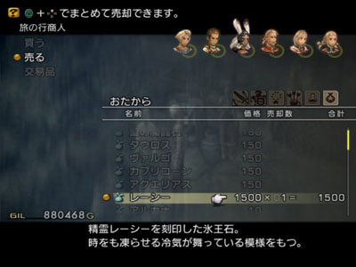

 1).レーシー×1，冰王石，大峡谷的冰精灵低概率偷盗； 2).輪竜のウロコ×4，基本是个輪竜都能掉，很基本的战利品； 3).生命のロウソク×3，上文说过了，蛇夫矿的鬼魂掉落； 并检查，保证至少有 __5个ラストエリクサー和10个エリクサー__ ，还有40万的银子，并且填充好一个ダークマター并准备一片ホーリーの魔片……注意，做这些准备是为了再返回蛇夫矿收伏最强隐藏召唤——戒律王，Basch是骑士的话是最好，如果是破坏/格斗的话就有点难办了，速杀戒律王要珍惜每一点输出，而破坏/格斗都没有办法装备圣剑……破坏还有一把不错FF兵器  **（虽然伤害不稳定但是连击值非常出色）** ，而格斗现在兵器方面实在是比较拿不出手……这时候就有3个选择： 1.取到トロの剣再来收伏戒律王……就是时机太晚了…… 2.从戒律王身上偷盗神器トランゴタワー  **（虽然没有圣属性的攻击2倍了，不过其仅次于トロの剣和マサムネ I的连击值绝对能弥补这一点）** ，现取现用  **（万一偷到了又被全灭了……请默哀）** ！ 3.使用逆转战术…… 在不能装备圣剑的情况下，方法3自然是最稳妥的，不过又额外多用了一场逆转，有点可惜……方法2绝对高效，而且选择破坏就是为了用神剑  **（就多样化战术破坏绝对不如骑士）** ，但是比较极端，偷到トランゴタワー的概率最高为6%，而且弱模式无逆转收伏戒律王很难说“必定”成功……方法1实在是有点晚……收伏完戒律王就该进百层了！具体取舍请玩家自己选择…… 
#### 收伏战：戒律王ゾディアーク
 如何进入蛇夫矿刚才在刷装备时都说得很清楚了……下面仔细说说戒律王： 先说用逆转的，对于收伏戒律王使用逆转战术的玩家，我在这里稍微提两句：戒律王无耻的 __召唤阵大魔法ダージャ简直是人神共愤__ ……超高威力的暗属性伤害和附带50%的即死+黑暗……无耻之尤，没有魔盾的保护下，就算是逆转战术也有12.5%的概率场上人员全灭，所以高级魔盾的加护是必须的，但这样就导致逆转的成功率也会减半，所以白魔上阵给逆转释放者提供信仰状态至关重要！还有戒律王濒死时不要使用デスペル魔法/魔片解除其有利增益，因为戒律王濒死物免“几乎是”无法回避的，所以万一再魔免了，加上每8回合就使用一次的ダージャ……那真是被虐待的感觉……所以为了酣畅和刺激，建议选择无逆转的战术： 这里要说的是无逆转战略，首先都已经开始对付Boss三小强了，就要舍得下血本……戒律王的自动能力被ダメージ返し，同时具有铳耐性，主要输出是机工和猎人的銭投げ，同时Basch在前面顶着输出也不可小觑  **（尤其是有圣剑或是トロの剣的话）** ……因为銭投げ每次都会带来500的伤害，同时再配上戒律王的物理攻击，X-Potion的回复肯定不够，所以就要以ラストエリクサー和エリクサー为回复手段了！5个ラストエリクサー是肯定有的 __（收伏輪廻王场景1个，伪A级紧急讨伐奖励一个，工会11级时奖励2个，地下宫殿瀑布谜题解开后进入小场景内1个）__ ，エリクサー就更好办了，10个肯定有了……回复方面的问题用大手笔解决了，该谈谈输出问题了…… 戒律王具铳耐性，有336847的HP，濒死会以魔法障壁来作为反击技能，所以在其物免之前最后 __用ダークマター一次性赏它42000的伤害__ 是肯定的了，不过戒律王濒死的HP足足有67369，刨去一个ダークマター还剩下25000+呢……好在ダークマター有卡住敌人行动的效果，所以在释放ダークマター之后戒律王启动魔法障壁之前，还会有小小一段时间让我们来收尾…… 戒律王攻击的花样非常繁多，而且强力，不少是高威力远程打击能力，但是戒律王也有弱点，就是 __它有太多的自动能力要启动__   **（濒死前足足要开启5个，而且它还会给自己上有利增益。这些都为我们高速攻击提供了足够的时间）** ，同时ダージャ没有HP检查点  **（除去开战那一次）** ，随着戒律王HP的不断减少，其ダージャ的使用规律会不停变化，只要我方攻击够快，完全可以拖住戒律王的脚步让他在濒死前不施放ダージャ，然后一鼓作气解决它…… 以下实战说明：战前调整好状态极为重要，请给将黑魔的HP调整至1.**（完全治疗+逆转）** ，装备贤者之杖，防具+饰品让其魔力最大化  **（以Penelo为例，魔力最大可以调整至75，最强魔装，再装备オパールの指輪，最后记得装备賢者の杖，魔力+8，同时圣强化）** ，有利增益信仰就可以了，开启Gambit，但是关闭所有项……7vmn7vmn录制的视频地址：http://www.tudou.com/programs/view/BtBMCKUqlUs/ ，如果是双銭投げ的话速度会更快！ 

 3名主攻手：Basch，猎人和技工，Basch请根据情况选择最合理的兵器，上除了反射，隐身，信仰和火力吸引之外的一切有利状态！技工和猎人的有利增益和Basch大抵相同，就是不上狂战，最后给技工上火力吸引！三人收至菜单中，调出黑魔，进入特殊作業場…… 

 这次截的图中，饰品调整出了点错，魔力是73，所以伤害低了点…… 开战后手动让黑魔给戒律王使用神圣魔片……黑魔会自己跑过去，戒律王则同时锁定黑魔，准备使用ダージャ，魔片施放在前，黑魔被伤害反弹反死，召唤阵大魔法也强制终止……顺便说一句，黑魔在濒死+信仰+圣强化的情况下使用神圣魔片的作用可不只是强制终止ダージャ，也能造成不小的伤害呢，就算戒律王此时有魔盾，也会有16000（下限：(145-37)×[2+75×(75+3)/256]×2×1.5×1.3×2×0.75=15701，上限是18366）左右的伤害  **（笔者：小潘啊，你死的好值啊！读者：你个没心没肺的家伙……）** …… 

 黑魔HP一归零，立即调出3为主攻，Basch会很自动地冲上去， __请让戒律王，Basch还有技工和猎人基本排列在一条直线上__ ，如上图，这样的话，戒律王基本都是会用物理攻击来攻击机工的，绝少使用远程打击能力，但如果站位不像上述的那样，戒律王的攻击可就五花八门了，这是要千万避免的……中途会因为デスペル魔片的解除，戒律王开启完全マバリア，同时还会在工程中使用見切り，限界突破，バイオ和魔力の泉，还会时不时给自己上有利增益，而与此同时技工和猎人是疯狂銭投げ……还有，魔力の泉启动后，请猎人关闭使用デスペル魔片的Gambit，全力进攻…… 最后，进入濒死时，戒律王会使用気合い，此时请开启技工和猎人使用ダークマター的Gambit  **（可以考虑换装来争取时间，不过我觉得必要性不大）** 同时将Basch的兵器换为无属性， __ダークマター的释放卡住其行动__ ，运气好一个ダークマター就直接把它送上天了，否则最后机工和猎人各补一次銭投げ，放心，绝对来得及，而且Basch这时候也还在狂砍呢！戒律王在开启気合い之后也还会有另一个自动能力バリアチェンジ要发动，所以基本是十拿九稳了！ __战斗重点：合理站位+ダークエナジー施放的时机！__  

 投掷完ダークマター，补了一次銭投げ送它上西天！ 

 战斗后两样究极回复药的残量……  **PS：** 要是实在不放心，就在施放ダークマター同时手动施放ダークエナジー  **（可以合成一个，用在这里虽然有点奢侈，但是也算物有所值）** ，肯定秒掉戒律王了！  **PS2：** 有瘾的玩家可以从戒律王身上偷取神器……我个人这次写攻略为了测试，打了17遍戒律王  **（就当偷神剑了，当然偷成的那次自然脱出存档了，是第14次的说……）** ，只有1次戒律王开启了物免……所以这个战斗方法还是很成熟的，同时，封印戒律王首次ダージャ后， __战斗时建议开启4倍速__ ！ 最后给出装备和Gambit设置，投掷ダークマター的Gambit适时开启！！ 

 Basch在戒律王在开启気合い之后换成无属性兵器 收伏完成后！攻击玩家通了一次极难的试炼，同时机工执照盘上的HP终于提升至上限了……从该场景的左侧离开，在蛇夫矿的十字形小场景搬动机关  **（一搬动机关会有一堆金翅蝙蝠落下，别犹豫，立即跑，绝对它们还来不及攻击就跑走了，毕竟只是巴掌大小的场景）** ，然后从幻妖之森的出口脱出  **（这可近多了！不过就算短也要一路小心……）** ！ 收伏完戒律王之后，调整一下心态准备去把最后一部分主线处理完成吧！ 
## Chapter 25——绝海之塔：
 回到港汀，补足药剂……去飞空艇库，飞往大灯台！ 

 恢弘的气势，出色的音效，我个人觉得FF12中空中战舰爆炸和这段过场最精彩！进入里多拉纳大瀑布！ 
 _リドルアナ大瀑布，以后通称大瀑布：_ 
 

 大瀑布没有什么值得取得的……记得在コロセウム把地图开启了，顺便瞻仰一下……在はるかなる時の庭刷出讨伐珍惜怪：アベリスク 

 珍稀怪兽序号No.60：アベリスク，该珍惜怪属性抗性：冰弱点，雷吸收；该珍惜怪异常状态抗性：全异常免疫……不过这怪其实挺菜的，主要是攻击视回避，所以没什么要注意的，如果已经收伏了的戒律王……不妨在其HP<60%时，小试一下牛刀？？！！…… 进入大灯台…… 
 _リドルアナ大灯台，以后通称大灯台：_ 
 进入大灯台要收集3样材料，我在这里就一次性说明了： 1).キマイラの首×2：キマイラブレイン（怪物图鉴编号176），大灯台下层大量出没，12%固定概率掉落； 

 2).獣王の皮×7：アパンダ（怪物图鉴编号179），大灯台中层一定量出没，中概率偷盗，高概率掉落，高概率密猎； 

 3).死虫×3：这个材料有点不太好弄，不过没有选格斗的玩家就不需要收集了，ドラゴンゾンビ（怪物图鉴编号182），低概率偷盗或者是12%固定概率掉落，主要是出现的太少，受難の層和幻惑の層各2只，重生也有点麻烦，到时候稍微说一下，还有就是一会儿遇到的尸龙Boss身上可以中概率偷盗1个，建议取得； 

 
#### Boss战：ハイドロ
 真的不愿意去写流程中的Boss了，现在我们连リボン都有了，这条龙还有什么可怕的？？不过这个Boss身上可以中概率偷盗死虫，选择格斗的玩家最好在这里入手1个。余下的，油污之后装上龙炎子弹，几枪毙了它…… 这是进入大灯台，来到游戏最后一个传送点，存档！大灯台是游戏中最长的一个迷宫，竟然由4个小迷宫  **（其实每个都不小）** 组成  **PS：** 此时死都有1个新魔法卖，乐意跑1趟的可以去……我觉得可以等灯台剧情结束之后再说，那时候Hi-Ether也追加出售了  **（准确说是至天の旋回廊剧情对话结束）** 。不过这时候最好回港汀补充一次药剂…… 
 _大灯台下层：_ 
 先反复1AC把かわき満たす広場的2个饰品取到，然后在始原の層 外郭不停地杀敌，并且收集黒の珠，建议先关闭4倍速，顺便把10号宝箱开启了，记得收集个50-60个黒の珠就可以了，从3个出口回到始原の層 内郭，启动3个黒封の祭壇，在从始原の層 外郭正东侧进入小黑屋…… 
#### 工会讨伐：パンデモニウム（闇神一味之一）
 有趣的龟龟……还要先找，找错了还要重找……パンデモニウム是作为流程中必定会遇到的Boss，所以虽然位列S级紧急讨伐，但是难度不高，风弱点，土吸收，濒死时会完全无敌……所以有戒律王的玩家看准时机秒杀掉好了…… 正式进入大灯台下层，在此有一个建议，取得第2个リボン  **（或许对有的玩家来说是第1个呢……）** ，出处当然是有名的リボン珍惜怪ヴィシュヌ（珍惜怪编号44，怪物图鉴编号300），因为是极低概率掉落
 _（Chain到最大是7%的掉落率）_ 
，所以要先Chain到大金币……同类型的怪在大灯台有绿色灯台怪コジャ（怪物图鉴编号184）和红色灯台怪デイダラ（怪物图鉴编号186），这两个怪都吃即死，远程投掷逆转凤凰尾即可  **（浪费道具？怕什么，主线迷宫中，有白魔一个人就够了，更何况时魔也会复活魔法）** …… 请关闭Gambit，先杀绿色灯台怪，中途掉的掉的宝物一概不捡……别的杂兵一概不杀！ 

 30Chain之下绝对到大金币了，到了大金币就可以捡战利品啦，先把到始原の旋回廊４德绿色通路打通……然后回过头来从始原の旋回廊３  **（只有3和4才有红色灯台怪）** 开始，只杀红色灯台怪！先 __不用管红色通路的3个宝箱问题，计数，杀了10个红色灯台怪，立即爬到始原の旋回廊4的最后一个平台__ 上，珍惜怪ヴィシュヌ肯定就出现了，旁边有飞龙的干扰，请先选择逃跑，等到飞龙往下飞之后，开始解决珍惜怪，现在两位火枪手都应该穿着勇气套装了，那解决它就是很简单的事情了，驱除魔片，接着逆转万能药  **（该珍惜怪吃油污）** ，龙炎子弹+狂战，几枪收工！ 

 掉下来的大金币捡起来，有リボン没？有的话，看看红色的通路铺全了么？铺全的话，把3个宝箱收了，没铺全继续杀红色灯台怪，如果没掉的话，再回始原の旋回廊3，杀10只红色灯台怪再爬上来，遇到珍惜怪再杀……7%的概率不低了，杀不了几只珍惜怪就得到リボン啦  **（笔者是70Chain时得到的，是第4只珍惜怪）** ！同时别忘了吧必出宝箱中的东西都捎走！一直向上走到至次の境域。 
#### 工会讨伐：シャーリート（闇神一味之一）
 丑陋的大鱼，话说还是苍龙？？？真是太菜了，デスペル魔片，两位火枪手狂战+龙炎子弹，收工…… 
 _大灯台中层：_ 
 弱模式下，强烈建议选择 __魔封の祭壇__ ，然后让三位男角上场……你会发现，跟没封印没什么两样……而且大灯台中层还有游戏中第3强的珍惜怪，在幻惑の層左上角，请注意！ 请对照天换宝箱地图开启必定出现的宝箱……关于ドラゴンゾンビ如何刷新，这里提一个我自认为比较短的路线……目标是：受難の層内郭的2只ドラゴンゾンビ，从受難の層右上角下到封殺の層，再从封殺の層内郭右上角下到下一层，就是2AC完成了，路程其实很短……中间如果药剂缺乏了可以回港汀补充一下，顺便把多余的战利品卖了，能赚不少呢……笔者收伏完戒律王只有73万了，中间从大灯台中层出来了一次  **（发现修羅の骨快99个了……）** ，合成了白の装備和魔力の兜，发现自己又有120万了…… 
#### 交易品：白の装備：
白の仮面（魔装10，魔防+56，魔力+8，MP+81），白のローブ（魔装10，物防+53，魔力+10，MP+66，HP+100，速度+4，圣强化），和黑面黑袍一样，特定场合白面白袍是很有用的，共需3样材料： 

 1).聖の魔晶石×8：上文说过了，死都的白色魔法人型……； 2).高級ウール×9：和黑の装備的取得途径相同，齐塔大草原的大鳄鱼； 3).獣王の皮×7：上文说过了，大灯台的兽王； 
#### 交易品：魔力の兜：
魔力のシシャーク（重装11，魔防+47，力+11，魔力+5），时魔的标配，虽然已经有1件了，不过再合成1件给骑士/破坏好了，因为在用逆转战略时，活力越低越好  **（最强重装头附带+10的活力）** ，当然了，源氏也是不错的选择！共需3样材料： 

 1).鉄甲殻×5：也算是个烂到爆的材料，合成恶魔盾的时候就该把这玩意收集到99了； 2).キマイラの首×2：上文说过了，大灯台下层； 3).精霊石×1：精灵类敌人中概率偷盗，肯定也有库存吧； 
#### 交易品：魔物の髭：
鯨の髭N（鲸装备，攻+112，止步10%），共需材料3样： 

 1).ミスリル×3：古代都市的魔法人型ミスリルゴーレム10%固定掉落，或者是珍惜怪アムスティ必定偷盗； 2).アクエリアス×4：十二宫魔石，不多说了； 3).死虫×3：上文刚提及，不太好收集的材料； 再次回到大灯台，走到中层，我们准备把第3强的珍惜怪解决掉 
#### 特殊怪：第3强珍惜怪アヴェンジャー
 无头巨人アヴェンジャー，会究极里魔法炽焰  **（伤害可不是盖的）** ，HP10万出头……HP<20%会启动魔法障壁，还会自我回复（HP直接补满），再次HP<50%时会启动完全マバリア，如此反复我方肯定吃不消……其他的攻击还都算好说，异常状态吃：油污+迟缓，不过是火吸收，水弱点…… 

 所以，请在其HP在60%和50%之间时，使用戒律王将其一击必杀！没有戒律王的话，请用铁锈填充好，使用告密者的召唤技……注意アヴェンジャーHP<50%时会开启自动能力被ダメージカット，那时候戒律王就只有42000的伤害了，所以如果将其HP打掉过半，就要多打一些…… 
#### 工会讨伐：フェンリル（闇神一味之一）
 又是四相？？？这次换白虎了……真是无语，换风属性子弹，毙了它……场景四周有宝箱，记得开了。万一没来得及开也无所谓…… 
 _大灯台上层：_ 
 终于来到了上层……炸弹具有铳耐性，要不用黑魔，要不就直接逃！具体路线天幻网上都有说明了……把必出的宝箱开启了就可以走人了！ 
#### 收伏战：統制者ハシュマリム
 风属性弱点，但是吃油污……让猎人和Basch装备龙盾  **（都忘了吧，好早好早之前在山地刷出来的……土无效）** ，这个Boss基本就废了…… 
#### Boss战：ジャッジ·ガブラス
 兄弟纷争……明显是哥哥强嘛！又不是在百层！虐了他！ 
#### Boss战+收伏战：ドクター·シド+ 暗黒の雲ファムフリート
 剧情上Boss连战一般都是在游戏最终期了……FF12也不例外……废材博士+废材召唤兽，召唤兽火弱点而且吃油污……让人巨倒！至于博士……濒死会防御力UP，圣弱点，暗吸收，其余减半……所以，博士濒死时上法师吧！这种角色不必用銭投げ…… 感人的剧情………………同时恭喜玩家到此收伏完全部13体召唤！黑魔的HP变得比其他法师多好多…… 
## Chapter 26——要塞启动：
 脱出大灯台，13体召唤应该都入手了吧！先把最后的两个召唤搭桥开启了……回到港汀据点， __游戏正式进入最终期__ ！ 此时，我方还有8场稍微说得上  **（有的可不是稍微说得上）** 的战斗……恭喜玩家，如果你坚持玩到这里的话！FF12国际版弱模式已经基本快达到比较高的收集度了！ 闲话少说，还剩下2个H级的通常讨伐！有一个新出现在公告板上……接了它！ 
#### 工会讨伐：手配書 No.31 - 最強はどっちだ！？
 

 接任务还要先玩……无语……通常讨伐编号最靠后的一个了！水属性强化霸王龙！出现在大灯台前广场……讨伐对象很逍遥的在那里散步……讨伐对象的攻击力可是非常非常的高！不愧为H级讨伐……不过攻击视回避，所以以Basch为肉盾，上黑魔和技工，炎の杖+高级火魔法+龙炎子弹，黑魔同时给Basch罩火力吸引  **（每30秒上一次，别断了）** ，轻松解决…… 
#### 工会讨伐：手配書 No.30 - 邪竜、ここに目覚める
 

 这个任务许久之前就接到了，不过因为和緊急討伐No.1.- ミストに包まれた真実联动，所以当时没有做……主要是飞空艇入手要做的事情太多了，所以才拖到现在……虽然是最强通常讨伐，不过其实那时候把这2个任务一并做了也是没有问题的！ 讨伐对象ファーヴニル有将近140万的HP，雷弱点，冰吸收，异常只吃迟缓……攻击力不低，更强的是魔法攻击，会高级沉默和高级睡眠……还有高攻击的冰属性攻击技ホワイトブレス（扇6，120°，威力150……绝对的高伤害， __附带50%的停止__ ，还有50的击退值），任何时候攻击均无视回避…… 

 濒死时， __ファーヴニル的魔力会大增__   **（濒死魔力UP，魔法伤害变为1.7倍）** ，其单体攻击魔法ショック伤害增至8500+，非常恐怖！没人能连续顶两下……不过毕竟是通常讨伐……这么一个依赖魔法的 __讨伐对象，竟然没有自动能力リフレク貫通__ ……所以我方尽可以让肉盾装备红宝石指轮  **（自动反射）** ，然后火力吸引完成战斗，一定要手动上火力吸引  **（大概每30秒一次）** ，如右上图，不要等没了再补！ 

 可以令机工濒死加速输出…… 因为是无视回避，所以建议让猎人做肉盾  **（装备寒冰盾，冰减半！）** ，黑魔以雷魔法做输出，机工则是狂战+石化弹……黑魔一定要装备オパールの指輪，否则泡沫状态没有办法给猎人上  **（HP翻倍还是很重要的，ホワイトブレス的伤害减半了也不低，更何况还有高威力物理攻击）** ，站位非常重要， __一定不能让ホワイトブレス喷到黑魔__ 和技工，尤其是黑魔……剩下的问题就好解决了……ファーヴニル濒死时，看到ショック反弹回去可是非常的爽啊，如右上图！以下为战前状态，装备和Gambit设置： 

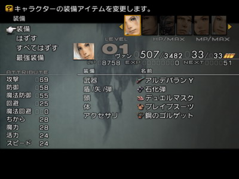

 完成了这个通常讨伐，所有的通常讨伐全都完成了，余下的4个紧急讨伐，我们先处理其中的2个……回王都的公会，接到3个紧急讨伐。 
#### 工会讨伐：緊急討伐No.1.- ミストに包まれた真実
 

 又是一个巨大体积的讨伐对象，委托人在王都的老爷爷家里面……补充药剂，传送到古代都市……把两个雪原的杂兵清掉……贝希摩斯王出现…… 讨伐对象キングベヒーモス有将近170万的HP，又是持久战，而且是全异常免疫，全属性减半，会伤害反弹，……攻击无视回避，会反复的物免或者是魔免…… __半血之后更是会开启强大的自动能力魔法CT=0，同时强制将所有伤害减至7成__ ，实力极强……会4属性高级魔法，究极里魔法，高级减速，冰属性攻击技ホワイトブレス，没有一个是菜的！之所以说这场战斗不用逆转也能行，就是因为 __贝希摩斯王几乎所有的攻击全都是属性攻击__ ，通过时刻注意屏幕左上角Boss出招，来及时变更装备，回复的压力并不是特别大……但是这样对玩家集中力的要求可就实在是太高了……一通打下来，能叫人心力憔悴的……所以，还是选择逆转战略吧  **（您要是集中力255就试试挑战无逆转，不是不可能）** …… 

 用了逆转就没什么了，如果要是有2个リボン就更好了！Gambit的设定和前2次逆转战术基本一样，就是因为Boss会伤害反弹，所以 __猎人和技工要设定适时自残__ ……至于物免时是否换出黑魔，随意吧……等2分钟就等2分钟好了……我记得以前在一个论坛上（具体哪个忘记了）有个玩家说自己是戒律王连发把贝希摩斯王搞死的……我在此佩服他，看那么多遍戒律王必杀您还真不审美疲劳…… 回到王都交了任务，记得去神都把隐藏奖励拿了！去神都ブルオミシェイス神殿へ続く道，仔细观察可以发现崖壁上有龙形状的化石，Vaan不装备武器的情况下，调查龙头位置「竜の鼻」，即可以得到「フェイスロッド」，另外还有金钱50万！！！ 
## Chapter 27——トロの剣：
 好了……回到王都工会，找公会长接到唯一一个X级讨伐！Boss三小强之一，究极神龙王！ 
#### 工会讨伐：緊急討伐No.1.- 最期の戰い、師よ安らかに眠れ
 

 神龙王ヤズマット的HP……5千万………这里从天幻的习惯，以后 __通称鸭血馒头__ ……无耻的各种技能……还有足够强的自动能力，而且还会使用驚異！全异常免疫，圣吸收，暗弱点，每40回合使用一次大招サイクロン以及必杀等等等等……关于它的技能之无耻，我这里就不赘言了！因为要用到无伤无逆转战术……所以它的技能如何并不重要…… 

 先说一下，如果想硬碰硬挑战鸭血馒头的玩家，逆转战术是要用到的……整个过程是漫长的，痛苦的……我利用逆转战术挑战鸭血馒头是分5次完成了（第一天下午销了它一半的HP，到晚上实在是打烦了……存档，接下来的3天是每天晚上500万……最后一天晚上一次性解决了它残余的1500万…… __共计消耗凤凰尾285个，中途过线调整战术和阵容无数次__ ）……因为已经说了3次逆转战术，如果想用的话应该都有经验了……这里就不在多说了。 如果要用到无逆转战术，肯定是要用到周围玄机四藏的石壁……这里不敢贪功，所用战术是7vmn7vmn所阐明的利用鸭血馒头的必杀无法释放的方法……原帖地址：http://bbs.ffsky.com/disp.aspx?ID=1679627&bid=45 然后针对弱模式不封印执照来补充几点： 1.吸引成功很重要， __最关键的是神龙王的位置，神龙王的位置必须足够贴墙壁__ ，否则稍微靠中间一点，必杀就能放出来！不是每次馒头转身都有那么好的位置，要多试几次！ 

 请注意馒头的位置，要足够贴墙壁！同时，刚开始输出时，馒头身上有物盾，所以会打七五折…… 2.这个位置调出狂战火枪手之后，有可能枪手不跑上去，这时候操控队长稍微往上顶一下火枪手……他就自己上去了， __顶的时候千万要小心__ ，万一被必杀了就…… 3.如果是猎人或机工  **（开启了行动缩短3阶）** ， __在狂战状态下可以开8-10枪不被锁定__   **（中间过程中两位后援给火枪手加狂战酒要算一枪的时间！记得减下去）** ， __开了第11枪必定会被馒头锁定，开小于等于7枪就收，馒头必定会给自己加有利状态__ ，之前的吸引就白费了！所以8-10枪，别搞错！ 4. __Vaan和Balthier的活力都是24__ ，在开启有利增益时间延长和行动缩短时间3阶的前提下， __一瓶狂战酒能支持其开32枪__ ，不多不少！ 5.菜单换人的顺序千万别错！ 6.如果是用机工濒死（饰品支援）+使用狂战酒的话，有个问题： __万一机工开完第10枪，恰好狂战消失，此时给他补狂战的后援又不是第一个能收进菜单的人__   **（即，机工收不进菜单来）** …… __这时候等你补完狂战，机工肯定就被锁定了__ …… __所以这种情况一定要极力避免__ ！举个具体例子，机工狂战开了7枪狂战消失，补狂战，再开2枪到极限，菜单调整人物，换出2名后援，馒头锁定对象变换，调出机工，开10枪，菜单调整人物，换出2名后援，馒头锁定对象变换，调出机工，开10枪，菜单调整人物，换出2名后援，馒头锁定对象变换，调出机工，开10枪，这时候开完第10枪机工的狂战正好消失，根据Gambit设定立即会有人使用狂战酒，而此时如果是馒头锁定的那位在给机工加狂战，那么机工就收不进菜单！然后步骤就全乱了！不过这个问题也挺好避免的，因为机工开8-10枪都可以，所以请预判狂战酒能支持的枪数，然后合理让机工开枪……这个问题就不是问题了……比如按照上例，中间2次让机工开9枪就能把补狂战的时机延迟到下一次调出机工…… 7.整个过程出现偏差最大的可能性就是给机工上狂战时恰好被锁定的问题，菜单换人集中力高点不会出错的， __熟练之后开启4倍速__ …… 8.中途出错就要重新吸引馒头让其放不出必杀，万一需要过线，那在此过程中馒头会自动回满血几乎是必然的，所以，最好别出错！ 9. __怕出错的玩家，就选择猎人吧__ ，直接调整HP至濒死，装备狂战饰品，永远是10枪一收，不会有问题的，就是输出只有狂战机工64%，战斗时间会延长…… 10. __一直处于必杀施放状态的馒头没有时间开启其他自动能力__ ，所以我方的输出不会降至7成，当然了，刚开始馒头身上的物盾没有消失之前是会打折扣的…… 

 物盾解除，输出正常化！ 

 因为馒头始终在使用必杀，没有开启任何自动能力，所以输出一直不会减少！ 试了3次，才算把馒头引到允许的位置……中间出了1次错，又重新引……成功，又犯错……最终算是熟练了……吸引成功后，开启了4倍速，战斗时间是46分钟， __消耗了狂战酒32瓶和1个凤凰尾__   **（复活后场刚开始被馒头杀死的那位）** ！输出是用的濒死机工，如果是用濒死猎人的话，犯错的可能性会小很多，时间会延长到1小时出头……全程无伤。 解决完神龙王之后……回公会领赏！看到 __トロの剣__ 在向我们招手了吧！ 所以下面去大水晶，把Boss三小强中的最后1个也解决掉！ 这次去大水晶，顺便把次强珍惜怪也给了结吧……正式地给珍惜讨伐划上一个句号！ 
#### 特殊战：次强珍惜怪クリスタルナイト
 水晶骑士作为次强珍惜怪，实力要比最强珍惜怪低了不少，HP是10万出头……如果没有戒律王的话，也请先填充好告密者的召唤技……クリスタルナイト的主攻手段的物理攻击+范围止步+高级暗魔法和圣属性攻击技，调整属性吸收不难， __未进入濒死攻击视回避__ ，请合理火力吸引， __在其濒死前使用戒律王或告密者直接闷毙__ ！ 

 好了！这个怪身上有次强魔装体，愿意偷的可以捎一件走…… 再次来到水晶之巅，存档！然后传送回去从之前打通的道路直奔オメガmk.XII 
#### 最终隐藏Boss战：オメガmk.XII
 オメガmk.XII的HP百万有余……自动能力五花八门！最强的三个防御自动能力都有  **（瀕死防御力UP，被ダメージ返し和被ダメージカット）** ，属性弱点会变化……攻击只有一种，是激光，但是通常攻撃CT0实在是让人咋舌！建议选择逆转战术！ 

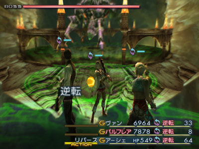

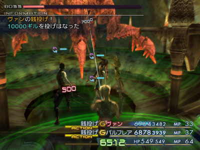

 3人装备没什么好说的，就是两位主攻手的饰品会在逆转指轮和リボン间变化…… 之所以装备逆转逆转指轮是因为这样解除狂战可以不消除其他的有利增益……用洋葱弹是为了自残时不会引起异常……Gambit设置如下: 

 当然了，装备リボン，然后用デスペル魔片解除狂战也可以，那样就把子弹换成石化弹就可以了！用了逆转战术嘛……所以稍微调整一下队伍就可以了！ __胜利后一定要把宝贝捡起来__ ！ 

 关于不使用逆转战术针对本Boss的探索……首先先说结果，失败了  **（读者：失败了还有脸说！）** ，撑到了オメガmk.XII濒死，オメガmk.XII启动濒死攻击力UP之后就玩完了……说说思路，还是用 __单人吸收，一人属性强攻补血的办法__ ……队员选择的是机工，猎人和时魔，猎人装备一起能提升HP至Max的装备+饰品，配上泡沫状态HP可达9400+，负责全体物盾，同时使用銭投げ为唯一输出  **（别人实在没这个功夫）** ，机工调整至濒死，饰品支援，装备黑暗子弹和勇气套装，配上最强铳每次输出为9555至12093  **（猎人身上有物盾）** ，负责猎人的回复…… __时魔全程手动__ ，适时负责猎人的火力吸引和泡沫，以及全体的加速  **（对于火铳补血，加速非常重要！而且幸好有利状态利用魔法可以直接延长）** ，还有就是用逆转指轮解除猎人的狂战状态  **（绝对不能用驱魔魔片，猎人身上的有利增益一刻都不能掉！）** ……就以这个步调一直坚持到オメガmk.XII濒死是一点问题都没有，不过 __到了オメガmk.XII濒死发威就麻烦了__ ，这台破铜烂铁濒死攻击一次猎人能打7000+， __很容易一次性把猎人打到濒死__ ，猎人一濒死，就有自动能力 __瀕死防御力UP__ ，机工的补血一下子就 __变成了原来一半__ ，就算配上猎人对濒死的自身使用X-Potion再加上机工的一次补血，也不一定能撑得住オメガmk.XII的下一次攻击……而 __这个战术就是一定不能死人，一死人步调全乱套__ ……所以试验了几次都失败了……格斗的HP在泡沫下照说又能比猎人多出1000，被オメガmk.XII濒死攻击一次未必进濒死，机工补上一击倒是能继续坚持，不过格斗在封印神器的情况下没有暗属性吸收 __（其余的子弹也不行）__ ，根本没办法补血，所以不利用オメガmk.XII的攻击盲区在弱模式下无逆转击破オメガmk.XII恐怕有些难度的说……也许 __不开启猎人的瀕死防御力UP执照就有戏__ 了…… 回到海岸，把珍惜讨伐完成…… 

 现在……回到东沙漠，请把钓鱼支线完成  **（其实这挺纠结了，我个人觉得一点儿也不比打败那两个Boss简单！）** …… 

 __终于，恶龙斗勇者之剑入手！！！！__  

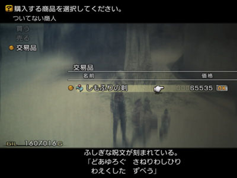

 现在就算选择骑士也可以去收伏戒律王了！以后不要再说没有戒律王了哦^z^！！ 
## Chapter 28——灯台冥渊：
 最后就剩2个S级紧急讨伐了！这时候トロの剣入手，时魔的装备算是配齐了……以下两个紧急讨伐算是为我们 __进百层之前做逆转战术的最终练兵__ 吧！ 
#### 工会讨伐：緊急討伐No.1.- 眠れぬ美女に安らかな夜を
 

 我个人建议，接到讨伐之后，请反复进入暗影の層，直到刷出イクシオン……要不探索着地下层时还要提防着イクシオン…… 

 イクシオン有30万的HP，多样的属性攻击，异常状态吃：迟缓，沉默，急速损血和油污，圣弱点，暗吸收……建议使用逆转万能药后配上龙炎子弹好了……适时自残……使用逆转战略此战没有任何难度！需要说明一点的是，イクシオン半血以下会解除自身异常，那时就换上沉默子弹解决吧！ 在流程中，灯台地下层只有一个リボン和第二颗风神子弹值得我们去刷，当然没有第二颗黑暗子弹的玩家也请在此取得！所以没用的地方就不要去了，怪危险的…… 暗影の層 北外郭：在大部屋进行Boss战…… 
#### 工会讨伐：フェニックス（闇神一味之一）
 Boss吃黑暗……弱点不定……两位火枪手全力无属性输出即可……没比灯台上中下的那3个废材强多少…… 

 后两层探索的时候，如果一进屋就发现一下次出现了4-5个杂兵，请不要犹豫，直接使用戒律王的召唤技了解他们……因为此地杂兵极强！有的杂兵的高段魔法一次能有1500+的伤害，多个一起上肯定是没治！请刷出リボン，并且至此所有属性子弹都应该有两颗了！ 所有台座安置为完毕后，回灯台存档…… 
#### 工会讨伐：緊急討伐No.1.- 神か悪魔か
 

 闇神的HP减到80%时会开始召唤式神，请及时解决（上文都说过了）……因为是逆转战略的采用配上リボン的加护……战斗压力不大……闇神瀕死防御力UP，请选择銭投げ解决战斗！ 

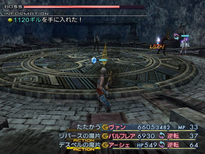
 Gambit的设置和讨伐オメガmk.XII时一样，就是多了几个优先有属性弱点敌人的攻击Gambit和优先飞行系敌人攻击的Gambit（清理式神）。以下为装备和战前状态： 

  **PS：** 有兴趣的玩家可以试试不用逆转来完成这个讨伐……非常有刺激感，同时也的确不简单…… 回到王都，交差领赏…… 

## 尾声：

 到此，本篇中值得一提的Boss算是都说完了，余下的就是做些准备工作进百层，或者是说在收集收集提高完成度！反正都不再是什么难事啦！尽可以装备上神盾+リボン……整个伊瓦利斯世界都没有什么东西能耐你何！本攻略就算到此结束啦！ __最终Boss？？总要留点不写的东西嘛！__  最后，就是希望以各个方式，奋战在FF12各个战线的玩家，玩得愉快，生活得舒心！ 

## 鸣谢：
 
洋洋洒洒也算写了7万字……前后30天每天晚上完成一点……在此感谢7vmn7vmn大湿对天幻游民们的支持！毕竟先驱者是最值得敬佩的！也感谢jhq319一直对我的支持！最后感谢主席长期勤恳地耕耘FF12的专题，以及所有在剧情，装备，战术上对我有启发的玩家们！！
