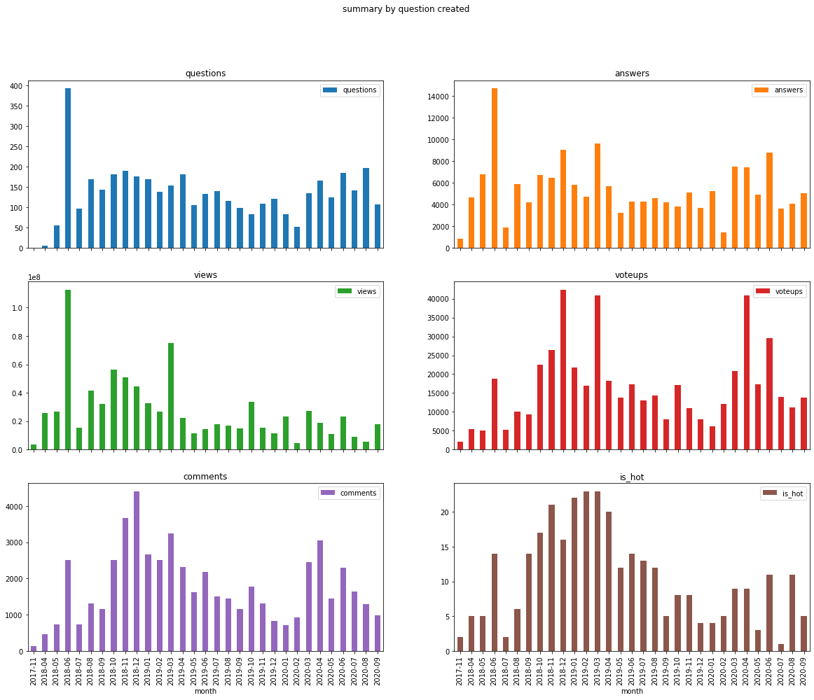
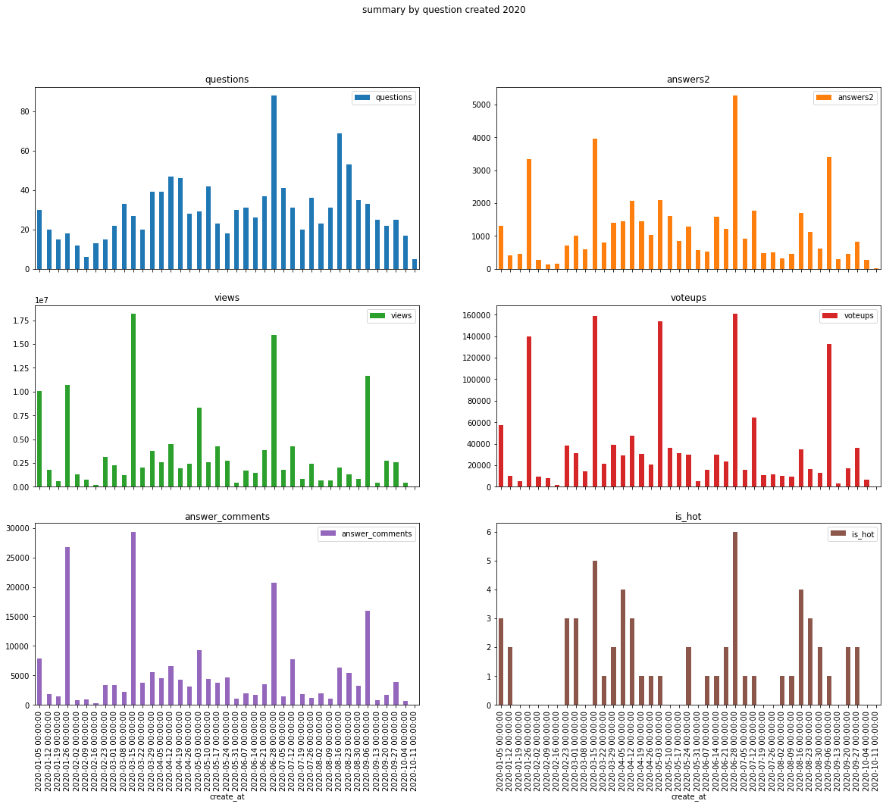
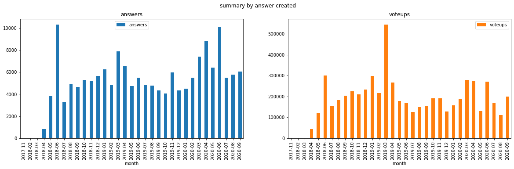
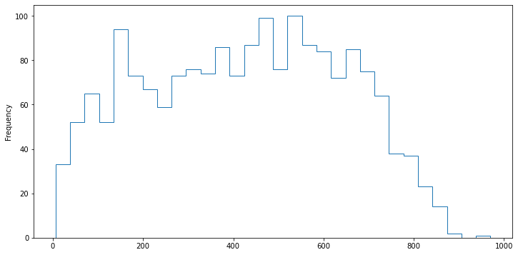
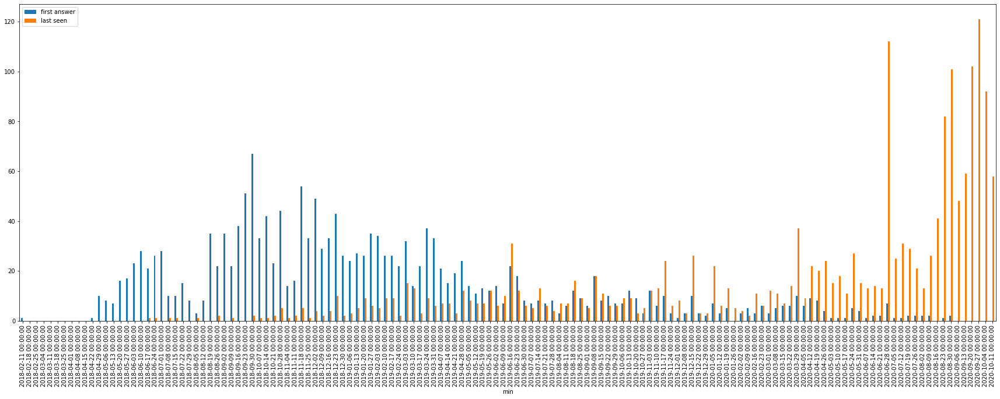
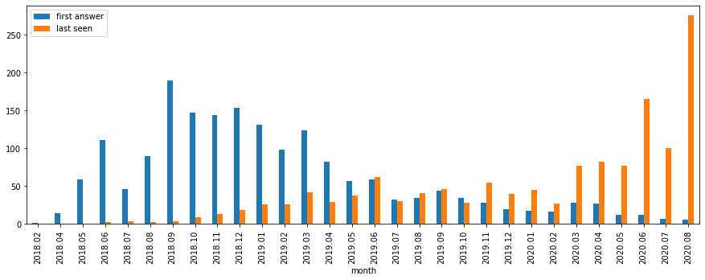
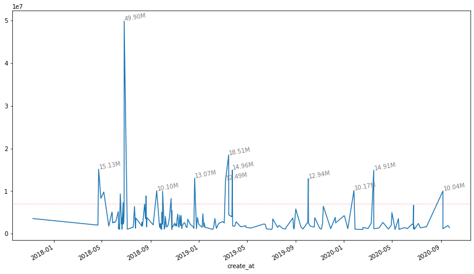

```python
# import matplotlib
import matplotlib.pyplot as plt

# import numpy as np
import pandas as pd

pd.set_option("max_colwidth", 100)
# pd.options.plotting.backend = "matplotlib"
```

## 读取数据

- 数据来源限定是杨超越话题下所有问题和提问，没有文章和专栏的数据，未带话题的也不在范围内。
- 数据抓取的时间是10月7日前后,10月份数据略去
- 数据已经经过清洗，后续尽量不使用和构造中间变量，所有结果以附加列和查询语句呈现。

```python
# savepath=""
savepath = "/home/sopp/docker/csv/db/"
dbname = "ycy"
name = '杨超越'
```

```python
from sqlalchemy import create_engine

# 前三个斜杠是固定格式，第四个开始才是路径
engine = create_engine("sqlite:///" + savepath + dbname + ".db", echo=False)
```

```python
query = """
select question_id,title,answers,comments,followers,create_at,create_by,views,tags,GMT_create from questions
"""
questions = pd.read_sql_query(query, con=engine)
questions.create_at = pd.to_datetime(questions.create_at)
```

questions = questions[questions.create_at < '2020-10']


```python
answers = pd.read_sql("answers", con=engine)
answers.create_at = pd.to_datetime(answers.create_at)
```

answers = answers[answers.create_at < '2020-10']


```python
modify = pd.read_sql("modify", con=engine)
modify.modify_at = pd.to_datetime(modify.modify_at)
```

modify = modify[modify.modify_at < '2020-10']


```python
people = pd.read_sql("people", con=engine)
```

people["url"] = "https://www.zhihu.com/people/" + people.user_id.astype(str)

answers["url"] = ("https://www.zhihu.com/question/" +
                  answers.question_id.astype(str) + "/answer/" +
                  answers.answer_id.astype(str))

## summary

按月汇总的六项数据趋势图，可以看个直观印象。


```python
%%time
{
    "问题数": questions.question_id.count(),
    "无回答": questions[
        questions.question_id.isin(answers.question_id) == False
    ].question_id.count(),
    "总赞低于10的问题": answers.groupby("question_id")
    .voteups.sum()[lambda x: x < 10]
    .count(),
    "浏览大于100w": questions[questions.views > 1000000].question_id.count(),
    "最高浏览数": questions.views.max(),
    "问题最多获赞": answers.groupby("question_id").voteups.sum().max(),
    "回答数": answers.answer_id.count(),
    "匿名回答": answers[answers.create_by == "0"].answer_id.count(),
    "匿名总获赞": answers[answers.create_by == "0"].voteups.sum(),
    "获赞小于5的回答": answers[answers.voteups < 5].answer_id.count(),
    "回答最多获赞": answers.voteups.max(),
    "千赞回答": answers[answers.voteups > 1000].answer_id.count(),
    "第一个千赞回答": str(answers[answers.voteups > 1000].create_at.min())[:10],
    "最后一个千赞回答": str(answers[answers.voteups > 1000].create_at.max())[:10],
    "累计获赞": answers.voteups.sum(),
    "浏览数": questions.views.sum(),
    "回答的评论数": answers.comments.sum(),
    "热榜锁定次数": modify[
        (modify.modify_by == "zhihuadmin") & (modify.reason.str.contains("热榜"))
    ].modify_id.count(),
    "编辑战": modify.groupby("question_id")
    .modify_id.count()[lambda x: x > 50]
    .count(),
}
```

    CPU times: user 204 ms, sys: 7.4 ms, total: 211 ms
    Wall time: 247 ms


    {'问题数': 4180,
     '无回答': 601,
     '总赞低于10的问题': 1364,
     '浏览大于100w': 187,
     '最高浏览数': 49900427,
     '问题最多获赞': 159037,
     '回答数': 168646,
     '匿名回答': 38586,
     '匿名总获赞': 623711,
     '获赞小于5的回答': 104965,
     '回答最多获赞': 53194,
     '千赞回答': 787,
     '第一个千赞回答': '2018-04-23',
     '最后一个千赞回答': '2020-09-28',
     '累计获赞': 6080649,
     '浏览数': 842038630,
     '回答的评论数': 971585,
     '热榜锁定次数': 324,
     '编辑战': 19}


### 按月统计的问题数据走势图

注意热榜数会偏低


```python
%%time
# 差别在于是否去除了提问者的编辑
query = """
select month,count(question_id) as questions, sum(answers2) as answers,
sum(views) as views,sum(voteups) as voteups,sum(comments) as comments,sum(is_hot) as is_hot
from 
    (
    select t1.question_id,answers2,views,voteups,t3.comments,count(modify_id) as is_hot,strftime("%Y-%m", t1.create_at) as 'month'
    from
        (select question_id,create_at,views from questions where create_at <'2020-10') as t1
    left join
        (select question_id,count(answer_id) as answers2,voteups,comments from answers group by question_id) as t3
        on t3.question_id =t1.question_id
    left join 
        (select question_id,modify_id,modify_at from modify where modify_by is "zhihuadmin" and reason like "%热榜%") as t2
        on t1.question_id = t2.question_id
    group by t1.question_id
    ) 
group by month
;

"""
pd.read_sql_query(query, con=engine).set_index("month").plot(
    kind="bar",
    subplots=True,
    layout=(3, 2),
    figsize=(20, 15),
    title="summary by question created",
)
```

    CPU times: user 1.99 s, sys: 96.9 ms, total: 2.09 s
    Wall time: 2.45 s


    array([[<AxesSubplot:title={'center':'questions'}, xlabel='month'>,
            <AxesSubplot:title={'center':'answers'}, xlabel='month'>],
           [<AxesSubplot:title={'center':'views'}, xlabel='month'>,
            <AxesSubplot:title={'center':'voteups'}, xlabel='month'>],
           [<AxesSubplot:title={'center':'comments'}, xlabel='month'>,
            <AxesSubplot:title={'center':'is_hot'}, xlabel='month'>]],
          dtype=object)


    

    


### 按周统计的2020年走势图


```python
%%time
pd.concat(
    [
        questions.set_index("question_id"),
        modify[
            (modify.modify_by == "zhihuadmin")
            & (modify.reason.str.contains("热榜"))
        ]
        .groupby("question_id")
        .modify_id.count()
        .rename("is_hot"),
        questions.groupby("question_id")
        .question_id.count()
        .rename("questions"),
        answers.groupby("question_id").answer_id.count().rename("answers2"),
        answers.groupby("question_id").voteups.sum().rename("voteups"),
        answers.groupby("question_id")
        .comments.sum()
        .rename("answer_comments"),
    ],
    axis=1,
).reset_index()[
    [
        "questions",
        "answers2",
        "views",
        "voteups",
        "answer_comments",
        "create_at",
        "is_hot",
    ]
].groupby(
    pd.Grouper(key="create_at", freq="w")
).sum()[
    "2020"
].plot(
    kind="bar",
    subplots=True,
    layout=(3, 2),
    figsize=(20, 15),
    title="summary by question created 2020",
)
```

    CPU times: user 2.35 s, sys: 7.23 ms, total: 2.36 s
    Wall time: 2.64 s


    array([[<AxesSubplot:title={'center':'questions'}, xlabel='create_at'>,
            <AxesSubplot:title={'center':'answers2'}, xlabel='create_at'>],
           [<AxesSubplot:title={'center':'views'}, xlabel='create_at'>,
            <AxesSubplot:title={'center':'voteups'}, xlabel='create_at'>],
           [<AxesSubplot:title={'center':'answer_comments'}, xlabel='create_at'>,
            <AxesSubplot:title={'center':'is_hot'}, xlabel='create_at'>]],
          dtype=object)


    

    


### 以回答创建时间为索引的统计


```python
%%time
# 差别在于是否去除了提问者的编辑
query = """
select strftime("%Y-%m", create_at) as month,count(answer_id) as answers,sum(voteups) as voteups
from
(select create_at,answer_id,voteups from answers where create_at <'2020-10')
group by month
"""
pd.read_sql_query(query, con=engine).set_index("month").plot(
    kind="bar",
    subplots=True,
    layout=(1, 2),
    figsize=(20, 5),
    title="summary by answer created",
)
```

    CPU times: user 895 ms, sys: 83.6 ms, total: 979 ms
    Wall time: 1.12 s


    array([[<AxesSubplot:title={'center':'answers'}, xlabel='month'>,
            <AxesSubplot:title={'center':'voteups'}, xlabel='month'>]],
          dtype=object)


    

    


## 人物

以人物为主键的一些汇总数据，尽量不使用具体的用户名。

### 编辑次数

知乎问题日志页的api相当古老，没有用户id，清洗过程中用url_token匹配提问者回答者查询id填写，没匹配到（这个人没有提问回答过或者开了隐私选项的）用hash值生成一个id。会有一些重复


```python
%%time
# 移除提问者创建问题时的编辑
a = modify[
    modify.modify_at.isin(
        modify[modify.action.str.contains("添加了问题")].modify_at
    )
]
```

    CPU times: user 51.6 ms, sys: 0 ns, total: 51.6 ms
    Wall time: 68.6 ms


```python
%%time
pd.concat(
    [
        people.set_index("user_id"),
        modify.drop(index=a.index)
        .groupby("modify_by")
        .modify_at.count()
        .rename("modifies"),
        modify.drop(index=a.index)
        .groupby(["modify_by", pd.Grouper(key="modify_at", freq="y")])
        .modify_id.count()
        .rename("modifies")
        .reset_index()
        .pivot(index="modify_by", columns="modify_at"),
    ],
    axis=1,
).sort_values(
    by="modifies",
    #    by=("modifies", pd.Timestamp("2018-12-31")),
    ascending=False,
).iloc[
    :, 7:
].head(
    10
)
```

    CPU times: user 310 ms, sys: 14.3 ms, total: 324 ms
    Wall time: 380 ms


<div>
<style scoped>
    .dataframe tbody tr th:only-of-type {
        vertical-align: middle;
    }

    .dataframe tbody tr th {
        vertical-align: top;
    }

    .dataframe thead th {
        text-align: right;
    }
</style>
<table border="1" class="dataframe">
  <thead>
    <tr style="text-align: right;">
      <th></th>
      <th>modifies</th>
      <th>(modifies, 2017-12-31 00:00:00)</th>
      <th>(modifies, 2018-12-31 00:00:00)</th>
      <th>(modifies, 2019-12-31 00:00:00)</th>
      <th>(modifies, 2020-12-31 00:00:00)</th>
    </tr>
  </thead>
  <tbody>
    <tr>
      <th>0</th>
      <td>1744.0</td>
      <td>NaN</td>
      <td>542.0</td>
      <td>820.0</td>
      <td>382.0</td>
    </tr>
    <tr>
      <th>ab387c207374d294c94b04078d3e45ff</th>
      <td>1280.0</td>
      <td>NaN</td>
      <td>NaN</td>
      <td>6.0</td>
      <td>1274.0</td>
    </tr>
    <tr>
      <th>zhihuadmin</th>
      <td>960.0</td>
      <td>NaN</td>
      <td>202.0</td>
      <td>472.0</td>
      <td>286.0</td>
    </tr>
    <tr>
      <th>ade6549bded0d0634715abb5407c5f15</th>
      <td>748.0</td>
      <td>NaN</td>
      <td>19.0</td>
      <td>723.0</td>
      <td>6.0</td>
    </tr>
    <tr>
      <th>7066cd4e69a47d677f9dc49c06abc8fd</th>
      <td>525.0</td>
      <td>NaN</td>
      <td>316.0</td>
      <td>189.0</td>
      <td>20.0</td>
    </tr>
    <tr>
      <th>74ebc100988d638ed8017ebc164b3dad</th>
      <td>513.0</td>
      <td>NaN</td>
      <td>421.0</td>
      <td>92.0</td>
      <td>NaN</td>
    </tr>
    <tr>
      <th>ec80c92729eb9fbf160b296c08afb508</th>
      <td>371.0</td>
      <td>NaN</td>
      <td>31.0</td>
      <td>211.0</td>
      <td>129.0</td>
    </tr>
    <tr>
      <th>bd36c89f774312dfa7b6e7b49e073d2e</th>
      <td>330.0</td>
      <td>1.0</td>
      <td>53.0</td>
      <td>260.0</td>
      <td>16.0</td>
    </tr>
    <tr>
      <th>59d0ba88b217bb558486cb3fe52d5657</th>
      <td>274.0</td>
      <td>NaN</td>
      <td>NaN</td>
      <td>235.0</td>
      <td>39.0</td>
    </tr>
    <tr>
      <th>8299b98000e901c2aa577107c553e1e7</th>
      <td>252.0</td>
      <td>NaN</td>
      <td>41.0</td>
      <td>206.0</td>
      <td>5.0</td>
    </tr>
  </tbody>
</table>
</div>


#### 编辑次数(sql)


```python
%%time
# 差别在于是否去除了提问者的编辑
query = """
with temp as 
(
select * from modify 
where modify_at <'2020-10' 
and 
modify_at not in (select modify_at from modify where action like "%添加了问题%" )
)
select modify_by as user,count(modify_id) as counts,
strftime("%Y", modify_at) as 'year' from temp group by modify_by,year
union all
select modify_by as user,count(modify_id) as counts,
'all time' as 'year' from temp group by modify_by
;
"""
pd.read_sql_query(query, con=engine).pivot(
    index="user", columns="year"
).sort_values(by=("counts", "2020"), ascending=False).head(10)
```

    CPU times: user 268 ms, sys: 107 ms, total: 375 ms
    Wall time: 462 ms


<div>
<style scoped>
    .dataframe tbody tr th:only-of-type {
        vertical-align: middle;
    }

    .dataframe tbody tr th {
        vertical-align: top;
    }

    .dataframe thead tr th {
        text-align: left;
    }

    .dataframe thead tr:last-of-type th {
        text-align: right;
    }
</style>
<table border="1" class="dataframe">
  <thead>
    <tr>
      <th></th>
      <th colspan="5" halign="left">counts</th>
    </tr>
    <tr>
      <th>year</th>
      <th>2017</th>
      <th>2018</th>
      <th>2019</th>
      <th>2020</th>
      <th>all time</th>
    </tr>
    <tr>
      <th>user</th>
      <th></th>
      <th></th>
      <th></th>
      <th></th>
      <th></th>
    </tr>
  </thead>
  <tbody>
    <tr>
      <th>ab387c207374d294c94b04078d3e45ff</th>
      <td>NaN</td>
      <td>NaN</td>
      <td>6.0</td>
      <td>1247.0</td>
      <td>1253.0</td>
    </tr>
    <tr>
      <th>0</th>
      <td>NaN</td>
      <td>542.0</td>
      <td>820.0</td>
      <td>382.0</td>
      <td>1744.0</td>
    </tr>
    <tr>
      <th>zhihuadmin</th>
      <td>NaN</td>
      <td>202.0</td>
      <td>472.0</td>
      <td>278.0</td>
      <td>952.0</td>
    </tr>
    <tr>
      <th>864842024a645ccf178e6603b6ae6546</th>
      <td>NaN</td>
      <td>NaN</td>
      <td>2.0</td>
      <td>144.0</td>
      <td>146.0</td>
    </tr>
    <tr>
      <th>78ef60e388b6f671a122832feb0c059b</th>
      <td>NaN</td>
      <td>NaN</td>
      <td>20.0</td>
      <td>139.0</td>
      <td>159.0</td>
    </tr>
    <tr>
      <th>ec80c92729eb9fbf160b296c08afb508</th>
      <td>NaN</td>
      <td>31.0</td>
      <td>211.0</td>
      <td>129.0</td>
      <td>371.0</td>
    </tr>
    <tr>
      <th>aaf42c0bbe33855d7cfe542b3da31101</th>
      <td>NaN</td>
      <td>NaN</td>
      <td>34.0</td>
      <td>108.0</td>
      <td>142.0</td>
    </tr>
    <tr>
      <th>1998d9e07e81beaf375b8d5eee132e57</th>
      <td>NaN</td>
      <td>NaN</td>
      <td>NaN</td>
      <td>90.0</td>
      <td>90.0</td>
    </tr>
    <tr>
      <th>1857924137053613630</th>
      <td>NaN</td>
      <td>10.0</td>
      <td>13.0</td>
      <td>76.0</td>
      <td>99.0</td>
    </tr>
    <tr>
      <th>fc5a9fb941c5a8de26e08ad134474b5f</th>
      <td>NaN</td>
      <td>NaN</td>
      <td>NaN</td>
      <td>48.0</td>
      <td>48.0</td>
    </tr>
  </tbody>
</table>
</div>


- 两个特殊的用户id正好都在，zhihuadmin是日志页的知乎管理员，0是匿名用户，后面所有查询结果里几乎都有它的身影。
- 7066c这位用户同时也是除匿名用户外提问最多的，不过她应该是腾讯综艺相关的账号，个人特质比较淡化。

### 提问次数


```python
%%time
pd.concat(
    [
        people.set_index("user_id"),
        #    answers.groupby("create_by").voteup_count.count().rename("answer_count"),
        questions.groupby("create_by").question_id.count().rename("questions"),
        questions.groupby(["create_by", pd.Grouper(key="create_at", freq="y")])
        .question_id.count()
        .rename("questions")
        .reset_index()
        .pivot(index="create_by", columns="create_at"),
    ],
    axis=1,
).sort_values(
    by="questions",
    # by=("questions", pd.Timestamp("2020-12-31")),
    ascending=False,
).iloc[
    :, 7:
].head(
    10
)
```

    CPU times: user 218 ms, sys: 3.72 ms, total: 222 ms
    Wall time: 264 ms


<div>
<style scoped>
    .dataframe tbody tr th:only-of-type {
        vertical-align: middle;
    }

    .dataframe tbody tr th {
        vertical-align: top;
    }

    .dataframe thead th {
        text-align: right;
    }
</style>
<table border="1" class="dataframe">
  <thead>
    <tr style="text-align: right;">
      <th></th>
      <th>questions</th>
      <th>(questions, 2017-12-31 00:00:00)</th>
      <th>(questions, 2018-12-31 00:00:00)</th>
      <th>(questions, 2019-12-31 00:00:00)</th>
      <th>(questions, 2020-12-31 00:00:00)</th>
    </tr>
  </thead>
  <tbody>
    <tr>
      <th>0</th>
      <td>1237.0</td>
      <td>NaN</td>
      <td>384.0</td>
      <td>486.0</td>
      <td>367.0</td>
    </tr>
    <tr>
      <th>7066cd4e69a47d677f9dc49c06abc8fd</th>
      <td>173.0</td>
      <td>NaN</td>
      <td>126.0</td>
      <td>39.0</td>
      <td>8.0</td>
    </tr>
    <tr>
      <th>dcd5a53ece0b19b4d8ea9986fc7aa9e0</th>
      <td>18.0</td>
      <td>NaN</td>
      <td>NaN</td>
      <td>NaN</td>
      <td>18.0</td>
    </tr>
    <tr>
      <th>f274e1341e781403a934ed118c3f8139</th>
      <td>18.0</td>
      <td>NaN</td>
      <td>18.0</td>
      <td>NaN</td>
      <td>NaN</td>
    </tr>
    <tr>
      <th>1f605d506a30d4a170ba1ea2d3ef9237</th>
      <td>16.0</td>
      <td>NaN</td>
      <td>NaN</td>
      <td>11.0</td>
      <td>5.0</td>
    </tr>
    <tr>
      <th>9bde85cac961a0d20abe3180f708a43a</th>
      <td>15.0</td>
      <td>NaN</td>
      <td>15.0</td>
      <td>NaN</td>
      <td>NaN</td>
    </tr>
    <tr>
      <th>9df062f3d18b3997be2608b119da22c8</th>
      <td>15.0</td>
      <td>NaN</td>
      <td>5.0</td>
      <td>8.0</td>
      <td>2.0</td>
    </tr>
    <tr>
      <th>04566a874eafd242929d11fee0572c98</th>
      <td>14.0</td>
      <td>NaN</td>
      <td>NaN</td>
      <td>9.0</td>
      <td>5.0</td>
    </tr>
    <tr>
      <th>b7d7da2bae4392decc99230fa3f1cf3f</th>
      <td>14.0</td>
      <td>NaN</td>
      <td>1.0</td>
      <td>8.0</td>
      <td>5.0</td>
    </tr>
    <tr>
      <th>0f9ab983f0da7448fda1e736ed6c3b44</th>
      <td>12.0</td>
      <td>NaN</td>
      <td>7.0</td>
      <td>5.0</td>
      <td>NaN</td>
    </tr>
  </tbody>
</table>
</div>


#### 提问次数(sql)


```python
%%time
query = """
select create_by as user,count(question_id) as counts,
strftime("%Y", create_at) as 'year' from questions group by create_by,year
union all
select create_by as user,count(question_id) as counts,
'all time' as 'year' from questions group by create_by

"""
pd.read_sql_query(query, con=engine).pivot(
    index="user", columns="year"
).sort_values(by=("counts", "2020"), ascending=False).head(10)
```

    CPU times: user 66.3 ms, sys: 8.52 ms, total: 74.8 ms
    Wall time: 107 ms


<div>
<style scoped>
    .dataframe tbody tr th:only-of-type {
        vertical-align: middle;
    }

    .dataframe tbody tr th {
        vertical-align: top;
    }

    .dataframe thead tr th {
        text-align: left;
    }

    .dataframe thead tr:last-of-type th {
        text-align: right;
    }
</style>
<table border="1" class="dataframe">
  <thead>
    <tr>
      <th></th>
      <th colspan="5" halign="left">counts</th>
    </tr>
    <tr>
      <th>year</th>
      <th>2017</th>
      <th>2018</th>
      <th>2019</th>
      <th>2020</th>
      <th>all time</th>
    </tr>
    <tr>
      <th>user</th>
      <th></th>
      <th></th>
      <th></th>
      <th></th>
      <th></th>
    </tr>
  </thead>
  <tbody>
    <tr>
      <th>0</th>
      <td>NaN</td>
      <td>384.0</td>
      <td>486.0</td>
      <td>367.0</td>
      <td>1237.0</td>
    </tr>
    <tr>
      <th>dcd5a53ece0b19b4d8ea9986fc7aa9e0</th>
      <td>NaN</td>
      <td>NaN</td>
      <td>NaN</td>
      <td>18.0</td>
      <td>18.0</td>
    </tr>
    <tr>
      <th>7bc6ca1585a8219ffa0748518b15bd84</th>
      <td>NaN</td>
      <td>NaN</td>
      <td>NaN</td>
      <td>9.0</td>
      <td>9.0</td>
    </tr>
    <tr>
      <th>1e453bfc0d87ea31b51e82da3393af8c</th>
      <td>NaN</td>
      <td>NaN</td>
      <td>NaN</td>
      <td>8.0</td>
      <td>8.0</td>
    </tr>
    <tr>
      <th>7066cd4e69a47d677f9dc49c06abc8fd</th>
      <td>NaN</td>
      <td>126.0</td>
      <td>39.0</td>
      <td>8.0</td>
      <td>173.0</td>
    </tr>
    <tr>
      <th>527bb37be7b5cc61a2ccb4328a310946</th>
      <td>NaN</td>
      <td>NaN</td>
      <td>NaN</td>
      <td>6.0</td>
      <td>6.0</td>
    </tr>
    <tr>
      <th>647c37a21d60c0988a5924dde63cde8a</th>
      <td>NaN</td>
      <td>NaN</td>
      <td>NaN</td>
      <td>6.0</td>
      <td>6.0</td>
    </tr>
    <tr>
      <th>b7d7da2bae4392decc99230fa3f1cf3f</th>
      <td>NaN</td>
      <td>1.0</td>
      <td>8.0</td>
      <td>5.0</td>
      <td>14.0</td>
    </tr>
    <tr>
      <th>04566a874eafd242929d11fee0572c98</th>
      <td>NaN</td>
      <td>NaN</td>
      <td>9.0</td>
      <td>5.0</td>
      <td>14.0</td>
    </tr>
    <tr>
      <th>43aec77c5ad1626f6c77d9d99d997b61</th>
      <td>NaN</td>
      <td>NaN</td>
      <td>1.0</td>
      <td>5.0</td>
      <td>6.0</td>
    </tr>
  </tbody>
</table>
</div>


- 7066c后期的一些综艺相关提问比如心动信号没有带话题，因此提问数量有所下降。
- dcd5a这位用户目前已注销，之前使用的id是星星的你。

### 回答数


```python
%%time
pd.concat(
    [
        people.set_index("user_id"),
        #    answers.groupby("create_by").voteup_count.count().rename("answer_count"),
        answers.groupby("create_by").answer_id.count().rename("answers"),
        answers.groupby(["create_by", pd.Grouper(key="create_at", freq="y")])
        .answer_id.count()
        .rename("answers")
        .reset_index()
        .pivot(index="create_by", columns="create_at"),
    ],
    axis=1,
).sort_values(
    #  by="answer",
    by=("answers", pd.Timestamp("2020-12-31")),
    ascending=False,
).iloc[
    :, 7:
].head(
    10
)
```

    CPU times: user 2.15 s, sys: 40.6 ms, total: 2.19 s
    Wall time: 2.44 s


<div>
<style scoped>
    .dataframe tbody tr th:only-of-type {
        vertical-align: middle;
    }

    .dataframe tbody tr th {
        vertical-align: top;
    }

    .dataframe thead th {
        text-align: right;
    }
</style>
<table border="1" class="dataframe">
  <thead>
    <tr style="text-align: right;">
      <th></th>
      <th>answers</th>
      <th>(answers, 2017-12-31 00:00:00)</th>
      <th>(answers, 2018-12-31 00:00:00)</th>
      <th>(answers, 2019-12-31 00:00:00)</th>
      <th>(answers, 2020-12-31 00:00:00)</th>
    </tr>
  </thead>
  <tbody>
    <tr>
      <th>0</th>
      <td>38586.0</td>
      <td>NaN</td>
      <td>12975.0</td>
      <td>13008.0</td>
      <td>12603.0</td>
    </tr>
    <tr>
      <th>5a90ce9ac1466421474769ccdb54ed37</th>
      <td>171.0</td>
      <td>NaN</td>
      <td>NaN</td>
      <td>50.0</td>
      <td>121.0</td>
    </tr>
    <tr>
      <th>9719c9495f5351ceabea5a5c68076162</th>
      <td>261.0</td>
      <td>NaN</td>
      <td>NaN</td>
      <td>152.0</td>
      <td>109.0</td>
    </tr>
    <tr>
      <th>c9bc4f5f86fb6e4a7df4f6afef0329fa</th>
      <td>303.0</td>
      <td>NaN</td>
      <td>NaN</td>
      <td>202.0</td>
      <td>101.0</td>
    </tr>
    <tr>
      <th>8ce139566f3758f567c92feecaa08c61</th>
      <td>196.0</td>
      <td>NaN</td>
      <td>21.0</td>
      <td>79.0</td>
      <td>96.0</td>
    </tr>
    <tr>
      <th>0849e422a09b62d44a629fb9b119d055</th>
      <td>101.0</td>
      <td>NaN</td>
      <td>NaN</td>
      <td>16.0</td>
      <td>85.0</td>
    </tr>
    <tr>
      <th>be6f3813e0f91d2eb976f621c2ba3790</th>
      <td>91.0</td>
      <td>NaN</td>
      <td>9.0</td>
      <td>9.0</td>
      <td>73.0</td>
    </tr>
    <tr>
      <th>86e3534f1a227d6bdc94a55d4ff21335</th>
      <td>71.0</td>
      <td>NaN</td>
      <td>NaN</td>
      <td>NaN</td>
      <td>71.0</td>
    </tr>
    <tr>
      <th>46c5a6ec4168f99b595f62da3b080b75</th>
      <td>156.0</td>
      <td>NaN</td>
      <td>NaN</td>
      <td>88.0</td>
      <td>68.0</td>
    </tr>
    <tr>
      <th>9f2563cf848c300541929b5c18771349</th>
      <td>66.0</td>
      <td>NaN</td>
      <td>NaN</td>
      <td>NaN</td>
      <td>66.0</td>
    </tr>
  </tbody>
</table>
</div>


#### todo:回答数(sql)

- 20年前10名回答数只有两个人在18年有回答
- 其实18年回答数前列在20年活跃也比较少，因此后面做了个话题活跃参与者活动区间的查询。

### 分区间获赞数


```python
%%time
pd.concat(
    [
        people.set_index("user_id"),
        answers.groupby("create_by").voteups.sum(),
        answers.groupby(["create_by", pd.Grouper(key="create_at", freq="y")])
        .voteups.sum()
        .reset_index()
        .pivot(index="create_by", columns="create_at"),
    ],
    axis=1,
).sort_values(
    by="voteups",
    #    by=("voteups", pd.Timestamp("2017-12-31")),
    ascending=False,
).iloc[
    :, 7:
].head(
    10
)
```

    CPU times: user 2.2 s, sys: 38.7 ms, total: 2.24 s
    Wall time: 2.46 s


<div>
<style scoped>
    .dataframe tbody tr th:only-of-type {
        vertical-align: middle;
    }

    .dataframe tbody tr th {
        vertical-align: top;
    }

    .dataframe thead th {
        text-align: right;
    }
</style>
<table border="1" class="dataframe">
  <thead>
    <tr style="text-align: right;">
      <th></th>
      <th>voteups</th>
      <th>(voteups, 2017-12-31 00:00:00)</th>
      <th>(voteups, 2018-12-31 00:00:00)</th>
      <th>(voteups, 2019-12-31 00:00:00)</th>
      <th>(voteups, 2020-12-31 00:00:00)</th>
    </tr>
  </thead>
  <tbody>
    <tr>
      <th>0</th>
      <td>623711.0</td>
      <td>NaN</td>
      <td>277848.0</td>
      <td>258826.0</td>
      <td>87037.0</td>
    </tr>
    <tr>
      <th>ade6549bded0d0634715abb5407c5f15</th>
      <td>101078.0</td>
      <td>NaN</td>
      <td>22414.0</td>
      <td>77989.0</td>
      <td>675.0</td>
    </tr>
    <tr>
      <th>aaf42c0bbe33855d7cfe542b3da31101</th>
      <td>65147.0</td>
      <td>NaN</td>
      <td>NaN</td>
      <td>21638.0</td>
      <td>43509.0</td>
    </tr>
    <tr>
      <th>ab387c207374d294c94b04078d3e45ff</th>
      <td>55801.0</td>
      <td>NaN</td>
      <td>NaN</td>
      <td>1078.0</td>
      <td>54723.0</td>
    </tr>
    <tr>
      <th>10e968844284a51a411abf84458f6a28</th>
      <td>53208.0</td>
      <td>NaN</td>
      <td>14.0</td>
      <td>53194.0</td>
      <td>NaN</td>
    </tr>
    <tr>
      <th>266c56db63b21698b8c1546af22984cb</th>
      <td>52029.0</td>
      <td>NaN</td>
      <td>NaN</td>
      <td>NaN</td>
      <td>52029.0</td>
    </tr>
    <tr>
      <th>abc4af939f9f1ed31f460f8b52db64b5</th>
      <td>51861.0</td>
      <td>NaN</td>
      <td>NaN</td>
      <td>NaN</td>
      <td>51861.0</td>
    </tr>
    <tr>
      <th>87a3a638c4b24eb3ce94f59447d7e016</th>
      <td>49396.0</td>
      <td>NaN</td>
      <td>11421.0</td>
      <td>33395.0</td>
      <td>4580.0</td>
    </tr>
    <tr>
      <th>e07ed52a54eea4cd4f6abbd4977a558c</th>
      <td>45662.0</td>
      <td>NaN</td>
      <td>NaN</td>
      <td>45662.0</td>
      <td>NaN</td>
    </tr>
    <tr>
      <th>cf8d57bba603fff99f1d763c2aad0bcc</th>
      <td>43937.0</td>
      <td>NaN</td>
      <td>77.0</td>
      <td>41545.0</td>
      <td>2315.0</td>
    </tr>
  </tbody>
</table>
</div>


#### todo:分区间获赞(sql)

- 回答质量可比提问质量好做多了，直接用获赞数累计就行。
- 其中有不少只有一两个回答，算不上活跃参与者；但是有成千上万个赞，可以定义成优质回答者。
- 20年累计获赞前10名在18年一个赞都没有，老用户里有一些换账号活跃的情况，不过更多的应该是不活跃了。

### 通过回答者搜索回答


```python
%%time

answers.merge(questions[["question_id", "title"]], on="question_id").merge(
    people[["user_id", "name"]],
    left_on="create_by",
    right_on="user_id",
    how="left",
)[
    #      lambda x: x.name.str.contains("从来不")
    lambda x: x.create_by.str.contains("^87a3a")
    == True
    #      answers.create_by=='0'
][
    [
        "name",
        #         'create_by',
        "voteups",
        #     'answer_comment_count',
        "title",
        "create_at",
        #     'answer_updated_time',
        #       "url",
    ]
].sort_values(
    by="create_at",
    #  by="voteups",
    ascending=False,
).head()
```

    CPU times: user 639 ms, sys: 44.5 ms, total: 683 ms
    Wall time: 759 ms


<div>
<style scoped>
    .dataframe tbody tr th:only-of-type {
        vertical-align: middle;
    }

    .dataframe tbody tr th {
        vertical-align: top;
    }

    .dataframe thead th {
        text-align: right;
    }
</style>
<table border="1" class="dataframe">
  <thead>
    <tr style="text-align: right;">
      <th></th>
      <th>name</th>
      <th>voteups</th>
      <th>title</th>
      <th>create_at</th>
    </tr>
  </thead>
  <tbody>
    <tr>
      <th>1890</th>
      <td>金色短发少年杨超越</td>
      <td>450</td>
      <td>杨超越是怎么火起来的呢？</td>
      <td>2020-09-09 19:20:14</td>
    </tr>
    <tr>
      <th>9881</th>
      <td>金色短发少年杨超越</td>
      <td>462</td>
      <td>如何看待杨超越正式入驻B站？</td>
      <td>2020-07-20 22:17:50</td>
    </tr>
    <tr>
      <th>34897</th>
      <td>金色短发少年杨超越</td>
      <td>330</td>
      <td>如何评价杨超越3月25号针对粉丝说教的回应？</td>
      <td>2020-03-26 16:59:50</td>
    </tr>
    <tr>
      <th>41221</th>
      <td>金色短发少年杨超越</td>
      <td>937</td>
      <td>如何看待杨超越代言乐事？</td>
      <td>2020-03-02 10:37:57</td>
    </tr>
    <tr>
      <th>47049</th>
      <td>金色短发少年杨超越</td>
      <td>312</td>
      <td>如何评价杨超越在《将夜2》里饰演的角色“昊天”？</td>
      <td>2020-02-11 22:40:45</td>
    </tr>
  </tbody>
</table>
</div>


#### 通过回答者搜索回答(sql)


```python
%%time
query = """
with t1 as (select voteups,create_at,create_by,question_id from answers)
select people.name,voteups,date(t1.create_at),questions.title
from people  
inner join t1 on people.user_id=t1.create_by
inner join questions on t1.question_id=questions.question_id
where people.user_id like "7cd5a%"
order by t1.create_at desc
"""

pd.read_sql_query(query, con=engine)
```

    CPU times: user 528 ms, sys: 340 ms, total: 868 ms
    Wall time: 1.27 s


<div>
<style scoped>
    .dataframe tbody tr th:only-of-type {
        vertical-align: middle;
    }

    .dataframe tbody tr th {
        vertical-align: top;
    }

    .dataframe thead th {
        text-align: right;
    }
</style>
<table border="1" class="dataframe">
  <thead>
    <tr style="text-align: right;">
      <th></th>
      <th>name</th>
      <th>voteups</th>
      <th>date(t1.create_at)</th>
      <th>title</th>
    </tr>
  </thead>
  <tbody>
  </tbody>
</table>
</div>


- 用户dcd5a虽然提问很多，但只有两个回答，也许是匿名了。
- 用户名查询回答挺方便的，尤其对于马甲账户有统一命名规则的几位

#### todo:知乎管理员的账号

日志中，知乎管理员锁定前十分钟内编辑过问题的账号统计

这个查询还没写，定义应该没问题。

### 平均获赞数


```python
%%time
pd.concat(
    [
        people.set_index("user_id"),
        answers.groupby("create_by").answer_id.count().rename("answers"),
        answers.groupby("create_by").voteups.sum(),
        answers.groupby("create_by").voteups.mean().rename("mean"),
    ],
    axis=1,
)[lambda x: x.answers > 40][["answers", "voteups", "mean"]].sort_values(
    by="mean", ascending=False,
).head(
    10
)
```

    CPU times: user 1.66 s, sys: 2.62 ms, total: 1.66 s
    Wall time: 1.87 s


<div>
<style scoped>
    .dataframe tbody tr th:only-of-type {
        vertical-align: middle;
    }

    .dataframe tbody tr th {
        vertical-align: top;
    }

    .dataframe thead th {
        text-align: right;
    }
</style>
<table border="1" class="dataframe">
  <thead>
    <tr style="text-align: right;">
      <th></th>
      <th>answers</th>
      <th>voteups</th>
      <th>mean</th>
    </tr>
  </thead>
  <tbody>
    <tr>
      <th>ade6549bded0d0634715abb5407c5f15</th>
      <td>79.0</td>
      <td>101078.0</td>
      <td>1279.468354</td>
    </tr>
    <tr>
      <th>ab387c207374d294c94b04078d3e45ff</th>
      <td>51.0</td>
      <td>55801.0</td>
      <td>1094.137255</td>
    </tr>
    <tr>
      <th>aaf42c0bbe33855d7cfe542b3da31101</th>
      <td>70.0</td>
      <td>65147.0</td>
      <td>930.671429</td>
    </tr>
    <tr>
      <th>cf8d57bba603fff99f1d763c2aad0bcc</th>
      <td>50.0</td>
      <td>43937.0</td>
      <td>878.740000</td>
    </tr>
    <tr>
      <th>59d0ba88b217bb558486cb3fe52d5657</th>
      <td>47.0</td>
      <td>37517.0</td>
      <td>798.234043</td>
    </tr>
    <tr>
      <th>f987bb1c9ee681fef2801b0bf7012b47</th>
      <td>53.0</td>
      <td>30246.0</td>
      <td>570.679245</td>
    </tr>
    <tr>
      <th>fff29729ff9ca34d89bd456d0795d099</th>
      <td>42.0</td>
      <td>23868.0</td>
      <td>568.285714</td>
    </tr>
    <tr>
      <th>87a3a638c4b24eb3ce94f59447d7e016</th>
      <td>88.0</td>
      <td>49396.0</td>
      <td>561.318182</td>
    </tr>
    <tr>
      <th>6f0da7d7cfbe5a3e24304f6e5f0195f8</th>
      <td>48.0</td>
      <td>26314.0</td>
      <td>548.208333</td>
    </tr>
    <tr>
      <th>b6e26ca95c17cafe25b4fe4fb8b99c32</th>
      <td>49.0</td>
      <td>24360.0</td>
      <td>497.142857</td>
    </tr>
  </tbody>
</table>
</div>


#### 平均获赞数(sql)


```python
%%time

query = """
select user_id,answers,voteups,mean from people 
inner join
(select create_by,count(answer_id) as answers,
sum(voteups) as voteups,avg(voteups) as mean
from  answers
group by create_by) as temp
on temp.create_by=people.user_id
where answers >100
order by mean desc
limit 10
"""
pd.read_sql_query(query, con=engine)
```

    CPU times: user 307 ms, sys: 76.4 ms, total: 383 ms
    Wall time: 559 ms


<div>
<style scoped>
    .dataframe tbody tr th:only-of-type {
        vertical-align: middle;
    }

    .dataframe tbody tr th {
        vertical-align: top;
    }

    .dataframe thead th {
        text-align: right;
    }
</style>
<table border="1" class="dataframe">
  <thead>
    <tr style="text-align: right;">
      <th></th>
      <th>user_id</th>
      <th>answers</th>
      <th>voteups</th>
      <th>mean</th>
    </tr>
  </thead>
  <tbody>
    <tr>
      <th>0</th>
      <td>04566a874eafd242929d11fee0572c98</td>
      <td>137</td>
      <td>36895</td>
      <td>269.306569</td>
    </tr>
    <tr>
      <th>1</th>
      <td>e4050736eef296c6eb03c17fd93e0072</td>
      <td>153</td>
      <td>26156</td>
      <td>170.954248</td>
    </tr>
    <tr>
      <th>2</th>
      <td>5a90ce9ac1466421474769ccdb54ed37</td>
      <td>171</td>
      <td>28429</td>
      <td>166.251462</td>
    </tr>
    <tr>
      <th>3</th>
      <td>b1bbb3fa2309e51eb7c4de3497afc9b5</td>
      <td>110</td>
      <td>16856</td>
      <td>153.236364</td>
    </tr>
    <tr>
      <th>4</th>
      <td>9719c9495f5351ceabea5a5c68076162</td>
      <td>261</td>
      <td>37396</td>
      <td>143.279693</td>
    </tr>
    <tr>
      <th>5</th>
      <td>3567df0c4a6d3177e55874bc60b99b46</td>
      <td>132</td>
      <td>16003</td>
      <td>121.234848</td>
    </tr>
    <tr>
      <th>6</th>
      <td>8ce139566f3758f567c92feecaa08c61</td>
      <td>196</td>
      <td>22424</td>
      <td>114.408163</td>
    </tr>
    <tr>
      <th>7</th>
      <td>dc379bc98e7f19135978058929965958</td>
      <td>125</td>
      <td>13745</td>
      <td>109.960000</td>
    </tr>
    <tr>
      <th>8</th>
      <td>c9bc4f5f86fb6e4a7df4f6afef0329fa</td>
      <td>303</td>
      <td>31124</td>
      <td>102.719472</td>
    </tr>
    <tr>
      <th>9</th>
      <td>6a4ddc9fe89ac5484b4452a7a5065c21</td>
      <td>108</td>
      <td>10310</td>
      <td>95.462963</td>
    </tr>
  </tbody>
</table>
</div>


- 每个回答的平均获赞数是个不错的评价指标，同时可以用不同回答数划分回答者类型
- 回答数大于0来筛选的话，前几位的平均数都是一两万
- 回答数大于40的筛选出来的结果感觉还是比较合理
- 回答数大于100后，也有将近10个用户的平均获赞在100以上

### 话题活跃参与者的活动时长

活跃参与者定义：在话题内有5个以上获得5个赞同的回答。要求不算太高，但是符合条件的一般只占全部话题参与者的5%左右。


```python
aq = (
    answers[
        answers.create_by.isin(
            answers[answers.voteups > 4]
            .create_by.value_counts()[lambda x: x.values > 4]
            .index
        )
    ]
    .groupby(["create_by"])
    .create_at.agg(["min", "max"])
    .reset_index()
)
```


```python
aq["ptp"] = aq["max"] - aq["min"]
aq.ptp.describe()
```


    count                           1821
    mean     424 days 22:30:29.205381672
    std      217 days 22:10:50.466092984
    min                  6 days 17:29:25
    25%                242 days 02:43:17
    50%                437 days 14:53:46
    75%                599 days 05:05:52
    max                970 days 07:48:28
    Name: ptp, dtype: object


```python
aq.ptp.astype("timedelta64[D]").plot.hist(
    bins=30, figsize=(12, 6), histtype="step"
)
```


    <AxesSubplot:ylabel='Frequency'>


    

    


- 图表横轴是活跃参与者最后一次回答和第一次回答的时间差，竖轴是相应人数
- 在200到700天之间的分布比较均匀
- 也有几个800天以上还在活跃的钉子户

### 活跃参与者增减趋势


```python
%%time
pd.concat(
    [
        aq.groupby(pd.Grouper(key="min", freq="w"))
        .create_by.count()
        .rename("first answer"),
        aq.groupby(pd.Grouper(key="max", freq="w"))
        .create_by.count()
        .rename("last seen"),
    ],
    axis=1,
).plot(kind="bar", subplots=False, figsize=(30, 10))
```

    CPU times: user 1.58 s, sys: 1.53 ms, total: 1.58 s
    Wall time: 1.82 s


    <AxesSubplot:xlabel='min'>


    

    


#### 活跃参与者增减趋势(sql)

sqlite只支持左外连接，目前这个思路没法写了


```python
query = """
with aq as (select create_by,min(create_at) as first,max(create_at) as last
from answers where create_by in (select create_by from
   (select answer_id,create_by from answers where voteups >4)
   group by create_by having count(answer_id) >4)
group by create_by)
select t1.month,first as 'first answer',last as 'last seen' from
(select strftime("%Y.%m", first) as 'month',count(create_by) as first from aq group by month) as t1
left outer join
(select strftime("%Y.%m", last) as 'month',count(create_by) as last from aq group by month) as t2
on t1.month=t2.month
"""
pd.read_sql_query(query, con=engine).plot(
    kind="bar", x="month", subplots=False, figsize=(15, 5)
)
```


    <AxesSubplot:xlabel='month'>


    

    


- 这个查询写的比较难看
- 不过出来图表还是比较直观的，上图是活跃参与者首次答题时间，下图是最后一次答题所在的月份。
- 19年3月份是最后一个入坑高峰，之后趋势放缓。
- 20年6月份的解散相关问题估计有很多活跃参与者被重新激活。
- 以最近三月有回答来区分休眠与活动的话，大约还有700个活跃参与者处于活动状态。

## 问题＆编辑


### 问题按编辑次数排序


```python
%%time
pd.concat(
    [
        questions.set_index("question_id"),
        modify.groupby("question_id").modify_id.count().rename("modified"),
    ],
    axis=1,
)[
    ["title", "answers", "views", "followers", "create_at", "modified"]
].sort_values(
    by="modified", ascending=False,
).head(
    10
)
```

    CPU times: user 35.8 ms, sys: 959 µs, total: 36.8 ms
    Wall time: 40.1 ms


<div>
<style scoped>
    .dataframe tbody tr th:only-of-type {
        vertical-align: middle;
    }

    .dataframe tbody tr th {
        vertical-align: top;
    }

    .dataframe thead th {
        text-align: right;
    }
</style>
<table border="1" class="dataframe">
  <thead>
    <tr style="text-align: right;">
      <th></th>
      <th>title</th>
      <th>answers</th>
      <th>views</th>
      <th>followers</th>
      <th>create_at</th>
      <th>modified</th>
    </tr>
    <tr>
      <th>question_id</th>
      <th></th>
      <th></th>
      <th></th>
      <th></th>
      <th></th>
      <th></th>
    </tr>
  </thead>
  <tbody>
    <tr>
      <th>360563011</th>
      <td>如何看待知乎用户贱贱公然和杨超越粉丝唱反调？</td>
      <td>49.0</td>
      <td>124659.0</td>
      <td>120.0</td>
      <td>2019-12-12 11:44:06</td>
      <td>141</td>
    </tr>
    <tr>
      <th>326849868</th>
      <td>杨超越是大叔控吗？</td>
      <td>4.0</td>
      <td>1032.0</td>
      <td>4.0</td>
      <td>2019-05-29 15:32:01</td>
      <td>119</td>
    </tr>
    <tr>
      <th>387568193</th>
      <td>如果虞书欣、杨超越一起参加同一档选秀，谁会更火？</td>
      <td>30.0</td>
      <td>80228.0</td>
      <td>36.0</td>
      <td>2020-04-14 00:05:34</td>
      <td>103</td>
    </tr>
    <tr>
      <th>305204036</th>
      <td>如何看待杨超越出席 2018 「影响中国」荣誉盛典并荣获年度演艺人物称号？</td>
      <td>691.0</td>
      <td>2235605.0</td>
      <td>1709.0</td>
      <td>2018-12-09 20:04:20</td>
      <td>86</td>
    </tr>
    <tr>
      <th>367912247</th>
      <td>为什么诸葛大力（成果、狗哥）的火，会引起部分女生的反感？</td>
      <td>3187.0</td>
      <td>10166213.0</td>
      <td>4316.0</td>
      <td>2020-01-26 01:43:47</td>
      <td>85</td>
    </tr>
    <tr>
      <th>329812351</th>
      <td>村民如何才能找到一个三观合得来的NB姐姐做老婆？</td>
      <td>0.0</td>
      <td>203.0</td>
      <td>1.0</td>
      <td>2019-06-17 14:19:40</td>
      <td>78</td>
    </tr>
    <tr>
      <th>348891705</th>
      <td>杨超越被认为皮肤很好，是因为上了较厚的粉底还是真的很好？</td>
      <td>515.0</td>
      <td>12944618.0</td>
      <td>1417.0</td>
      <td>2019-10-03 03:09:41</td>
      <td>76</td>
    </tr>
    <tr>
      <th>332624152</th>
      <td>我是计算机博士，请问如何才能娶到杨超越做老婆？</td>
      <td>176.0</td>
      <td>245671.0</td>
      <td>302.0</td>
      <td>2019-07-01 02:24:27</td>
      <td>72</td>
    </tr>
    <tr>
      <th>294246520</th>
      <td>所有这些娱乐圈女明星中，你认为谁最好看？</td>
      <td>179.0</td>
      <td>455941.0</td>
      <td>241.0</td>
      <td>2018-09-11 19:13:36</td>
      <td>71</td>
    </tr>
    <tr>
      <th>361311911</th>
      <td>如何看待女明星的四杨双丽(杨幂、杨超越、杨颖、杨紫、赵丽颖、迪丽热巴)?</td>
      <td>102.0</td>
      <td>250145.0</td>
      <td>167.0</td>
      <td>2019-12-16 17:59:57</td>
      <td>67</td>
    </tr>
  </tbody>
</table>
</div>


- 大概有170个左右问题有超过20次的编辑
- 不过很多无人理睬的问题也存在编辑战，特意把查询设为head6凸显一下

### 知乎管理员的编辑原因


```python
%%time
modify[modify.modify_by == "zhihuadmin"].reason.value_counts().to_frame()
```

    CPU times: user 14.1 ms, sys: 1.47 ms, total: 15.5 ms
    Wall time: 40.3 ms


<div>
<style scoped>
    .dataframe tbody tr th:only-of-type {
        vertical-align: middle;
    }

    .dataframe tbody tr th {
        vertical-align: top;
    }

    .dataframe thead th {
        text-align: right;
    }
</style>
<table border="1" class="dataframe">
  <thead>
    <tr style="text-align: right;">
      <th></th>
      <th>reason</th>
    </tr>
  </thead>
  <tbody>
    <tr>
      <th>[]</th>
      <td>559</td>
    </tr>
    <tr>
      <th>['问题上热榜期间，自动锁定公共编辑']</th>
      <td>277</td>
    </tr>
    <tr>
      <th>['已有较多讨论或已产生优质内容的问题自动锁定公共编辑']</th>
      <td>60</td>
    </tr>
    <tr>
      <th>['本问题被热榜收录，自动锁定公共编辑']</th>
      <td>46</td>
    </tr>
    <tr>
      <th>['问题众裁期间锁定编辑']</th>
      <td>17</td>
    </tr>
    <tr>
      <th>['问题上热榜期间，暂时锁定公共编辑']</th>
      <td>1</td>
    </tr>
  </tbody>
</table>
</div>


- 知乎没有历史热榜查询的api，问题属性里也没有热榜相关，因此只能用知乎管理员的锁定理由来定义。
- 这个当然是不准确的，比如九月份的100斤玉米问题，被优质内容锁定编辑，之后上热榜就没有热榜锁定。
- 不过现在也只能用这个。

### 热榜的步进计数


```python
modify[
    (modify.modify_by == "zhihuadmin") & (modify.reason.str.contains("热榜"))
].groupby(pd.Grouper(key="modify_at", freq="y")).question_id.count()
```


    modify_at
    2018-12-31     91
    2019-12-31    171
    2020-12-31     62
    Freq: A-DEC, Name: question_id, dtype: int64


### 问题热榜次数


```python
%%time
pd.concat(
    [
        questions.set_index("question_id"),
        modify[
            (modify.modify_by == "zhihuadmin")
            & (modify.reason.str.contains("热榜"))
        ]
        .groupby("question_id")
        .modify_id.count()
        .rename("is_hot"),
        answers.groupby("question_id").voteups.sum(),
    ],
    axis=1,
).sort_values(by=["is_hot", "views"], ascending=False,).iloc[
    :, [0, 1, 3, 4, 6, 9, 10]
].head(
    20
)
```

    CPU times: user 99.2 ms, sys: 920 µs, total: 100 ms
    Wall time: 127 ms


<div>
<style scoped>
    .dataframe tbody tr th:only-of-type {
        vertical-align: middle;
    }

    .dataframe tbody tr th {
        vertical-align: top;
    }

    .dataframe thead th {
        text-align: right;
    }
</style>
<table border="1" class="dataframe">
  <thead>
    <tr style="text-align: right;">
      <th></th>
      <th>title</th>
      <th>answers</th>
      <th>followers</th>
      <th>create_at</th>
      <th>views</th>
      <th>is_hot</th>
      <th>voteups</th>
    </tr>
    <tr>
      <th>question_id</th>
      <th></th>
      <th></th>
      <th></th>
      <th></th>
      <th></th>
      <th></th>
      <th></th>
    </tr>
  </thead>
  <tbody>
    <tr>
      <th>282657655</th>
      <td>杨超越的颜值是否过誉？</td>
      <td>3561</td>
      <td>8102</td>
      <td>2018-06-26 13:44:55</td>
      <td>49900427</td>
      <td>4.0</td>
      <td>156147.0</td>
    </tr>
    <tr>
      <th>294857750</th>
      <td>两年后第一代火箭少女团解散，各成员的前途会有怎样的发展？</td>
      <td>558</td>
      <td>2607</td>
      <td>2018-09-16 12:24:56</td>
      <td>10100147</td>
      <td>4.0</td>
      <td>35514.0</td>
    </tr>
    <tr>
      <th>315104845</th>
      <td>你觉得火箭少女里谁最可怜？</td>
      <td>860</td>
      <td>2542</td>
      <td>2019-03-08 17:30:54</td>
      <td>12486746</td>
      <td>3.0</td>
      <td>77671.0</td>
    </tr>
    <tr>
      <th>276048308</th>
      <td>为什么杨超越唱跳实力一般但是有这么多人喜欢？</td>
      <td>1457</td>
      <td>2993</td>
      <td>2018-05-06 06:40:34</td>
      <td>9809858</td>
      <td>3.0</td>
      <td>47290.0</td>
    </tr>
    <tr>
      <th>274328777</th>
      <td>如何评价《创造101》的杨超越？</td>
      <td>2619</td>
      <td>5877</td>
      <td>2018-04-23 07:34:26</td>
      <td>15125055</td>
      <td>2.0</td>
      <td>88529.0</td>
    </tr>
    <tr>
      <th>379710349</th>
      <td>虞书欣与杨超越有哪些差别？</td>
      <td>2920</td>
      <td>5010</td>
      <td>2020-03-15 20:18:32</td>
      <td>14906943</td>
      <td>2.0</td>
      <td>131534.0</td>
    </tr>
    <tr>
      <th>296752647</th>
      <td>为什么很多人都觉得杨超越的颜值惊为天人，甚至说是超高颜值？</td>
      <td>2200</td>
      <td>5726</td>
      <td>2018-10-01 07:23:01</td>
      <td>9973900</td>
      <td>2.0</td>
      <td>85220.0</td>
    </tr>
    <tr>
      <th>275175860</th>
      <td>如何评价杨超越在《创造101》中的表现？</td>
      <td>1603</td>
      <td>3673</td>
      <td>2018-04-28 23:49:03</td>
      <td>8308963</td>
      <td>2.0</td>
      <td>49175.0</td>
    </tr>
    <tr>
      <th>296552174</th>
      <td>如何评价杨超越成为miumiu唯一官方受邀中国艺人前往巴黎时装周？</td>
      <td>230</td>
      <td>1104</td>
      <td>2018-09-29 14:34:42</td>
      <td>5087829</td>
      <td>2.0</td>
      <td>22687.0</td>
    </tr>
    <tr>
      <th>308649069</th>
      <td>火箭少女101还能走多远?</td>
      <td>175</td>
      <td>567</td>
      <td>2019-01-10 13:16:46</td>
      <td>4697437</td>
      <td>2.0</td>
      <td>18218.0</td>
    </tr>
    <tr>
      <th>297597852</th>
      <td>杨超越哪张照片最好看？</td>
      <td>487</td>
      <td>2741</td>
      <td>2018-10-08 00:40:30</td>
      <td>4056945</td>
      <td>2.0</td>
      <td>14196.0</td>
    </tr>
    <tr>
      <th>67839445</th>
      <td>如何评价腾讯的中国版 Produce101《创造101》？</td>
      <td>837</td>
      <td>1833</td>
      <td>2017-11-08 20:10:56</td>
      <td>3571653</td>
      <td>2.0</td>
      <td>12546.0</td>
    </tr>
    <tr>
      <th>303386973</th>
      <td>杨超越会不会最后因为没有好的作品而被大众遗忘？</td>
      <td>477</td>
      <td>1037</td>
      <td>2018-11-23 17:04:24</td>
      <td>2522456</td>
      <td>2.0</td>
      <td>16035.0</td>
    </tr>
    <tr>
      <th>318374247</th>
      <td>如何看待杨超越饰演电视剧《将夜2》的角色昊天（白桑桑）？</td>
      <td>301</td>
      <td>820</td>
      <td>2019-04-01 17:19:32</td>
      <td>1945826</td>
      <td>2.0</td>
      <td>10761.0</td>
    </tr>
    <tr>
      <th>304268463</th>
      <td>如何看待和评价2018年杨超越现象？</td>
      <td>298</td>
      <td>1337</td>
      <td>2018-12-01 13:38:13</td>
      <td>1481987</td>
      <td>2.0</td>
      <td>14709.0</td>
    </tr>
    <tr>
      <th>330181854</th>
      <td>如何评价杨超越加入运动品牌安德玛 Under Armour？</td>
      <td>252</td>
      <td>748</td>
      <td>2019-06-19 19:17:03</td>
      <td>1169939</td>
      <td>2.0</td>
      <td>12939.0</td>
    </tr>
    <tr>
      <th>333439759</th>
      <td>如何看待杨超越在Angelababy、迪丽热巴之后成为安慕希新晋品牌代言人?</td>
      <td>187</td>
      <td>504</td>
      <td>2019-07-05 17:12:39</td>
      <td>464717</td>
      <td>2.0</td>
      <td>11868.0</td>
    </tr>
    <tr>
      <th>339527302</th>
      <td>如何评价《极限17 羽你同行》预告片中杨超越的表现？</td>
      <td>139</td>
      <td>277</td>
      <td>2019-08-09 11:37:30</td>
      <td>250247</td>
      <td>2.0</td>
      <td>3178.0</td>
    </tr>
    <tr>
      <th>316154921</th>
      <td>为什么篮球迷对蔡徐坤和杨超越是两种态度?</td>
      <td>1510</td>
      <td>3555</td>
      <td>2019-03-16 13:47:07</td>
      <td>18508325</td>
      <td>1.0</td>
      <td>159037.0</td>
    </tr>
    <tr>
      <th>306428235</th>
      <td>火箭少女 101 中有哪些细思极恐的事情？</td>
      <td>137</td>
      <td>1099</td>
      <td>2018-12-21 00:00:14</td>
      <td>13071703</td>
      <td>1.0</td>
      <td>28298.0</td>
    </tr>
  </tbody>
</table>
</div>


#### todo:问题热榜次数(sql)

- 按照上面的热榜条件，筛选出热榜锁定次数，有16个问题上过两次热榜，不过后面几个问题可能和分区热榜有关，浏览数比较低
- 第一个问题除了总获赞数以外，其他所有数据都是第一，颜值果然是知乎第一生产力

### 问题获赞排序(累计,top5,top1)


```python
%%time
(
    pd.concat(
        [
            questions.set_index("question_id"),
            answers.groupby("question_id").voteups.sum(),
            answers.groupby("question_id").voteups.max().rename("voteup_top1"),
            answers.sort_values(by="voteups")
            .groupby("question_id")
            .voteups.agg(lambda x: x.tail().sum())
            .rename("voteup_top5"),
        ],
        axis=1,
    )
    .reset_index()[lambda x: x.create_at > "2018-01-01"]  # reset后索引无效
    .sort_values(by="voteup_top5", ascending=False)
    .head(20)
    .iloc[:, [1, 2, 4, 5, 7, 10, 11, 12]]
)
```

    CPU times: user 1.57 s, sys: 12.3 ms, total: 1.58 s
    Wall time: 1.77 s


<div>
<style scoped>
    .dataframe tbody tr th:only-of-type {
        vertical-align: middle;
    }

    .dataframe tbody tr th {
        vertical-align: top;
    }

    .dataframe thead th {
        text-align: right;
    }
</style>
<table border="1" class="dataframe">
  <thead>
    <tr style="text-align: right;">
      <th></th>
      <th>title</th>
      <th>answers</th>
      <th>followers</th>
      <th>create_at</th>
      <th>views</th>
      <th>voteups</th>
      <th>voteup_top1</th>
      <th>voteup_top5</th>
    </tr>
  </thead>
  <tbody>
    <tr>
      <th>1785</th>
      <td>为什么篮球迷对蔡徐坤和杨超越是两种态度?</td>
      <td>1510</td>
      <td>3555</td>
      <td>2019-03-16 13:47:07</td>
      <td>18508325</td>
      <td>159037.0</td>
      <td>53194.0</td>
      <td>101739.0</td>
    </tr>
    <tr>
      <th>1836</th>
      <td>如何看待杨超越向海里吐口水的行为？</td>
      <td>1616</td>
      <td>2890</td>
      <td>2019-03-25 14:11:33</td>
      <td>14962077</td>
      <td>124290.0</td>
      <td>45662.0</td>
      <td>96525.0</td>
    </tr>
    <tr>
      <th>4083</th>
      <td>如何看待杨超越说种 100 斤玉米只能买 3 斤猪肉?</td>
      <td>2781</td>
      <td>9063</td>
      <td>2020-09-06 00:33:28</td>
      <td>10040692</td>
      <td>114223.0</td>
      <td>23495.0</td>
      <td>65519.0</td>
    </tr>
    <tr>
      <th>3038</th>
      <td>为什么诸葛大力（成果、狗哥）的火，会引起部分女生的反感？</td>
      <td>3187</td>
      <td>4316</td>
      <td>2020-01-26 01:43:47</td>
      <td>10166213</td>
      <td>136035.0</td>
      <td>29679.0</td>
      <td>62866.0</td>
    </tr>
    <tr>
      <th>3405</th>
      <td>鞠婧祎和杨超越两个美少女突然打了一架，谁的单兵战斗力更强 ？</td>
      <td>649</td>
      <td>1712</td>
      <td>2020-04-30 15:28:41</td>
      <td>4995744</td>
      <td>82932.0</td>
      <td>24002.0</td>
      <td>62139.0</td>
    </tr>
    <tr>
      <th>868</th>
      <td>为什么很多人都觉得杨超越的颜值惊为天人，甚至说是超高颜值？</td>
      <td>2200</td>
      <td>5726</td>
      <td>2018-10-01 07:23:01</td>
      <td>9973900</td>
      <td>85220.0</td>
      <td>40767.0</td>
      <td>52261.0</td>
    </tr>
    <tr>
      <th>3398</th>
      <td>非常嫉妒杨超越怎么办？</td>
      <td>736</td>
      <td>1635</td>
      <td>2020-04-29 02:51:39</td>
      <td>2036544</td>
      <td>55281.0</td>
      <td>47149.0</td>
      <td>51884.0</td>
    </tr>
    <tr>
      <th>416</th>
      <td>杨超越的颜值是否过誉？</td>
      <td>3561</td>
      <td>8102</td>
      <td>2018-06-26 13:44:55</td>
      <td>49900427</td>
      <td>156147.0</td>
      <td>16859.0</td>
      <td>51680.0</td>
    </tr>
    <tr>
      <th>3168</th>
      <td>虞书欣与杨超越有哪些差别？</td>
      <td>2920</td>
      <td>5010</td>
      <td>2020-03-15 20:18:32</td>
      <td>14906943</td>
      <td>131534.0</td>
      <td>17004.0</td>
      <td>48843.0</td>
    </tr>
    <tr>
      <th>2788</th>
      <td>如何评价杨超越在《奇葩说》里被批判没文化，她的发言真的很浅薄吗？</td>
      <td>2115</td>
      <td>5175</td>
      <td>2019-11-10 00:13:38</td>
      <td>6464982</td>
      <td>85372.0</td>
      <td>25314.0</td>
      <td>47531.0</td>
    </tr>
    <tr>
      <th>2661</th>
      <td>杨超越被认为皮肤很好，是因为上了较厚的粉底还是真的很好？</td>
      <td>515</td>
      <td>1417</td>
      <td>2019-10-03 03:09:41</td>
      <td>12944618</td>
      <td>54525.0</td>
      <td>16878.0</td>
      <td>34948.0</td>
    </tr>
    <tr>
      <th>317</th>
      <td>如何看待《创造101》总决赛杨超越第三名出道？</td>
      <td>2332</td>
      <td>4320</td>
      <td>2018-06-23 23:47:43</td>
      <td>7312199</td>
      <td>62100.0</td>
      <td>21855.0</td>
      <td>34647.0</td>
    </tr>
    <tr>
      <th>1760</th>
      <td>你觉得火箭少女里谁最可怜？</td>
      <td>860</td>
      <td>2542</td>
      <td>2019-03-08 17:30:54</td>
      <td>12486746</td>
      <td>77671.0</td>
      <td>15842.0</td>
      <td>33083.0</td>
    </tr>
    <tr>
      <th>2</th>
      <td>如何评价《创造101》的杨超越？</td>
      <td>2619</td>
      <td>5877</td>
      <td>2018-04-23 07:34:26</td>
      <td>15125055</td>
      <td>88529.0</td>
      <td>13094.0</td>
      <td>32704.0</td>
    </tr>
    <tr>
      <th>1390</th>
      <td>杨超越的背景到底怎么样？</td>
      <td>59</td>
      <td>788</td>
      <td>2018-12-27 21:31:51</td>
      <td>3832043</td>
      <td>31428.0</td>
      <td>24861.0</td>
      <td>28357.0</td>
    </tr>
    <tr>
      <th>4</th>
      <td>如何评价杨超越在《创造101》中的表现？</td>
      <td>1603</td>
      <td>3673</td>
      <td>2018-04-28 23:49:03</td>
      <td>8308963</td>
      <td>49175.0</td>
      <td>16107.0</td>
      <td>28084.0</td>
    </tr>
    <tr>
      <th>527</th>
      <td>杨超越的心理素质如何？</td>
      <td>283</td>
      <td>1399</td>
      <td>2018-07-22 14:13:04</td>
      <td>6398869</td>
      <td>40650.0</td>
      <td>11489.0</td>
      <td>25958.0</td>
    </tr>
    <tr>
      <th>2662</th>
      <td>为什么现在杨超越风评逐渐变好孟美岐变差？</td>
      <td>202</td>
      <td>604</td>
      <td>2019-10-03 11:50:23</td>
      <td>2502381</td>
      <td>30550.0</td>
      <td>12629.0</td>
      <td>24151.0</td>
    </tr>
    <tr>
      <th>7</th>
      <td>为什么杨超越唱跳实力一般但是有这么多人喜欢？</td>
      <td>1457</td>
      <td>2993</td>
      <td>2018-05-06 06:40:34</td>
      <td>9809858</td>
      <td>47290.0</td>
      <td>11300.0</td>
      <td>22373.0</td>
    </tr>
    <tr>
      <th>1258</th>
      <td>如果杨超越和詹青云同时追你，你选谁？</td>
      <td>2148</td>
      <td>2878</td>
      <td>2018-12-03 14:43:30</td>
      <td>3423241</td>
      <td>34838.0</td>
      <td>10285.0</td>
      <td>22360.0</td>
    </tr>
  </tbody>
</table>
</div>


#### todo问题获赞数(sql)

- 每个问题获赞前五、前一、全部的累积，个人感觉上还是前5比较实用，因为我很少看第六个回答，其次应当是前一
- 前五或者前一占总获赞的比例，可以看出这个问题是被少数几个优质回答带起来的，还是参与人数多表达欲望强烈的结果。
- 比如3404的这个问题，前一几乎包圆了总获赞
- 还有3174这个问题，前5的比例不到40%

### 浏览前200位中回答数最少的问题


```python
pd.concat(
    [
        questions.set_index("question_id"),
        answers.groupby("question_id").voteups.sum(),
    ],
    axis=1,
).reset_index()[lambda x: x.views > 1000000].sort_values(
    by="answers", ascending=True
).head(
    10
).iloc[
    :, [1, 2, 4, 7, 10]
]
```


<div>
<style scoped>
    .dataframe tbody tr th:only-of-type {
        vertical-align: middle;
    }

    .dataframe tbody tr th {
        vertical-align: top;
    }

    .dataframe thead th {
        text-align: right;
    }
</style>
<table border="1" class="dataframe">
  <thead>
    <tr style="text-align: right;">
      <th></th>
      <th>title</th>
      <th>answers</th>
      <th>followers</th>
      <th>views</th>
      <th>voteups</th>
    </tr>
  </thead>
  <tbody>
    <tr>
      <th>911</th>
      <td>杨超越自带的造梗能力有多强？</td>
      <td>34</td>
      <td>322</td>
      <td>2228123</td>
      <td>5142.0</td>
    </tr>
    <tr>
      <th>2309</th>
      <td>如何评价“富婆收割机”杨超越?</td>
      <td>36</td>
      <td>159</td>
      <td>1328531</td>
      <td>6984.0</td>
    </tr>
    <tr>
      <th>1495</th>
      <td>杨超越吹过的牛实现了多少？</td>
      <td>36</td>
      <td>257</td>
      <td>1544355</td>
      <td>6002.0</td>
    </tr>
    <tr>
      <th>1233</th>
      <td>火箭少女101的成员中有哪些有趣的共性和个性？</td>
      <td>44</td>
      <td>343</td>
      <td>1557734</td>
      <td>5391.0</td>
    </tr>
    <tr>
      <th>217</th>
      <td>为什么创造101导师好像都挺喜欢杨超越的？</td>
      <td>44</td>
      <td>251</td>
      <td>1151225</td>
      <td>7538.0</td>
    </tr>
    <tr>
      <th>1520</th>
      <td>如何评价火箭少女集体素颜出镜？谁的素颜最能打？</td>
      <td>45</td>
      <td>116</td>
      <td>1392662</td>
      <td>2477.0</td>
    </tr>
    <tr>
      <th>2146</th>
      <td>为什么黄子韬在杨超越第一次表演时想给她A不过最终宣布是C？</td>
      <td>46</td>
      <td>155</td>
      <td>1778405</td>
      <td>8414.0</td>
    </tr>
    <tr>
      <th>3044</th>
      <td>杨超越是如何一夜之间积累起人气来的？</td>
      <td>47</td>
      <td>163</td>
      <td>1064775</td>
      <td>6941.0</td>
    </tr>
    <tr>
      <th>2981</th>
      <td>火箭少女101每个人家境如何？</td>
      <td>53</td>
      <td>424</td>
      <td>3759988</td>
      <td>7696.0</td>
    </tr>
    <tr>
      <th>1390</th>
      <td>杨超越的背景到底怎么样？</td>
      <td>59</td>
      <td>788</td>
      <td>3832043</td>
      <td>31428.0</td>
    </tr>
  </tbody>
</table>
</div>


- 大于100w浏览的问题中，回答数量较少的问题
- 这部分问题浏览应该更加依赖于知乎的推荐算法，可以看到一般的知乎用户感兴趣的方向

### 浏览10w以下回答数量最多的问题


```python
pd.concat(
    [
        questions.set_index("question_id"),
        answers.groupby("question_id").voteups.sum(),
    ],
    axis=1,
)[lambda x: x.views < 50000].sort_values(by="answers", ascending=False)[
    ["title", "answers", "followers", "views", "voteups"]
].head(
    10
)
```


<div>
<style scoped>
    .dataframe tbody tr th:only-of-type {
        vertical-align: middle;
    }

    .dataframe tbody tr th {
        vertical-align: top;
    }

    .dataframe thead th {
        text-align: right;
    }
</style>
<table border="1" class="dataframe">
  <thead>
    <tr style="text-align: right;">
      <th></th>
      <th>title</th>
      <th>answers</th>
      <th>followers</th>
      <th>views</th>
      <th>voteups</th>
    </tr>
    <tr>
      <th>question_id</th>
      <th></th>
      <th></th>
      <th></th>
      <th></th>
      <th></th>
    </tr>
  </thead>
  <tbody>
    <tr>
      <th>384708495</th>
      <td>Lisa跟杨超越你更吃谁的颜？</td>
      <td>275</td>
      <td>312</td>
      <td>45569</td>
      <td>752.0</td>
    </tr>
    <tr>
      <th>345777942</th>
      <td>如何评价「中秋赏“yue”」的参赛作品？</td>
      <td>180</td>
      <td>265</td>
      <td>38569</td>
      <td>1667.0</td>
    </tr>
    <tr>
      <th>366969557</th>
      <td>如何看待「有的女生不喜欢杨超越」的说法？</td>
      <td>171</td>
      <td>176</td>
      <td>39390</td>
      <td>767.0</td>
    </tr>
    <tr>
      <th>347746903</th>
      <td>怎样才能让杨超越娶我？</td>
      <td>165</td>
      <td>209</td>
      <td>34664</td>
      <td>225.0</td>
    </tr>
    <tr>
      <th>382147835</th>
      <td>你们喜欢火箭少女101吗，如果喜欢，最喜欢十一个人里面的谁，为什么？</td>
      <td>144</td>
      <td>165</td>
      <td>24964</td>
      <td>432.0</td>
    </tr>
    <tr>
      <th>402234346</th>
      <td>如何才能娶到杨超越?</td>
      <td>127</td>
      <td>182</td>
      <td>8861</td>
      <td>55.0</td>
    </tr>
    <tr>
      <th>337847275</th>
      <td>7月31日是杨超越生日，你有什么想对超越妹妹说的吗？</td>
      <td>124</td>
      <td>176</td>
      <td>34277</td>
      <td>1120.0</td>
    </tr>
    <tr>
      <th>392263594</th>
      <td>同样是被质疑实力，为什么你会觉得杨超越还能接受但却越来越反感虞书欣？</td>
      <td>113</td>
      <td>138</td>
      <td>48963</td>
      <td>676.0</td>
    </tr>
    <tr>
      <th>358653398</th>
      <td>我想问一下，在经历杨超越全网黑近三个月的事实下，换做是你，你能抗下来么？</td>
      <td>103</td>
      <td>119</td>
      <td>18306</td>
      <td>393.0</td>
    </tr>
    <tr>
      <th>397155300</th>
      <td>火箭少女要解散了，你觉的她们最好听的三首歌是？</td>
      <td>100</td>
      <td>99</td>
      <td>6109</td>
      <td>55.0</td>
    </tr>
  </tbody>
</table>
</div>


- 小于10w浏览但是回答很多的问题
- 和上面相对，这些问题主要是粉丝们取暖的场所，价值一般

### 非热榜浏览数最多的问题

前列这些不少应该都上过热榜，但是可能之前因为其他原因已经锁定，没有热榜锁定的记录。


```python
%%time

pd.concat(
    [
        questions.set_index("question_id"),
        modify[
            (modify.modify_by == "zhihuadmin")
            & (modify.reason.str.contains("热榜"))
        ]
        .groupby("question_id")
        .modify_id.count()
        .rename("is_hot"),
        answers.groupby("question_id").voteups.sum(),
    ],
    axis=1,
)[lambda x: x.is_hot.isnull()].sort_values(by="views", ascending=False,).iloc[
    :, [0, 1, 3, 4, 6, 10]
].head(
    10
)
```

    CPU times: user 95.1 ms, sys: 866 µs, total: 96 ms
    Wall time: 106 ms


<div>
<style scoped>
    .dataframe tbody tr th:only-of-type {
        vertical-align: middle;
    }

    .dataframe tbody tr th {
        vertical-align: top;
    }

    .dataframe thead th {
        text-align: right;
    }
</style>
<table border="1" class="dataframe">
  <thead>
    <tr style="text-align: right;">
      <th></th>
      <th>title</th>
      <th>answers</th>
      <th>followers</th>
      <th>create_at</th>
      <th>views</th>
      <th>voteups</th>
    </tr>
    <tr>
      <th>question_id</th>
      <th></th>
      <th></th>
      <th></th>
      <th></th>
      <th></th>
      <th></th>
    </tr>
  </thead>
  <tbody>
    <tr>
      <th>317398256</th>
      <td>如何看待杨超越向海里吐口水的行为？</td>
      <td>1616</td>
      <td>2890</td>
      <td>2019-03-25 14:11:33</td>
      <td>14962077</td>
      <td>124290.0</td>
    </tr>
    <tr>
      <th>348891705</th>
      <td>杨超越被认为皮肤很好，是因为上了较厚的粉底还是真的很好？</td>
      <td>515</td>
      <td>1417</td>
      <td>2019-10-03 03:09:41</td>
      <td>12944618</td>
      <td>54525.0</td>
    </tr>
    <tr>
      <th>367912247</th>
      <td>为什么诸葛大力（成果、狗哥）的火，会引起部分女生的反感？</td>
      <td>3187</td>
      <td>4316</td>
      <td>2020-01-26 01:43:47</td>
      <td>10166213</td>
      <td>136035.0</td>
    </tr>
    <tr>
      <th>419628591</th>
      <td>如何看待杨超越说种 100 斤玉米只能买 3 斤猪肉?</td>
      <td>2781</td>
      <td>9063</td>
      <td>2020-09-06 00:33:28</td>
      <td>10040692</td>
      <td>114223.0</td>
    </tr>
    <tr>
      <th>291053613</th>
      <td>火箭少女101的其它成员会怎么看杨超越？</td>
      <td>192</td>
      <td>887</td>
      <td>2018-08-20 10:04:31</td>
      <td>8873709</td>
      <td>22937.0</td>
    </tr>
    <tr>
      <th>343859262</th>
      <td>杨超越的颜放在韩国女团中可以称之为神颜吗？</td>
      <td>771</td>
      <td>1315</td>
      <td>2019-09-01 14:26:29</td>
      <td>5817674</td>
      <td>33809.0</td>
    </tr>
    <tr>
      <th>282630285</th>
      <td>我突然想知道杨超越有木有整容？</td>
      <td>207</td>
      <td>364</td>
      <td>2018-06-26 11:04:42</td>
      <td>5074859</td>
      <td>10642.0</td>
    </tr>
    <tr>
      <th>391683117</th>
      <td>鞠婧祎和杨超越两个美少女突然打了一架，谁的单兵战斗力更强 ？</td>
      <td>649</td>
      <td>1712</td>
      <td>2020-04-30 15:28:41</td>
      <td>4995744</td>
      <td>82932.0</td>
    </tr>
    <tr>
      <th>301720700</th>
      <td>杨超越如果在韩国出道能在韩团做门面吗？</td>
      <td>565</td>
      <td>886</td>
      <td>2018-11-08 13:20:27</td>
      <td>4618343</td>
      <td>20130.0</td>
    </tr>
    <tr>
      <th>278822083</th>
      <td>为什么你不喜欢杨超越？</td>
      <td>1649</td>
      <td>2578</td>
      <td>2018-05-27 16:07:57</td>
      <td>4527534</td>
      <td>36593.0</td>
    </tr>
  </tbody>
</table>
</div>


### 最新tag不包含的问题

后面添加编辑次数列


```python
pd.concat(
    [
        questions.set_index("question_id"),
        modify.groupby("question_id").modify_id.count().rename("modified"),
    ],
    axis=1,
)[lambda x: x.tags.str.contains(name) == False].iloc[:, [0, 1, 3, 6, 9]]
```


<div>
<style scoped>
    .dataframe tbody tr th:only-of-type {
        vertical-align: middle;
    }

    .dataframe tbody tr th {
        vertical-align: top;
    }

    .dataframe thead th {
        text-align: right;
    }
</style>
<table border="1" class="dataframe">
  <thead>
    <tr style="text-align: right;">
      <th></th>
      <th>title</th>
      <th>answers</th>
      <th>followers</th>
      <th>views</th>
      <th>modified</th>
    </tr>
    <tr>
      <th>question_id</th>
      <th></th>
      <th></th>
      <th></th>
      <th></th>
      <th></th>
    </tr>
  </thead>
  <tbody>
    <tr>
      <th>285625263</th>
      <td>你见过哪些你认为非常傻逼的广告？</td>
      <td>26.0</td>
      <td>51.0</td>
      <td>41746.0</td>
      <td>16</td>
    </tr>
    <tr>
      <th>308897342</th>
      <td>如何评价火箭少女101的上海演唱会？</td>
      <td>234.0</td>
      <td>661.0</td>
      <td>2150627.0</td>
      <td>32</td>
    </tr>
    <tr>
      <th>367912247</th>
      <td>为什么诸葛大力（成果、狗哥）的火，会引起部分女生的反感？</td>
      <td>3187.0</td>
      <td>4316.0</td>
      <td>10166213.0</td>
      <td>85</td>
    </tr>
    <tr>
      <th>405085818</th>
      <td>郭麒麟和杨超越有没有可能在一起?</td>
      <td>35.0</td>
      <td>52.0</td>
      <td>7464.0</td>
      <td>8</td>
    </tr>
    <tr>
      <th>406254416</th>
      <td>如何评价火箭少女101这个组合？</td>
      <td>1.0</td>
      <td>3.0</td>
      <td>218.0</td>
      <td>14</td>
    </tr>
    <tr>
      <th>409688419</th>
      <td>为什么把“燃烧我的卡路里”这句给了杨超越？</td>
      <td>67.0</td>
      <td>124.0</td>
      <td>1653630.0</td>
      <td>19</td>
    </tr>
    <tr>
      <th>417622430</th>
      <td>你为什么讨厌《琉璃 》 剧粉？</td>
      <td>68.0</td>
      <td>86.0</td>
      <td>102744.0</td>
      <td>17</td>
    </tr>
  </tbody>
</table>
</div>


- 提问时带了话题，后续编辑去掉了，不过还在话题api里，列出来参考
- 3679这个问题对不少查询结果有干扰

## 回答

- 赞数
- 评论数
- 待补充


### 按获赞数排序的回答


```python
%%time
answers.merge(
    questions[["title", "question_id"]], on="question_id"
).sort_values(by="voteups", ascending=False).iloc[:, [8, 1, 2, 3]].head(20)
```

    CPU times: user 198 ms, sys: 14.9 ms, total: 212 ms
    Wall time: 233 ms


<div>
<style scoped>
    .dataframe tbody tr th:only-of-type {
        vertical-align: middle;
    }

    .dataframe tbody tr th {
        vertical-align: top;
    }

    .dataframe thead th {
        text-align: right;
    }
</style>
<table border="1" class="dataframe">
  <thead>
    <tr style="text-align: right;">
      <th></th>
      <th>title</th>
      <th>voteups</th>
      <th>comments</th>
      <th>create_at</th>
    </tr>
  </thead>
  <tbody>
    <tr>
      <th>92335</th>
      <td>为什么篮球迷对蔡徐坤和杨超越是两种态度?</td>
      <td>53194</td>
      <td>874</td>
      <td>2019-03-20 16:14:54</td>
    </tr>
    <tr>
      <th>27355</th>
      <td>非常嫉妒杨超越怎么办？</td>
      <td>47149</td>
      <td>1922</td>
      <td>2020-04-29 10:40:38</td>
    </tr>
    <tr>
      <th>88775</th>
      <td>如何看待杨超越向海里吐口水的行为？</td>
      <td>45662</td>
      <td>1443</td>
      <td>2019-04-17 01:32:37</td>
    </tr>
    <tr>
      <th>127175</th>
      <td>为什么很多人都觉得杨超越的颜值惊为天人，甚至说是超高颜值？</td>
      <td>40767</td>
      <td>3947</td>
      <td>2020-03-20 14:59:14</td>
    </tr>
    <tr>
      <th>88797</th>
      <td>如何看待杨超越向海里吐口水的行为？</td>
      <td>33774</td>
      <td>1376</td>
      <td>2019-03-30 02:18:49</td>
    </tr>
    <tr>
      <th>43359</th>
      <td>为什么诸葛大力（成果、狗哥）的火，会引起部分女生的反感？</td>
      <td>29679</td>
      <td>195</td>
      <td>2020-02-02 23:28:09</td>
    </tr>
    <tr>
      <th>53132</th>
      <td>如何评价杨超越在《奇葩说》里被批判没文化，她的发言真的很浅薄吗？</td>
      <td>25314</td>
      <td>1390</td>
      <td>2019-11-11 08:32:21</td>
    </tr>
    <tr>
      <th>108608</th>
      <td>杨超越的背景到底怎么样？</td>
      <td>24861</td>
      <td>2086</td>
      <td>2019-01-12 18:00:24</td>
    </tr>
    <tr>
      <th>26705</th>
      <td>鞠婧祎和杨超越两个美少女突然打了一架，谁的单兵战斗力更强 ？</td>
      <td>24002</td>
      <td>624</td>
      <td>2020-07-06 00:38:17</td>
    </tr>
    <tr>
      <th>2262</th>
      <td>如何看待杨超越说种 100 斤玉米只能买 3 斤猪肉?</td>
      <td>23495</td>
      <td>2705</td>
      <td>2020-09-12 18:53:47</td>
    </tr>
    <tr>
      <th>26688</th>
      <td>鞠婧祎和杨超越两个美少女突然打了一架，谁的单兵战斗力更强 ？</td>
      <td>22852</td>
      <td>1467</td>
      <td>2020-04-30 22:32:50</td>
    </tr>
    <tr>
      <th>147707</th>
      <td>如何看待《创造101》总决赛杨超越第三名出道？</td>
      <td>21855</td>
      <td>5093</td>
      <td>2018-06-24 09:52:21</td>
    </tr>
    <tr>
      <th>2209</th>
      <td>如何看待杨超越说种 100 斤玉米只能买 3 斤猪肉?</td>
      <td>21789</td>
      <td>1184</td>
      <td>2020-09-14 20:40:39</td>
    </tr>
    <tr>
      <th>92334</th>
      <td>为什么篮球迷对蔡徐坤和杨超越是两种态度?</td>
      <td>19706</td>
      <td>607</td>
      <td>2019-03-18 11:36:04</td>
    </tr>
    <tr>
      <th>36432</th>
      <td>虞书欣与杨超越有哪些差别？</td>
      <td>17004</td>
      <td>1781</td>
      <td>2020-03-17 11:28:22</td>
    </tr>
    <tr>
      <th>59949</th>
      <td>杨超越被认为皮肤很好，是因为上了较厚的粉底还是真的很好？</td>
      <td>16878</td>
      <td>407</td>
      <td>2020-06-01 18:58:49</td>
    </tr>
    <tr>
      <th>142299</th>
      <td>杨超越的颜值是否过誉？</td>
      <td>16859</td>
      <td>1868</td>
      <td>2018-07-16 22:59:17</td>
    </tr>
    <tr>
      <th>163248</th>
      <td>如何评价杨超越在《创造101》中的表现？</td>
      <td>16107</td>
      <td>3242</td>
      <td>2018-05-13 18:37:51</td>
    </tr>
    <tr>
      <th>94591</th>
      <td>你觉得火箭少女里谁最可怜？</td>
      <td>15842</td>
      <td>1230</td>
      <td>2019-03-20 16:02:23</td>
    </tr>
    <tr>
      <th>165033</th>
      <td>如何评价《创造101》的杨超越？</td>
      <td>13094</td>
      <td>1360</td>
      <td>2018-04-25 01:06:25</td>
    </tr>
  </tbody>
</table>
</div>


- 高赞梯队的内部阶梯还是比较大，10个回答就从5w赞跌到到2w了
- 一个优质回答的作用非常大，比如36997和137897都是在时隔很久之后把问题带上热榜

### 按评论数排序的回答， 交流区&对线战场


```python
%%time
answers.merge(
    questions[["title", "question_id"]], on="question_id"
).sort_values(by="comments", ascending=False).iloc[:, [8, 2, 3, 0]].head(10)
```

    CPU times: user 191 ms, sys: 6.01 ms, total: 197 ms
    Wall time: 267 ms


<div>
<style scoped>
    .dataframe tbody tr th:only-of-type {
        vertical-align: middle;
    }

    .dataframe tbody tr th {
        vertical-align: top;
    }

    .dataframe thead th {
        text-align: right;
    }
</style>
<table border="1" class="dataframe">
  <thead>
    <tr style="text-align: right;">
      <th></th>
      <th>title</th>
      <th>comments</th>
      <th>create_at</th>
      <th>answer_id</th>
    </tr>
  </thead>
  <tbody>
    <tr>
      <th>147707</th>
      <td>如何看待《创造101》总决赛杨超越第三名出道？</td>
      <td>5093</td>
      <td>2018-06-24 09:52:21</td>
      <td>424883754</td>
    </tr>
    <tr>
      <th>127175</th>
      <td>为什么很多人都觉得杨超越的颜值惊为天人，甚至说是超高颜值？</td>
      <td>3947</td>
      <td>2020-03-20 14:59:14</td>
      <td>1092094945</td>
    </tr>
    <tr>
      <th>132235</th>
      <td>两年后第一代火箭少女团解散，各成员的前途会有怎样的发展？</td>
      <td>3568</td>
      <td>2019-02-01 13:58:27</td>
      <td>587169624</td>
    </tr>
    <tr>
      <th>163248</th>
      <td>如何评价杨超越在《创造101》中的表现？</td>
      <td>3242</td>
      <td>2018-05-13 18:37:51</td>
      <td>390652478</td>
    </tr>
    <tr>
      <th>2262</th>
      <td>如何看待杨超越说种 100 斤玉米只能买 3 斤猪肉?</td>
      <td>2705</td>
      <td>2020-09-12 18:53:47</td>
      <td>1468774155</td>
    </tr>
    <tr>
      <th>43304</th>
      <td>为什么诸葛大力（成果、狗哥）的火，会引起部分女生的反感？</td>
      <td>2228</td>
      <td>2020-01-28 18:07:12</td>
      <td>988324488</td>
    </tr>
    <tr>
      <th>154155</th>
      <td>如何评价杨超越的颜值？</td>
      <td>2130</td>
      <td>2020-01-27 15:40:58</td>
      <td>987034732</td>
    </tr>
    <tr>
      <th>108608</th>
      <td>杨超越的背景到底怎么样？</td>
      <td>2086</td>
      <td>2019-01-12 18:00:24</td>
      <td>572315428</td>
    </tr>
    <tr>
      <th>36503</th>
      <td>虞书欣与杨超越有哪些差别？</td>
      <td>1998</td>
      <td>2020-03-16 22:37:49</td>
      <td>1083529470</td>
    </tr>
    <tr>
      <th>27355</th>
      <td>非常嫉妒杨超越怎么办？</td>
      <td>1922</td>
      <td>2020-04-29 10:40:38</td>
      <td>1187949356</td>
    </tr>
  </tbody>
</table>
</div>


### 评论获赞比 ，对线战场2


```python
answers[answers.comments > 199][(lambda x: x.voteups / x.comments < 0.5)].iloc[
    :, [1, 2, 3, 4, 5]
].sort_values(by="comments", ascending=False)
```


<div>
<style scoped>
    .dataframe tbody tr th:only-of-type {
        vertical-align: middle;
    }

    .dataframe tbody tr th {
        vertical-align: top;
    }

    .dataframe thead th {
        text-align: right;
    }
</style>
<table border="1" class="dataframe">
  <thead>
    <tr style="text-align: right;">
      <th></th>
      <th>voteups</th>
      <th>comments</th>
      <th>create_at</th>
      <th>update_at</th>
      <th>question_id</th>
    </tr>
  </thead>
  <tbody>
    <tr>
      <th>37733</th>
      <td>489</td>
      <td>1170</td>
      <td>2020-04-08 13:44:01</td>
      <td>2020-09-30 01:59:37</td>
      <td>379710349</td>
    </tr>
    <tr>
      <th>5486</th>
      <td>267</td>
      <td>663</td>
      <td>2020-08-26 13:46:13</td>
      <td>2020-09-09 05:07:16</td>
      <td>417622430</td>
    </tr>
    <tr>
      <th>43360</th>
      <td>303</td>
      <td>649</td>
      <td>2020-02-10 11:08:14</td>
      <td>2020-02-12 06:54:57</td>
      <td>367912247</td>
    </tr>
    <tr>
      <th>16442</th>
      <td>231</td>
      <td>586</td>
      <td>2020-06-24 09:58:15</td>
      <td>2020-07-09 15:38:26</td>
      <td>403095645</td>
    </tr>
    <tr>
      <th>8537</th>
      <td>194</td>
      <td>446</td>
      <td>2020-08-10 23:07:30</td>
      <td>2020-08-10 23:07:30</td>
      <td>413255237</td>
    </tr>
    <tr>
      <th>113320</th>
      <td>51</td>
      <td>398</td>
      <td>2020-01-06 16:41:59</td>
      <td>2020-02-19 17:23:12</td>
      <td>304505505</td>
    </tr>
    <tr>
      <th>113371</th>
      <td>104</td>
      <td>386</td>
      <td>2019-11-24 12:01:27</td>
      <td>2020-03-25 17:01:06</td>
      <td>304505505</td>
    </tr>
    <tr>
      <th>121102</th>
      <td>82</td>
      <td>373</td>
      <td>2020-01-31 14:18:10</td>
      <td>2020-01-31 14:18:10</td>
      <td>301720700</td>
    </tr>
    <tr>
      <th>36798</th>
      <td>71</td>
      <td>331</td>
      <td>2020-03-18 12:55:04</td>
      <td>2020-03-21 19:32:55</td>
      <td>379710349</td>
    </tr>
    <tr>
      <th>54936</th>
      <td>37</td>
      <td>320</td>
      <td>2019-11-10 12:01:27</td>
      <td>2019-11-11 18:07:25</td>
      <td>355072164</td>
    </tr>
    <tr>
      <th>130458</th>
      <td>62</td>
      <td>283</td>
      <td>2019-10-06 08:54:06</td>
      <td>2019-10-06 09:00:29</td>
      <td>296269974</td>
    </tr>
    <tr>
      <th>87823</th>
      <td>91</td>
      <td>241</td>
      <td>2019-04-05 22:38:25</td>
      <td>2019-04-05 22:51:08</td>
      <td>317663667</td>
    </tr>
    <tr>
      <th>133077</th>
      <td>77</td>
      <td>238</td>
      <td>2020-02-09 15:08:08</td>
      <td>2020-02-09 15:08:08</td>
      <td>294246520</td>
    </tr>
    <tr>
      <th>78318</th>
      <td>11</td>
      <td>231</td>
      <td>2019-06-01 18:55:41</td>
      <td>2019-06-03 08:45:44</td>
      <td>327316492</td>
    </tr>
    <tr>
      <th>112563</th>
      <td>12</td>
      <td>227</td>
      <td>2018-12-16 17:25:03</td>
      <td>2018-12-16 23:12:13</td>
      <td>305204036</td>
    </tr>
    <tr>
      <th>158387</th>
      <td>16</td>
      <td>227</td>
      <td>2019-03-17 22:37:22</td>
      <td>2019-03-18 11:10:47</td>
      <td>278822083</td>
    </tr>
    <tr>
      <th>33769</th>
      <td>73</td>
      <td>214</td>
      <td>2020-04-02 19:53:45</td>
      <td>2020-05-18 19:17:45</td>
      <td>384256146</td>
    </tr>
    <tr>
      <th>12143</th>
      <td>36</td>
      <td>203</td>
      <td>2020-07-06 22:03:38</td>
      <td>2020-07-06 22:55:46</td>
      <td>405240946</td>
    </tr>
  </tbody>
</table>
</div>


- 回答下的评论一般不是进一步深入讨论问题的地方
- 评论数量多，或者评论比赞数多，基本可以定义是战况激烈的对线现场

### 匿名者的回答


```python
answers[answers.create_by == "0"].merge(
    questions[["question_id", "title"]], on="question_id"
)[["title", "voteups", "comments", "create_at"]].sort_values(
    by="voteups", ascending=False
).head(
    10
)
```


<div>
<style scoped>
    .dataframe tbody tr th:only-of-type {
        vertical-align: middle;
    }

    .dataframe tbody tr th {
        vertical-align: top;
    }

    .dataframe thead th {
        text-align: right;
    }
</style>
<table border="1" class="dataframe">
  <thead>
    <tr style="text-align: right;">
      <th></th>
      <th>title</th>
      <th>voteups</th>
      <th>comments</th>
      <th>create_at</th>
    </tr>
  </thead>
  <tbody>
    <tr>
      <th>37053</th>
      <td>如何评价《创造101》的杨超越？</td>
      <td>13094</td>
      <td>1360</td>
      <td>2018-04-25 01:06:25</td>
    </tr>
    <tr>
      <th>28098</th>
      <td>杨超越的心理素质如何？</td>
      <td>11489</td>
      <td>372</td>
      <td>2019-01-21 23:45:17</td>
    </tr>
    <tr>
      <th>25054</th>
      <td>如何评价杨超越成为miumiu唯一官方受邀中国艺人前往巴黎时装周？</td>
      <td>10321</td>
      <td>611</td>
      <td>2018-09-30 12:31:06</td>
    </tr>
    <tr>
      <th>28658</th>
      <td>杨超越的颜值是否过誉？</td>
      <td>10258</td>
      <td>893</td>
      <td>2018-07-19 17:37:09</td>
    </tr>
    <tr>
      <th>26340</th>
      <td>怎样看待杨超越被称之为锦鲤？</td>
      <td>7639</td>
      <td>844</td>
      <td>2018-08-30 00:56:17</td>
    </tr>
    <tr>
      <th>16113</th>
      <td>关于杨超越你们怎么看？</td>
      <td>5790</td>
      <td>1040</td>
      <td>2019-04-11 13:48:57</td>
    </tr>
    <tr>
      <th>25557</th>
      <td>两年后第一代火箭少女团解散，各成员的前途会有怎样的发展？</td>
      <td>5727</td>
      <td>3568</td>
      <td>2019-02-01 13:58:27</td>
    </tr>
    <tr>
      <th>12529</th>
      <td>为什么杨超越那么幸运？</td>
      <td>5151</td>
      <td>415</td>
      <td>2019-08-30 08:56:04</td>
    </tr>
    <tr>
      <th>15396</th>
      <td>如何评价《哈哈农夫》四位嘉宾（贾乃亮、金瀚、杨超越、王源）之间的关系？</td>
      <td>5106</td>
      <td>795</td>
      <td>2019-05-22 18:33:46</td>
    </tr>
    <tr>
      <th>22523</th>
      <td>杨超越性格如何？</td>
      <td>4918</td>
      <td>508</td>
      <td>2020-05-02 23:42:39</td>
    </tr>
  </tbody>
</table>
</div>


- 知乎明星话题下的匿名回答者不少都带有恶意
- 但其中能获得高赞的，也可以认为是提出了一些非常规的信息和角度

## 图表

#### 回答数变化图和标注,itertuples


```python
figure, ax = plt.subplots(figsize=(14, 8))

questions[questions.views > 1000000].set_index("create_at")[
    # "answer_count"
    "views"
].plot()
ax.axhline(7000000, c="r", ls=":", lw=0.5)
for i in (
    questions[questions.views > 1000000]
    .set_index("create_at")[
        questions[questions.views > 1000000].set_index("create_at").views
        > 10000000
    ]
    .itertuples()
):
    ax.text(
        i.Index,
        i.views,
        str(format(i.views / 1000000, "0.2f")) + "M",
        c="grey",
        rotation=10,
    )
```


    

    


- 按创建时间顺序的问题浏览次数走势，这实际上是个线图
- 还是可以大致感受19年3月后的参与度差异

## todo Soon™


#### 回答的情感分析

#### 正向态度比例随时间变化曲线


[back](./)
