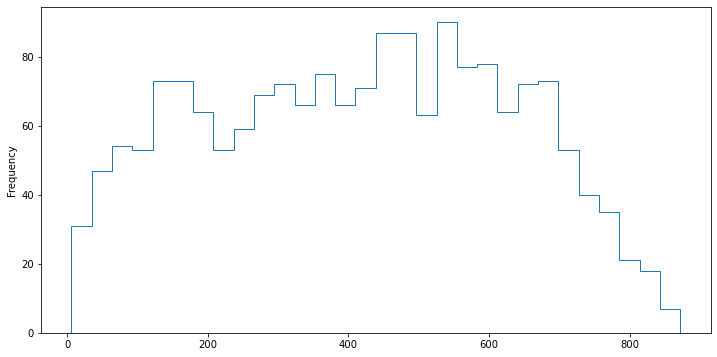
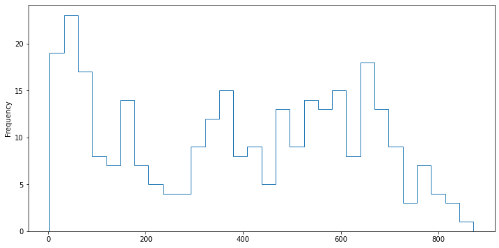
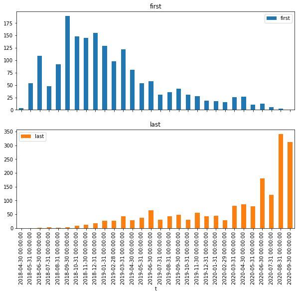

```python
# import matplotlib
import matplotlib.pyplot as plt
import numpy as np
import pandas as pd

pd.set_option("max_colwidth", 100)
```

## 读取数据

数据已经经过清洗，后续尽量不使用和构造中间变量，所有结果以附加列和查询语句呈现


```python
questions = pd.read_csv("/home/sopp/docker/csv/ycy0914.questions.csv")
questions.create_at = pd.to_datetime(questions.create_at)
```


```python
modify = pd.read_csv("/home/sopp/docker/csv/ycy0915.modify.csv")
modify.modify_at = pd.to_datetime(modify.modify_at)
```


```python
answers = pd.read_csv("/home/sopp/docker/csv/ycy0918.answers.csv")
answers.create_at = pd.to_datetime(answers.create_at)
```


```python
people = pd.read_csv("/home/sopp/docker/csv/ycy0919.people.csv")
```


```python
poeple["url"] = "https://www.zhihu.com/people/" + people.user_id.astype(str)
```


```python
answers["url"] = (
    "https://www.zhihu.com/question/"
    + answers.question_id.astype(str)
    + "/answer/"
    + answers.answer_id.astype(str)
)
```

## summary


```python
%%time
#fig,ax=plt.subplots(3,2,figsize=(12,8))
pd.concat(
    [
        questions.set_index("question_id"),
        modify[(modify.modify_by == "zhihuadmin") & (modify.reason.str.contains("热榜"))]
        .groupby("question_id")
        .modify_id.count()
        .rename("is_hot"),
        questions.groupby("question_id").question_id.count().rename("questions"),
        answers.groupby("question_id").answer_id.count().rename("answers"),
        answers.groupby("question_id").voteups.sum().rename("voteups"),
        answers.groupby("question_id").comments.sum().rename("answer_comments"),
    ],
    axis=1,
).reset_index()[
    [
        "questions",
        "answers",
        "views",
        "voteups",
        "answer_comments",
        "create_at",
        "is_hot",
    ]
].groupby(
    pd.Grouper(key="create_at", freq="m")
).sum().plot(
    kind="bar", subplots=True, layout=(3, 2), figsize=(12, 8), title="summary"
)[0,0]
```

    CPU times: user 1.65 s, sys: 1.96 ms, total: 1.65 s
    Wall time: 1.85 s


    <AxesSubplot:title={'center':'questions'}, xlabel='create_at'>


## 人物

  分年度的groupby
- 个人信息，url,id等
- 关注者数量
- 回答次数，关联问题和回答信息，url等
- 获赞数量，关联问题和回答信息，问题标题等
- 编辑次数，关联问题信息问题
- 提问数
    * 优质问题数

#### 编辑次数


```python
%%time
# 移除提问者创建问题时的编辑
a = modify[modify.modify_at.isin(modify[modify.action.str.contains("添加了问题")].modify_at)]
```

    CPU times: user 33.7 ms, sys: 811 µs, total: 34.5 ms
    Wall time: 44.9 ms


```python
%%time
pd.concat(
    [
        people.set_index("user_id"),
        #    answers.groupby("create_by").voteup_count.count().rename("answer_count"),
        modify.drop(index=a.index)
        .groupby("modify_by")
        .modify_at.count()
        .rename("modifies"),
        modify.drop(index=a.index)
        .groupby(["modify_by", pd.Grouper(key="modify_at", freq="y")])
        .modify_id.count()
        .rename("modifies")
        .reset_index()
        .pivot(index="modify_by", columns="modify_at"),
    ],
    axis=1,
).sort_values(
    by="modifies",
    #   by=("modifies", pd.Timestamp("2018-12-31")),
    ascending=False,
).iloc[
    :, [1, 6, 7, 8, 9]
].head(
    10
)
```

    CPU times: user 211 ms, sys: 4.04 ms, total: 215 ms
    Wall time: 248 ms


<div>
<style scoped>
    .dataframe tbody tr th:only-of-type {
        vertical-align: middle;
    }

    .dataframe tbody tr th {
        vertical-align: top;
    }

    .dataframe thead th {
        text-align: right;
    }
</style>
<table border="1" class="dataframe">
  <thead>
    <tr style="text-align: right;">
      <th></th>
      <th>name</th>
      <th>modifies</th>
      <th>(modifies, 2018-12-31 00:00:00)</th>
      <th>(modifies, 2019-12-31 00:00:00)</th>
      <th>(modifies, 2020-12-31 00:00:00)</th>
    </tr>
  </thead>
  <tbody>
    <tr>
      <th>0</th>
      <td>匿名用户</td>
      <td>1733.0</td>
      <td>544.0</td>
      <td>820.0</td>
      <td>369.0</td>
    </tr>
    <tr>
      <th>ab387c207374d294c94b04078d3e45ff</th>
      <td>罗伯特萝卜</td>
      <td>1112.0</td>
      <td>NaN</td>
      <td>6.0</td>
      <td>1106.0</td>
    </tr>
    <tr>
      <th>zhihuadmin</th>
      <td>知乎管理员</td>
      <td>924.0</td>
      <td>192.0</td>
      <td>472.0</td>
      <td>260.0</td>
    </tr>
    <tr>
      <th>ade6549bded0d0634715abb5407c5f15</th>
      <td>faeries</td>
      <td>745.0</td>
      <td>20.0</td>
      <td>719.0</td>
      <td>6.0</td>
    </tr>
    <tr>
      <th>7066cd4e69a47d677f9dc49c06abc8fd</th>
      <td>呼啦啦</td>
      <td>525.0</td>
      <td>316.0</td>
      <td>189.0</td>
      <td>20.0</td>
    </tr>
    <tr>
      <th>7538737233586633521</th>
      <td>凤山脚下</td>
      <td>513.0</td>
      <td>421.0</td>
      <td>92.0</td>
      <td>NaN</td>
    </tr>
    <tr>
      <th>ec80c92729eb9fbf160b296c08afb508</th>
      <td>胡靖逸</td>
      <td>371.0</td>
      <td>31.0</td>
      <td>211.0</td>
      <td>129.0</td>
    </tr>
    <tr>
      <th>dcd5a53ece0b19b4d8ea9986fc7aa9e0</th>
      <td>「已注销」</td>
      <td>313.0</td>
      <td>53.0</td>
      <td>248.0</td>
      <td>12.0</td>
    </tr>
    <tr>
      <th>59d0ba88b217bb558486cb3fe52d5657</th>
      <td>杨超越黑粉头子站</td>
      <td>275.0</td>
      <td>NaN</td>
      <td>235.0</td>
      <td>40.0</td>
    </tr>
    <tr>
      <th>8299b98000e901c2aa577107c553e1e7</th>
      <td>ZZHONGG</td>
      <td>250.0</td>
      <td>39.0</td>
      <td>206.0</td>
      <td>5.0</td>
    </tr>
  </tbody>
</table>
</div>


#### 提问次数


```python
%%time
pd.concat(
    [
        people.set_index("user_id"),
        #    answers.groupby("create_by").voteup_count.count().rename("answer_count"),
        questions.groupby("create_by").question_id.count().rename("questions"),
        questions.groupby(["create_by", pd.Grouper(key="create_at", freq="y")])
        .question_id.count()
        .rename("questions")
        .reset_index()
        .pivot(index="create_by", columns="create_at"),
    ],
    axis=1,
).sort_values(
    #  by="answer",
    by=("questions", pd.Timestamp("2019-12-31")),
    ascending=False,
).iloc[
    :, 6:
].head()
```

    CPU times: user 174 ms, sys: 2.5 ms, total: 176 ms
    Wall time: 221 ms


<div>
<style scoped>
    .dataframe tbody tr th:only-of-type {
        vertical-align: middle;
    }

    .dataframe tbody tr th {
        vertical-align: top;
    }

    .dataframe thead th {
        text-align: right;
    }
</style>
<table border="1" class="dataframe">
  <thead>
    <tr style="text-align: right;">
      <th></th>
      <th>questions</th>
      <th>(questions, 2018-12-31 00:00:00)</th>
      <th>(questions, 2019-12-31 00:00:00)</th>
      <th>(questions, 2020-12-31 00:00:00)</th>
    </tr>
  </thead>
  <tbody>
    <tr>
      <th>0</th>
      <td>1215.0</td>
      <td>384.0</td>
      <td>484.0</td>
      <td>347.0</td>
    </tr>
    <tr>
      <th>7066cd4e69a47d677f9dc49c06abc8fd</th>
      <td>173.0</td>
      <td>126.0</td>
      <td>39.0</td>
      <td>8.0</td>
    </tr>
    <tr>
      <th>4774a65b0f6722baf5292750f4df2513</th>
      <td>11.0</td>
      <td>NaN</td>
      <td>11.0</td>
      <td>NaN</td>
    </tr>
    <tr>
      <th>1f605d506a30d4a170ba1ea2d3ef9237</th>
      <td>15.0</td>
      <td>NaN</td>
      <td>11.0</td>
      <td>4.0</td>
    </tr>
    <tr>
      <th>377a423aa9805c6b8bd4e3fb403a7f29</th>
      <td>11.0</td>
      <td>1.0</td>
      <td>10.0</td>
      <td>NaN</td>
    </tr>
  </tbody>
</table>
</div>


#### 回答数


```python
%%time
pd.concat(
    [
        people.set_index("user_id"),
        #    answers.groupby("create_by").voteup_count.count().rename("answer_count"),
        answers.groupby("create_by").answer_id.count().rename("answers"),
        answers.groupby(["create_by", pd.Grouper(key="create_at", freq="y")])
        .answer_id.count()
        .rename("answers")
        .reset_index()
        .pivot(index="create_by", columns="create_at"),
    ],
    axis=1,
).sort_values(
    #  by="answer",
    by=("answers", pd.Timestamp("2020-12-31")),
    ascending=False,
).iloc[
    :, 6:
].head()
```

    CPU times: user 1.47 s, sys: 36.1 ms, total: 1.5 s
    Wall time: 1.7 s


<div>
<style scoped>
    .dataframe tbody tr th:only-of-type {
        vertical-align: middle;
    }

    .dataframe tbody tr th {
        vertical-align: top;
    }

    .dataframe thead th {
        text-align: right;
    }
</style>
<table border="1" class="dataframe">
  <thead>
    <tr style="text-align: right;">
      <th></th>
      <th>answers</th>
      <th>(answers, 2018-12-31 00:00:00)</th>
      <th>(answers, 2019-12-31 00:00:00)</th>
      <th>(answers, 2020-12-31 00:00:00)</th>
    </tr>
  </thead>
  <tbody>
    <tr>
      <th>0</th>
      <td>36666.0</td>
      <td>11512.0</td>
      <td>12929.0</td>
      <td>12225.0</td>
    </tr>
    <tr>
      <th>5a90ce9ac1466421474769ccdb54ed37</th>
      <td>164.0</td>
      <td>NaN</td>
      <td>50.0</td>
      <td>114.0</td>
    </tr>
    <tr>
      <th>9719c9495f5351ceabea5a5c68076162</th>
      <td>254.0</td>
      <td>NaN</td>
      <td>151.0</td>
      <td>103.0</td>
    </tr>
    <tr>
      <th>c9bc4f5f86fb6e4a7df4f6afef0329fa</th>
      <td>305.0</td>
      <td>NaN</td>
      <td>207.0</td>
      <td>98.0</td>
    </tr>
    <tr>
      <th>8ce139566f3758f567c92feecaa08c61</th>
      <td>190.0</td>
      <td>21.0</td>
      <td>79.0</td>
      <td>90.0</td>
    </tr>
  </tbody>
</table>
</div>


#### 分区间获赞数


```python
%%time
pd.concat(
    [
        people.set_index("user_id"),
        #    answers.groupby("create_by").voteup_count.count().rename("answer_count"),
        answers.groupby("create_by").voteups.sum(),
        answers.groupby(["create_by", pd.Grouper(key="create_at", freq="y")])
        .voteups.sum()
        .reset_index()
        .pivot(index="create_by", columns="create_at"),
    ],
    axis=1,
).sort_values(
    #  by="answer_count",
    by=("voteups", pd.Timestamp("2018-12-31")),
    ascending=False,
).iloc[
    :, 6:
].head()
```

    CPU times: user 1.46 s, sys: 17.7 ms, total: 1.48 s
    Wall time: 1.58 s


<div>
<style scoped>
    .dataframe tbody tr th:only-of-type {
        vertical-align: middle;
    }

    .dataframe tbody tr th {
        vertical-align: top;
    }

    .dataframe thead th {
        text-align: right;
    }
</style>
<table border="1" class="dataframe">
  <thead>
    <tr style="text-align: right;">
      <th></th>
      <th>voteups</th>
      <th>(voteups, 2018-12-31 00:00:00)</th>
      <th>(voteups, 2019-12-31 00:00:00)</th>
      <th>(voteups, 2020-12-31 00:00:00)</th>
    </tr>
  </thead>
  <tbody>
    <tr>
      <th>0</th>
      <td>583767.0</td>
      <td>243251.0</td>
      <td>256729.0</td>
      <td>83787.0</td>
    </tr>
    <tr>
      <th>77c26fba5efd9d3bacdea6a37b7750fb</th>
      <td>30342.0</td>
      <td>23619.0</td>
      <td>4880.0</td>
      <td>1843.0</td>
    </tr>
    <tr>
      <th>ade6549bded0d0634715abb5407c5f15</th>
      <td>100967.0</td>
      <td>22352.0</td>
      <td>77947.0</td>
      <td>668.0</td>
    </tr>
    <tr>
      <th>e9178069292478545259bec37881b341</th>
      <td>21982.0</td>
      <td>21865.0</td>
      <td>94.0</td>
      <td>23.0</td>
    </tr>
    <tr>
      <th>259d303447c2dd0d3fc6c603007f46b7</th>
      <td>16860.0</td>
      <td>16860.0</td>
      <td>NaN</td>
      <td>NaN</td>
    </tr>
  </tbody>
</table>
</div>


#### 通过回答者搜索回答


```python
%%time

answers.merge(questions[["question_id", "title"]], on="question_id").merge(
    people[["user_id", "name"]], left_on="create_by", right_on="user_id", how="left"
)[
    #      lambda x: x.name.str.contains("从来不")
    answers.create_by.str.contains("^7588c")
    == True
    #      answers.create_by=='0'
][
    [
        "name",
        #         'create_by',
        "voteups",
        #     'answer_comment_count',
        "title",
        "create_at",
        #     'answer_updated_time',
        #       "url",
    ]
].sort_values(
    by="create_at",
    #  by="voteups",
    ascending=False,
).head()
```

    CPU times: user 597 ms, sys: 34.1 ms, total: 631 ms
    Wall time: 690 ms


<div>
<style scoped>
    .dataframe tbody tr th:only-of-type {
        vertical-align: middle;
    }

    .dataframe tbody tr th {
        vertical-align: top;
    }

    .dataframe thead th {
        text-align: right;
    }
</style>
<table border="1" class="dataframe">
  <thead>
    <tr style="text-align: right;">
      <th></th>
      <th>name</th>
      <th>voteups</th>
      <th>title</th>
      <th>create_at</th>
    </tr>
  </thead>
  <tbody>
    <tr>
      <th>55349</th>
      <td>颜值顶点杨超越</td>
      <td>35</td>
      <td>讨厌杨超越的大约都是哪些人？</td>
      <td>2018-12-20 08:13:41</td>
    </tr>
    <tr>
      <th>54072</th>
      <td>颜值顶点杨超越</td>
      <td>3</td>
      <td>如何看待杨超越在2018年度腾讯星光大赏获得节目新锐之星？</td>
      <td>2018-12-20 07:56:49</td>
    </tr>
    <tr>
      <th>54149</th>
      <td>颜值顶点杨超越</td>
      <td>2</td>
      <td>如何评价杨超越12月18日在超话上对粉丝的回应？</td>
      <td>2018-12-20 07:51:09</td>
    </tr>
    <tr>
      <th>54913</th>
      <td>颜值顶点杨超越</td>
      <td>27</td>
      <td>杨超越给社会带来的正能量更多还是负能量更多呢？</td>
      <td>2018-12-19 02:28:15</td>
    </tr>
    <tr>
      <th>54473</th>
      <td>颜值顶点杨超越</td>
      <td>21</td>
      <td>杨超越登上中国新闻周刊封面代表着什么？</td>
      <td>2018-12-18 23:43:18</td>
    </tr>
  </tbody>
</table>
</div>


#### todo:知乎管理员的账号

日志中，知乎管理员锁定前十分钟内编辑过问题的账号统计

#### 平均获赞数


```python
%%time
pd.concat(
    [
        people.set_index("user_id"),
        answers.groupby("create_by").answer_id.count().rename("answers"),
        answers.groupby("create_by").voteups.sum(),
        answers.groupby("create_by").voteups.agg("mean").rename("mean"),
    ],
    axis=1,
)[lambda x: x.answers > 40].sort_values(
    by="mean",
    #     by= ('answers',pd.Timestamp('2019-12-31')),
    ascending=False,
).iloc[
    :, [1, 6, 7, 8]
].head(
    20
)
```

    CPU times: user 1.33 s, sys: 39.1 ms, total: 1.37 s
    Wall time: 1.51 s


<div>
<style scoped>
    .dataframe tbody tr th:only-of-type {
        vertical-align: middle;
    }

    .dataframe tbody tr th {
        vertical-align: top;
    }

    .dataframe thead th {
        text-align: right;
    }
</style>
<table border="1" class="dataframe">
  <thead>
    <tr style="text-align: right;">
      <th></th>
      <th>name</th>
      <th>answers</th>
      <th>voteups</th>
      <th>mean</th>
    </tr>
  </thead>
  <tbody>
    <tr>
      <th>ade6549bded0d0634715abb5407c5f15</th>
      <td>faeries</td>
      <td>79.0</td>
      <td>100967.0</td>
      <td>1278.063291</td>
    </tr>
    <tr>
      <th>ab387c207374d294c94b04078d3e45ff</th>
      <td>罗伯特萝卜</td>
      <td>47.0</td>
      <td>51889.0</td>
      <td>1104.021277</td>
    </tr>
    <tr>
      <th>aaf42c0bbe33855d7cfe542b3da31101</th>
      <td>知乎用户</td>
      <td>70.0</td>
      <td>64655.0</td>
      <td>923.642857</td>
    </tr>
    <tr>
      <th>cf8d57bba603fff99f1d763c2aad0bcc</th>
      <td>激动的鳄鱼</td>
      <td>50.0</td>
      <td>43792.0</td>
      <td>875.840000</td>
    </tr>
    <tr>
      <th>59d0ba88b217bb558486cb3fe52d5657</th>
      <td>杨超越黑粉头子站</td>
      <td>46.0</td>
      <td>35160.0</td>
      <td>764.347826</td>
    </tr>
    <tr>
      <th>87a3a638c4b24eb3ce94f59447d7e016</th>
      <td>金色短发少年杨超越</td>
      <td>88.0</td>
      <td>49271.0</td>
      <td>559.897727</td>
    </tr>
    <tr>
      <th>f987bb1c9ee681fef2801b0bf7012b47</th>
      <td>山风为岚</td>
      <td>52.0</td>
      <td>28889.0</td>
      <td>555.557692</td>
    </tr>
    <tr>
      <th>6f0da7d7cfbe5a3e24304f6e5f0195f8</th>
      <td>Deng Li</td>
      <td>48.0</td>
      <td>26223.0</td>
      <td>546.312500</td>
    </tr>
    <tr>
      <th>b6e26ca95c17cafe25b4fe4fb8b99c32</th>
      <td>邓呵呵</td>
      <td>49.0</td>
      <td>24354.0</td>
      <td>497.020408</td>
    </tr>
    <tr>
      <th>4da5a3efc3da23ef7bde393724b96e55</th>
      <td>例不虚发探花郎</td>
      <td>50.0</td>
      <td>23648.0</td>
      <td>472.960000</td>
    </tr>
    <tr>
      <th>b5be517e7f1ed5aca505dd4b3fd5450f</th>
      <td>进击的大玉螺旋丸</td>
      <td>84.0</td>
      <td>39512.0</td>
      <td>470.380952</td>
    </tr>
    <tr>
      <th>77c26fba5efd9d3bacdea6a37b7750fb</th>
      <td>拎着菜刀的诗人</td>
      <td>71.0</td>
      <td>30342.0</td>
      <td>427.352113</td>
    </tr>
    <tr>
      <th>da0d9c31bef9635bb3bd6245e8e148ab</th>
      <td>夜神月</td>
      <td>52.0</td>
      <td>21981.0</td>
      <td>422.711538</td>
    </tr>
    <tr>
      <th>55347099af432eac9a4a95a7406463fb</th>
      <td>老猫</td>
      <td>71.0</td>
      <td>29075.0</td>
      <td>409.507042</td>
    </tr>
    <tr>
      <th>0669e40e7c03cd317dcb1500a9f97702</th>
      <td>工业党徒</td>
      <td>52.0</td>
      <td>15060.0</td>
      <td>289.615385</td>
    </tr>
    <tr>
      <th>7a4cdbd98efd10a459b4b335b581715f</th>
      <td>怪力乱神</td>
      <td>48.0</td>
      <td>13161.0</td>
      <td>274.187500</td>
    </tr>
    <tr>
      <th>04566a874eafd242929d11fee0572c98</th>
      <td>风子</td>
      <td>136.0</td>
      <td>36527.0</td>
      <td>268.580882</td>
    </tr>
    <tr>
      <th>b725c3d61bbba313ce475f6c50af1ee8</th>
      <td>九鼎</td>
      <td>50.0</td>
      <td>12541.0</td>
      <td>250.820000</td>
    </tr>
    <tr>
      <th>276a1d9e562cb514a048363d62012f74</th>
      <td>知乎用户</td>
      <td>97.0</td>
      <td>22393.0</td>
      <td>230.855670</td>
    </tr>
    <tr>
      <th>74ebc100988d638ed8017ebc164b3dad</th>
      <td>知乎用户</td>
      <td>74.0</td>
      <td>17029.0</td>
      <td>230.121622</td>
    </tr>
  </tbody>
</table>
</div>


#### 话题历史活跃参与者的活动时长


```python
%%time
# answers.groupby(["create_by", "create_at"]).answer_id.count().rename("answers") > 10
(
    answers[
        answers.create_by.isin(
            answers[answers.voteups > 4]
            .create_by.value_counts()[lambda x: x.values > 4]
            .index
        )
    ]
    .groupby(["create_by"])
    .create_at
    #  .max().apply(lambda x:pd.Timestamp("2020-08-31")-x)
    .agg(["min", "max", np.ptp, "count"])
    #   min().apply(lambda x: x - pd.Timestamp("2018-12-31"))
    #  .describe()
    .sort_values(by="ptp")  # np.ptp
).ptp.astype("timedelta64[D]").plot.hist(bins=30, figsize=(12, 6), histtype="step")
```

    CPU times: user 751 ms, sys: 6.56 ms, total: 758 ms
    Wall time: 906 ms


    <AxesSubplot:ylabel='Frequency'>





#### 七月后活跃参与者(标准略有降低)的时间


```python
%%time
# answers.groupby(["create_by", "create_at"]).answer_id.count().rename("answers") > 10
(
    answers[
        answers.create_by.isin(
            answers[(answers.voteups > 4) & (answers.create_at > "2020-06-30")]
            .create_by.value_counts()[lambda x: x.values > 2]
            .index
        )
    ]
    .groupby(["create_by"])
    .create_at
    #  .max().apply(lambda x:pd.Timestamp("2020-08-31")-x)
    .agg(["min", "max", np.ptp, "count"])
    #   min().apply(lambda x: x - pd.Timestamp("2018-12-31"))
    #  .describe()
    .sort_values(by="min")  # np.ptp
).ptp.astype("timedelta64[D]").plot.hist(bins=30, figsize=(12, 6), histtype="step")
```

    CPU times: user 254 ms, sys: 2.83 ms, total: 257 ms
    Wall time: 283 ms


    <AxesSubplot:ylabel='Frequency'>





#### 话题历史活跃者增减趋势


```python
%%time
# answers.groupby(["create_by", "create_at"]).answer_id.count().rename("answers") > 10
pd.concat(
    [
        (
            answers[
                answers.create_by.isin(
                    answers[answers.voteups > 4]
                    .create_by.value_counts()[lambda x: x.values > 4]
                    .index
                )
            ]
            .groupby(["create_by"])
            .create_at.min()
        )
        .rename("t")
        .reset_index()
        .groupby(pd.Grouper(key="t", freq="m"))
        .create_by.count()
        .rename("first"),
        answers[
            answers.create_by.isin(
                answers[answers.voteups > 4]
                .create_by.value_counts()[lambda x: x.values > 4]
                .index
            )
        ]
        .groupby(["create_by"])
        .create_at.max()
        .rename("t")
        .reset_index()
        .groupby(pd.Grouper(key="t", freq="m"))
        .create_by.count()
        .rename("last"),
    ],
    axis=1,
).plot(kind="bar", subplots=True, figsize=(10, 8))
#.get_figure().savefig("output.png")
```

    CPU times: user 862 ms, sys: 11.6 ms, total: 874 ms
    Wall time: 979 ms


    array([<AxesSubplot:title={'center':'first'}, xlabel='t'>,
           <AxesSubplot:title={'center':'last'}, xlabel='t'>], dtype=object)





## 问题＆编辑

- 基本信息，创建时间，提问者url等
- 回答数
    * 总获赞数
    * 前五获赞数
    * 第一获赞数
- 关注数
- 浏览数
- 锁定编辑次数
    * 编辑战
    * 热榜
    * 优质内容
- 编辑数

#### 问题按编辑次数排序


```python
%%time
pd.concat(
    [
        questions.set_index("question_id"),
        #       answers.groupby("create_by").voteup_count.count().rename("answer_count"),
        modify.groupby("question_id").modify_id.count().rename("modify_count"),
    ],
    axis=1,
).sort_values(
    #   by="voteup_count",
    by="modify_count",
    ascending=False,
).iloc[
    :, [0, 1, 3, 4, 6, 8,]
].head()
```

    CPU times: user 32.8 ms, sys: 0 ns, total: 32.8 ms
    Wall time: 34.8 ms


<div>
<style scoped>
    .dataframe tbody tr th:only-of-type {
        vertical-align: middle;
    }

    .dataframe tbody tr th {
        vertical-align: top;
    }

    .dataframe thead th {
        text-align: right;
    }
</style>
<table border="1" class="dataframe">
  <thead>
    <tr style="text-align: right;">
      <th></th>
      <th>title</th>
      <th>answer_count</th>
      <th>follower_count</th>
      <th>create_at</th>
      <th>views</th>
      <th>modify_count</th>
    </tr>
    <tr>
      <th>question_id</th>
      <th></th>
      <th></th>
      <th></th>
      <th></th>
      <th></th>
      <th></th>
    </tr>
  </thead>
  <tbody>
    <tr>
      <th>360563011</th>
      <td>如何看待知乎用户贱贱公然和杨超越粉丝唱反调？</td>
      <td>48</td>
      <td>120</td>
      <td>2019-12-12 11:44:00</td>
      <td>123288</td>
      <td>141</td>
    </tr>
    <tr>
      <th>326849868</th>
      <td>杨超越是大叔控吗？</td>
      <td>4</td>
      <td>5</td>
      <td>2019-05-29 15:32:00</td>
      <td>1026</td>
      <td>119</td>
    </tr>
    <tr>
      <th>387568193</th>
      <td>如果虞书欣、杨超越一起参加同一档选秀，谁会更火？</td>
      <td>29</td>
      <td>34</td>
      <td>2020-04-14 00:05:00</td>
      <td>78808</td>
      <td>103</td>
    </tr>
    <tr>
      <th>305204036</th>
      <td>如何看待杨超越出席 2018 「影响中国」荣誉盛典并荣获年度演艺人物称号？</td>
      <td>693</td>
      <td>1707</td>
      <td>2018-12-09 20:04:00</td>
      <td>2233141</td>
      <td>86</td>
    </tr>
    <tr>
      <th>367912247</th>
      <td>为什么诸葛大力（成果、狗哥）的火，会引起部分女生的反感？</td>
      <td>3196</td>
      <td>4319</td>
      <td>2020-01-26 01:43:00</td>
      <td>10156292</td>
      <td>85</td>
    </tr>
  </tbody>
</table>
</div>


#### 知乎管理员的编辑原因


```python
%%time
modify[modify.modify_by == "zhihuadmin"].reason.value_counts().to_frame()
```

    CPU times: user 10.3 ms, sys: 0 ns, total: 10.3 ms
    Wall time: 12.4 ms


<div>
<style scoped>
    .dataframe tbody tr th:only-of-type {
        vertical-align: middle;
    }

    .dataframe tbody tr th {
        vertical-align: top;
    }

    .dataframe thead th {
        text-align: right;
    }
</style>
<table border="1" class="dataframe">
  <thead>
    <tr style="text-align: right;">
      <th></th>
      <th>reason</th>
    </tr>
  </thead>
  <tbody>
    <tr>
      <th>[]</th>
      <td>540</td>
    </tr>
    <tr>
      <th>['问题上热榜期间，自动锁定公共编辑']</th>
      <td>273</td>
    </tr>
    <tr>
      <th>['已有较多讨论或已产生优质内容的问题自动锁定公共编辑']</th>
      <td>51</td>
    </tr>
    <tr>
      <th>['本问题被热榜收录，自动锁定公共编辑']</th>
      <td>43</td>
    </tr>
    <tr>
      <th>['问题众裁期间锁定编辑']</th>
      <td>17</td>
    </tr>
  </tbody>
</table>
</div>


#### 热榜的步进计数


```python
modify.modify_at = pd.to_datetime(modify.modify_at)
modify[(modify.modify_by == "zhihuadmin") & (modify.reason.str.contains("热榜"))].groupby(
    pd.Grouper(key="modify_at", freq="3M")
).question_id.count()
```


    modify_at
    2018-05-31     3
    2018-08-31    22
    2018-11-30    46
    2019-02-28    61
    2019-05-31    58
    2019-08-31    41
    2019-11-30    22
    2020-02-29    12
    2020-05-31    24
    2020-08-31    25
    2020-11-30     2
    Freq: 3M, Name: question_id, dtype: int64


#### 问题热榜次数


```python
%%time
pd.concat(
    [
        questions.set_index("question_id"),
        modify[(modify.modify_by == "zhihuadmin") & (modify.reason.str.contains("热榜"))]
        .groupby("question_id")
        .modify_id.count()
        .rename("is_hot"),
        answers.groupby("question_id").voteups.sum(),
    ],
    axis=1,
).sort_values(
    #   by="voteup_count",
    by=["is_hot", "views"],
    ascending=False,
).iloc[
    :, [0, 1, 3, 4, 6, 8, 9]
].head(
    20
)
```

    CPU times: user 82.7 ms, sys: 930 µs, total: 83.6 ms
    Wall time: 107 ms


<div>
<style scoped>
    .dataframe tbody tr th:only-of-type {
        vertical-align: middle;
    }

    .dataframe tbody tr th {
        vertical-align: top;
    }

    .dataframe thead th {
        text-align: right;
    }
</style>
<table border="1" class="dataframe">
  <thead>
    <tr style="text-align: right;">
      <th></th>
      <th>title</th>
      <th>answer_count</th>
      <th>follower_count</th>
      <th>create_at</th>
      <th>views</th>
      <th>is_hot</th>
      <th>voteups</th>
    </tr>
    <tr>
      <th>question_id</th>
      <th></th>
      <th></th>
      <th></th>
      <th></th>
      <th></th>
      <th></th>
      <th></th>
    </tr>
  </thead>
  <tbody>
    <tr>
      <th>282657655</th>
      <td>杨超越的颜值是否过誉？</td>
      <td>3564</td>
      <td>8099</td>
      <td>2018-06-26 13:44:00</td>
      <td>49872496</td>
      <td>4.0</td>
      <td>156051.0</td>
    </tr>
    <tr>
      <th>294857750</th>
      <td>两年后第一代火箭少女团解散，各成员的前途会有怎样的发展？</td>
      <td>558</td>
      <td>2609</td>
      <td>2018-09-16 12:24:00</td>
      <td>10097913</td>
      <td>4.0</td>
      <td>35503.0</td>
    </tr>
    <tr>
      <th>315104845</th>
      <td>你觉得火箭少女里谁最可怜？</td>
      <td>858</td>
      <td>2540</td>
      <td>2019-03-08 17:30:00</td>
      <td>12451947</td>
      <td>3.0</td>
      <td>77558.0</td>
    </tr>
    <tr>
      <th>276048308</th>
      <td>为什么杨超越唱跳实力一般但是有这么多人喜欢？</td>
      <td>1458</td>
      <td>2992</td>
      <td>2018-05-06 06:40:00</td>
      <td>9806458</td>
      <td>3.0</td>
      <td>47273.0</td>
    </tr>
    <tr>
      <th>379710349</th>
      <td>虞书欣与杨超越有哪些差别？</td>
      <td>2919</td>
      <td>5001</td>
      <td>2020-03-15 20:18:00</td>
      <td>14851843</td>
      <td>2.0</td>
      <td>131080.0</td>
    </tr>
    <tr>
      <th>296752647</th>
      <td>为什么很多人都觉得杨超越的颜值惊为天人，甚至说是超高颜值？</td>
      <td>2201</td>
      <td>5705</td>
      <td>2018-10-01 07:23:00</td>
      <td>9921757</td>
      <td>2.0</td>
      <td>84644.0</td>
    </tr>
    <tr>
      <th>275175860</th>
      <td>如何评价杨超越在《创造101》中的表现？</td>
      <td>1605</td>
      <td>3671</td>
      <td>2018-04-28 23:49:00</td>
      <td>8306475</td>
      <td>2.0</td>
      <td>49177.0</td>
    </tr>
    <tr>
      <th>296552174</th>
      <td>如何评价杨超越成为miumiu唯一官方受邀中国艺人前往巴黎时装周？</td>
      <td>230</td>
      <td>1102</td>
      <td>2018-09-29 14:34:00</td>
      <td>5085502</td>
      <td>2.0</td>
      <td>22678.0</td>
    </tr>
    <tr>
      <th>308649069</th>
      <td>火箭少女101还能走多远?</td>
      <td>175</td>
      <td>568</td>
      <td>2019-01-10 13:16:00</td>
      <td>4697182</td>
      <td>2.0</td>
      <td>18220.0</td>
    </tr>
    <tr>
      <th>297597852</th>
      <td>杨超越哪张照片最好看？</td>
      <td>488</td>
      <td>2738</td>
      <td>2018-10-08 00:40:00</td>
      <td>4053089</td>
      <td>2.0</td>
      <td>14166.0</td>
    </tr>
    <tr>
      <th>303386973</th>
      <td>杨超越会不会最后因为没有好的作品而被大众遗忘？</td>
      <td>475</td>
      <td>1034</td>
      <td>2018-11-23 17:04:00</td>
      <td>2519119</td>
      <td>2.0</td>
      <td>15990.0</td>
    </tr>
    <tr>
      <th>318374247</th>
      <td>如何看待杨超越饰演电视剧《将夜2》的角色昊天（白桑桑）？</td>
      <td>301</td>
      <td>821</td>
      <td>2019-04-01 17:19:00</td>
      <td>1944328</td>
      <td>2.0</td>
      <td>10761.0</td>
    </tr>
    <tr>
      <th>304268463</th>
      <td>如何看待和评价2018年杨超越现象？</td>
      <td>298</td>
      <td>1339</td>
      <td>2018-12-01 13:38:00</td>
      <td>1480660</td>
      <td>2.0</td>
      <td>14690.0</td>
    </tr>
    <tr>
      <th>330181854</th>
      <td>如何评价杨超越加入运动品牌安德玛 Under Armour？</td>
      <td>252</td>
      <td>747</td>
      <td>2019-06-19 19:17:00</td>
      <td>1169532</td>
      <td>2.0</td>
      <td>12939.0</td>
    </tr>
    <tr>
      <th>333439759</th>
      <td>如何看待杨超越在Angelababy、迪丽热巴之后成为安慕希新晋品牌代言人?</td>
      <td>189</td>
      <td>505</td>
      <td>2019-07-05 17:12:00</td>
      <td>464208</td>
      <td>2.0</td>
      <td>11878.0</td>
    </tr>
    <tr>
      <th>339527302</th>
      <td>如何评价《极限17 羽你同行》预告片中杨超越的表现？</td>
      <td>139</td>
      <td>277</td>
      <td>2019-08-09 11:37:00</td>
      <td>250226</td>
      <td>2.0</td>
      <td>3179.0</td>
    </tr>
    <tr>
      <th>316154921</th>
      <td>为什么篮球迷对蔡徐坤和杨超越是两种态度?</td>
      <td>1513</td>
      <td>3557</td>
      <td>2019-03-16 13:47:00</td>
      <td>18505892</td>
      <td>1.0</td>
      <td>159053.0</td>
    </tr>
    <tr>
      <th>306428235</th>
      <td>火箭少女 101 中有哪些细思极恐的事情？</td>
      <td>137</td>
      <td>1096</td>
      <td>2018-12-21 00:00:00</td>
      <td>13057258</td>
      <td>1.0</td>
      <td>28247.0</td>
    </tr>
    <tr>
      <th>281263401</th>
      <td>《创造101》中，你对哪位选手改观最大？</td>
      <td>409</td>
      <td>1326</td>
      <td>2018-06-16 19:53:00</td>
      <td>9353408</td>
      <td>1.0</td>
      <td>42351.0</td>
    </tr>
    <tr>
      <th>299574611</th>
      <td>杨超越的语言能力怎么样？有哪些经典发言？</td>
      <td>168</td>
      <td>1830</td>
      <td>2018-10-22 19:12:00</td>
      <td>8284990</td>
      <td>1.0</td>
      <td>33289.0</td>
    </tr>
  </tbody>
</table>
</div>


#### 问题获赞排序(累计,top5,top1)

所有答案的赞数，前五得赞数，第一名赞数
前五不知道有啥函数，可能得自己写


```python
#
def top(series, n=5):
    return series.sort_values().tail(n).sum()
```


```python
%%time
# 见summary
# group后agg参数，sort_values,first，first5，mean
(
    pd.concat(
        [
            questions.set_index("question_id"),
            answers.groupby("question_id").voteups.sum(),
            answers.groupby("question_id").voteups.max().rename("voteup_top1"),
            answers.sort_values(by="voteups")
            .groupby("question_id")
            .voteups.agg(top)
            .rename("voteup_top5"),
            #    answers.groupby("create_by").voteup_count.sum(),
        ],
        axis=1,
    )
    .reset_index()[
        #       (temp.target_created < '2020-01-01')&
        #    (temp.target_created > '2019-06-30')
        #        (temp.target_created > '2017-06-30')
        lambda x: x.create_at
        > "2020-01-01"  # reset后索引无效
    ]
    .sort_values(by="voteup_top5", ascending=False)
    .head(20)
    .iloc[:, [1, 2, 4, 5, 7, 9, 10, 11]]
)
```

    CPU times: user 6.16 s, sys: 25.9 ms, total: 6.19 s
    Wall time: 6.84 s


<div>
<style scoped>
    .dataframe tbody tr th:only-of-type {
        vertical-align: middle;
    }

    .dataframe tbody tr th {
        vertical-align: top;
    }

    .dataframe thead th {
        text-align: right;
    }
</style>
<table border="1" class="dataframe">
  <thead>
    <tr style="text-align: right;">
      <th></th>
      <th>title</th>
      <th>answer_count</th>
      <th>follower_count</th>
      <th>create_at</th>
      <th>views</th>
      <th>voteups</th>
      <th>voteup_top1</th>
      <th>voteup_top5</th>
    </tr>
  </thead>
  <tbody>
    <tr>
      <th>3044</th>
      <td>为什么诸葛大力（成果、狗哥）的火，会引起部分女生的反感？</td>
      <td>3196</td>
      <td>4319</td>
      <td>2020-01-26 01:43:00</td>
      <td>10156292</td>
      <td>136061.0</td>
      <td>29688.0</td>
      <td>62894.0</td>
    </tr>
    <tr>
      <th>3411</th>
      <td>鞠婧祎和杨超越两个美少女突然打了一架，谁的单兵战斗力更强 ？</td>
      <td>646</td>
      <td>1686</td>
      <td>2020-04-30 15:28:00</td>
      <td>4872541</td>
      <td>81000.0</td>
      <td>23207.0</td>
      <td>60777.0</td>
    </tr>
    <tr>
      <th>3404</th>
      <td>非常嫉妒杨超越怎么办？</td>
      <td>734</td>
      <td>1636</td>
      <td>2020-04-29 02:51:00</td>
      <td>2024370</td>
      <td>54924.0</td>
      <td>46881.0</td>
      <td>51575.0</td>
    </tr>
    <tr>
      <th>3174</th>
      <td>虞书欣与杨超越有哪些差别？</td>
      <td>2919</td>
      <td>5001</td>
      <td>2020-03-15 20:18:00</td>
      <td>14851843</td>
      <td>131080.0</td>
      <td>16921.0</td>
      <td>48653.0</td>
    </tr>
    <tr>
      <th>4090</th>
      <td>如何看待杨超越说种 100 斤玉米只能买 3 斤猪肉?</td>
      <td>2203</td>
      <td>7118</td>
      <td>2020-09-06 00:33:00</td>
      <td>7151437</td>
      <td>75650.0</td>
      <td>20734.0</td>
      <td>37945.0</td>
    </tr>
    <tr>
      <th>3569</th>
      <td>如何看待杨超越占用公共资源吐槽车主开远光灯的事件？</td>
      <td>1378</td>
      <td>1906</td>
      <td>2020-06-08 02:17:00</td>
      <td>1192632</td>
      <td>27636.0</td>
      <td>7995.0</td>
      <td>19743.0</td>
    </tr>
    <tr>
      <th>3643</th>
      <td>如何评价杨超越在《火箭少女 101 告别典礼》上的发言?</td>
      <td>1979</td>
      <td>4074</td>
      <td>2020-06-23 19:38:00</td>
      <td>6688773</td>
      <td>76567.0</td>
      <td>4824.0</td>
      <td>18701.0</td>
    </tr>
    <tr>
      <th>3761</th>
      <td>同样是实力不足出道，杨超越、虞书欣和张艺凡有什么区别？</td>
      <td>526</td>
      <td>832</td>
      <td>2020-07-06 04:50:00</td>
      <td>2324738</td>
      <td>28729.0</td>
      <td>4309.0</td>
      <td>17890.0</td>
    </tr>
    <tr>
      <th>3778</th>
      <td>2020再回首，杨超越现象是否给女团选秀开了个坏头，让一些毫无实力的人高位出道了？</td>
      <td>791</td>
      <td>1377</td>
      <td>2020-07-11 02:47:00</td>
      <td>1386235</td>
      <td>24516.0</td>
      <td>5759.0</td>
      <td>14189.0</td>
    </tr>
    <tr>
      <th>3483</th>
      <td>如何看待杨超越透露明星代言的产品可以免费使用？</td>
      <td>370</td>
      <td>1385</td>
      <td>2020-05-16 22:51:00</td>
      <td>3540236</td>
      <td>19822.0</td>
      <td>6845.0</td>
      <td>13801.0</td>
    </tr>
    <tr>
      <th>3667</th>
      <td>如何看待杨超越将微博认证改为演员、歌手?</td>
      <td>485</td>
      <td>932</td>
      <td>2020-06-24 14:40:00</td>
      <td>1969660</td>
      <td>20060.0</td>
      <td>8773.0</td>
      <td>12697.0</td>
    </tr>
    <tr>
      <th>3283</th>
      <td>如何看待杨超越在综艺节目上闻自己的袜子？</td>
      <td>833</td>
      <td>1916</td>
      <td>2020-04-07 22:19:00</td>
      <td>2663965</td>
      <td>22118.0</td>
      <td>3005.0</td>
      <td>11829.0</td>
    </tr>
    <tr>
      <th>3080</th>
      <td>如何看待杨超越给郭老师刷礼物？</td>
      <td>207</td>
      <td>420</td>
      <td>2020-02-17 08:43:00</td>
      <td>1023250</td>
      <td>14265.0</td>
      <td>5250.0</td>
      <td>10818.0</td>
    </tr>
    <tr>
      <th>3430</th>
      <td>喜欢杨超越的人也会喜欢虞书欣吗?</td>
      <td>507</td>
      <td>569</td>
      <td>2020-05-04 14:12:00</td>
      <td>498584</td>
      <td>13544.0</td>
      <td>6445.0</td>
      <td>9722.0</td>
    </tr>
    <tr>
      <th>3491</th>
      <td>杨超越适合演《三体》里的庄颜吗?</td>
      <td>371</td>
      <td>649</td>
      <td>2020-05-18 13:51:00</td>
      <td>1000877</td>
      <td>10769.0</td>
      <td>4478.0</td>
      <td>8719.0</td>
    </tr>
    <tr>
      <th>3620</th>
      <td>如何评价杨超越在《炙热的我们》中的「僵尸新娘」造型？</td>
      <td>284</td>
      <td>825</td>
      <td>2020-06-20 19:19:00</td>
      <td>2280422</td>
      <td>11347.0</td>
      <td>3410.0</td>
      <td>8071.0</td>
    </tr>
    <tr>
      <th>3177</th>
      <td>虞书欣会成为下一个杨超越吗？</td>
      <td>388</td>
      <td>497</td>
      <td>2020-03-16 00:08:00</td>
      <td>1177631</td>
      <td>11174.0</td>
      <td>5986.0</td>
      <td>8035.0</td>
    </tr>
    <tr>
      <th>3540</th>
      <td>鹅厂不给杨超越资源她还能继续火下去吗？</td>
      <td>185</td>
      <td>561</td>
      <td>2020-06-02 00:17:00</td>
      <td>1428579</td>
      <td>11720.0</td>
      <td>2333.0</td>
      <td>7725.0</td>
    </tr>
    <tr>
      <th>3154</th>
      <td>杨超越为什么能力不是最拔尖的，却是101里最受欢迎并且拿的资源最多的人？</td>
      <td>531</td>
      <td>1165</td>
      <td>2020-03-09 16:58:00</td>
      <td>2524953</td>
      <td>18130.0</td>
      <td>4708.0</td>
      <td>7721.0</td>
    </tr>
    <tr>
      <th>3455</th>
      <td>为什么《创1》杨超越哭黄子韬还安慰她，到了《创3》别的选手就不一样了？</td>
      <td>96</td>
      <td>156</td>
      <td>2020-05-08 12:27:00</td>
      <td>1003933</td>
      <td>9260.0</td>
      <td>4583.0</td>
      <td>7261.0</td>
    </tr>
  </tbody>
</table>
</div>


#### 浏览前200位中回答数最少的问题
附加总获赞数


```python
pd.concat(
    [
        questions.set_index("question_id"),
        answers.groupby("question_id").voteups.sum(),
        #    answers.groupby("create_by").voteup_count.sum(),
    ],
    axis=1,
).reset_index()[
    #       (temp.target_created < '2020-01-01')&
    #    (temp.target_created > '2019-06-30')
    (questions.create_at > "2017-06-30")
].sort_values(
    by="views", ascending=False
).head(
    200
).sort_values(
    by="answer_count", ascending=True
).head().iloc[
    :, [1, 2, 4, 7, 9]
]
```


<div>
<style scoped>
    .dataframe tbody tr th:only-of-type {
        vertical-align: middle;
    }

    .dataframe tbody tr th {
        vertical-align: top;
    }

    .dataframe thead th {
        text-align: right;
    }
</style>
<table border="1" class="dataframe">
  <thead>
    <tr style="text-align: right;">
      <th></th>
      <th>title</th>
      <th>answer_count</th>
      <th>follower_count</th>
      <th>views</th>
      <th>voteups</th>
    </tr>
  </thead>
  <tbody>
    <tr>
      <th>913</th>
      <td>杨超越自带的造梗能力有多强？</td>
      <td>34</td>
      <td>322</td>
      <td>2227522</td>
      <td>5142.0</td>
    </tr>
    <tr>
      <th>2315</th>
      <td>如何评价“富婆收割机”杨超越?</td>
      <td>36</td>
      <td>159</td>
      <td>1322303</td>
      <td>6944.0</td>
    </tr>
    <tr>
      <th>1501</th>
      <td>杨超越吹过的牛实现了多少？</td>
      <td>36</td>
      <td>256</td>
      <td>1541435</td>
      <td>5988.0</td>
    </tr>
    <tr>
      <th>215</th>
      <td>为什么创造101导师好像都挺喜欢杨超越的？</td>
      <td>44</td>
      <td>251</td>
      <td>1147178</td>
      <td>7515.0</td>
    </tr>
    <tr>
      <th>1236</th>
      <td>火箭少女101的成员中有哪些有趣的共性和个性？</td>
      <td>45</td>
      <td>343</td>
      <td>1557423</td>
      <td>5401.0</td>
    </tr>
  </tbody>
</table>
</div>


#### 浏览10w以下回答数量最多的问题
附加获赞数


```python
pd.concat(
    [
        questions.set_index("question_id"),
        answers.groupby("question_id").voteups.sum(),
        #    answers.groupby("create_by").voteup_count.sum(),
    ],
    axis=1,
).reset_index()[
    #  remp.create_at < '2020'
    lambda x: x.views
    < 100000
].sort_values(
    by="answer_count", ascending=False
).head(
    10
).iloc[
    :, [1, 2, 4, 5, 7, 9]
]
```


<div>
<style scoped>
    .dataframe tbody tr th:only-of-type {
        vertical-align: middle;
    }

    .dataframe tbody tr th {
        vertical-align: top;
    }

    .dataframe thead th {
        text-align: right;
    }
</style>
<table border="1" class="dataframe">
  <thead>
    <tr style="text-align: right;">
      <th></th>
      <th>title</th>
      <th>answer_count</th>
      <th>follower_count</th>
      <th>create_at</th>
      <th>views</th>
      <th>voteups</th>
    </tr>
  </thead>
  <tbody>
    <tr>
      <th>3255</th>
      <td>Lisa跟杨超越你更吃谁的颜？</td>
      <td>277</td>
      <td>313</td>
      <td>2020-04-03 01:14:00</td>
      <td>45198</td>
      <td>752.0</td>
    </tr>
    <tr>
      <th>2452</th>
      <td>如果以后杨超越有了男朋友，粉丝的心情、态度、想法和举动会如何变动?</td>
      <td>227</td>
      <td>244</td>
      <td>2019-08-05 00:00:00</td>
      <td>63503</td>
      <td>1108.0</td>
    </tr>
    <tr>
      <th>3275</th>
      <td>怎样用一句话证明你是杨超越粉丝？</td>
      <td>211</td>
      <td>211</td>
      <td>2020-04-06 01:53:00</td>
      <td>84377</td>
      <td>1269.0</td>
    </tr>
    <tr>
      <th>3004</th>
      <td>在生活中，你敢说你喜欢杨超越么?</td>
      <td>194</td>
      <td>212</td>
      <td>2020-01-10 10:57:00</td>
      <td>59590</td>
      <td>1318.0</td>
    </tr>
    <tr>
      <th>2562</th>
      <td>女生对待杨超越的态度是不是就像男生对待蔡徐坤的态度啊?</td>
      <td>193</td>
      <td>179</td>
      <td>2019-09-01 07:43:00</td>
      <td>52247</td>
      <td>495.0</td>
    </tr>
    <tr>
      <th>2611</th>
      <td>如何评价「中秋赏“yue”」的参赛作品？</td>
      <td>180</td>
      <td>266</td>
      <td>2019-09-13 10:37:00</td>
      <td>38537</td>
      <td>1675.0</td>
    </tr>
    <tr>
      <th>2924</th>
      <td>如果杨超越谈恋爱了，作为粉丝你会脱粉嘛？</td>
      <td>179</td>
      <td>218</td>
      <td>2019-12-13 03:21:00</td>
      <td>53502</td>
      <td>1858.0</td>
    </tr>
    <tr>
      <th>2725</th>
      <td>你有多喜欢杨超越？</td>
      <td>179</td>
      <td>361</td>
      <td>2019-10-26 02:03:00</td>
      <td>97580</td>
      <td>2331.0</td>
    </tr>
    <tr>
      <th>3030</th>
      <td>如何看待「有的女生不喜欢杨超越」的说法？</td>
      <td>171</td>
      <td>176</td>
      <td>2020-01-19 10:24:00</td>
      <td>39255</td>
      <td>766.0</td>
    </tr>
    <tr>
      <th>2650</th>
      <td>怎样才能让杨超越娶我？</td>
      <td>166</td>
      <td>210</td>
      <td>2019-09-25 16:13:00</td>
      <td>34566</td>
      <td>226.0</td>
    </tr>
  </tbody>
</table>
</div>


#### todo:非热榜浏览数最多的问题


```python
temp.loc[
    #       (temp.target_created < '2020-01-01')&
    #    (temp.target_created > '2019-06-30')
    (temp.hot_count.isna() == True)
].sort_values(
    # by="modified",
    by="views",
    ascending=False,
    #   ascending=True
).head(
    20
).iloc[
    :, [0, 2, 3, 4, 6, 7]
]
```


    -----------------------------------------------------

    NameError           Traceback (most recent call last)

    <ipython-input-406-cf2597b9a3f1> in <module>
    ----> 1 temp.loc[
          2     #       (temp.target_created < '2020-01-01')&
          3     #    (temp.target_created > '2019-06-30')
          4     (temp.hot_count.isna() == True)
          5 ].sort_values(


    NameError: name 'temp' is not defined


#### 最新tag不包含的问题

后面添加编辑次数列


```python
pd.concat(
    [
        questions.set_index("question_id"),
        modify.groupby("question_id").modify_id.count().rename("modify_count"),
    ],
    axis=1,
)[lambda x: x.tags.str.contains("杨超越") == False].iloc[:, [0, 1, 3, 6, 8]]
```


<div>
<style scoped>
    .dataframe tbody tr th:only-of-type {
        vertical-align: middle;
    }

    .dataframe tbody tr th {
        vertical-align: top;
    }

    .dataframe thead th {
        text-align: right;
    }
</style>
<table border="1" class="dataframe">
  <thead>
    <tr style="text-align: right;">
      <th></th>
      <th>title</th>
      <th>answer_count</th>
      <th>follower_count</th>
      <th>views</th>
      <th>modify_count</th>
    </tr>
    <tr>
      <th>question_id</th>
      <th></th>
      <th></th>
      <th></th>
      <th></th>
      <th></th>
    </tr>
  </thead>
  <tbody>
    <tr>
      <th>285625263</th>
      <td>你见过哪些你认为非常傻逼的广告？</td>
      <td>26</td>
      <td>50</td>
      <td>41517</td>
      <td>16</td>
    </tr>
    <tr>
      <th>337154106</th>
      <td>无聊的问题还？</td>
      <td>134</td>
      <td>249</td>
      <td>600501</td>
      <td>19</td>
    </tr>
    <tr>
      <th>367912247</th>
      <td>为什么诸葛大力（成果、狗哥）的火，会引起部分女生的反感？</td>
      <td>3196</td>
      <td>4319</td>
      <td>10156292</td>
      <td>85</td>
    </tr>
    <tr>
      <th>405085818</th>
      <td>郭麒麟和杨超越有没有可能在一起?</td>
      <td>35</td>
      <td>52</td>
      <td>7149</td>
      <td>8</td>
    </tr>
    <tr>
      <th>406254416</th>
      <td>如何评价火箭少女101这个组合？</td>
      <td>1</td>
      <td>3</td>
      <td>216</td>
      <td>14</td>
    </tr>
    <tr>
      <th>409688419</th>
      <td>为什么把“燃烧我的卡路里”这句给了杨超越？</td>
      <td>67</td>
      <td>125</td>
      <td>1651937</td>
      <td>19</td>
    </tr>
    <tr>
      <th>417622430</th>
      <td>你为什么讨厌《琉璃 》 剧粉？</td>
      <td>53</td>
      <td>65</td>
      <td>60680</td>
      <td>17</td>
    </tr>
  </tbody>
</table>
</div>


## 回答

- 赞数
- 评论数
- 待补充


#### 按获赞数排序的回答


```python
%%time
answers.merge(questions[["title", "question_id"]], on="question_id").sort_values(
    by="voteups", ascending=False
).iloc[:, [8, 1, 2, 3]].head(10)
```

    CPU times: user 300 ms, sys: 23.8 ms, total: 324 ms
    Wall time: 383 ms


<div>
<style scoped>
    .dataframe tbody tr th:only-of-type {
        vertical-align: middle;
    }

    .dataframe tbody tr th {
        vertical-align: top;
    }

    .dataframe thead th {
        text-align: right;
    }
</style>
<table border="1" class="dataframe">
  <thead>
    <tr style="text-align: right;">
      <th></th>
      <th>title</th>
      <th>voteups</th>
      <th>comments</th>
      <th>create_at</th>
    </tr>
  </thead>
  <tbody>
    <tr>
      <th>71127</th>
      <td>为什么篮球迷对蔡徐坤和杨超越是两种态度?</td>
      <td>53206</td>
      <td>874</td>
      <td>2019-03-20 16:14:54</td>
    </tr>
    <tr>
      <th>136880</th>
      <td>非常嫉妒杨超越怎么办？</td>
      <td>46881</td>
      <td>1912</td>
      <td>2020-04-29 10:40:38</td>
    </tr>
    <tr>
      <th>75444</th>
      <td>如何看待杨超越向海里吐口水的行为？</td>
      <td>45648</td>
      <td>1443</td>
      <td>2019-04-17 01:32:37</td>
    </tr>
    <tr>
      <th>36997</th>
      <td>为什么很多人都觉得杨超越的颜值惊为天人，甚至说是超高颜值？</td>
      <td>40418</td>
      <td>3919</td>
      <td>2020-03-20 14:59:14</td>
    </tr>
    <tr>
      <th>75685</th>
      <td>如何看待杨超越向海里吐口水的行为？</td>
      <td>33776</td>
      <td>1375</td>
      <td>2019-03-30 02:18:49</td>
    </tr>
    <tr>
      <th>121096</th>
      <td>为什么诸葛大力（成果、狗哥）的火，会引起部分女生的反感？</td>
      <td>29688</td>
      <td>195</td>
      <td>2020-02-02 23:28:09</td>
    </tr>
    <tr>
      <th>110017</th>
      <td>如何评价杨超越在《奇葩说》里被批判没文化，她的发言真的很浅薄吗？</td>
      <td>25218</td>
      <td>1385</td>
      <td>2019-11-11 08:32:21</td>
    </tr>
    <tr>
      <th>56165</th>
      <td>杨超越的背景到底怎么样？</td>
      <td>24827</td>
      <td>2084</td>
      <td>2019-01-12 18:00:24</td>
    </tr>
    <tr>
      <th>137897</th>
      <td>鞠婧祎和杨超越两个美少女突然打了一架，谁的单兵战斗力更强 ？</td>
      <td>23207</td>
      <td>601</td>
      <td>2020-07-06 00:38:17</td>
    </tr>
    <tr>
      <th>137995</th>
      <td>鞠婧祎和杨超越两个美少女突然打了一架，谁的单兵战斗力更强 ？</td>
      <td>22444</td>
      <td>1443</td>
      <td>2020-04-30 22:32:50</td>
    </tr>
  </tbody>
</table>
</div>


#### 按评论数排序的回答.aka 对线战场


```python
%%time
answers.merge(questions[["title", "question_id"]], on="question_id").sort_values(
    by="comments", ascending=False
).iloc[:, [7, 2, 3, 0]].head(10)
```

    CPU times: user 219 ms, sys: 28.3 ms, total: 248 ms
    Wall time: 293 ms


<div>
<style scoped>
    .dataframe tbody tr th:only-of-type {
        vertical-align: middle;
    }

    .dataframe tbody tr th {
        vertical-align: top;
    }

    .dataframe thead th {
        text-align: right;
    }
</style>
<table border="1" class="dataframe">
  <thead>
    <tr style="text-align: right;">
      <th></th>
      <th>title</th>
      <th>comments</th>
      <th>create_at</th>
      <th>answer_id</th>
    </tr>
  </thead>
  <tbody>
    <tr>
      <th>16413</th>
      <td>如何看待《创造101》总决赛杨超越第三名出道？</td>
      <td>5093</td>
      <td>2018-06-24 09:52:21</td>
      <td>424883754</td>
    </tr>
    <tr>
      <th>36997</th>
      <td>为什么很多人都觉得杨超越的颜值惊为天人，甚至说是超高颜值？</td>
      <td>3919</td>
      <td>2020-03-20 14:59:14</td>
      <td>1092094945</td>
    </tr>
    <tr>
      <th>32385</th>
      <td>两年后第一代火箭少女团解散，各成员的前途会有怎样的发展？</td>
      <td>3568</td>
      <td>2019-02-01 13:58:27</td>
      <td>587169624</td>
    </tr>
    <tr>
      <th>1495</th>
      <td>如何评价杨超越在《创造101》中的表现？</td>
      <td>3241</td>
      <td>2018-05-13 18:37:51</td>
      <td>390652478</td>
    </tr>
    <tr>
      <th>160368</th>
      <td>如何看待杨超越说种 100 斤玉米只能买 3 斤猪肉?</td>
      <td>2494</td>
      <td>2020-09-12 18:53:47</td>
      <td>1468774155</td>
    </tr>
    <tr>
      <th>121138</th>
      <td>为什么诸葛大力（成果、狗哥）的火，会引起部分女生的反感？</td>
      <td>2228</td>
      <td>2020-01-28 18:07:12</td>
      <td>988324488</td>
    </tr>
    <tr>
      <th>10380</th>
      <td>如何评价杨超越的颜值？</td>
      <td>2127</td>
      <td>2020-01-27 15:40:58</td>
      <td>987034732</td>
    </tr>
    <tr>
      <th>56165</th>
      <td>杨超越的背景到底怎么样？</td>
      <td>2084</td>
      <td>2019-01-12 18:00:24</td>
      <td>572315428</td>
    </tr>
    <tr>
      <th>125697</th>
      <td>虞书欣与杨超越有哪些差别？</td>
      <td>1998</td>
      <td>2020-03-16 22:37:49</td>
      <td>1083529470</td>
    </tr>
    <tr>
      <th>136880</th>
      <td>非常嫉妒杨超越怎么办？</td>
      <td>1912</td>
      <td>2020-04-29 10:40:38</td>
      <td>1187949356</td>
    </tr>
  </tbody>
</table>
</div>


#### todo:上面两个的是否匿名标签

## 图表

#### 回答数变化图和标注,itertuples


```python
figure, ax = plt.subplots(figsize=(14, 8))
temp2 = temp.set_index(pd.DatetimeIndex(temp.target_created))
temp2[
    "target_answer_count"
    #    'views'
].plot()
for i in temp2.loc[temp2.target_answer_count > 1000].itertuples():
    ax.text(
        i.Index, i.target_answer_count, i.target_answer_count, c="grey", rotation=25
    )
# for i in temp2.loc[temp2.views>7000000].itertuples():
#            ax.text(i.Index,i.views,str(format(i.views/1000000,'0.2f'))+'M',c='grey',rotation=25)
```

## todo Soon™


#### 回答的语义分析

#### 正向逆向比例随时间变化曲线


```python
ans.answer_voteup_count.describe()
```


```python
ans.loc[ans.author_id == "0"].answer_voteup_count.describe()
```


```python
ans.loc[
    (ans.author_id == "0") & (ans.answer_voteup_count > 100)
].answer_voteup_count.describe()
```


```python
ans.loc[ans.author_id == "0"].sort_values(
    by="answer_voteup_count", ascending=False
).head(20).iloc[:, [0, 12, 6, 7, 8, 10, -2]]
```


```python
%whos
```

    Variable          Type             Data/Info
    --------------------------------------------
    NamespaceMagics   MetaHasTraits    <class 'IPython.core.magi<...>mespace.NamespaceMagics'>
    a                 DataFrame               question_id    mod<...>n[16341 rows x 7 columns]
    answers           DataFrame                 answer_id  voteu<...>[162598 rows x 8 columns]
    create_engine     function         <function create_engine at 0x7f1f9fbdd550>
    get_ipython       function         <function get_ipython at 0x7f1fde7c45e0>
    json              module           <module 'json' from '/hom<...>hon3.8/json/__init__.py'>
    modify            DataFrame               question_id    mod<...>n[31694 rows x 7 columns]
    np                module           <module 'numpy' from '/ho<...>kages/numpy/__init__.py'>
    pd                module           <module 'pandas' from '/h<...>ages/pandas/__init__.py'>
    people            DataFrame                                 <...>n[61800 rows x 7 columns]
    plt               module           <module 'matplotlib.pyplo<...>es/matplotlib/pyplot.py'>
    questions         DataFrame              question_id        <...>\n[4130 rows x 9 columns]
    sys               module           <module 'sys' (built-in)>
    top               function         <function top at 0x7f1faa99adc0>


from sqlalchemy import create_engine

engine = create_engine("sqlite:///test.db", echo=False)
answers.to_sql("answers", con=engine)
questions.to_sql('questions',con=engine)
people.to_sql('people',con=engine)
modify.to_sql('modify',con=engine)


```python

```
