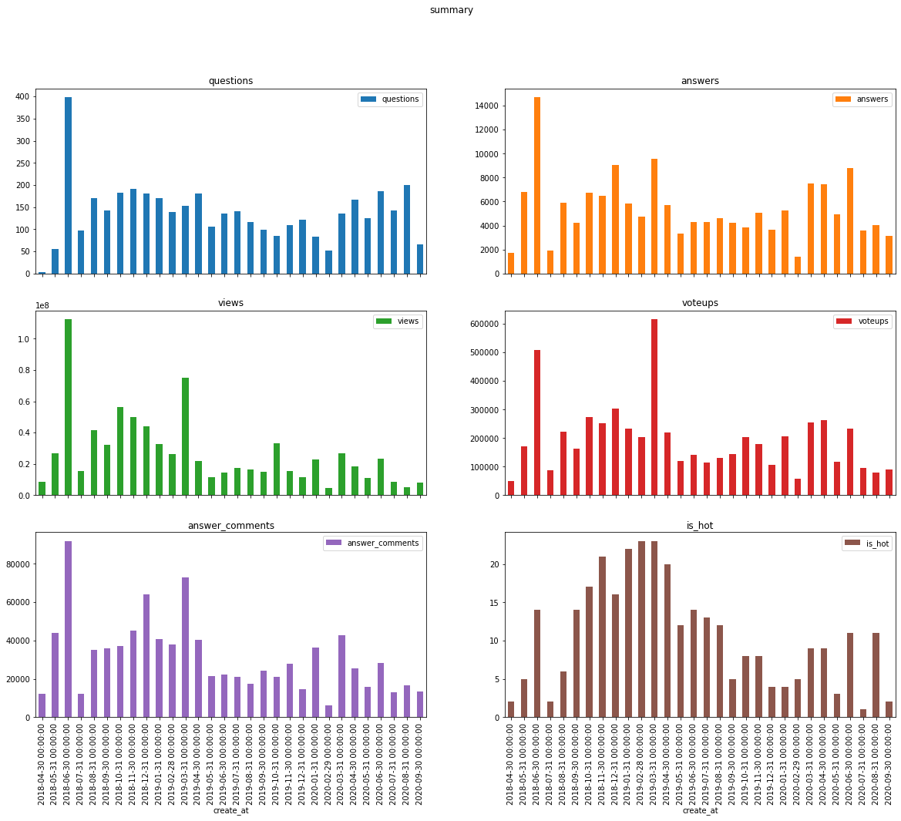
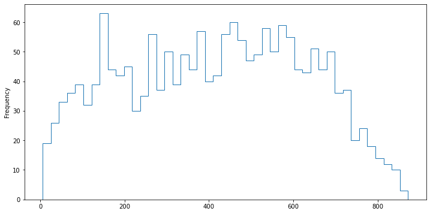
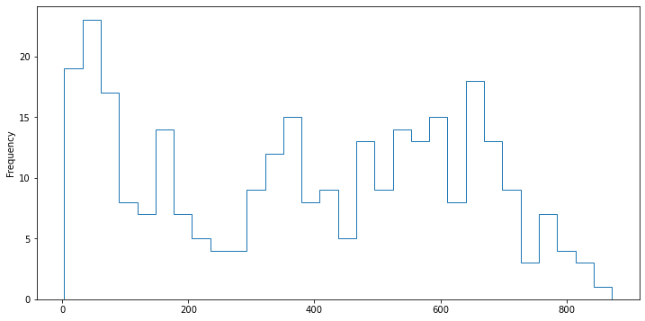
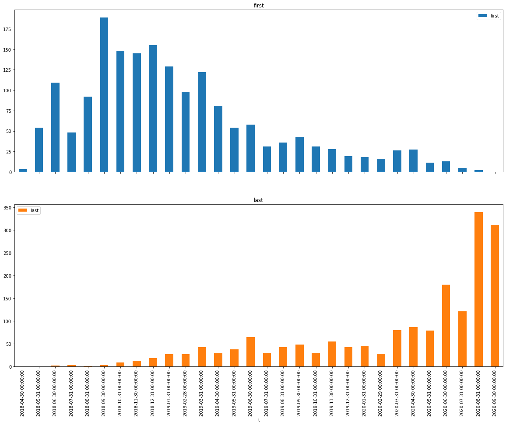
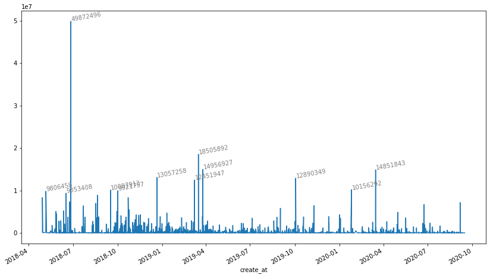

## 读取数据

- 数据来源限定是杨超越话题下所有问题和提问，没有文章和专栏的数据，未带话题的也不在范围内。
- 数据抓取的时间是9月15日前后
- 数据已经经过清洗，后续尽量不使用和构造中间变量，所有结果以附加列和查询语句呈现。


## summary

- 问题4130个
- 回答16w
- 浏览8亿
- 参与者6w

按月汇总的六项数据趋势图，可以看个直观印象。后面有时间也许会做个相关性，虽然谁都知道回答越多点赞越多浏览越多。


```python
%%time
pd.concat(
    [
        questions.set_index("question_id"),
        modify[(modify.modify_by == "zhihuadmin") & (modify.reason.str.contains("热榜"))]
        .groupby("question_id").modify_id.count().rename("is_hot"),
        questions.groupby("question_id").question_id.count().rename("questions"),
        answers.groupby("question_id").answer_id.count().rename("answers"),
        answers.groupby("question_id").voteups.sum().rename("voteups"),
        answers.groupby("question_id").comments.sum().rename("answer_comments"),
    ],
    axis=1,
).reset_index()[
    ["questions","answers","views","voteups","answer_comments","create_at","is_hot",]
].groupby(
    pd.Grouper(key="create_at", freq="m")
).sum().plot(kind="bar", subplots=True, layout=(3, 2), figsize=(20, 15), title="summary")
```

    CPU times: user 1.62 s, sys: 25.7 ms, total: 1.65 s
    Wall time: 1.77 s


    array([[<AxesSubplot:title={'center':'questions'}, xlabel='create_at'>,
            <AxesSubplot:title={'center':'answers'}, xlabel='create_at'>],
           [<AxesSubplot:title={'center':'views'}, xlabel='create_at'>,
            <AxesSubplot:title={'center':'voteups'}, xlabel='create_at'>],
           [<AxesSubplot:title={'center':'answer_comments'}, xlabel='create_at'>,
            <AxesSubplot:title={'center':'is_hot'}, xlabel='create_at'>]],
          dtype=object)





## 人物

以人物为主键的一些汇总数据，尽量不使用具体的用户名。

#### 编辑次数

知乎问题日志页的api相当古老，没有用户id，清洗过程中用url_token匹配提问者回答者查询id填写，没匹配到（这个人没有提问回答过或者开了隐私选项的）用hash值生成一个id。会有一些重复


```python
%%time
# 移除提问者创建问题时的编辑
a = modify[modify.modify_at.isin(modify[modify.action.str.contains("添加了问题")].modify_at)]
```

    CPU times: user 37.7 ms, sys: 1.03 ms, total: 38.7 ms
    Wall time: 50.1 ms


```python
%%time
pd.concat(
    [
        people.set_index("user_id"),
        modify.drop(index=a.index).groupby("modify_by").modify_at.count().rename("modifies"),
        modify.drop(index=a.index)
        .groupby(["modify_by", pd.Grouper(key="modify_at", freq="y")])
        .modify_id.count().rename("modifies").reset_index()
        .pivot(index="modify_by", columns="modify_at"),
    ],
    axis=1,
).sort_values(
    by="modifies",
    #   by=("modifies", pd.Timestamp("2018-12-31")),
    ascending=False,
).iloc[:, [6, 7, 8, 9]].head(10)
```

    CPU times: user 210 ms, sys: 13.4 ms, total: 224 ms
    Wall time: 262 ms


<div>
<style scoped>
    .dataframe tbody tr th:only-of-type {
        vertical-align: middle;
    }

    .dataframe tbody tr th {
        vertical-align: top;
    }

    .dataframe thead th {
        text-align: right;
    }
</style>
<table border="1" class="dataframe">
  <thead>
    <tr style="text-align: right;">
      <th></th>
      <th>modifies</th>
      <th>(modifies, 2018-12-31 00:00:00)</th>
      <th>(modifies, 2019-12-31 00:00:00)</th>
      <th>(modifies, 2020-12-31 00:00:00)</th>
    </tr>
  </thead>
  <tbody>
    <tr>
      <th>0</th>
      <td>1733.0</td>
      <td>544.0</td>
      <td>820.0</td>
      <td>369.0</td>
    </tr>
    <tr>
      <th>ab387c207374d294c94b04078d3e45ff</th>
      <td>1112.0</td>
      <td>NaN</td>
      <td>6.0</td>
      <td>1106.0</td>
    </tr>
    <tr>
      <th>zhihuadmin</th>
      <td>924.0</td>
      <td>192.0</td>
      <td>472.0</td>
      <td>260.0</td>
    </tr>
    <tr>
      <th>ade6549bded0d0634715abb5407c5f15</th>
      <td>745.0</td>
      <td>20.0</td>
      <td>719.0</td>
      <td>6.0</td>
    </tr>
    <tr>
      <th>7066cd4e69a47d677f9dc49c06abc8fd</th>
      <td>525.0</td>
      <td>316.0</td>
      <td>189.0</td>
      <td>20.0</td>
    </tr>
    <tr>
      <th>7538737233586633521</th>
      <td>513.0</td>
      <td>421.0</td>
      <td>92.0</td>
      <td>NaN</td>
    </tr>
    <tr>
      <th>ec80c92729eb9fbf160b296c08afb508</th>
      <td>371.0</td>
      <td>31.0</td>
      <td>211.0</td>
      <td>129.0</td>
    </tr>
    <tr>
      <th>dcd5a53ece0b19b4d8ea9986fc7aa9e0</th>
      <td>313.0</td>
      <td>53.0</td>
      <td>248.0</td>
      <td>12.0</td>
    </tr>
    <tr>
      <th>59d0ba88b217bb558486cb3fe52d5657</th>
      <td>275.0</td>
      <td>NaN</td>
      <td>235.0</td>
      <td>40.0</td>
    </tr>
    <tr>
      <th>8299b98000e901c2aa577107c553e1e7</th>
      <td>250.0</td>
      <td>39.0</td>
      <td>206.0</td>
      <td>5.0</td>
    </tr>
  </tbody>
</table>
</div>


tips：
- 两个特殊的用户id正好都在，zhihuadmin是日志页的知乎管理员，0是匿名用户，后面所有查询结果里几乎都有它的身影。
- 7066c这位用户是除匿名用户外提问最多的，不过她应该是腾讯综艺相关的账号，个人特质比较淡化。

#### 提问次数


```python
%%time
pd.concat(
    [
        people.set_index("user_id"),
        #    answers.groupby("create_by").voteup_count.count().rename("answer_count"),
        questions.groupby("create_by").question_id.count().rename("questions"),
        questions.groupby(["create_by", pd.Grouper(key="create_at", freq="y")])
        .question_id.count().rename("questions").reset_index()
        .pivot(index="create_by", columns="create_at"),
    ],
    axis=1,
).sort_values(
    by="questions",
    # by=("questions", pd.Timestamp("2020-12-31")),
    ascending=False,
).iloc[:, 6:].head(10)
```

    CPU times: user 169 ms, sys: 1.72 ms, total: 171 ms
    Wall time: 220 ms


<div>
<style scoped>
    .dataframe tbody tr th:only-of-type {
        vertical-align: middle;
    }

    .dataframe tbody tr th {
        vertical-align: top;
    }

    .dataframe thead th {
        text-align: right;
    }
</style>
<table border="1" class="dataframe">
  <thead>
    <tr style="text-align: right;">
      <th></th>
      <th>questions</th>
      <th>(questions, 2018-12-31 00:00:00)</th>
      <th>(questions, 2019-12-31 00:00:00)</th>
      <th>(questions, 2020-12-31 00:00:00)</th>
    </tr>
  </thead>
  <tbody>
    <tr>
      <th>0</th>
      <td>1215.0</td>
      <td>384.0</td>
      <td>484.0</td>
      <td>347.0</td>
    </tr>
    <tr>
      <th>7066cd4e69a47d677f9dc49c06abc8fd</th>
      <td>173.0</td>
      <td>126.0</td>
      <td>39.0</td>
      <td>8.0</td>
    </tr>
    <tr>
      <th>f274e1341e781403a934ed118c3f8139</th>
      <td>18.0</td>
      <td>18.0</td>
      <td>NaN</td>
      <td>NaN</td>
    </tr>
    <tr>
      <th>dcd5a53ece0b19b4d8ea9986fc7aa9e0</th>
      <td>18.0</td>
      <td>NaN</td>
      <td>NaN</td>
      <td>18.0</td>
    </tr>
    <tr>
      <th>9df062f3d18b3997be2608b119da22c8</th>
      <td>15.0</td>
      <td>5.0</td>
      <td>8.0</td>
      <td>2.0</td>
    </tr>
    <tr>
      <th>9bde85cac961a0d20abe3180f708a43a</th>
      <td>15.0</td>
      <td>15.0</td>
      <td>NaN</td>
      <td>NaN</td>
    </tr>
    <tr>
      <th>1f605d506a30d4a170ba1ea2d3ef9237</th>
      <td>15.0</td>
      <td>NaN</td>
      <td>11.0</td>
      <td>4.0</td>
    </tr>
    <tr>
      <th>04566a874eafd242929d11fee0572c98</th>
      <td>14.0</td>
      <td>NaN</td>
      <td>9.0</td>
      <td>5.0</td>
    </tr>
    <tr>
      <th>b7d7da2bae4392decc99230fa3f1cf3f</th>
      <td>13.0</td>
      <td>1.0</td>
      <td>8.0</td>
      <td>4.0</td>
    </tr>
    <tr>
      <th>0f9ab983f0da7448fda1e736ed6c3b44</th>
      <td>12.0</td>
      <td>7.0</td>
      <td>5.0</td>
      <td>NaN</td>
    </tr>
  </tbody>
</table>
</div>


tips
- 7066c后期的一些综艺相关提问比如心动信号没有带话题，因此提问数量有所下降。
- dcd5a这位用户目前已注销，之前使用的id是星星的你。
- 本来打算做个提问质量排名的，不过有数量也差不多够了

#### 回答数


```python
%%time
pd.concat(
    [
        people.set_index("user_id"),
        #    answers.groupby("create_by").voteup_count.count().rename("answer_count"),
        answers.groupby("create_by").answer_id.count().rename("answers"),
        answers.groupby(["create_by", pd.Grouper(key="create_at", freq="y")])
        .answer_id.count().rename("answers").reset_index()
        .pivot(index="create_by", columns="create_at"),
    ],
    axis=1,
).sort_values(
    #  by="answer",
    by=("answers", pd.Timestamp("2020-12-31")),
    ascending=False,
).iloc[:, 6:].head(10)
```

    CPU times: user 1.46 s, sys: 5.09 ms, total: 1.47 s
    Wall time: 1.64 s


<div>
<style scoped>
    .dataframe tbody tr th:only-of-type {
        vertical-align: middle;
    }

    .dataframe tbody tr th {
        vertical-align: top;
    }

    .dataframe thead th {
        text-align: right;
    }
</style>
<table border="1" class="dataframe">
  <thead>
    <tr style="text-align: right;">
      <th></th>
      <th>answers</th>
      <th>(answers, 2018-12-31 00:00:00)</th>
      <th>(answers, 2019-12-31 00:00:00)</th>
      <th>(answers, 2020-12-31 00:00:00)</th>
    </tr>
  </thead>
  <tbody>
    <tr>
      <th>0</th>
      <td>36666.0</td>
      <td>11512.0</td>
      <td>12929.0</td>
      <td>12225.0</td>
    </tr>
    <tr>
      <th>5a90ce9ac1466421474769ccdb54ed37</th>
      <td>164.0</td>
      <td>NaN</td>
      <td>50.0</td>
      <td>114.0</td>
    </tr>
    <tr>
      <th>9719c9495f5351ceabea5a5c68076162</th>
      <td>254.0</td>
      <td>NaN</td>
      <td>151.0</td>
      <td>103.0</td>
    </tr>
    <tr>
      <th>c9bc4f5f86fb6e4a7df4f6afef0329fa</th>
      <td>305.0</td>
      <td>NaN</td>
      <td>207.0</td>
      <td>98.0</td>
    </tr>
    <tr>
      <th>8ce139566f3758f567c92feecaa08c61</th>
      <td>190.0</td>
      <td>21.0</td>
      <td>79.0</td>
      <td>90.0</td>
    </tr>
    <tr>
      <th>0849e422a09b62d44a629fb9b119d055</th>
      <td>95.0</td>
      <td>NaN</td>
      <td>16.0</td>
      <td>79.0</td>
    </tr>
    <tr>
      <th>46c5a6ec4168f99b595f62da3b080b75</th>
      <td>156.0</td>
      <td>NaN</td>
      <td>88.0</td>
      <td>68.0</td>
    </tr>
    <tr>
      <th>86e3534f1a227d6bdc94a55d4ff21335</th>
      <td>65.0</td>
      <td>NaN</td>
      <td>NaN</td>
      <td>65.0</td>
    </tr>
    <tr>
      <th>9f2563cf848c300541929b5c18771349</th>
      <td>65.0</td>
      <td>NaN</td>
      <td>NaN</td>
      <td>65.0</td>
    </tr>
    <tr>
      <th>16645f0ddefbc766af04f881a68a3714</th>
      <td>151.0</td>
      <td>17.0</td>
      <td>69.0</td>
      <td>65.0</td>
    </tr>
  </tbody>
</table>
</div>


tips
- 20年前10名回答数只有两个人在18年有回答
- 其实18年回答数前列在20年活跃也比较少，因此后面做了个话题活跃参与者活动区间的查询。

#### 分区间获赞数


```python
%%time
pd.concat(
    [
        people.set_index("user_id"),
        #    answers.groupby("create_by").voteup_count.count().rename("answer_count"),
        answers.groupby("create_by").voteups.sum(),
        answers.groupby(["create_by", pd.Grouper(key="create_at", freq="y")])
        .voteups.sum().reset_index()
        .pivot(index="create_by", columns="create_at"),
    ],
    axis=1,
).sort_values(
    #  by="answer_count",
    by=("voteups", pd.Timestamp("2020-12-31")),
    ascending=False,
).iloc[:, 6:].head(10)
```

    CPU times: user 1.48 s, sys: 5.31 ms, total: 1.48 s
    Wall time: 1.61 s


<div>
<style scoped>
    .dataframe tbody tr th:only-of-type {
        vertical-align: middle;
    }

    .dataframe tbody tr th {
        vertical-align: top;
    }

    .dataframe thead th {
        text-align: right;
    }
</style>
<table border="1" class="dataframe">
  <thead>
    <tr style="text-align: right;">
      <th></th>
      <th>voteups</th>
      <th>(voteups, 2018-12-31 00:00:00)</th>
      <th>(voteups, 2019-12-31 00:00:00)</th>
      <th>(voteups, 2020-12-31 00:00:00)</th>
    </tr>
  </thead>
  <tbody>
    <tr>
      <th>0</th>
      <td>583767.0</td>
      <td>243251.0</td>
      <td>256729.0</td>
      <td>83787.0</td>
    </tr>
    <tr>
      <th>266c56db63b21698b8c1546af22984cb</th>
      <td>51680.0</td>
      <td>NaN</td>
      <td>NaN</td>
      <td>51680.0</td>
    </tr>
    <tr>
      <th>abc4af939f9f1ed31f460f8b52db64b5</th>
      <td>51577.0</td>
      <td>NaN</td>
      <td>NaN</td>
      <td>51577.0</td>
    </tr>
    <tr>
      <th>ab387c207374d294c94b04078d3e45ff</th>
      <td>51889.0</td>
      <td>NaN</td>
      <td>1076.0</td>
      <td>50813.0</td>
    </tr>
    <tr>
      <th>aaf42c0bbe33855d7cfe542b3da31101</th>
      <td>64655.0</td>
      <td>NaN</td>
      <td>21597.0</td>
      <td>43058.0</td>
    </tr>
    <tr>
      <th>a2b48374f34679e977a129559c95efb7</th>
      <td>30344.0</td>
      <td>NaN</td>
      <td>656.0</td>
      <td>29688.0</td>
    </tr>
    <tr>
      <th>f3590554f8330279ecf909dcb3b6ab0a</th>
      <td>23207.0</td>
      <td>NaN</td>
      <td>NaN</td>
      <td>23207.0</td>
    </tr>
    <tr>
      <th>04566a874eafd242929d11fee0572c98</th>
      <td>36527.0</td>
      <td>NaN</td>
      <td>13469.0</td>
      <td>23058.0</td>
    </tr>
    <tr>
      <th>5a90ce9ac1466421474769ccdb54ed37</th>
      <td>26843.0</td>
      <td>NaN</td>
      <td>4587.0</td>
      <td>22256.0</td>
    </tr>
    <tr>
      <th>5dd6287c9e641ee9107dd840d9034026</th>
      <td>20734.0</td>
      <td>NaN</td>
      <td>NaN</td>
      <td>20734.0</td>
    </tr>
  </tbody>
</table>
</div>


tips
- 回答质量可比提问质量好做多了，直接用获赞数累计就行。
- 其中有不少只有一两个回答，算不上活跃参与者；但是有成千上万个赞，可以定义成优质回答者。
- 20年累计获赞前10名在18年一个赞都没有，老用户里有一些换账号活跃的情况，不过更多的应该是不活跃了。

#### 通过回答者搜索回答


```python
%%time

answers.merge(questions[["question_id", "title"]], on="question_id").merge(
    people[["user_id", "name"]], left_on="create_by", right_on="user_id", how="left"
)[
    #      lambda x: x.name.str.contains("从来不")
    answers.create_by.str.contains("^dcd5a")
    == True
    #      answers.create_by=='0'
][
    [
        "name",
        #         'create_by',
        "voteups",
        #     'answer_comment_count',
        "title",
        "create_at",
        #     'answer_updated_time',
        #       "url",
    ]
].sort_values(
    by="create_at",
    #  by="voteups",
    ascending=False,
).head()
```

    CPU times: user 598 ms, sys: 28.4 ms, total: 626 ms
    Wall time: 683 ms


<div>
<style scoped>
    .dataframe tbody tr th:only-of-type {
        vertical-align: middle;
    }

    .dataframe tbody tr th {
        vertical-align: top;
    }

    .dataframe thead th {
        text-align: right;
    }
</style>
<table border="1" class="dataframe">
  <thead>
    <tr style="text-align: right;">
      <th></th>
      <th>name</th>
      <th>voteups</th>
      <th>title</th>
      <th>create_at</th>
    </tr>
  </thead>
  <tbody>
    <tr>
      <th>151834</th>
      <td>「已注销」</td>
      <td>2</td>
      <td>杨超越被礼炮吓到真的很胆小反应过激吗？是不是有刻意演的成分？</td>
      <td>2020-07-08 13:00:49</td>
    </tr>
    <tr>
      <th>147192</th>
      <td>「已注销」</td>
      <td>6</td>
      <td>如何看待杨超越虎扑女神大赛中止步 32 强？</td>
      <td>2020-06-22 22:56:55</td>
    </tr>
  </tbody>
</table>
</div>


tips：
- 用户dcd5a虽然提问很多，但只有两个回答，也许是匿名了。
- 用户名查询回答挺方便的，尤其对于马甲账户有统一命名规则的几位

#### todo:知乎管理员的账号

日志中，知乎管理员锁定前十分钟内编辑过问题的账号统计

这个查询还没写，定义应该没问题。

#### 平均获赞数


```python
%%time
pd.concat(
    [
        people.set_index("user_id"),
        answers.groupby("create_by").answer_id.count().rename("answers"),
        answers.groupby("create_by").voteups.sum(),
        answers.groupby("create_by").voteups.agg("mean").rename("mean"),
    ],
    axis=1,
)[
    lambda x: x.answers
    > 40
].sort_values(
    by="mean",
    ascending=False,
).iloc[:, [6, 7, 8]].head(10)
```

    CPU times: user 1.32 s, sys: 3.48 ms, total: 1.32 s
    Wall time: 1.51 s


<div>
<style scoped>
    .dataframe tbody tr th:only-of-type {
        vertical-align: middle;
    }

    .dataframe tbody tr th {
        vertical-align: top;
    }

    .dataframe thead th {
        text-align: right;
    }
</style>
<table border="1" class="dataframe">
  <thead>
    <tr style="text-align: right;">
      <th></th>
      <th>answers</th>
      <th>voteups</th>
      <th>mean</th>
    </tr>
  </thead>
  <tbody>
    <tr>
      <th>ade6549bded0d0634715abb5407c5f15</th>
      <td>79.0</td>
      <td>100967.0</td>
      <td>1278.063291</td>
    </tr>
    <tr>
      <th>ab387c207374d294c94b04078d3e45ff</th>
      <td>47.0</td>
      <td>51889.0</td>
      <td>1104.021277</td>
    </tr>
    <tr>
      <th>aaf42c0bbe33855d7cfe542b3da31101</th>
      <td>70.0</td>
      <td>64655.0</td>
      <td>923.642857</td>
    </tr>
    <tr>
      <th>cf8d57bba603fff99f1d763c2aad0bcc</th>
      <td>50.0</td>
      <td>43792.0</td>
      <td>875.840000</td>
    </tr>
    <tr>
      <th>59d0ba88b217bb558486cb3fe52d5657</th>
      <td>46.0</td>
      <td>35160.0</td>
      <td>764.347826</td>
    </tr>
    <tr>
      <th>87a3a638c4b24eb3ce94f59447d7e016</th>
      <td>88.0</td>
      <td>49271.0</td>
      <td>559.897727</td>
    </tr>
    <tr>
      <th>f987bb1c9ee681fef2801b0bf7012b47</th>
      <td>52.0</td>
      <td>28889.0</td>
      <td>555.557692</td>
    </tr>
    <tr>
      <th>6f0da7d7cfbe5a3e24304f6e5f0195f8</th>
      <td>48.0</td>
      <td>26223.0</td>
      <td>546.312500</td>
    </tr>
    <tr>
      <th>b6e26ca95c17cafe25b4fe4fb8b99c32</th>
      <td>49.0</td>
      <td>24354.0</td>
      <td>497.020408</td>
    </tr>
    <tr>
      <th>4da5a3efc3da23ef7bde393724b96e55</th>
      <td>50.0</td>
      <td>23648.0</td>
      <td>472.960000</td>
    </tr>
  </tbody>
</table>
</div>


tips：
- 每个回答的平均获赞数是个不错的评价指标，同时可以用不同回答数划分回答者类型
- 回答数大于0来筛选的话，前几位的平均数都是一两万
- 回答数大于40的筛选出来的结果感觉还是比较合理
- 回答数大于100后，也有一些用户的平均获赞在100以上

#### 话题历史活跃参与者的活动时长


```python
%%time
(
    answers[
        answers.create_by.isin(
            answers[answers.voteups > 4]
            .create_by.value_counts()[lambda x: x.values > 4]
            .index
        )
    ]
    .groupby(["create_by"])
    .create_at
    #  .max().apply(lambda x:pd.Timestamp("2020-08-31")-x)
    .agg(["min", "max", np.ptp, "count"])
    #   min().apply(lambda x: x - pd.Timestamp("2018-12-31"))
    #  .describe()
    .sort_values(by="ptp")  # np.ptp
).ptp.astype("timedelta64[D]").plot.hist(bins=45, figsize=(12, 6), histtype="step")
```

    CPU times: user 739 ms, sys: 3.93 ms, total: 743 ms
    Wall time: 810 ms


    <AxesSubplot:ylabel='Frequency'>





tips:
- 话题活跃参与者定义为在话题下拥有5个收到超过5个赞的回答，要求不算太高，但是符合条件的已经只剩不到2000人了。
- 图表横轴是活跃参与者最后一次回答和第一次回答的时间差，竖轴是相应人数
- 在200到700天之间的分布比较均匀
- 也有几个800天以上还在活跃的钉子户

#### 七月后活跃参与者(标准略有降低)的时间


```python
%%time
# answers.groupby(["create_by", "create_at"]).answer_id.count().rename("answers") > 10
(
    answers[
        answers.create_by.isin(
            answers[(answers.voteups > 4) & (answers.create_at > "2020-06-30")]
            .create_by.value_counts()[lambda x: x.values > 2]
            .index
        )
    ]
    .groupby(["create_by"])
    .create_at
    #  .max().apply(lambda x:pd.Timestamp("2020-08-31")-x)
    .agg(["min", "max", np.ptp, "count"])
    #   min().apply(lambda x: x - pd.Timestamp("2018-12-31"))
    #  .describe()
    .sort_values(by="min")  # np.ptp
).ptp.astype("timedelta64[D]").plot.hist(bins=30, figsize=(12, 6), histtype="step")
```

    CPU times: user 255 ms, sys: 2.51 ms, total: 258 ms
    Wall time: 294 ms


    <AxesSubplot:ylabel='Frequency'>





tips：
- 图表7月开始有三个以上回答的活跃时长，这个统计感觉定义不够精确
- 0到100天的人数高峰还算明显，应该算是话题新关注者

#### 话题历史活跃者增减趋势


```python
%%time
# answers.groupby(["create_by", "create_at"]).answer_id.count().rename("answers") > 10
pd.concat(
    [
        (
            answers[
                answers.create_by.isin(
                    answers[answers.voteups > 4]
                    .create_by.value_counts()[lambda x: x.values > 4]
                    .index
                )
            ]
            .groupby(["create_by"])
            .create_at.min()
        )
        .rename("t")
        .reset_index()
        .groupby(pd.Grouper(key="t", freq="m"))
        .create_by.count()
        .rename("first"),
        answers[
            answers.create_by.isin(
                answers[answers.voteups > 4]
                .create_by.value_counts()[lambda x: x.values > 4]
                .index
            )
        ]
        .groupby(["create_by"])
        .create_at.max()
        .rename("t")
        .reset_index()
        .groupby(pd.Grouper(key="t", freq="m"))
        .create_by.count()
        .rename("last"),
    ],
    axis=1,
).plot(kind="bar", subplots=True, figsize=(20, 15))
# .get_figure().savefig("output.png")
```

    CPU times: user 802 ms, sys: 16.1 ms, total: 819 ms
    Wall time: 914 ms


    array([<AxesSubplot:title={'center':'first'}, xlabel='t'>,
           <AxesSubplot:title={'center':'last'}, xlabel='t'>], dtype=object)





tips：
- 这个查询写的比较难看
- 不过出来图表还是比较直观的，上图是活跃参与者首次答题时间，下图是最后一次答题所在的月份。
- 19年3月份是最后一个入坑高峰，之后趋势放缓。
- 20年6月份的解散相关问题估计有很多活跃参与者被重新激活。
- 以最近三月有回答来区分休眠与活动的话，大约还有700个活跃参与者处于活动状态。

## 问题＆编辑

- 基本信息，创建时间，提问者url等
- 回答数
    * 总获赞数
    * 前五获赞数
    * 第一获赞数
- 关注数
- 浏览数
- 锁定编辑次数
    * 编辑战
    * 热榜
    * 优质内容
- 编辑数

#### 问题按编辑次数排序


```python
%%time
pd.concat(
    [
        questions.set_index("question_id"),
        #       answers.groupby("create_by").voteup_count.count().rename("answer_count"),
        modify.groupby("question_id").modify_id.count().rename("modify_count"),
    ],
    axis=1,
).sort_values(
    #   by="voteup_count",
    by="modify_count",
    ascending=False,
).iloc[
    :, [0, 1, 3, 4, 6, 8,]
].head(
    6
)
```

    CPU times: user 32.4 ms, sys: 0 ns, total: 32.4 ms
    Wall time: 36.2 ms


<div>
<style scoped>
    .dataframe tbody tr th:only-of-type {
        vertical-align: middle;
    }

    .dataframe tbody tr th {
        vertical-align: top;
    }

    .dataframe thead th {
        text-align: right;
    }
</style>
<table border="1" class="dataframe">
  <thead>
    <tr style="text-align: right;">
      <th></th>
      <th>title</th>
      <th>answer_count</th>
      <th>follower_count</th>
      <th>create_at</th>
      <th>views</th>
      <th>modify_count</th>
    </tr>
    <tr>
      <th>question_id</th>
      <th></th>
      <th></th>
      <th></th>
      <th></th>
      <th></th>
      <th></th>
    </tr>
  </thead>
  <tbody>
    <tr>
      <th>360563011</th>
      <td>如何看待知乎用户贱贱公然和杨超越粉丝唱反调？</td>
      <td>48</td>
      <td>120</td>
      <td>2019-12-12 11:44:00</td>
      <td>123288</td>
      <td>141</td>
    </tr>
    <tr>
      <th>326849868</th>
      <td>杨超越是大叔控吗？</td>
      <td>4</td>
      <td>5</td>
      <td>2019-05-29 15:32:00</td>
      <td>1026</td>
      <td>119</td>
    </tr>
    <tr>
      <th>387568193</th>
      <td>如果虞书欣、杨超越一起参加同一档选秀，谁会更火？</td>
      <td>29</td>
      <td>34</td>
      <td>2020-04-14 00:05:00</td>
      <td>78808</td>
      <td>103</td>
    </tr>
    <tr>
      <th>305204036</th>
      <td>如何看待杨超越出席 2018 「影响中国」荣誉盛典并荣获年度演艺人物称号？</td>
      <td>693</td>
      <td>1707</td>
      <td>2018-12-09 20:04:00</td>
      <td>2233141</td>
      <td>86</td>
    </tr>
    <tr>
      <th>367912247</th>
      <td>为什么诸葛大力（成果、狗哥）的火，会引起部分女生的反感？</td>
      <td>3196</td>
      <td>4319</td>
      <td>2020-01-26 01:43:00</td>
      <td>10156292</td>
      <td>85</td>
    </tr>
    <tr>
      <th>329812351</th>
      <td>村民如何才能找到一个三观合得来的NB姐姐做老婆？</td>
      <td>0</td>
      <td>1</td>
      <td>2019-06-17 14:19:00</td>
      <td>200</td>
      <td>78</td>
    </tr>
  </tbody>
</table>
</div>


tips：
- 大概有170个左右问题有超过20次的编辑
- 不过很多无人理睬的问题也存在编辑战，特意把查询设为head6凸显一下

#### 知乎管理员的编辑原因


```python
%%time
modify[modify.modify_by == "zhihuadmin"].reason.value_counts().to_frame()
```

    CPU times: user 10.3 ms, sys: 0 ns, total: 10.3 ms
    Wall time: 12.4 ms


<div>
<style scoped>
    .dataframe tbody tr th:only-of-type {
        vertical-align: middle;
    }

    .dataframe tbody tr th {
        vertical-align: top;
    }

    .dataframe thead th {
        text-align: right;
    }
</style>
<table border="1" class="dataframe">
  <thead>
    <tr style="text-align: right;">
      <th></th>
      <th>reason</th>
    </tr>
  </thead>
  <tbody>
    <tr>
      <th>[]</th>
      <td>540</td>
    </tr>
    <tr>
      <th>['问题上热榜期间，自动锁定公共编辑']</th>
      <td>273</td>
    </tr>
    <tr>
      <th>['已有较多讨论或已产生优质内容的问题自动锁定公共编辑']</th>
      <td>51</td>
    </tr>
    <tr>
      <th>['本问题被热榜收录，自动锁定公共编辑']</th>
      <td>43</td>
    </tr>
    <tr>
      <th>['问题众裁期间锁定编辑']</th>
      <td>17</td>
    </tr>
  </tbody>
</table>
</div>


tips：
- 知乎没有历史热榜查询的api，问题属性里也没有热榜相关，因此只能用知乎管理员的锁定理由来定义。
- 这个当然是不准确的，比如九月份的100斤玉米问题，被优质内容锁定编辑，之后上热榜就没有热榜锁定。
- 不过现在也只能用这个。

#### 热榜的步进计数


```python
modify[(modify.modify_by == "zhihuadmin") & (modify.reason.str.contains("热榜"))].groupby(
    pd.Grouper(key="modify_at", freq="6M")
).question_id.count()
```


    modify_at
    2018-05-31      3
    2018-11-30     68
    2019-05-31    119
    2019-11-30     63
    2020-05-31     36
    2020-11-30     27
    Freq: 6M, Name: question_id, dtype: int64


#### 问题热榜次数


```python
%%time
pd.concat(
    [
        questions.set_index("question_id"),
        modify[(modify.modify_by == "zhihuadmin") & (modify.reason.str.contains("热榜"))]
        .groupby("question_id")
        .modify_id.count()
        .rename("is_hot"),
        answers.groupby("question_id").voteups.sum(),
    ],
    axis=1,
).sort_values(
    #   by="voteup_count",
    by=["is_hot", "views"],
    ascending=False,
).iloc[
    :, [0, 1, 3, 4, 6, 8, 9]
].head(
    20
)
```

    CPU times: user 80.5 ms, sys: 950 µs, total: 81.5 ms
    Wall time: 98.4 ms


<div>
<style scoped>
    .dataframe tbody tr th:only-of-type {
        vertical-align: middle;
    }

    .dataframe tbody tr th {
        vertical-align: top;
    }

    .dataframe thead th {
        text-align: right;
    }
</style>
<table border="1" class="dataframe">
  <thead>
    <tr style="text-align: right;">
      <th></th>
      <th>title</th>
      <th>answer_count</th>
      <th>follower_count</th>
      <th>create_at</th>
      <th>views</th>
      <th>is_hot</th>
      <th>voteups</th>
    </tr>
    <tr>
      <th>question_id</th>
      <th></th>
      <th></th>
      <th></th>
      <th></th>
      <th></th>
      <th></th>
      <th></th>
    </tr>
  </thead>
  <tbody>
    <tr>
      <th>282657655</th>
      <td>杨超越的颜值是否过誉？</td>
      <td>3564</td>
      <td>8099</td>
      <td>2018-06-26 13:44:00</td>
      <td>49872496</td>
      <td>4.0</td>
      <td>156051.0</td>
    </tr>
    <tr>
      <th>294857750</th>
      <td>两年后第一代火箭少女团解散，各成员的前途会有怎样的发展？</td>
      <td>558</td>
      <td>2609</td>
      <td>2018-09-16 12:24:00</td>
      <td>10097913</td>
      <td>4.0</td>
      <td>35503.0</td>
    </tr>
    <tr>
      <th>315104845</th>
      <td>你觉得火箭少女里谁最可怜？</td>
      <td>858</td>
      <td>2540</td>
      <td>2019-03-08 17:30:00</td>
      <td>12451947</td>
      <td>3.0</td>
      <td>77558.0</td>
    </tr>
    <tr>
      <th>276048308</th>
      <td>为什么杨超越唱跳实力一般但是有这么多人喜欢？</td>
      <td>1458</td>
      <td>2992</td>
      <td>2018-05-06 06:40:00</td>
      <td>9806458</td>
      <td>3.0</td>
      <td>47273.0</td>
    </tr>
    <tr>
      <th>379710349</th>
      <td>虞书欣与杨超越有哪些差别？</td>
      <td>2919</td>
      <td>5001</td>
      <td>2020-03-15 20:18:00</td>
      <td>14851843</td>
      <td>2.0</td>
      <td>131080.0</td>
    </tr>
    <tr>
      <th>296752647</th>
      <td>为什么很多人都觉得杨超越的颜值惊为天人，甚至说是超高颜值？</td>
      <td>2201</td>
      <td>5705</td>
      <td>2018-10-01 07:23:00</td>
      <td>9921757</td>
      <td>2.0</td>
      <td>84644.0</td>
    </tr>
    <tr>
      <th>275175860</th>
      <td>如何评价杨超越在《创造101》中的表现？</td>
      <td>1605</td>
      <td>3671</td>
      <td>2018-04-28 23:49:00</td>
      <td>8306475</td>
      <td>2.0</td>
      <td>49177.0</td>
    </tr>
    <tr>
      <th>296552174</th>
      <td>如何评价杨超越成为miumiu唯一官方受邀中国艺人前往巴黎时装周？</td>
      <td>230</td>
      <td>1102</td>
      <td>2018-09-29 14:34:00</td>
      <td>5085502</td>
      <td>2.0</td>
      <td>22678.0</td>
    </tr>
    <tr>
      <th>308649069</th>
      <td>火箭少女101还能走多远?</td>
      <td>175</td>
      <td>568</td>
      <td>2019-01-10 13:16:00</td>
      <td>4697182</td>
      <td>2.0</td>
      <td>18220.0</td>
    </tr>
    <tr>
      <th>297597852</th>
      <td>杨超越哪张照片最好看？</td>
      <td>488</td>
      <td>2738</td>
      <td>2018-10-08 00:40:00</td>
      <td>4053089</td>
      <td>2.0</td>
      <td>14166.0</td>
    </tr>
    <tr>
      <th>303386973</th>
      <td>杨超越会不会最后因为没有好的作品而被大众遗忘？</td>
      <td>475</td>
      <td>1034</td>
      <td>2018-11-23 17:04:00</td>
      <td>2519119</td>
      <td>2.0</td>
      <td>15990.0</td>
    </tr>
    <tr>
      <th>318374247</th>
      <td>如何看待杨超越饰演电视剧《将夜2》的角色昊天（白桑桑）？</td>
      <td>301</td>
      <td>821</td>
      <td>2019-04-01 17:19:00</td>
      <td>1944328</td>
      <td>2.0</td>
      <td>10761.0</td>
    </tr>
    <tr>
      <th>304268463</th>
      <td>如何看待和评价2018年杨超越现象？</td>
      <td>298</td>
      <td>1339</td>
      <td>2018-12-01 13:38:00</td>
      <td>1480660</td>
      <td>2.0</td>
      <td>14690.0</td>
    </tr>
    <tr>
      <th>330181854</th>
      <td>如何评价杨超越加入运动品牌安德玛 Under Armour？</td>
      <td>252</td>
      <td>747</td>
      <td>2019-06-19 19:17:00</td>
      <td>1169532</td>
      <td>2.0</td>
      <td>12939.0</td>
    </tr>
    <tr>
      <th>333439759</th>
      <td>如何看待杨超越在Angelababy、迪丽热巴之后成为安慕希新晋品牌代言人?</td>
      <td>189</td>
      <td>505</td>
      <td>2019-07-05 17:12:00</td>
      <td>464208</td>
      <td>2.0</td>
      <td>11878.0</td>
    </tr>
    <tr>
      <th>339527302</th>
      <td>如何评价《极限17 羽你同行》预告片中杨超越的表现？</td>
      <td>139</td>
      <td>277</td>
      <td>2019-08-09 11:37:00</td>
      <td>250226</td>
      <td>2.0</td>
      <td>3179.0</td>
    </tr>
    <tr>
      <th>316154921</th>
      <td>为什么篮球迷对蔡徐坤和杨超越是两种态度?</td>
      <td>1513</td>
      <td>3557</td>
      <td>2019-03-16 13:47:00</td>
      <td>18505892</td>
      <td>1.0</td>
      <td>159053.0</td>
    </tr>
    <tr>
      <th>306428235</th>
      <td>火箭少女 101 中有哪些细思极恐的事情？</td>
      <td>137</td>
      <td>1096</td>
      <td>2018-12-21 00:00:00</td>
      <td>13057258</td>
      <td>1.0</td>
      <td>28247.0</td>
    </tr>
    <tr>
      <th>281263401</th>
      <td>《创造101》中，你对哪位选手改观最大？</td>
      <td>409</td>
      <td>1326</td>
      <td>2018-06-16 19:53:00</td>
      <td>9353408</td>
      <td>1.0</td>
      <td>42351.0</td>
    </tr>
    <tr>
      <th>299574611</th>
      <td>杨超越的语言能力怎么样？有哪些经典发言？</td>
      <td>168</td>
      <td>1830</td>
      <td>2018-10-22 19:12:00</td>
      <td>8284990</td>
      <td>1.0</td>
      <td>33289.0</td>
    </tr>
  </tbody>
</table>
</div>


tips：
- 按照上面的热榜条件，筛选出热榜锁定次数，有16个问题上过两次热榜，不过后面几个问题可能和分区热榜有关，浏览数比较低
- 第一个问题除了总获赞数以外，其他所有数据都是第一，颜值果然是知乎第一生产力

#### 问题获赞排序(累计,top5,top1)

所有答案的赞数，前五得赞数，第一名赞数
前五不知道有啥函数，可能得自己写


```python
%%time
# 见summary
# group后agg参数
(
    pd.concat(
        [
            questions.set_index("question_id"),
            answers.groupby("question_id").voteups.sum(),
            answers.groupby("question_id").voteups.max().rename("voteup_top1"),
            answers.sort_values(by="voteups")
            .groupby("question_id")
            .voteups.agg(lambda x:x.sort_values().tail().sum())
            .rename("voteup_top5"),
            #    answers.groupby("create_by").voteup_count.sum(),
        ],
        axis=1,
    )
    .reset_index()[
        #       (temp.target_created < '2020-01-01')&
        #    (temp.target_created > '2019-06-30')
        #        (temp.target_created > '2017-06-30')
        lambda x: x.create_at
        > "2018-01-01"  # reset后索引无效
    ]
    .sort_values(by="voteup_top5", ascending=False)
    .head(20)
    .iloc[:, [1, 2, 4, 5, 7, 9, 10, 11]]
)
```

    CPU times: user 6.03 s, sys: 7.55 ms, total: 6.03 s
    Wall time: 6.6 s


<div>
<style scoped>
    .dataframe tbody tr th:only-of-type {
        vertical-align: middle;
    }

    .dataframe tbody tr th {
        vertical-align: top;
    }

    .dataframe thead th {
        text-align: right;
    }
</style>
<table border="1" class="dataframe">
  <thead>
    <tr style="text-align: right;">
      <th></th>
      <th>title</th>
      <th>answer_count</th>
      <th>follower_count</th>
      <th>create_at</th>
      <th>views</th>
      <th>voteups</th>
      <th>voteup_top1</th>
      <th>voteup_top5</th>
    </tr>
  </thead>
  <tbody>
    <tr>
      <th>1789</th>
      <td>为什么篮球迷对蔡徐坤和杨超越是两种态度?</td>
      <td>1513</td>
      <td>3557</td>
      <td>2019-03-16 13:47:00</td>
      <td>18505892</td>
      <td>159053.0</td>
      <td>53206.0</td>
      <td>101752.0</td>
    </tr>
    <tr>
      <th>1840</th>
      <td>如何看待杨超越向海里吐口水的行为？</td>
      <td>1619</td>
      <td>2889</td>
      <td>2019-03-25 14:11:00</td>
      <td>14956927</td>
      <td>124251.0</td>
      <td>45648.0</td>
      <td>96514.0</td>
    </tr>
    <tr>
      <th>3044</th>
      <td>为什么诸葛大力（成果、狗哥）的火，会引起部分女生的反感？</td>
      <td>3196</td>
      <td>4319</td>
      <td>2020-01-26 01:43:00</td>
      <td>10156292</td>
      <td>136061.0</td>
      <td>29688.0</td>
      <td>62894.0</td>
    </tr>
    <tr>
      <th>3411</th>
      <td>鞠婧祎和杨超越两个美少女突然打了一架，谁的单兵战斗力更强 ？</td>
      <td>646</td>
      <td>1686</td>
      <td>2020-04-30 15:28:00</td>
      <td>4872541</td>
      <td>81000.0</td>
      <td>23207.0</td>
      <td>60777.0</td>
    </tr>
    <tr>
      <th>870</th>
      <td>为什么很多人都觉得杨超越的颜值惊为天人，甚至说是超高颜值？</td>
      <td>2201</td>
      <td>5705</td>
      <td>2018-10-01 07:23:00</td>
      <td>9921757</td>
      <td>84644.0</td>
      <td>40418.0</td>
      <td>51810.0</td>
    </tr>
    <tr>
      <th>417</th>
      <td>杨超越的颜值是否过誉？</td>
      <td>3564</td>
      <td>8099</td>
      <td>2018-06-26 13:44:00</td>
      <td>49872496</td>
      <td>156051.0</td>
      <td>16860.0</td>
      <td>51675.0</td>
    </tr>
    <tr>
      <th>3404</th>
      <td>非常嫉妒杨超越怎么办？</td>
      <td>734</td>
      <td>1636</td>
      <td>2020-04-29 02:51:00</td>
      <td>2024370</td>
      <td>54924.0</td>
      <td>46881.0</td>
      <td>51575.0</td>
    </tr>
    <tr>
      <th>3174</th>
      <td>虞书欣与杨超越有哪些差别？</td>
      <td>2919</td>
      <td>5001</td>
      <td>2020-03-15 20:18:00</td>
      <td>14851843</td>
      <td>131080.0</td>
      <td>16921.0</td>
      <td>48653.0</td>
    </tr>
    <tr>
      <th>2794</th>
      <td>如何评价杨超越在《奇葩说》里被批判没文化，她的发言真的很浅薄吗？</td>
      <td>2109</td>
      <td>5169</td>
      <td>2019-11-10 00:13:00</td>
      <td>6443401</td>
      <td>85160.0</td>
      <td>25218.0</td>
      <td>47411.0</td>
    </tr>
    <tr>
      <th>4090</th>
      <td>如何看待杨超越说种 100 斤玉米只能买 3 斤猪肉?</td>
      <td>2203</td>
      <td>7118</td>
      <td>2020-09-06 00:33:00</td>
      <td>7151437</td>
      <td>75650.0</td>
      <td>20734.0</td>
      <td>37945.0</td>
    </tr>
    <tr>
      <th>2667</th>
      <td>杨超越被认为皮肤很好，是因为上了较厚的粉底还是真的很好？</td>
      <td>514</td>
      <td>1413</td>
      <td>2019-10-03 03:09:00</td>
      <td>12890349</td>
      <td>54562.0</td>
      <td>16900.0</td>
      <td>34960.0</td>
    </tr>
    <tr>
      <th>315</th>
      <td>如何看待《创造101》总决赛杨超越第三名出道？</td>
      <td>2336</td>
      <td>4319</td>
      <td>2018-06-23 23:47:00</td>
      <td>7308733</td>
      <td>62107.0</td>
      <td>21865.0</td>
      <td>34660.0</td>
    </tr>
    <tr>
      <th>1764</th>
      <td>你觉得火箭少女里谁最可怜？</td>
      <td>858</td>
      <td>2540</td>
      <td>2019-03-08 17:30:00</td>
      <td>12451947</td>
      <td>77558.0</td>
      <td>15829.0</td>
      <td>33007.0</td>
    </tr>
    <tr>
      <th>1394</th>
      <td>杨超越的背景到底怎么样？</td>
      <td>60</td>
      <td>784</td>
      <td>2018-12-27 21:31:00</td>
      <td>3821746</td>
      <td>31347.0</td>
      <td>24827.0</td>
      <td>28284.0</td>
    </tr>
    <tr>
      <th>1</th>
      <td>如何评价杨超越在《创造101》中的表现？</td>
      <td>1605</td>
      <td>3671</td>
      <td>2018-04-28 23:49:00</td>
      <td>8306475</td>
      <td>49177.0</td>
      <td>16111.0</td>
      <td>28086.0</td>
    </tr>
    <tr>
      <th>528</th>
      <td>杨超越的心理素质如何？</td>
      <td>284</td>
      <td>1393</td>
      <td>2018-07-22 14:13:00</td>
      <td>6389207</td>
      <td>40575.0</td>
      <td>11481.0</td>
      <td>25929.0</td>
    </tr>
    <tr>
      <th>2668</th>
      <td>为什么现在杨超越风评逐渐变好孟美岐变差？</td>
      <td>202</td>
      <td>604</td>
      <td>2019-10-03 11:50:00</td>
      <td>2487440</td>
      <td>30403.0</td>
      <td>12566.0</td>
      <td>24080.0</td>
    </tr>
    <tr>
      <th>4</th>
      <td>为什么杨超越唱跳实力一般但是有这么多人喜欢？</td>
      <td>1458</td>
      <td>2992</td>
      <td>2018-05-06 06:40:00</td>
      <td>9806458</td>
      <td>47273.0</td>
      <td>11301.0</td>
      <td>22376.0</td>
    </tr>
    <tr>
      <th>1261</th>
      <td>如果杨超越和詹青云同时追你，你选谁？</td>
      <td>2152</td>
      <td>2871</td>
      <td>2018-12-03 14:43:00</td>
      <td>3414243</td>
      <td>34791.0</td>
      <td>10277.0</td>
      <td>22353.0</td>
    </tr>
    <tr>
      <th>260</th>
      <td>《创造101》中，你对哪位选手改观最大？</td>
      <td>409</td>
      <td>1326</td>
      <td>2018-06-16 19:53:00</td>
      <td>9353408</td>
      <td>42351.0</td>
      <td>6031.0</td>
      <td>22078.0</td>
    </tr>
  </tbody>
</table>
</div>


tips：
- 自己写的函数比np里用c写出来的慢差不多好几百倍，这个查询因此拖得很慢
- 每个问题获赞前五、前一、全部的累积，个人感觉上还是前5比较实用，因为我很少看第六个回答，其次应当是前一
- 前五或者前一占总获赞的比例，可以看出这个问题是被少数几个优质回答带起来的，还是参与人数多表达欲望强烈的结果。
- 比如3404的这个问题，前一几乎包圆了总获赞
- 还有3174这个问题，前5的比例不到40%

#### 浏览前200位中回答数最少的问题
附加总获赞数


```python
pd.concat(
    [
        questions.set_index("question_id"),
        answers.groupby("question_id").voteups.sum(),
        #    answers.groupby("create_by").voteup_count.sum(),
    ],
    axis=1,
).reset_index()[
    #       (temp.target_created < '2020-01-01')&
    #    (temp.target_created > '2019-06-30')
    lambda x: x.views
    > 1000000
].sort_values(
    by="answer_count", ascending=True
).head(
    10
).iloc[
    :, [1, 2, 4, 7, 9]
]
```


<div>
<style scoped>
    .dataframe tbody tr th:only-of-type {
        vertical-align: middle;
    }

    .dataframe tbody tr th {
        vertical-align: top;
    }

    .dataframe thead th {
        text-align: right;
    }
</style>
<table border="1" class="dataframe">
  <thead>
    <tr style="text-align: right;">
      <th></th>
      <th>title</th>
      <th>answer_count</th>
      <th>follower_count</th>
      <th>views</th>
      <th>voteups</th>
    </tr>
  </thead>
  <tbody>
    <tr>
      <th>913</th>
      <td>杨超越自带的造梗能力有多强？</td>
      <td>34</td>
      <td>322</td>
      <td>2227522</td>
      <td>5142.0</td>
    </tr>
    <tr>
      <th>1501</th>
      <td>杨超越吹过的牛实现了多少？</td>
      <td>36</td>
      <td>256</td>
      <td>1541435</td>
      <td>5988.0</td>
    </tr>
    <tr>
      <th>2315</th>
      <td>如何评价“富婆收割机”杨超越?</td>
      <td>36</td>
      <td>159</td>
      <td>1322303</td>
      <td>6944.0</td>
    </tr>
    <tr>
      <th>215</th>
      <td>为什么创造101导师好像都挺喜欢杨超越的？</td>
      <td>44</td>
      <td>251</td>
      <td>1147178</td>
      <td>7515.0</td>
    </tr>
    <tr>
      <th>1526</th>
      <td>如何评价火箭少女集体素颜出镜？谁的素颜最能打？</td>
      <td>45</td>
      <td>116</td>
      <td>1391384</td>
      <td>2478.0</td>
    </tr>
    <tr>
      <th>1236</th>
      <td>火箭少女101的成员中有哪些有趣的共性和个性？</td>
      <td>45</td>
      <td>343</td>
      <td>1557423</td>
      <td>5401.0</td>
    </tr>
    <tr>
      <th>2151</th>
      <td>为什么黄子韬在杨超越第一次表演时想给她A不过最终宣布是C？</td>
      <td>46</td>
      <td>152</td>
      <td>1755433</td>
      <td>8312.0</td>
    </tr>
    <tr>
      <th>3050</th>
      <td>杨超越是如何一夜之间积累起人气来的？</td>
      <td>47</td>
      <td>162</td>
      <td>1062079</td>
      <td>6886.0</td>
    </tr>
    <tr>
      <th>2988</th>
      <td>火箭少女101每个人家境如何？</td>
      <td>52</td>
      <td>413</td>
      <td>3427471</td>
      <td>6996.0</td>
    </tr>
    <tr>
      <th>1394</th>
      <td>杨超越的背景到底怎么样？</td>
      <td>60</td>
      <td>784</td>
      <td>3821746</td>
      <td>31347.0</td>
    </tr>
  </tbody>
</table>
</div>


tips：
- 大于100w浏览的问题中，回答数量较少的问题
- 这部分问题浏览应该更加依赖于知乎的推荐算法，可以看到一般的知乎用户感兴趣的方向

#### 浏览10w以下回答数量最多的问题
附加获赞数


```python
pd.concat(
    [
        questions.set_index("question_id"),
        answers.groupby("question_id").voteups.sum(),
    ],
    axis=1,
).reset_index()[
    lambda x: x.views
    < 100000
].sort_values(
    by="answer_count", ascending=False
).head(
    10
).iloc[
    :, [1, 2, 4, 5, 7, 9]
]
```


<div>
<style scoped>
    .dataframe tbody tr th:only-of-type {
        vertical-align: middle;
    }

    .dataframe tbody tr th {
        vertical-align: top;
    }

    .dataframe thead th {
        text-align: right;
    }
</style>
<table border="1" class="dataframe">
  <thead>
    <tr style="text-align: right;">
      <th></th>
      <th>title</th>
      <th>answer_count</th>
      <th>follower_count</th>
      <th>create_at</th>
      <th>views</th>
      <th>voteups</th>
    </tr>
  </thead>
  <tbody>
    <tr>
      <th>3255</th>
      <td>Lisa跟杨超越你更吃谁的颜？</td>
      <td>277</td>
      <td>313</td>
      <td>2020-04-03 01:14:00</td>
      <td>45198</td>
      <td>752.0</td>
    </tr>
    <tr>
      <th>2452</th>
      <td>如果以后杨超越有了男朋友，粉丝的心情、态度、想法和举动会如何变动?</td>
      <td>227</td>
      <td>244</td>
      <td>2019-08-05 00:00:00</td>
      <td>63503</td>
      <td>1108.0</td>
    </tr>
    <tr>
      <th>3275</th>
      <td>怎样用一句话证明你是杨超越粉丝？</td>
      <td>211</td>
      <td>211</td>
      <td>2020-04-06 01:53:00</td>
      <td>84377</td>
      <td>1269.0</td>
    </tr>
    <tr>
      <th>3004</th>
      <td>在生活中，你敢说你喜欢杨超越么?</td>
      <td>194</td>
      <td>212</td>
      <td>2020-01-10 10:57:00</td>
      <td>59590</td>
      <td>1318.0</td>
    </tr>
    <tr>
      <th>2562</th>
      <td>女生对待杨超越的态度是不是就像男生对待蔡徐坤的态度啊?</td>
      <td>193</td>
      <td>179</td>
      <td>2019-09-01 07:43:00</td>
      <td>52247</td>
      <td>495.0</td>
    </tr>
    <tr>
      <th>2611</th>
      <td>如何评价「中秋赏“yue”」的参赛作品？</td>
      <td>180</td>
      <td>266</td>
      <td>2019-09-13 10:37:00</td>
      <td>38537</td>
      <td>1675.0</td>
    </tr>
    <tr>
      <th>2924</th>
      <td>如果杨超越谈恋爱了，作为粉丝你会脱粉嘛？</td>
      <td>179</td>
      <td>218</td>
      <td>2019-12-13 03:21:00</td>
      <td>53502</td>
      <td>1858.0</td>
    </tr>
    <tr>
      <th>2725</th>
      <td>你有多喜欢杨超越？</td>
      <td>179</td>
      <td>361</td>
      <td>2019-10-26 02:03:00</td>
      <td>97580</td>
      <td>2331.0</td>
    </tr>
    <tr>
      <th>3030</th>
      <td>如何看待「有的女生不喜欢杨超越」的说法？</td>
      <td>171</td>
      <td>176</td>
      <td>2020-01-19 10:24:00</td>
      <td>39255</td>
      <td>766.0</td>
    </tr>
    <tr>
      <th>2650</th>
      <td>怎样才能让杨超越娶我？</td>
      <td>166</td>
      <td>210</td>
      <td>2019-09-25 16:13:00</td>
      <td>34566</td>
      <td>226.0</td>
    </tr>
  </tbody>
</table>
</div>


tips：
- 小于10w浏览但是回答很多的问题
- 和上面相对，这些问题主要是粉丝们取暖的场所，价值一般

#### todo:非热榜浏览数最多的问题


```python
temp.loc[
    #       (temp.target_created < '2020-01-01')&
    #    (temp.target_created > '2019-06-30')
    (temp.hot_count.isna() == True)
].sort_values(
    # by="modified",
    by="views",
    ascending=False,
    #   ascending=True
).head(
    20
).iloc[
    :, [0, 2, 3, 4, 6, 7]
]
```


    -----------------------------------------------------

    NameError           Traceback (most recent call last)

    <ipython-input-406-cf2597b9a3f1> in <module>
    ----> 1 temp.loc[
          2     #       (temp.target_created < '2020-01-01')&
          3     #    (temp.target_created > '2019-06-30')
          4     (temp.hot_count.isna() == True)
          5 ].sort_values(


    NameError: name 'temp' is not defined


#### 最新tag不包含的问题

后面添加编辑次数列


```python
pd.concat(
    [
        questions.set_index("question_id"),
        modify.groupby("question_id").modify_id.count().rename("modify_count"),
    ],
    axis=1,
)[lambda x: x.tags.str.contains("杨超越") == False].iloc[:, [0, 1, 3, 6, 8]]
```


<div>
<style scoped>
    .dataframe tbody tr th:only-of-type {
        vertical-align: middle;
    }

    .dataframe tbody tr th {
        vertical-align: top;
    }

    .dataframe thead th {
        text-align: right;
    }
</style>
<table border="1" class="dataframe">
  <thead>
    <tr style="text-align: right;">
      <th></th>
      <th>title</th>
      <th>answer_count</th>
      <th>follower_count</th>
      <th>views</th>
      <th>modify_count</th>
    </tr>
    <tr>
      <th>question_id</th>
      <th></th>
      <th></th>
      <th></th>
      <th></th>
      <th></th>
    </tr>
  </thead>
  <tbody>
    <tr>
      <th>285625263</th>
      <td>你见过哪些你认为非常傻逼的广告？</td>
      <td>26</td>
      <td>50</td>
      <td>41517</td>
      <td>16</td>
    </tr>
    <tr>
      <th>337154106</th>
      <td>无聊的问题还？</td>
      <td>134</td>
      <td>249</td>
      <td>600501</td>
      <td>19</td>
    </tr>
    <tr>
      <th>367912247</th>
      <td>为什么诸葛大力（成果、狗哥）的火，会引起部分女生的反感？</td>
      <td>3196</td>
      <td>4319</td>
      <td>10156292</td>
      <td>85</td>
    </tr>
    <tr>
      <th>405085818</th>
      <td>郭麒麟和杨超越有没有可能在一起?</td>
      <td>35</td>
      <td>52</td>
      <td>7149</td>
      <td>8</td>
    </tr>
    <tr>
      <th>406254416</th>
      <td>如何评价火箭少女101这个组合？</td>
      <td>1</td>
      <td>3</td>
      <td>216</td>
      <td>14</td>
    </tr>
    <tr>
      <th>409688419</th>
      <td>为什么把“燃烧我的卡路里”这句给了杨超越？</td>
      <td>67</td>
      <td>125</td>
      <td>1651937</td>
      <td>19</td>
    </tr>
    <tr>
      <th>417622430</th>
      <td>你为什么讨厌《琉璃 》 剧粉？</td>
      <td>53</td>
      <td>65</td>
      <td>60680</td>
      <td>17</td>
    </tr>
  </tbody>
</table>
</div>


tips：
- 提问时带了话题，后续编辑去掉了，不过还在话题api里，列出来参考
- 3679这个问题对不少查询结果有干扰

## 回答

- 赞数
- 评论数
- 待补充


#### 按获赞数排序的回答


```python
%%time
answers.merge(questions[["title", "question_id"]], on="question_id").sort_values(
    by="voteups", ascending=False
).iloc[:, [7, 1, 2, 3]].head(10)
```

    CPU times: user 231 ms, sys: 13.7 ms, total: 244 ms
    Wall time: 273 ms


<div>
<style scoped>
    .dataframe tbody tr th:only-of-type {
        vertical-align: middle;
    }

    .dataframe tbody tr th {
        vertical-align: top;
    }

    .dataframe thead th {
        text-align: right;
    }
</style>
<table border="1" class="dataframe">
  <thead>
    <tr style="text-align: right;">
      <th></th>
      <th>title</th>
      <th>voteups</th>
      <th>comments</th>
      <th>create_at</th>
    </tr>
  </thead>
  <tbody>
    <tr>
      <th>71127</th>
      <td>为什么篮球迷对蔡徐坤和杨超越是两种态度?</td>
      <td>53206</td>
      <td>874</td>
      <td>2019-03-20 16:14:54</td>
    </tr>
    <tr>
      <th>136880</th>
      <td>非常嫉妒杨超越怎么办？</td>
      <td>46881</td>
      <td>1912</td>
      <td>2020-04-29 10:40:38</td>
    </tr>
    <tr>
      <th>75444</th>
      <td>如何看待杨超越向海里吐口水的行为？</td>
      <td>45648</td>
      <td>1443</td>
      <td>2019-04-17 01:32:37</td>
    </tr>
    <tr>
      <th>36997</th>
      <td>为什么很多人都觉得杨超越的颜值惊为天人，甚至说是超高颜值？</td>
      <td>40418</td>
      <td>3919</td>
      <td>2020-03-20 14:59:14</td>
    </tr>
    <tr>
      <th>75685</th>
      <td>如何看待杨超越向海里吐口水的行为？</td>
      <td>33776</td>
      <td>1375</td>
      <td>2019-03-30 02:18:49</td>
    </tr>
    <tr>
      <th>121096</th>
      <td>为什么诸葛大力（成果、狗哥）的火，会引起部分女生的反感？</td>
      <td>29688</td>
      <td>195</td>
      <td>2020-02-02 23:28:09</td>
    </tr>
    <tr>
      <th>110017</th>
      <td>如何评价杨超越在《奇葩说》里被批判没文化，她的发言真的很浅薄吗？</td>
      <td>25218</td>
      <td>1385</td>
      <td>2019-11-11 08:32:21</td>
    </tr>
    <tr>
      <th>56165</th>
      <td>杨超越的背景到底怎么样？</td>
      <td>24827</td>
      <td>2084</td>
      <td>2019-01-12 18:00:24</td>
    </tr>
    <tr>
      <th>137897</th>
      <td>鞠婧祎和杨超越两个美少女突然打了一架，谁的单兵战斗力更强 ？</td>
      <td>23207</td>
      <td>601</td>
      <td>2020-07-06 00:38:17</td>
    </tr>
    <tr>
      <th>137995</th>
      <td>鞠婧祎和杨超越两个美少女突然打了一架，谁的单兵战斗力更强 ？</td>
      <td>22444</td>
      <td>1443</td>
      <td>2020-04-30 22:32:50</td>
    </tr>
  </tbody>
</table>
</div>


tips：
- 高赞梯队的内部阶梯还是比较大，10个回答就从5w赞跌到到2w了
- 一个优质回答的作用非常大，比如36997和137897都是在时隔很久之后把问题带上热榜

#### 按评论数排序的回答， 对线战场1


```python
%%time
answers.merge(questions[["title", "question_id"]], on="question_id").sort_values(
    by="comments", ascending=False
).iloc[:, [7, 2, 3, 0]].head(10)
```

    CPU times: user 219 ms, sys: 28.3 ms, total: 248 ms
    Wall time: 293 ms


<div>
<style scoped>
    .dataframe tbody tr th:only-of-type {
        vertical-align: middle;
    }

    .dataframe tbody tr th {
        vertical-align: top;
    }

    .dataframe thead th {
        text-align: right;
    }
</style>
<table border="1" class="dataframe">
  <thead>
    <tr style="text-align: right;">
      <th></th>
      <th>title</th>
      <th>comments</th>
      <th>create_at</th>
      <th>answer_id</th>
    </tr>
  </thead>
  <tbody>
    <tr>
      <th>16413</th>
      <td>如何看待《创造101》总决赛杨超越第三名出道？</td>
      <td>5093</td>
      <td>2018-06-24 09:52:21</td>
      <td>424883754</td>
    </tr>
    <tr>
      <th>36997</th>
      <td>为什么很多人都觉得杨超越的颜值惊为天人，甚至说是超高颜值？</td>
      <td>3919</td>
      <td>2020-03-20 14:59:14</td>
      <td>1092094945</td>
    </tr>
    <tr>
      <th>32385</th>
      <td>两年后第一代火箭少女团解散，各成员的前途会有怎样的发展？</td>
      <td>3568</td>
      <td>2019-02-01 13:58:27</td>
      <td>587169624</td>
    </tr>
    <tr>
      <th>1495</th>
      <td>如何评价杨超越在《创造101》中的表现？</td>
      <td>3241</td>
      <td>2018-05-13 18:37:51</td>
      <td>390652478</td>
    </tr>
    <tr>
      <th>160368</th>
      <td>如何看待杨超越说种 100 斤玉米只能买 3 斤猪肉?</td>
      <td>2494</td>
      <td>2020-09-12 18:53:47</td>
      <td>1468774155</td>
    </tr>
    <tr>
      <th>121138</th>
      <td>为什么诸葛大力（成果、狗哥）的火，会引起部分女生的反感？</td>
      <td>2228</td>
      <td>2020-01-28 18:07:12</td>
      <td>988324488</td>
    </tr>
    <tr>
      <th>10380</th>
      <td>如何评价杨超越的颜值？</td>
      <td>2127</td>
      <td>2020-01-27 15:40:58</td>
      <td>987034732</td>
    </tr>
    <tr>
      <th>56165</th>
      <td>杨超越的背景到底怎么样？</td>
      <td>2084</td>
      <td>2019-01-12 18:00:24</td>
      <td>572315428</td>
    </tr>
    <tr>
      <th>125697</th>
      <td>虞书欣与杨超越有哪些差别？</td>
      <td>1998</td>
      <td>2020-03-16 22:37:49</td>
      <td>1083529470</td>
    </tr>
    <tr>
      <th>136880</th>
      <td>非常嫉妒杨超越怎么办？</td>
      <td>1912</td>
      <td>2020-04-29 10:40:38</td>
      <td>1187949356</td>
    </tr>
  </tbody>
</table>
</div>


#### 评论获赞比 ，对线战场2


```python
answers[answers.comments > 99][(lambda x: x.voteups / x.comments < 1)].sort_values(
    by="comments", ascending=False
)
```


<div>
<style scoped>
    .dataframe tbody tr th:only-of-type {
        vertical-align: middle;
    }

    .dataframe tbody tr th {
        vertical-align: top;
    }

    .dataframe thead th {
        text-align: right;
    }
</style>
<table border="1" class="dataframe">
  <thead>
    <tr style="text-align: right;">
      <th></th>
      <th>answer_id</th>
      <th>voteups</th>
      <th>comments</th>
      <th>create_at</th>
      <th>update_at</th>
      <th>question_id</th>
      <th>create_by</th>
    </tr>
  </thead>
  <tbody>
    <tr>
      <th>127523</th>
      <td>1137417180</td>
      <td>487</td>
      <td>1160</td>
      <td>2020-04-08 13:44:01</td>
      <td>2020-06-29 15:21:32</td>
      <td>379710349</td>
      <td>f0b89c5eea584907229b7e8804aefa6c</td>
    </tr>
    <tr>
      <th>120312</th>
      <td>1007936565</td>
      <td>303</td>
      <td>649</td>
      <td>2020-02-10 11:08:14</td>
      <td>2020-02-12 06:54:57</td>
      <td>367912247</td>
      <td>78cb308a2e1bd66dd5b7d4a91aa29e43</td>
    </tr>
    <tr>
      <th>149590</th>
      <td>1299659533</td>
      <td>231</td>
      <td>586</td>
      <td>2020-06-24 09:58:15</td>
      <td>2020-07-09 15:38:26</td>
      <td>403095645</td>
      <td>1e37a922a4253bb5e514562d3b35e217</td>
    </tr>
    <tr>
      <th>19770</th>
      <td>528721951</td>
      <td>510</td>
      <td>570</td>
      <td>2018-11-10 13:26:09</td>
      <td>2018-11-10 13:26:09</td>
      <td>282657655</td>
      <td>7a6b8355be0547ea06396ffe48bdce86</td>
    </tr>
    <tr>
      <th>159205</th>
      <td>1434552305</td>
      <td>162</td>
      <td>512</td>
      <td>2020-08-26 13:46:13</td>
      <td>2020-09-09 05:07:16</td>
      <td>417622430</td>
      <td>bd5d25bba18a99c7455afd1e79ac8890</td>
    </tr>
    <tr>
      <th>...</th>
      <td>...</td>
      <td>...</td>
      <td>...</td>
      <td>...</td>
      <td>...</td>
      <td>...</td>
      <td>...</td>
    </tr>
    <tr>
      <th>87643</th>
      <td>714392485</td>
      <td>12</td>
      <td>102</td>
      <td>2019-06-13 17:28:22</td>
      <td>2019-06-13 17:28:22</td>
      <td>329099332</td>
      <td>72120fae16756757ad1faf83c6e554f9</td>
    </tr>
    <tr>
      <th>6849</th>
      <td>587082309</td>
      <td>57</td>
      <td>101</td>
      <td>2019-02-01 11:53:21</td>
      <td>2019-04-11 16:02:20</td>
      <td>278822083</td>
      <td>0</td>
    </tr>
    <tr>
      <th>63778</th>
      <td>602676802</td>
      <td>9</td>
      <td>101</td>
      <td>2019-02-19 16:35:24</td>
      <td>2019-02-19 21:52:28</td>
      <td>311227034</td>
      <td>0</td>
    </tr>
    <tr>
      <th>148614</th>
      <td>1299203927</td>
      <td>48</td>
      <td>100</td>
      <td>2020-06-23 23:35:10</td>
      <td>2020-07-08 13:58:05</td>
      <td>403095645</td>
      <td>0</td>
    </tr>
    <tr>
      <th>159184</th>
      <td>1438153664</td>
      <td>31</td>
      <td>100</td>
      <td>2020-08-28 01:46:22</td>
      <td>2020-08-29 21:20:34</td>
      <td>417622430</td>
      <td>0</td>
    </tr>
  </tbody>
</table>
<p>151 rows × 7 columns</p>
</div>


tips：
- 回答下的评论一般不是进一步深入讨论问题的地方
- 评论数量多，或者评论比赞数多，基本可以定义是战况激烈的对线现场

#### 匿名者的回答


```python
answers[answers.create_by == "0"].merge(
    questions[["question_id", "title"]], on="question_id"
).sort_values(by="voteups", ascending=False).head(20).iloc[:, [-1, 0, 1, 2, 3]]
```


<div>
<style scoped>
    .dataframe tbody tr th:only-of-type {
        vertical-align: middle;
    }

    .dataframe tbody tr th {
        vertical-align: top;
    }

    .dataframe thead th {
        text-align: right;
    }
</style>
<table border="1" class="dataframe">
  <thead>
    <tr style="text-align: right;">
      <th></th>
      <th>title</th>
      <th>answer_id</th>
      <th>voteups</th>
      <th>comments</th>
      <th>create_at</th>
    </tr>
  </thead>
  <tbody>
    <tr>
      <th>11407</th>
      <td>两年后第一代火箭少女团解散，各成员的前途会有怎样的发展？</td>
      <td>587169624</td>
      <td>5719</td>
      <td>3568</td>
      <td>2019-02-01 13:58:27</td>
    </tr>
    <tr>
      <th>16012</th>
      <td>讨厌杨超越的大约都是哪些人？</td>
      <td>1199374268</td>
      <td>1481</td>
      <td>1284</td>
      <td>2020-05-04 15:38:26</td>
    </tr>
    <tr>
      <th>24885</th>
      <td>杨超越的颜放在韩国女团中可以称之为神颜吗？</td>
      <td>814984359</td>
      <td>1782</td>
      <td>1179</td>
      <td>2019-09-06 10:33:04</td>
    </tr>
    <tr>
      <th>13290</th>
      <td>如何评价众多偶像称杨超越为杨老师？</td>
      <td>524459264</td>
      <td>1082</td>
      <td>1053</td>
      <td>2018-11-04 04:49:49</td>
    </tr>
    <tr>
      <th>20797</th>
      <td>关于杨超越你们怎么看？</td>
      <td>647873638</td>
      <td>5793</td>
      <td>1040</td>
      <td>2019-04-11 13:48:57</td>
    </tr>
    <tr>
      <th>7910</th>
      <td>杨超越的颜值是否过誉？</td>
      <td>446618984</td>
      <td>10260</td>
      <td>893</td>
      <td>2018-07-19 17:37:09</td>
    </tr>
    <tr>
      <th>10653</th>
      <td>怎样看待杨超越被称之为锦鲤？</td>
      <td>481365122</td>
      <td>7641</td>
      <td>844</td>
      <td>2018-08-30 00:56:17</td>
    </tr>
    <tr>
      <th>21534</th>
      <td>如何评价《哈哈农夫》四位嘉宾（贾乃亮、金瀚、杨超越、王源）之间的关系？</td>
      <td>691683292</td>
      <td>5101</td>
      <td>796</td>
      <td>2019-05-22 18:33:46</td>
    </tr>
    <tr>
      <th>4790</th>
      <td>如何评价《创造101》总决赛22人名单？</td>
      <td>415323834</td>
      <td>3322</td>
      <td>657</td>
      <td>2018-06-11 23:40:27</td>
    </tr>
    <tr>
      <th>11888</th>
      <td>如何评价杨超越成为miumiu唯一官方受邀中国艺人前往巴黎时装周？</td>
      <td>501185228</td>
      <td>10323</td>
      <td>611</td>
      <td>2018-09-30 12:31:06</td>
    </tr>
    <tr>
      <th>6433</th>
      <td>如何看待《创造101》总决赛杨超越第三名出道？</td>
      <td>424742485</td>
      <td>1760</td>
      <td>573</td>
      <td>2018-06-24 01:36:13</td>
    </tr>
    <tr>
      <th>14448</th>
      <td>杨超越性格如何？</td>
      <td>1195978026</td>
      <td>4918</td>
      <td>508</td>
      <td>2020-05-02 23:42:39</td>
    </tr>
    <tr>
      <th>10286</th>
      <td>是否很多人都对杨超越比较宽容？原因是什么？</td>
      <td>473532783</td>
      <td>2150</td>
      <td>471</td>
      <td>2018-08-20 14:48:35</td>
    </tr>
    <tr>
      <th>1132</th>
      <td>为什么杨超越唱跳实力一般但是有这么多人喜欢？</td>
      <td>402385960</td>
      <td>2304</td>
      <td>468</td>
      <td>2018-05-27 11:27:51</td>
    </tr>
    <tr>
      <th>4105</th>
      <td>如何看待《创造101》第七期杨超越发言？</td>
      <td>408573010</td>
      <td>655</td>
      <td>461</td>
      <td>2018-06-03 21:16:15</td>
    </tr>
    <tr>
      <th>35858</th>
      <td>你觉得杨超越在《且听凤鸣》中的表现怎么样？</td>
      <td>1399278371</td>
      <td>195</td>
      <td>446</td>
      <td>2020-08-10 23:07:30</td>
    </tr>
    <tr>
      <th>24442</th>
      <td>为什么杨超越那么幸运？</td>
      <td>807595339</td>
      <td>5152</td>
      <td>415</td>
      <td>2019-08-30 08:56:04</td>
    </tr>
    <tr>
      <th>18875</th>
      <td>你觉得火箭少女里谁最可怜？</td>
      <td>650125300</td>
      <td>2580</td>
      <td>406</td>
      <td>2019-04-13 18:05:28</td>
    </tr>
    <tr>
      <th>10322</th>
      <td>是否很多人都对杨超越比较宽容？原因是什么？</td>
      <td>481155178</td>
      <td>4365</td>
      <td>390</td>
      <td>2018-08-29 19:53:44</td>
    </tr>
    <tr>
      <th>20746</th>
      <td>关于杨超越你们怎么看？</td>
      <td>729057082</td>
      <td>2330</td>
      <td>388</td>
      <td>2019-06-27 00:31:26</td>
    </tr>
  </tbody>
</table>
</div>


tips

- 知乎明星话题下的匿名回答者不少都带有恶意
- 但其中能获得高赞的，也可以认为是提出了一些非常规的信息和角度

## 图表

#### 回答数变化图和标注,itertuples


```python
figure, ax = plt.subplots(figsize=(14, 8))
# temp2 = temp.set_index(pd.DatetimeIndex(temp.target_created))
questions.set_index("create_at")[
    # "answer_count"
    "views"
].plot()
for i in questions.set_index("create_at")[
    questions.set_index("create_at").views > 9000000
].itertuples():
    ax.text(i.Index, i.views, i.views, c="grey", rotation=10)
# for i in temp2.loc[temp2.views>7000000].itertuples():
#            ax.text(i.Index,i.views,str(format(i.views/1000000,'0.2f'))+'M',c='grey',rotation=25)
```





tips

- 按创建时间顺序的问题浏览次数走势，这实际上是个线图
- 还是可以大致感受19年3月后的参与度差异

## todo Soon™


#### 回答的语义分析

#### 正向态度比例随时间变化曲线

